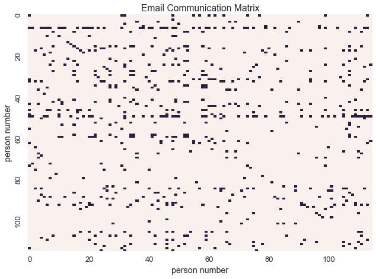
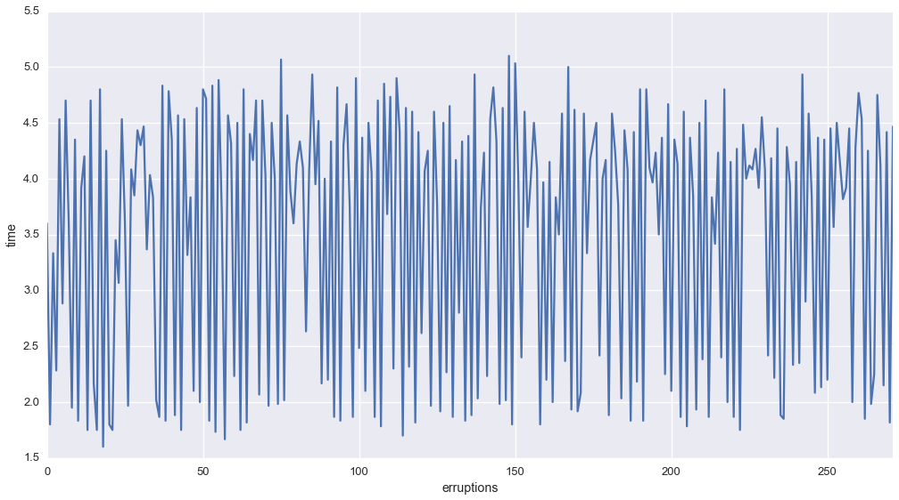

.. currentmodule:: microscopes
.. _datatypes:

Datatypes and Bayesian Nonparametric Models
===========================================

--------------

To understand data, we often categorize data as falling under a specific
type of datatype. Understanding our underlying dataype gives structure
to the problem of modeling the data.

Datamicroscopes provides tools to understand 4 particular datatypes:

1. Real valued data
2. Social network data
3. Timeseries data
4. Text data

.. code:: python

    import numpy as np
    import pandas as pd
    import itertools as it
    import seaborn as sns
    import scipy.io
    import cPickle as pickle
    %matplotlib inline
    import pylab as plt
    sns.set_style('darkgrid')
    sns.set_context('talk')

The two most common datatypes are real valued data and discrete data

For example, let's take the iris dataset

.. code:: python

    iris = sns.load_dataset('iris')
    iris.head()

.. raw:: html

    

    <table border="1" class="dataframe">
      <thead>
        <tr style="text-align: right;">
          <th></th>
          <th>sepal_length</th>
          <th>sepal_width</th>
          <th>petal_length</th>
          <th>petal_width</th>
          <th>species</th>
        </tr>
      </thead>
      <tbody>
        <tr>
          <th>0</th>
          <td>5.1</td>
          <td>3.5</td>
          <td>1.4</td>
          <td>0.2</td>
          <td>setosa</td>
        </tr>
        <tr>
          <th>1</th>
          <td>4.9</td>
          <td>3.0</td>
          <td>1.4</td>
          <td>0.2</td>
          <td>setosa</td>
        </tr>
        <tr>
          <th>2</th>
          <td>4.7</td>
          <td>3.2</td>
          <td>1.3</td>
          <td>0.2</td>
          <td>setosa</td>
        </tr>
        <tr>
          <th>3</th>
          <td>4.6</td>
          <td>3.1</td>
          <td>1.5</td>
          <td>0.2</td>
          <td>setosa</td>
        </tr>
        <tr>
          <th>4</th>
          <td>5.0</td>
          <td>3.6</td>
          <td>1.4</td>
          <td>0.2</td>
          <td>setosa</td>
        </tr>
      </tbody>
    </table>
    

In this case, ``species`` is a discrete variable and the other variables
are real valued

By understanding the form of the data, we can find a model that
represents its underlying structure

In the case of the ``iris`` dataset, plotting the data shows that
indiviudal species exhibit a typical range of measurements

.. code:: python

    irisplot = sns.pairplot(iris, hue="species", palette='Set2', diag_kind="hist", size=2.5)
    irisplot.fig.suptitle('Scatter Plots and KDE of Iris Data by Species', fontsize = 18)
    irisplot.fig.subplots_adjust(top=.9)

.. image:: datatypes_files/datatypes_5_0.png

If we wanted to learn these underlying species' measurements, we would
use these real valued measurements and make assumptions about the
structure of the data.

For example we could assume that each species had a latent range of
mesurements, and assume that these measurements were distributed
multivariate normal. In other words, the conditional probability of the
measurements given the species would be normally distributed

.. math:: P(\mathbf{x}|species=s)\sim\mathcal{N}(\mu_{s},\Sigma_{s})

Bayesian Models allow us to leverage those assumptions.

In the case of the iris dataset, we would be able to learn both the
latent measurements of each Gaussian AND the number of species with a
Dirichlet Process Mixture Model, ``microscopes.mituremodel``

--------------

Relational Data

While Dirichlet Process Mixture Models are the most common Bayesian
Nonparametric Model, there are other kinds of data to consider. For
example, let's consider relational data in social networks

While social network data also has discrete valued varaibles, in this
case they have a different interpretation than the iris dataset

Let's look at the Enron Email Corpus

.. code:: python

    import enron_utils
    
    
    with open('results.p') as fp:
        communications = pickle.load(fp)
    def allnames(o):
        for k, v in o:
            yield [k] + list(v)
    names = set(it.chain.from_iterable(allnames(communications)))
    names = sorted(list(names))
    namemap = { name : idx for idx, name in enumerate(names) }
    N = len(names)
    
    communications_relation = np.zeros((N, N), dtype=np.bool)
    for sender, receivers in communications:
        sender_id = namemap[sender]
        for receiver in receivers:
            receiver_id = namemap[receiver]
            communications_relation[sender_id, receiver_id] = True
    
    print "%d names in the corpus" % N

.. parsed-literal::

    115 names in the corpus

In this dataset, data is representated as a binary communication matrix
where

.. math:: \mathbf{X}_{i,j} = 1 \Leftrightarrow \text{person}_{i} \text{ sent an email to person}_{j}

Let's visualize the communication matrix

.. code:: python

    labels = [i if i%20 == 0 else '' for i in xrange(N)]
    sns.heatmap(communications_relation, linewidths=0, cbar=False, xticklabels=labels, yticklabels=labels) 
    plt.xlabel('person number')
    plt.ylabel('person number')
    plt.title('Email Communication Matrix')

.. parsed-literal::

    <matplotlib.text.Text at 0x11f764390>

In this context, binary data represents communication between
individuals. With this interpretation of the data, we can model the
underlying social network.

To learn its structure we could use the Inifinite Relational Model,
``microscopes.irm``

--------------

In the case of time series data, the index of the data describes the
relationship between the observation and the rest of the data

.. math:: \mathbf{x}_{t}\text{ s.t. }t \in \{0,...,T\}

For example, let's look at the Old Faithful Data

.. code:: python

    old_faithful = pd.read_csv('https://vincentarelbundock.github.io/Rdatasets/csv/datasets/faithful.csv', index_col=0)
    old_faithful.head()

.. raw:: html

    

    <table border="1" class="dataframe">
      <thead>
        <tr style="text-align: right;">
          <th></th>
          <th>eruptions</th>
          <th>waiting</th>
        </tr>
      </thead>
      <tbody>
        <tr>
          <th>1</th>
          <td>3.600</td>
          <td>79</td>
        </tr>
        <tr>
          <th>2</th>
          <td>1.800</td>
          <td>54</td>
        </tr>
        <tr>
          <th>3</th>
          <td>3.333</td>
          <td>74</td>
        </tr>
        <tr>
          <th>4</th>
          <td>2.283</td>
          <td>62</td>
        </tr>
        <tr>
          <th>5</th>
          <td>4.533</td>
          <td>85</td>
        </tr>
      </tbody>
    </table>
    

Let's plot the erruptions as a function of time

.. code:: python

    f, ax = plt.subplots(figsize=(17, 9))
    sns.tsplot(old_faithful['eruptions'], ax=ax)
    plt.xlabel('erruptions')
    plt.ylabel('time')

.. parsed-literal::

    <matplotlib.text.Text at 0x120e4fad0>

The plot sugests that the number of errupitons has a particular set of
states

To learn both the number of underlying states and the states themselves,
we could use a Dirichlet-Process Hidden Markov Model

--------------

Finally, let's consider text data

Text data, like social network data, is discrete valued. However, the
values are each word or its id.

.. code:: python

    with open('nyt_50.txt', 'r') as f:
        nyt = f.read()
    nyt = nyt.split('\n')

In the case of the New York Times Dataset, we have 50 documents

.. code:: python

    print nyt[0][:100]
    print nyt[1][:100]

.. parsed-literal::

    the new york times said editorial for tuesday jan new year day has way stealing down upon coming the
    the seminal russian filmmaker sergei eisenstein had physically matched the style his monumental film

One of the most common classification tasks within corpora is topic
modelling

While LDA is a popular method of topic modeling, we can also learn
topics and the number of topics with the Heierarchical Dirichlet Process

--------------

These example illustrate the ways in which Bayesian Nonparametric Models
can learn structure within data. For more information about each model
within Datamicroscopes you can read about each of the models in detail.
