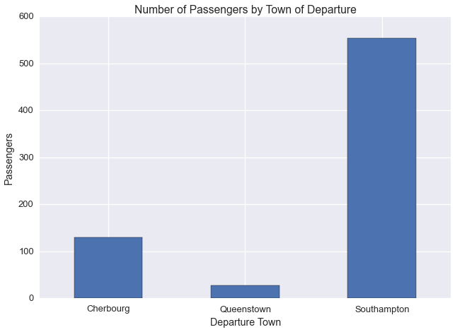

Categorical Data and the Dirichlet Discrete Distribution
========================================================

--------------

Let's consider some examples of data with categorical variables

.. code:: python

    import pandas as pd
    import seaborn as sns
    import numpy as np
    import matplotlib.pyplot as plt
    %matplotlib inline
    sns.set_context('talk')
    sns.set_style('darkgrid')

First, the passenger list of the Titanic

.. code:: python

    titanic = sns.load_dataset("titanic")

.. code:: python

    titanic.head(n=10)

.. raw:: html

    

    <table border="1" class="dataframe">
      <thead>
        <tr style="text-align: right;">
          <th></th>
          <th>survived</th>
          <th>pclass</th>
          <th>sex</th>
          <th>age</th>
          <th>sibsp</th>
          <th>parch</th>
          <th>fare</th>
          <th>embarked</th>
          <th>class</th>
          <th>who</th>
          <th>adult_male</th>
          <th>deck</th>
          <th>embark_town</th>
          <th>alive</th>
          <th>alone</th>
        </tr>
      </thead>
      <tbody>
        <tr>
          <th>0</th>
          <td>0</td>
          <td>3</td>
          <td>male</td>
          <td>22</td>
          <td>1</td>
          <td>0</td>
          <td>7.2500</td>
          <td>S</td>
          <td>Third</td>
          <td>man</td>
          <td>True</td>
          <td>NaN</td>
          <td>Southampton</td>
          <td>no</td>
          <td>False</td>
        </tr>
        <tr>
          <th>1</th>
          <td>1</td>
          <td>1</td>
          <td>female</td>
          <td>38</td>
          <td>1</td>
          <td>0</td>
          <td>71.2833</td>
          <td>C</td>
          <td>First</td>
          <td>woman</td>
          <td>False</td>
          <td>C</td>
          <td>Cherbourg</td>
          <td>yes</td>
          <td>False</td>
        </tr>
        <tr>
          <th>2</th>
          <td>1</td>
          <td>3</td>
          <td>female</td>
          <td>26</td>
          <td>0</td>
          <td>0</td>
          <td>7.9250</td>
          <td>S</td>
          <td>Third</td>
          <td>woman</td>
          <td>False</td>
          <td>NaN</td>
          <td>Southampton</td>
          <td>yes</td>
          <td>True</td>
        </tr>
        <tr>
          <th>3</th>
          <td>1</td>
          <td>1</td>
          <td>female</td>
          <td>35</td>
          <td>1</td>
          <td>0</td>
          <td>53.1000</td>
          <td>S</td>
          <td>First</td>
          <td>woman</td>
          <td>False</td>
          <td>C</td>
          <td>Southampton</td>
          <td>yes</td>
          <td>False</td>
        </tr>
        <tr>
          <th>4</th>
          <td>0</td>
          <td>3</td>
          <td>male</td>
          <td>35</td>
          <td>0</td>
          <td>0</td>
          <td>8.0500</td>
          <td>S</td>
          <td>Third</td>
          <td>man</td>
          <td>True</td>
          <td>NaN</td>
          <td>Southampton</td>
          <td>no</td>
          <td>True</td>
        </tr>
        <tr>
          <th>5</th>
          <td>0</td>
          <td>3</td>
          <td>male</td>
          <td>NaN</td>
          <td>0</td>
          <td>0</td>
          <td>8.4583</td>
          <td>Q</td>
          <td>Third</td>
          <td>man</td>
          <td>True</td>
          <td>NaN</td>
          <td>Queenstown</td>
          <td>no</td>
          <td>True</td>
        </tr>
        <tr>
          <th>6</th>
          <td>0</td>
          <td>1</td>
          <td>male</td>
          <td>54</td>
          <td>0</td>
          <td>0</td>
          <td>51.8625</td>
          <td>S</td>
          <td>First</td>
          <td>man</td>
          <td>True</td>
          <td>E</td>
          <td>Southampton</td>
          <td>no</td>
          <td>True</td>
        </tr>
        <tr>
          <th>7</th>
          <td>0</td>
          <td>3</td>
          <td>male</td>
          <td>2</td>
          <td>3</td>
          <td>1</td>
          <td>21.0750</td>
          <td>S</td>
          <td>Third</td>
          <td>child</td>
          <td>False</td>
          <td>NaN</td>
          <td>Southampton</td>
          <td>no</td>
          <td>False</td>
        </tr>
        <tr>
          <th>8</th>
          <td>1</td>
          <td>3</td>
          <td>female</td>
          <td>27</td>
          <td>0</td>
          <td>2</td>
          <td>11.1333</td>
          <td>S</td>
          <td>Third</td>
          <td>woman</td>
          <td>False</td>
          <td>NaN</td>
          <td>Southampton</td>
          <td>yes</td>
          <td>False</td>
        </tr>
        <tr>
          <th>9</th>
          <td>1</td>
          <td>2</td>
          <td>female</td>
          <td>14</td>
          <td>1</td>
          <td>0</td>
          <td>30.0708</td>
          <td>C</td>
          <td>Second</td>
          <td>child</td>
          <td>False</td>
          <td>NaN</td>
          <td>Cherbourg</td>
          <td>yes</td>
          <td>False</td>
        </tr>
      </tbody>
    </table>
    

One of the categorical variables in this dataset is ``embark_town``

Let's plot the number of passengers departing from each town

.. code:: python

    ax = titanic.groupby(['embark_town'])['age'].count().plot(kind='bar')
    plt.xticks(rotation=0)
    plt.xlabel('Departure Town')
    plt.ylabel('Passengers')
    plt.title('Number of Passengers by Town of Departure')

.. parsed-literal::

    <matplotlib.text.Text at 0x1029b9a10>

Let's look at another example: the `cars93
dataset <https://stat.ethz.ch/R-manual/R-devel/library/MASS/html/Cars93.html>`__

.. code:: python

    cars = pd.read_csv('https://vincentarelbundock.github.io/Rdatasets/csv/MASS/Cars93.csv', index_col=0)

.. code:: python

    cars.head()

.. raw:: html

    

    <table border="1" class="dataframe">
      <thead>
        <tr style="text-align: right;">
          <th></th>
          <th>Manufacturer</th>
          <th>Model</th>
          <th>Type</th>
          <th>Min.Price</th>
          <th>Price</th>
          <th>Max.Price</th>
          <th>MPG.city</th>
          <th>MPG.highway</th>
          <th>AirBags</th>
          <th>DriveTrain</th>
          <th>...</th>
          <th>Passengers</th>
          <th>Length</th>
          <th>Wheelbase</th>
          <th>Width</th>
          <th>Turn.circle</th>
          <th>Rear.seat.room</th>
          <th>Luggage.room</th>
          <th>Weight</th>
          <th>Origin</th>
          <th>Make</th>
        </tr>
      </thead>
      <tbody>
        <tr>
          <th>1</th>
          <td>Acura</td>
          <td>Integra</td>
          <td>Small</td>
          <td>12.9</td>
          <td>15.9</td>
          <td>18.8</td>
          <td>25</td>
          <td>31</td>
          <td>None</td>
          <td>Front</td>
          <td>...</td>
          <td>5</td>
          <td>177</td>
          <td>102</td>
          <td>68</td>
          <td>37</td>
          <td>26.5</td>
          <td>11</td>
          <td>2705</td>
          <td>non-USA</td>
          <td>Acura Integra</td>
        </tr>
        <tr>
          <th>2</th>
          <td>Acura</td>
          <td>Legend</td>
          <td>Midsize</td>
          <td>29.2</td>
          <td>33.9</td>
          <td>38.7</td>
          <td>18</td>
          <td>25</td>
          <td>Driver &amp; Passenger</td>
          <td>Front</td>
          <td>...</td>
          <td>5</td>
          <td>195</td>
          <td>115</td>
          <td>71</td>
          <td>38</td>
          <td>30.0</td>
          <td>15</td>
          <td>3560</td>
          <td>non-USA</td>
          <td>Acura Legend</td>
        </tr>
        <tr>
          <th>3</th>
          <td>Audi</td>
          <td>90</td>
          <td>Compact</td>
          <td>25.9</td>
          <td>29.1</td>
          <td>32.3</td>
          <td>20</td>
          <td>26</td>
          <td>Driver only</td>
          <td>Front</td>
          <td>...</td>
          <td>5</td>
          <td>180</td>
          <td>102</td>
          <td>67</td>
          <td>37</td>
          <td>28.0</td>
          <td>14</td>
          <td>3375</td>
          <td>non-USA</td>
          <td>Audi 90</td>
        </tr>
        <tr>
          <th>4</th>
          <td>Audi</td>
          <td>100</td>
          <td>Midsize</td>
          <td>30.8</td>
          <td>37.7</td>
          <td>44.6</td>
          <td>19</td>
          <td>26</td>
          <td>Driver &amp; Passenger</td>
          <td>Front</td>
          <td>...</td>
          <td>6</td>
          <td>193</td>
          <td>106</td>
          <td>70</td>
          <td>37</td>
          <td>31.0</td>
          <td>17</td>
          <td>3405</td>
          <td>non-USA</td>
          <td>Audi 100</td>
        </tr>
        <tr>
          <th>5</th>
          <td>BMW</td>
          <td>535i</td>
          <td>Midsize</td>
          <td>23.7</td>
          <td>30.0</td>
          <td>36.2</td>
          <td>22</td>
          <td>30</td>
          <td>Driver only</td>
          <td>Rear</td>
          <td>...</td>
          <td>4</td>
          <td>186</td>
          <td>109</td>
          <td>69</td>
          <td>39</td>
          <td>27.0</td>
          <td>13</td>
          <td>3640</td>
          <td>non-USA</td>
          <td>BMW 535i</td>
        </tr>
      </tbody>
    </table>
    
5 rows × 27 columns

    

.. code:: python

    cars.ix[1]

.. parsed-literal::

    Manufacturer                  Acura
    Model                       Integra
    Type                          Small
    Min.Price                      12.9
    Price                          15.9
    Max.Price                      18.8
    MPG.city                         25
    MPG.highway                      31
    AirBags                        None
    DriveTrain                    Front
    Cylinders                         4
    EngineSize                      1.8
    Horsepower                      140
    RPM                            6300
    Rev.per.mile                   2890
    Man.trans.avail                 Yes
    Fuel.tank.capacity             13.2
    Passengers                        5
    Length                          177
    Wheelbase                       102
    Width                            68
    Turn.circle                      37
    Rear.seat.room                 26.5
    Luggage.room                     11
    Weight                         2705
    Origin                      non-USA
    Make                  Acura Integra
    Name: 1, dtype: object

This dataset has multiple categorical variables

Based on the description of the cars93 datatset, we'll consider
``Manufacturer``, and ``DriveTrain`` to be categorical variables

Let's plot ``Manufacturer`` and ``DriveTrain``

.. code:: python

    cars.groupby('Manufacturer')['Model'].count().plot(kind='bar')
    plt.ylabel('Cars')
    plt.title('Number of Cars by Manufacturer')

.. parsed-literal::

    <matplotlib.text.Text at 0x114d9e6d0>

.. image:: dirichlet-discrete_files/dirichlet-discrete_12_1.png

.. code:: python

    cars.groupby('DriveTrain')['Model'].count().plot(kind='bar')
    plt.ylabel('Cars')
    plt.title('Number of Cars by Drive Train')

.. parsed-literal::

    <matplotlib.text.Text at 0x117554e50>

.. image:: dirichlet-discrete_files/dirichlet-discrete_13_1.png

If our categorical data has labels, we need to convert them to integer
id's

.. code:: python

    def col_2_ids(df, col):
        ids = df[col].drop_duplicates().sort(inplace=False).reset_index(drop=True)
        ids.index.name = '%s_ids' % col
        ids = ids.reset_index()
        df = pd.merge(df, ids, how='left')
        del df[col]
        return df

.. code:: python

    cat_columns = ['Manufacturer', 'DriveTrain']
    
    for c in cat_columns:
        print c
        cars = col_2_ids(cars, c)

.. parsed-literal::

    Manufacturer
    DriveTrain

.. code:: python

    cars[['%s_ids' % c for c in cat_columns]].head()

.. raw:: html

    

    <table border="1" class="dataframe">
      <thead>
        <tr style="text-align: right;">
          <th></th>
          <th>Manufacturer_ids</th>
          <th>DriveTrain_ids</th>
        </tr>
      </thead>
      <tbody>
        <tr>
          <th>0</th>
          <td>0</td>
          <td>1</td>
        </tr>
        <tr>
          <th>1</th>
          <td>0</td>
          <td>1</td>
        </tr>
        <tr>
          <th>2</th>
          <td>1</td>
          <td>1</td>
        </tr>
        <tr>
          <th>3</th>
          <td>1</td>
          <td>1</td>
        </tr>
        <tr>
          <th>4</th>
          <td>2</td>
          <td>2</td>
        </tr>
      </tbody>
    </table>
    

Just as we model binary data with the beta Bernoulli distribution, we
can model categorical data with the Dirichlet discrete distribution

The beta Bernoulli distribution allows us to learn the underlying
probability, :math:`\theta`, of the binary random variable, :math:`x`

.. math:: P(x=1) =\theta

.. math:: P(x=0) = 1-\theta

The Dirichlet discrete distribution extends the beta Bernoulli
distribution to the case in which :math:`x` can assume more than two
states

.. math:: \forall i \in [0,1,...n] \hspace{2mm} P(x = i) = \theta_i

.. math:: \sum_{i=0}^n \theta_i = 1

Again, the Dirichlet distribution takes advantage of the fact that the
Dirichlet distribution and the discrete distribution are conjugate. Note
that the discrete distriution is sometimes called the categorical
distribution or the multinomial distribution.

To import the Dirichlet discrete distribution call

.. code:: python

    from microscopes.models import dd as dirichlet_discrete

Then given the specific model we'd want we'd import

``from microscopes.model_name.definition import model_definition``

.. code:: python

    from microscopes.irm.definition import model_definition as irm_definition
    from microscopes.mixture.definition import model_definition as mm_definition

See ``Defining Your Model`` to learn more about model definitions
