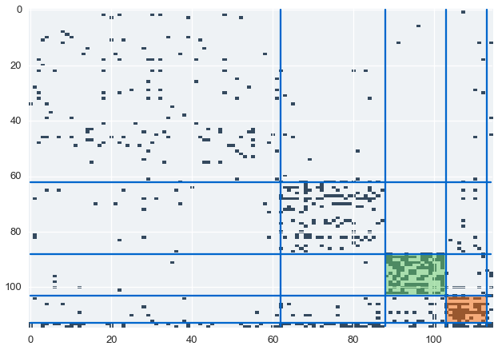
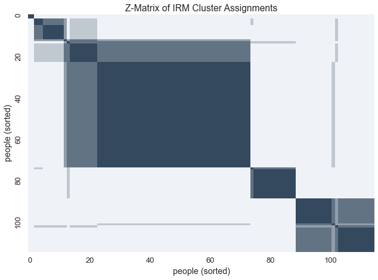

.. _enron_blog:

Network Modeling with the Infinite Relational Model
============================================================================================================

--------------

The `Enron e-mail corpus <http://www.cs.cmu.edu/~./enron/>`__ contains 500,00 emails between 150 individuals at Enron.  To analyze the communication network, we created a binary matrix to represent email
communication between individuals.

In this matrix, :math:`X_{i,j} = 1` if and only if person\ :math:`_{i}` sent an email to person\ :math:`_{j}`

.. image:: enron-email_files/enron-email_9_1.png

We'll learn the underlying clusters in this communication matrix using the Inifinite Relational
Model.  In this model, the underlying clusters represents groups of indiviudals in the network based on the kinds of who they email.

The domain of our model is the individuals in the email dataset.

Our relations are emails between individuals, both of cardinality :math:`N`, and we
model the relation with beta-bernoulli distribution since our data is
binary

.. code-block:: python

    defn = model_definition([N], [((0, 0), beta_bernoulli)])
    views = [numpy_dataview(communications_relation)]
    prng = rng()

Next, let's initialize the model and define the runners.

These runners are our MCMC chains. We'll use ``cpu_count`` to define our
number of chains.

.. code-block:: python

    nchains = cpu_count()
    latents = [model.initialize(defn, views, r=prng, cluster_hps=[{'alpha':1e-3}]) for _ in xrange(nchains)]
    kc = runner.default_assign_kernel_config(defn)
    runners = [runner.runner(defn, views, latent, kc) for latent in latents]
    r = parallel.runner(runners)

From here, we can finally run each chain of the sampler 1000 times

.. code-block:: python

    start = time.time()
    r.run(r=prng, niters=1000)
    print "inference took {} seconds".format(time.time() - start)

Now that we have learned our model let's get our cluster assignments

.. code-block:: python

    infers = r.get_latents()
    clusters = groups(infers[0].assignments(0), sort=True)
    ordering = list(it.chain.from_iterable(clusters))

Let's sort the communications matrix to highlight our inferred clusters

.. code-block:: python

    z = communications_relation.copy()
    z = z[ordering]
    z = z[:,ordering]
    sizes = map(len, clusters)
    boundaries = np.cumsum(sizes)[:-1]

Our model finds suspicious cluster based on the communication data.
We'll color and label these clusters in our communications matrix.

.. code-block:: python

    def cluster_with_name(clusters, name, payload=None):
        ident = namemap[name]
        for idx, cluster in enumerate(clusters):
            if ident in cluster:
                return idx, (cluster, payload)
        raise ValueError("could not find name")
    
    suspicious = [
        cluster_with_name(clusters, "horton-s", {"color":"#66CC66", "desc":"The pipeline/regulatory group"}), 
    
    
        cluster_with_name(clusters, "skilling-j", {"color":"#FF6600", "desc":"The VIP/executives group"}),
    ]
    suspicious = dict(suspicious)
    
    for idx, (boundary, size) in enumerate(zip(boundaries, sizes)):
        if size < 5:
            continue
        plt.plot(range(N), boundary*np.ones(N), color='#0066CC')
        plt.plot(boundary*np.ones(N), range(N), color='#0066CC')
        if idx in suspicious:
            rect = patches.Rectangle((boundary-size, boundary-size), 
                width=size, height=size, alpha=0.5, fc=suspicious[idx][1]["color"])
            plt.gca().add_patch(rect)
    plt.imshow(z, cmap=blue_cmap, interpolation='nearest', aspect='auto')
    @savefig email_matrix_colored.png width=5in

We've identified two suspicious clusters. Let's look at the data to find
out who these individuals are

.. code-block:: python

    def cluster_names(cluster):
        return [names[idx] for idx in cluster]
    def get_full_name(name):
        return enron_utils.FULLNAMES.get(name, name)
    def get_title(name):
        return enron_utils.TITLES.get(name, "?")
    
    for cluster, payload in suspicious.values():
        cnames = cluster_names(cluster)
        ctitles = map(get_title, cnames)
        print payload["desc"]
        for n, t in zip(cnames, ctitles):
            print "\t", get_full_name(n), '\t\t"{}"'.format(t)
        print

.. parsed-literal::

    The pipeline/regulatory group
    	Lynn Blair 		"?"
    	Shelley Corman 		"Vice President Regulatory Affairs"
    	Lindy Donoho 		"Employee"
    	Drew Fossum 		"Vice President"
    	Tracy Geaccone 		"Employee"
    	harris-s 		"?"
    	Rod Hayslett 		"Vice President Also Chief Financial Officer and Treasurer"
    	Stanley Horton 		"President Enron Gas Pipeline"
    	Kevin Hyatt 		"Director Pipeline Business"
    	Michelle Lokay 		"Employee Administrative Asisstant"
    	Teb Lokey 		"Manager Regulatory Affairs"
    	Danny McCarty 		"Vice President"
    	mcconnell-m 		"?"
    	Darrell Schoolcraft 		"?"
    	Kimberly Watson 		"?"
    
    The VIP/executives group
    	Rick Buy 		"Manager Chief Risk Management Officer"
    	Jeff Dasovich 		"Employee Government Relation Executive"
    	David Delainey 		"CEO Enron North America and Enron Enery Services"
    	Louise Kitchen 		"President Enron Online"
    	John Lavorato 		"CEO Enron America"
    	Richard Shapiro 		"Vice President Regulatory Affairs"
    	Jeffery Skilling 		"CEO"
    	Barry Tycholiz 		"Vice President"
    	Greg Whalley 		"President"
    	williams-j 		"?"
    

Given the uncertainty behind these latent clusters, we can visualize the
variablity within these assignments with a z-matrix.  Ordering the z-matrix allows us to group members of each possible
cluster together.

.. code-block:: python

    zmat = query.zmatrix(domain=0, latents=infers)
    zmat = zmatrix_reorder(zmat, zmatrix_heuristic_block_ordering(zmat))
    sns.heatmap(zmat, cmap=blue_cmap, cbar=False, xticklabels=labels, yticklabels=labels)
    plt.xlabel('people (sorted)')
    plt.ylabel('people (sorted)')
    plt.title('Z-Matrix of IRM Cluster Assignments')
    @savefig zmatrix.png width=5in

To cluster network data using datamicroscopes, the IRM is available for installation from conda

.. code-block:: bash

    $ conda install microscopes-irm
