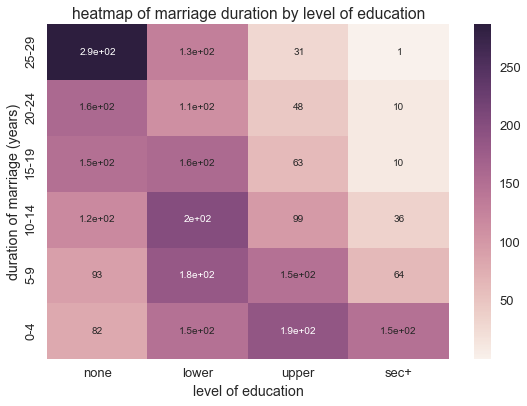

.. _gamma_poisson:

Count Data and Ordinal Data with the Gamma-Poisson Distribution
===============================================================

Typically, we model count data, or integer valued data, with the
gamma-Poisson distribution

Recall that the Poisson distribution is a distribution over integer
values parameterized by :math:`\lambda`. One interpretation behind
:math:`\lambda` is that it parameterizes the rate at which events occur
with a fixed interval, assuming these events occur independently. The
gamma distribution is conjugate to the Poisson distribution, so the
gamma-Poisson distribution allows us to learn both the distribution over
counts and the rate parameter :math:`\lambda`.

Let's set up our environment and consider some examples of count data

.. code:: python

    import pandas as pd
    import seaborn as sns
    import numpy as np
    import matplotlib.pyplot as plt
    sns.set_context('talk')
    import csv
    import urllib2
    import StringIO
    
    %matplotlib inline

`Children Ever Born <http://data.princeton.edu/wws509/datasets/#ceb>`__
is a dataset of birthrates in Fiji from the *World Fertility Survey*
with the following columns:

-  ``dur``: marriage duration
-  ``res``: residence,
-  ``educ``: level of education,
-  ``mean``: mean number of born,
-  ``var``: variance of children born
-  ``y``: number of women

Ordinal columns ``dur``, ``res``, and ``educ`` are shown as text in the
following dataset

.. code:: python

    ceb = pd.read_csv('http://data.princeton.edu/wws509/datasets/ceb.dat', sep='\s+')
    ceb.head()

.. raw:: html

    

    <table border="1" class="dataframe">
      <thead>
        <tr style="text-align: right;">
          <th></th>
          <th>dur</th>
          <th>res</th>
          <th>educ</th>
          <th>mean</th>
          <th>var</th>
          <th>n</th>
          <th>y</th>
        </tr>
      </thead>
      <tbody>
        <tr>
          <th>1</th>
          <td>0-4</td>
          <td>Suva</td>
          <td>none</td>
          <td>0.50</td>
          <td>1.14</td>
          <td>8</td>
          <td>4.00</td>
        </tr>
        <tr>
          <th>2</th>
          <td>0-4</td>
          <td>Suva</td>
          <td>lower</td>
          <td>1.14</td>
          <td>0.73</td>
          <td>21</td>
          <td>23.94</td>
        </tr>
        <tr>
          <th>3</th>
          <td>0-4</td>
          <td>Suva</td>
          <td>upper</td>
          <td>0.90</td>
          <td>0.67</td>
          <td>42</td>
          <td>37.80</td>
        </tr>
        <tr>
          <th>4</th>
          <td>0-4</td>
          <td>Suva</td>
          <td>sec+</td>
          <td>0.73</td>
          <td>0.48</td>
          <td>51</td>
          <td>37.23</td>
        </tr>
        <tr>
          <th>5</th>
          <td>0-4</td>
          <td>urban</td>
          <td>none</td>
          <td>1.17</td>
          <td>1.06</td>
          <td>12</td>
          <td>14.04</td>
        </tr>
      </tbody>
    </table>
    

With the these columns encoded, we can now represent them as integers

``dur`` and ``educ`` are ordinal columns. Additionally, number of women,
``n``, is integer valued.

.. code:: python

    ceb_int = pd.read_csv('http://data.princeton.edu/wws509/datasets/ceb.raw', sep='\s+', names = ['index'] + list(ceb.columns[:-1]), index_col=0)
    ceb_int.head()

.. raw:: html

    

    <table border="1" class="dataframe">
      <thead>
        <tr style="text-align: right;">
          <th></th>
          <th>dur</th>
          <th>res</th>
          <th>educ</th>
          <th>mean</th>
          <th>var</th>
          <th>n</th>
        </tr>
        <tr>
          <th>index</th>
          <th></th>
          <th></th>
          <th></th>
          <th></th>
          <th></th>
          <th></th>
        </tr>
      </thead>
      <tbody>
        <tr>
          <th>1</th>
          <td>1</td>
          <td>1</td>
          <td>1</td>
          <td>0.50</td>
          <td>1.14</td>
          <td>8</td>
        </tr>
        <tr>
          <th>2</th>
          <td>1</td>
          <td>1</td>
          <td>2</td>
          <td>1.14</td>
          <td>0.73</td>
          <td>21</td>
        </tr>
        <tr>
          <th>3</th>
          <td>1</td>
          <td>1</td>
          <td>3</td>
          <td>0.90</td>
          <td>0.67</td>
          <td>42</td>
        </tr>
        <tr>
          <th>4</th>
          <td>1</td>
          <td>1</td>
          <td>4</td>
          <td>0.73</td>
          <td>0.48</td>
          <td>51</td>
        </tr>
        <tr>
          <th>5</th>
          <td>1</td>
          <td>2</td>
          <td>1</td>
          <td>1.17</td>
          <td>1.06</td>
          <td>12</td>
        </tr>
      </tbody>
    </table>
    

We can map these orderings of ``dur`` and ``educ`` to produce a crosstab
heatmap of ``n``, numbe of women

.. code:: python

    plt.figure(figsize=(9,6))
    ct = pd.crosstab(ceb_int['dur'], ceb_int['educ'], values=ceb_int['n'], aggfunc= np.sum).sort_index(ascending = False)
    sns.heatmap(ct, annot = True)
    plt.yticks(ceb_int['dur'].drop_duplicates().values - .5, ceb['dur'].drop_duplicates().values)
    plt.xticks(ceb_int['educ'].drop_duplicates().values - .5, ceb['educ'].drop_duplicates().values)
    plt.ylabel('duration of marriage (years)')
    plt.xlabel('level of education')
    plt.title('heatmap of marriage duration by level of education')

.. parsed-literal::

    <matplotlib.text.Text at 0x11a8f48d0>

Since ``dur`` and ``education`` are ordinal valued, the columns assume a
small number of integer values

Additionally, the `caffeine
dataset <http://stanford.edu/class/psych252/data/index.html>`__ below
measures caffeine intake and performance on a 10 question quiz. The
variables are:

-  ``coffee``: coffee intake (1 = 0 cups, 2 = 2 cups, 3 = 4 cups)
-  ``perf``: quiz score
-  ``numprob``: problems attempted
-  ``accur``: accuracy

.. code:: python

    response = urllib2.urlopen('http://stanford.edu/class/psych252/_downloads/caffeine.csv')
    html = response.read()
    caf = pd.read_csv(StringIO.StringIO(html[:-16]))
    caf.head()

.. raw:: html

    

    <table border="1" class="dataframe">
      <thead>
        <tr style="text-align: right;">
          <th></th>
          <th>coffee</th>
          <th>perf</th>
          <th>accur</th>
          <th>numprob</th>
        </tr>
      </thead>
      <tbody>
        <tr>
          <th>0</th>
          <td>1</td>
          <td>53</td>
          <td>0.449877</td>
          <td>7</td>
        </tr>
        <tr>
          <th>1</th>
          <td>1</td>
          <td>9</td>
          <td>0.499534</td>
          <td>6</td>
        </tr>
        <tr>
          <th>2</th>
          <td>1</td>
          <td>31</td>
          <td>0.498590</td>
          <td>6</td>
        </tr>
        <tr>
          <th>3</th>
          <td>1</td>
          <td>38</td>
          <td>0.454312</td>
          <td>7</td>
        </tr>
        <tr>
          <th>4</th>
          <td>2</td>
          <td>40</td>
          <td>0.421212</td>
          <td>8</td>
        </tr>
      </tbody>
    </table>
    

Based on the characteristics of each column, ``coffee`` and ``numprob``
easily fit into the category of count data appropriate to a
gamma-Poisson distribution

.. code:: python

    caf.describe()

.. raw:: html

    

    <table border="1" class="dataframe">
      <thead>
        <tr style="text-align: right;">
          <th></th>
          <th>coffee</th>
          <th>perf</th>
          <th>accur</th>
          <th>numprob</th>
        </tr>
      </thead>
      <tbody>
        <tr>
          <th>count</th>
          <td>60.000000</td>
          <td>60.000000</td>
          <td>60.000000</td>
          <td>60.000000</td>
        </tr>
        <tr>
          <th>mean</th>
          <td>2.000000</td>
          <td>42.366667</td>
          <td>0.510854</td>
          <td>7.950000</td>
        </tr>
        <tr>
          <th>std</th>
          <td>0.823387</td>
          <td>18.350603</td>
          <td>0.107704</td>
          <td>1.185005</td>
        </tr>
        <tr>
          <th>min</th>
          <td>1.000000</td>
          <td>5.000000</td>
          <td>0.240238</td>
          <td>6.000000</td>
        </tr>
        <tr>
          <th>25%</th>
          <td>1.000000</td>
          <td>31.000000</td>
          <td>0.425859</td>
          <td>7.000000</td>
        </tr>
        <tr>
          <th>50%</th>
          <td>2.000000</td>
          <td>40.000000</td>
          <td>0.509806</td>
          <td>8.000000</td>
        </tr>
        <tr>
          <th>75%</th>
          <td>3.000000</td>
          <td>53.500000</td>
          <td>0.594445</td>
          <td>9.000000</td>
        </tr>
        <tr>
          <th>max</th>
          <td>3.000000</td>
          <td>89.000000</td>
          <td>0.748692</td>
          <td>10.000000</td>
        </tr>
      </tbody>
    </table>
    

Note that while integer valued data with high values is sometimes
modeled with a gamma-Poisson ditribution, remember that the
gamma-Poisson distribution has equal mean and variance :math:`\lambda`:

.. math:: E(X) = Var(X) = \lambda

If you want to be more flexible with this assumption, you may want to
consider using a normal inverse-chisquare or a normal inverse-Wishart
distribution depending on your data

To import the gamma-poisson likelihood, call:

.. code:: python

    from microscopes.models import gp as gamma_poisson
