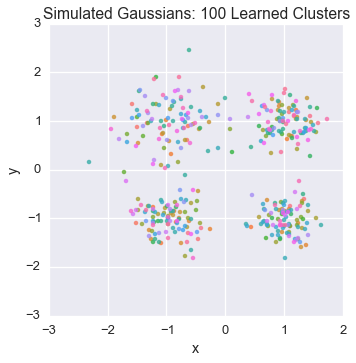
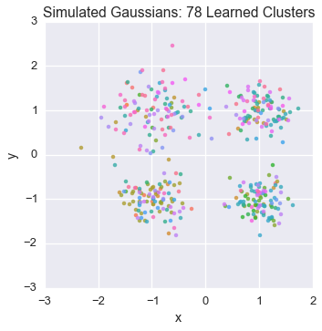
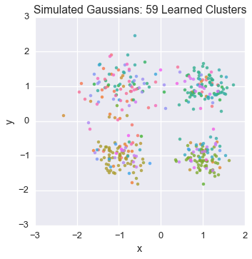
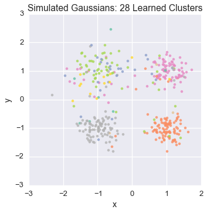
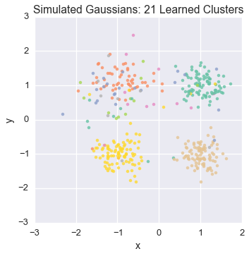
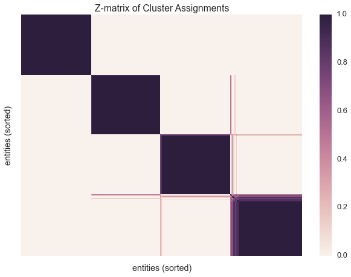

Inferring Gaussians with the Dirichlet Process Mixture Model
============================================================

--------------

Let's set up our environment

.. code:: python

    %matplotlib inline
    import matplotlib.pylab as plt
    import numpy as np
    import time
    import seaborn as sns
    import pandas as pd
    sns.set_style('darkgrid')
    sns.set_context('talk')
    sns.set_palette("Set2", 30)

Now let's import our functions from datamicroscopes

.. code:: python

    from microscopes.common.rng import rng
    from microscopes.common.recarray.dataview import numpy_dataview
    from microscopes.models import niw as normal_inverse_wishart
    from microscopes.mixture.definition import model_definition
    from microscopes.mixture import model, runner, query
    from microscopes.common.query import zmatrix_heuristic_block_ordering, zmatrix_reorder

From here, we'll generate four isotropic 2D gaussian clusters in each
quadrant, varying the scale parameter

.. code:: python

    nsamples_per_cluster = 100
    means = np.array([[1, 1], [1, -1], [-1, -1], [-1, 1]], dtype=np.float)
    scales = np.array([0.08, 0.09, 0.1, 0.2])
    Y_clusters = [
        np.random.multivariate_normal(
            mean=mu, 
            cov=var * np.eye(2), 
            size=nsamples_per_cluster) 
        for mu, var in zip(means, scales)]
    df = pd.DataFrame()
    for i, Yc in enumerate(Y_clusters):
        cl = pd.DataFrame(Yc, columns = ['x','y'])
        cl['cluster'] = i
        df = df.append(cl)
    Y = np.vstack(Y_clusters)
    Y = np.random.permutation(Y)

.. code:: python

    df.head()

.. raw:: html

    

    <table border="1" class="dataframe">
      <thead>
        <tr style="text-align: right;">
          <th></th>
          <th>x</th>
          <th>y</th>
          <th>cluster</th>
        </tr>
      </thead>
      <tbody>
        <tr>
          <th>0</th>
          <td>1.557005</td>
          <td>1.266202</td>
          <td>0</td>
        </tr>
        <tr>
          <th>1</th>
          <td>1.465262</td>
          <td>0.842641</td>
          <td>0</td>
        </tr>
        <tr>
          <th>2</th>
          <td>0.619352</td>
          <td>1.309368</td>
          <td>0</td>
        </tr>
        <tr>
          <th>3</th>
          <td>1.130965</td>
          <td>0.700129</td>
          <td>0</td>
        </tr>
        <tr>
          <th>4</th>
          <td>1.447409</td>
          <td>1.112726</td>
          <td>0</td>
        </tr>
      </tbody>
    </table>
    

Let's have a look at the generated data

.. code:: python

    sns.lmplot('x', 'y', hue="cluster", data=df, fit_reg=False)
    plt.title('Simulated Gaussians: 4 Clusters')

.. parsed-literal::

    <matplotlib.text.Text at 0x112cf7290>

.. image:: gauss2d_files/gauss2d_8_1.png

Now let's learn this clustering non-parametrically!

There are 5 steps necessary to set up your model:

1. Decide on the number of chains we want -- it is important to run
   multiple chains from different starting points!

2. Define our DP-GMM model

3. Munge the data into numpy recarray format then wrap the data for our
   model

4. Randomize start points

5. Create runners for each chain

.. code:: python

    nchains = 8
    
    # The random state object
    prng = rng()
    
    # Define a DP-GMM where the Gaussian is 2D
    defn = model_definition(Y.shape[0], [normal_inverse_wishart(2)])
    
    # Munge the data into numpy recarray format
    Y_rec = np.array([(list(y),) for y in Y], dtype=[('', np.float32, 2)])
    
    # Create a wrapper around the numpy recarray which 
    # data-microscopes understands
    view = numpy_dataview(Y_rec)
    
    # Initialize nchains start points randomly in the state space
    latents = [model.initialize(defn, view, prng) for _ in xrange(nchains)]
    
    # Create a runner for each chain
    runners = [runner.runner(defn, view, latent, kernel_config=['assign']) for latent in latents]

We will visualize our data to examine the cluster assignment

.. code:: python

    def plot_assignment(assignment, data=Y):
        cl = pd.DataFrame(data, columns = ['x','y'])
        cl['cluster'] = assignment
        n_clusters = cl['cluster'].nunique()
        sns.lmplot('x', 'y', hue="cluster", data=cl, fit_reg=False, legend=(n_clusters<10))
        plt.title('Simulated Gaussians: %d Learned Clusters' % n_clusters)

Let's peek at the starting state for one of our chains

.. code:: python

    plot_assignment(latents[0].assignments())

Let's watch one of the chains evolve for a few steps

.. code:: python

    first_runner = runners[0]
    for i in xrange(5):
        first_runner.run(r=prng, niters=1)
        plot_assignment(first_runner.get_latent().assignments())

.. image:: gauss2d_files/gauss2d_16_2.png

Now let's burn all our runners in for 100 iterations.

We'll do this sequentially since the model is simple, but check
microscopes.parallel.runner for parallel implementions (with support for
either multiprocessing or multyvac)

.. code:: python

    for runner in runners:
        runner.run(r=prng, niters=100)

Let's now peek again at the first state

.. code:: python

    plot_assignment(first_runner.get_latent().assignments())

.. image:: gauss2d_files/gauss2d_20_0.png

Let's build a z-matrix to compare our result with the rest of the chains

We'll be sure to sort our z-matrix before plotting. Sorting the
datapoints allows us to organize the clusters into a block matrix.

.. code:: python

    infers = [r.get_latent() for r in runners]
    zmat = query.zmatrix(infers)
    ordering = zmatrix_heuristic_block_ordering(zmat)
    zmat = zmatrix_reorder(zmat, ordering)

.. code:: python

    sns.heatmap(zmat, linewidths=0, xticklabels=False, yticklabels=False)
    plt.xlabel('entities (sorted)')
    plt.ylabel('entities (sorted)')
    plt.title('Z-matrix of Cluster Assignments')

.. parsed-literal::

    <matplotlib.text.Text at 0x116f73510>

