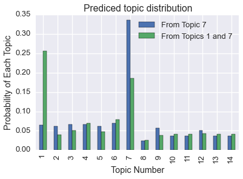
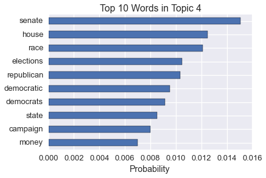

.. _hdp:

Learning Topics in The Daily Kos with the Hierarchical Dirichlet Process
========================================================================

The Hierarchical Dirichlet Process (HDP) is typically used for topic
modeling when the number of topics is unknown

Let's explore the topics of the political blog, The Daily Kos using data
from the `UCI Machine Learning
Repository <http://archive.ics.uci.edu/ml/datasets/Bag+of+Words>`__.

.. code:: python

    import itertools
    import pyLDAvis
    import pandas as pd
    import re
    import simplejson
    import seaborn as sns
    
    from microscopes.common.rng import rng
    from microscopes.lda.definition import model_definition
    from microscopes.lda.model import initialize
    from microscopes.lda import model, runner
    from random import shuffle
    import matplotlib.pyplot as plt
    
    sns.set_style('darkgrid')
    sns.set_context('talk')
    
    %matplotlib inline

First, let's grab the data from UCI:

.. code:: python

    !curl http://archive.ics.uci.edu/ml/machine-learning-databases/bag-of-words/docword.kos.txt.gz | gunzip > docword.kos.txt
    !head docword.kos.txt

.. parsed-literal::

      % Total    % Received % Xferd  Average Speed   Time    Time     Time  Current
                                     Dload  Upload   Total   Spent    Left  Speed
    100 1029k  100 1029k    0     0   129k      0  0:00:07  0:00:07 --:--:--  243k
    3430
    6906
    353160
    1 61 2
    1 76 1
    1 89 1
    1 211 1
    1 296 1
    1 335 1
    1 404 1

.. code:: python

    !curl http://archive.ics.uci.edu/ml/machine-learning-databases/bag-of-words/vocab.kos.txt > vocab.kos.txt
    !head vocab.kos.txt

.. parsed-literal::

      % Total    % Received % Xferd  Average Speed   Time    Time     Time  Current
                                     Dload  Upload   Total   Spent    Left  Speed
    100 55467  100 55467    0     0   163k      0 --:--:-- --:--:-- --:--:--  163k
    aarp
    abandon
    abandoned
    abandoning
    abb
    abc
    abcs
    abdullah
    ability
    aboard

::

    The format of the docword.os.txt file is 3 header lines, followed by
    NNZ triples:
    ---
    D
    W
    NNZ
    docID wordID count
    docID wordID count
    docID wordID count
    docID wordID count
    ...
    docID wordID count
    docID wordID count
    docID wordID count
    ---

We'll process the data into a list of lists of words ready to be fed
into our algorithm:

.. code:: python

    def parse_bag_of_words_file(docword, vocab):
        with open(vocab, "r") as f:
            kos_vocab = [word.strip() for word in f.readlines()]
            id_to_word = {i: word for i, word in enumerate(kos_vocab)}
            
        with open(docword, "r") as f:
            raw = [map(int, _.strip().split()) for _ in f.readlines()][3:]
    
        docs = []
        for _, grp in itertools.groupby(raw, lambda x: x[0]):
            doc = []
            for _, word_id, word_cnt in grp:
                doc += word_cnt * [id_to_word[word_id-1]]
            docs.append(doc)
        return docs, id_to_word

.. code:: python

    docs, id_to_word = parse_bag_of_words_file("docword.kos.txt", "vocab.kos.txt")
    vocab_size = len(set(word for doc in docs for word in doc))

We must define our model before we intialize it. In this case, we need
the number of docs and the number of words.

From there, we can initialize our model and set the hyperparameters

.. code:: python

    defn = model_definition(len(docs), vocab_size)
    prng = rng()
    kos_state = initialize(defn, docs, prng, 
                            vocab_hp=1, 
                            dish_hps={"alpha": 1, "gamma": 1})
    r = runner.runner(defn, docs, kos_state)
    
    print "number of docs:", defn.n, "vocabulary size:", defn.v

.. parsed-literal::

    number of docs: 3430 vocabulary size: 6906

Given the size of the dataset, it'll take some time to run.

We'll run our model for 1000 iterations and save our results every 25
iterations.

.. code:: python

    %%time
    step_size = 50
    steps = 500 / step_size
    
    print "randomly initialized model:", "perplexity:", kos_state.perplexity(), "num topics:", kos_state.ntopics()
    for s in range(steps):
        r.run(prng, step_size)
        print "iteration:", (s + 1) * step_size, "perplexity:", kos_state.perplexity(), "num topics:", kos_state.ntopics()

.. parsed-literal::

    randomly initialized model: perplexity: 6908.4715103 num topics: 9
    iteration: 50 perplexity: 1590.22974737 num topics: 12
    iteration: 100 perplexity: 1584.21787143 num topics: 13
    iteration: 150 perplexity: 1578.62064887 num topics: 14
    iteration: 200 perplexity: 1576.42299865 num topics: 15
    iteration: 250 perplexity: 1575.98953602 num topics: 11
    iteration: 300 perplexity: 1575.71624243 num topics: 13
    iteration: 350 perplexity: 1575.37703244 num topics: 12
    iteration: 400 perplexity: 1575.47578721 num topics: 13
    iteration: 450 perplexity: 1575.69188913 num topics: 12
    iteration: 500 perplexity: 1575.02874469 num topics: 14
    CPU times: user 47min 46s, sys: 9.39 s, total: 47min 55s
    Wall time: 53min 11s

`pyLDAvis <https://github.com/bmabey/pyLDAvis>`__ is a Python
implementation of the `LDAvis <https://github.com/cpsievert/LDAvis>`__
tool created by `Carson Sievert <https://github.com/cpsievert>`__.

    LDAvis is designed to help users interpret the topics in a topic
    model that has been fit to a corpus of text data. The package
    extracts information from a fitted LDA topic model to inform an
    interactive web-based visualization.

.. code:: python

    prepared = pyLDAvis.prepare(**kos_state.pyldavis_data())
    pyLDAvis.display(prepared)

.. parsed-literal::

    /Users/4d/anaconda/lib/python2.7/site-packages/skbio/stats/ordination/_principal_coordinate_analysis.py:107: RuntimeWarning: The result contains negative eigenvalues. Please compare their magnitude with the magnitude of some of the largest positive eigenvalues. If the negative ones are smaller, it's probably safe to ignore them, but if they are large in magnitude, the results won't be useful. See the Notes section for more details. The smallest eigenvalue is -1.56349705634e-05 and the largest is 0.129220486809.
      RuntimeWarning

.. raw:: html

    
    <link rel="stylesheet" type="text/css" href="https://cdn.rawgit.com/bmabey/pyLDAvis/files/ldavis.v1.0.0.css">
    
    
    

    <script type="text/javascript">
    
    var ldavis_el937646184981285180121014_data = {"plot.opts": {"xlab": "PC1", "ylab": "PC2"}, "topic.order": [2, 7, 6, 8, 4, 9, 1, 5, 3, 12, 10, 13, 11, 14], "token.table": {"Topic": [1, 2, 3, 4, 5, 6, 7, 8, 9, 1, 2, 3, 4, 5, 6, 7, 8, 9, 10, 1, 2, 3, 4, 5, 6, 7, 8, 9, 10, 1, 2, 3, 4, 5, 6, 7, 8, 9, 10, 1, 2, 8, 10, 1, 2, 3, 4, 5, 6, 7, 8, 9, 10, 1, 2, 3, 4, 5, 6, 7, 8, 9, 10, 1, 2, 3, 4, 5, 6, 7, 8, 9, 10, 1, 2, 3, 4, 5, 6, 7, 8, 9, 10, 11, 1, 2, 3, 4, 5, 6, 7, 8, 9, 10, 1, 2, 3, 4, 5, 6, 7, 8, 9, 10, 1, 2, 3, 4, 5, 6, 7, 8, 9, 10, 1, 2, 3, 4, 5, 6, 7, 8, 9, 1, 2, 3, 4, 5, 6, 7, 8, 9, 10, 1, 2, 3, 4, 5, 6, 7, 8, 9, 10, 1, 2, 3, 4, 5, 6, 7, 8, 9, 10, 1, 2, 3, 4, 5, 6, 7, 8, 9, 1, 2, 3, 4, 5, 6, 7, 8, 9, 1, 2, 3, 4, 5, 6, 7, 8, 9, 1, 2, 3, 4, 5, 6, 7, 8, 9, 1, 2, 3, 4, 5, 6, 7, 8, 9, 1, 2, 3, 4, 5, 6, 7, 8, 9, 10, 1, 2, 3, 4, 5, 6, 7, 8, 9, 1, 2, 3, 4, 5, 6, 7, 8, 9, 10, 1, 2, 3, 4, 5, 6, 7, 8, 9, 10, 1, 2, 3, 4, 5, 6, 7, 8, 9, 1, 2, 3, 4, 5, 6, 7, 8, 9, 10, 1, 2, 3, 4, 5, 6, 7, 8, 9, 10, 1, 2, 3, 4, 5, 6, 7, 8, 9, 10, 1, 2, 3, 4, 5, 1, 2, 3, 4, 5, 6, 7, 8, 9, 10, 1, 2, 3, 4, 5, 6, 7, 8, 9, 10, 1, 2, 3, 4, 5, 6, 7, 8, 9, 1, 2, 3, 4, 5, 6, 7, 8, 9, 10, 1, 2, 3, 4, 5, 6, 7, 8, 9, 1, 2, 3, 4, 5, 6, 7, 8, 9, 10, 1, 2, 3, 4, 5, 6, 7, 8, 9, 1, 2, 3, 4, 5, 6, 7, 8, 1, 2, 3, 4, 5, 7, 8, 9, 10, 1, 2, 3, 4, 5, 6, 7, 8, 9, 10, 1, 2, 3, 4, 5, 6, 7, 8, 9, 10, 1, 2, 3, 4, 5, 6, 7, 1, 2, 3, 4, 5, 6, 7, 8, 9, 10, 1, 2, 3, 4, 5, 6, 7, 8, 9, 1, 2, 3, 4, 5, 6, 7, 8, 9, 10, 1, 2, 3, 4, 5, 6, 7, 8, 9, 1, 2, 3, 4, 5, 6, 7, 8, 9, 10, 1, 2, 3, 4, 5, 6, 7, 8, 1, 2, 3, 4, 5, 6, 1, 2, 3, 4, 5, 6, 7, 8, 9, 10, 2, 3, 4, 8, 9, 1, 2, 3, 4, 5, 6, 7, 8, 9, 1, 2, 3, 4, 5, 6, 7, 8, 9, 10, 1, 2, 3, 4, 5, 6, 7, 8, 9, 1, 2, 3, 4, 5, 6, 7, 8, 9, 10, 1, 2, 3, 4, 5, 6, 7, 8, 9, 10, 1, 2, 3, 4, 5, 6, 7, 8, 9, 10, 1, 2, 3, 4, 5, 6, 7, 8, 9, 10, 1, 2, 3, 4, 5, 6, 7, 8, 9, 10, 1, 2, 3, 4, 5, 6, 7, 8, 9, 1, 2, 3, 4, 5, 6, 7, 8, 9, 10, 1, 2, 3, 4, 5, 6, 7, 8, 9, 2, 5, 6, 7, 8, 1, 2, 3, 4, 5, 6, 7, 8, 9, 10, 1, 2, 3, 4, 5, 6, 7, 8, 9, 1, 2, 6, 7, 9, 1, 2, 3, 4, 5, 6, 7, 8, 9, 1, 2, 3, 4, 5, 6, 7, 8, 9, 10, 1, 2, 3, 4, 5, 6, 7, 8, 9, 10, 1, 2, 3, 4, 5, 6, 7, 8, 9, 10, 1, 2, 3, 4, 5, 6, 7, 8, 9, 10, 1, 2, 3, 4, 5, 6, 7, 8, 9, 1, 2, 3, 4, 5, 6, 7, 8, 9, 10, 1, 2, 3, 4, 5, 6, 7, 8, 9, 10, 1, 2, 3, 4, 5, 6, 7, 8, 9, 1, 2, 3, 4, 5, 6, 7, 8, 9, 10, 1, 2, 3, 4, 5, 6, 7, 8, 9, 1, 2, 3, 4, 5, 6, 7, 8, 9, 1, 2, 3, 4, 5, 6, 7, 8, 9, 1, 2, 3, 4, 5, 6, 7, 8, 9, 10, 1, 2, 3, 4, 5, 6, 7, 8, 9, 10, 1, 2, 3, 4, 5, 6, 7, 8, 9, 1, 2, 3, 4, 5, 6, 7, 8, 9, 10, 1, 2, 3, 4, 5, 6, 7, 8, 9, 10, 1, 2, 3, 4, 5, 6, 7, 8, 9, 10, 1, 2, 3, 4, 5, 6, 7, 8, 9, 10, 1, 2, 3, 4, 5, 6, 7, 8, 9, 10, 1, 2, 3, 4, 5, 6, 7, 8, 9, 1, 2, 3, 4, 5, 6, 7, 8, 9, 1, 2, 3, 4, 5, 6, 7, 8, 9, 10, 1, 2, 3, 4, 5, 6, 7, 8, 9, 10, 1, 2, 3, 4, 5, 6, 7, 8, 9, 10, 1, 2, 3, 4, 5, 6, 7, 8, 9, 10, 1, 2, 3, 4, 5, 6, 7, 8, 9, 10, 1, 2, 3, 4, 5, 6, 7, 8, 9, 10, 1, 2, 3, 4, 5, 6, 7, 8, 9, 1, 2, 3, 4, 5, 6, 7, 8, 9, 10, 1, 2, 3, 4, 5, 6, 7, 8, 9, 10, 2, 4, 5, 9, 1, 2, 3, 4, 5, 6, 7, 8, 9, 10, 1, 2, 3, 4, 5, 6, 7, 8, 9, 1, 2, 3, 4, 5, 6, 7, 8, 9, 10, 1, 2, 3, 4, 5, 6, 7, 8, 9, 1, 2, 3, 4, 5, 6, 7, 8, 9, 10, 1, 2, 3, 4, 5, 6, 7, 8, 9, 10, 1, 2, 3, 4, 5, 6, 7, 8, 9, 10, 1, 2, 3, 4, 5, 6, 7, 8, 9, 1, 2, 3, 4, 5, 6, 7, 8, 9, 10, 1, 2, 3, 4, 5, 6, 7, 8, 9, 10, 1, 2, 3, 4, 5, 6, 7, 8, 9, 10, 1, 2, 3, 4, 5, 6, 7, 8, 9, 1, 2, 3, 4, 5, 6, 7, 8, 9, 10, 1, 2, 3, 4, 5, 6, 7, 8, 9, 10, 1, 2, 3, 4, 5, 6, 7, 8, 9, 10, 1, 2, 3, 4, 5, 6, 7, 8, 9, 10, 1, 2, 3, 4, 5, 6, 7, 8, 9, 10, 1, 2, 3, 4, 5, 6, 7, 8, 9, 10, 1, 2, 3, 4, 5, 6, 7, 8, 9, 10, 1, 2, 3, 4, 5, 6, 7, 8, 9, 1, 2, 3, 4, 5, 6, 7, 8, 9, 10, 1, 2, 3, 4, 5, 6, 7, 8, 9, 1, 2, 3, 4, 5, 6, 7, 8, 9, 10, 1, 2, 3, 4, 5, 6, 7, 8, 9, 10, 1, 2, 3, 4, 5, 6, 7, 8, 9, 10, 1, 2, 3, 4, 5, 6, 7, 8, 9, 10, 1, 2, 3, 4, 5, 6, 7, 8, 9, 10, 1, 2, 3, 4, 5, 6, 7, 8, 9, 10, 1, 2, 3, 4, 5, 6, 7, 8, 9, 1, 2, 3, 4, 5, 6, 7, 8, 9, 10, 1, 2, 3, 4, 5, 6, 7, 8, 9, 10, 1, 2, 3, 4, 5, 6, 7, 8, 9, 10, 1, 2, 3, 4, 5, 6, 7, 8, 9, 10, 1, 2, 3, 4, 5, 6, 7, 8, 9, 1, 2, 3, 4, 5, 6, 7, 8, 9, 10, 1, 2, 3, 4, 5, 6, 7, 8, 9, 10, 1, 2, 3, 4, 5, 6, 7, 8, 9, 1, 2, 3, 4, 5, 6, 7, 8, 9, 10, 1, 2, 3, 6, 1, 2, 3, 4, 5, 6, 7, 8, 9, 1, 2, 3, 4, 5, 6, 7, 8, 9, 1, 2, 3, 4, 5, 6, 7, 8, 9, 10, 1, 2, 3, 4, 5, 6, 7, 8, 9, 10, 1, 2, 3, 4, 5, 6, 7, 8, 9, 1, 2, 3, 4, 5, 6, 7, 8, 9, 10, 1, 2, 3, 4, 5, 6, 7, 8, 9, 1, 2, 3, 4, 5, 6, 7, 8, 9, 1, 2, 3, 4, 5, 6, 7, 8, 9, 10, 1, 2, 3, 4, 5, 6, 7, 8, 9, 1, 2, 3, 4, 5, 6, 7, 8, 9, 1, 2, 3, 4, 5, 6, 7, 8, 9, 10, 1, 2, 3, 4, 5, 6, 7, 8, 9, 10, 1, 2, 3, 4, 5, 6, 7, 8, 9, 1, 2, 3, 4, 5, 6, 7, 8, 9, 10, 1, 2, 3, 4, 5, 6, 7, 8, 9, 10, 1, 2, 3, 4, 5, 6, 7, 8, 9, 10, 2, 6, 1, 2, 3, 4, 5, 6, 7, 8, 9, 1, 2, 3, 4, 5, 6, 7, 8, 9, 10, 1, 2, 3, 4, 5, 6, 7, 8, 9, 10, 1, 2, 3, 4, 5, 6, 7, 8, 9, 1, 2, 3, 4, 5, 6, 7, 8, 9, 1, 2, 3, 4, 5, 6, 7, 8, 9, 10, 1, 2, 3, 4, 5, 6, 7, 8, 9, 10, 1, 2, 3, 4, 5, 6, 7, 8, 9, 10, 1, 2, 3, 4, 5, 6, 7, 8, 9, 10, 1, 2, 3, 5, 7, 9, 1, 2, 3, 4, 5, 6, 7, 8, 9, 10, 1, 2, 3, 4, 5, 6, 7, 8, 9, 10, 1, 2, 3, 4, 5, 6, 7, 8, 9, 10, 1, 2, 3, 4, 5, 6, 7, 8, 9, 10, 1, 2, 3, 4, 5, 6, 7, 8, 9, 10, 1, 2, 3, 4, 5, 6, 7, 8, 9, 1, 2, 3, 4, 5, 6, 1, 2, 3, 4, 5, 6, 7, 8, 9, 10, 1, 2, 3, 4, 5, 6, 7, 8, 9, 10, 1, 2, 3, 4, 5, 6, 7, 8, 9, 10, 1, 2, 3, 4, 5, 6, 7, 8, 9, 1, 2, 3, 4, 5, 6, 7, 8, 9, 1, 2, 3, 4, 5, 6, 7, 8, 9, 10, 1, 2, 3, 4, 5, 6, 7, 8, 9, 10, 1, 2, 3, 4, 5, 6, 7, 8, 9, 1, 2, 3, 4, 5, 6, 7, 8, 9, 10, 1, 2, 3, 4, 5, 6, 7, 8, 9, 10, 1, 2, 3, 4, 5, 6, 7, 8, 9, 1, 2, 3, 4, 5, 6, 7, 8, 9, 1, 2, 3, 4, 5, 6, 7, 8, 9, 10, 1, 2, 3, 4, 5, 6, 7, 8, 9, 10, 1, 2, 3, 4, 5, 6, 7, 8, 9, 10, 1, 2, 3, 4, 5, 6, 7, 8, 9, 10, 1, 2, 3, 4, 5, 6, 7, 8, 9, 10, 1, 2, 3, 4, 5, 6, 7, 8, 9, 10, 1, 2, 3, 4, 5, 6, 7, 8, 9, 1, 2, 3, 4, 5, 6, 7, 8, 9, 10, 1, 2, 3, 4, 5, 6, 7, 8, 9, 10, 1, 2, 3, 4, 5, 6, 7, 1, 2, 3, 4, 5, 6, 7, 8, 9, 10, 1, 2, 3, 4, 5, 6, 7, 1, 2, 3, 4, 5, 6, 7, 8, 9, 10, 1, 2, 3, 4, 5, 6, 7, 8, 9, 10, 1, 2, 3, 4, 5, 6, 7, 8, 9, 10, 1, 2, 3, 4, 5, 6, 7, 8, 9, 10, 1, 2, 3, 4, 5, 6, 7, 8, 9, 1, 2, 4, 6, 9, 1, 2, 3, 4, 5, 6, 7, 8, 9, 10, 1, 2, 3, 4, 5, 6, 7, 9, 1, 2, 3, 4, 5, 6, 7, 8, 9, 10, 1, 2, 3, 4, 5, 6, 7, 8, 9, 10, 1, 2, 3, 4, 5, 6, 7, 8, 9, 10, 1, 2, 3, 4, 5, 6, 7, 8, 9, 10, 1, 2, 3, 4, 5, 6, 7, 8, 9, 10, 1, 2, 3, 4, 5, 6, 7, 8, 9, 10, 1, 2, 3, 4, 5, 6, 7, 8, 9, 10, 1, 2, 3, 4, 5, 6, 7, 8, 9, 10, 1, 2, 3, 4, 5, 6, 7, 8, 9, 1, 2, 3, 4, 5, 6, 7, 8, 9, 10, 1, 2, 3, 4, 5, 6, 7, 8, 9, 1, 2, 3, 4, 5, 6, 7, 8, 9, 1, 2, 3, 5, 6, 7, 9, 1, 2, 3, 4, 5, 6, 7, 8, 9, 10, 1, 2, 3, 4, 5, 6, 7, 9, 1, 2, 3, 4, 5, 6, 7, 8, 9, 1, 2, 3, 4, 5, 6, 7, 1, 2, 3, 4, 5, 6, 7, 8, 9, 10, 1, 2, 3, 4, 5, 6, 7, 8, 9, 10, 1, 2, 3, 4, 5, 6, 7, 8, 9, 1, 2, 3, 4, 5, 6, 7, 8, 9, 10, 1, 2, 3, 4, 5, 6, 7, 8, 9, 10, 1, 2, 3, 4, 5, 6, 7, 8, 9, 10, 1, 2, 3, 4, 5, 6, 7, 8, 9, 10, 1, 2, 3, 4, 5, 8, 1, 2, 3, 4, 5, 6, 7, 8, 9, 1, 2, 3, 4, 5, 6, 7, 8, 9, 10, 1, 2, 3, 4, 5, 6, 7, 8, 9, 1, 2, 3, 4, 5, 6, 7, 8, 9, 10, 1, 2, 3, 4, 5, 6, 7, 8, 9, 1, 2, 3, 4, 5, 6, 7, 8, 9, 10, 1, 2, 3, 4, 5, 6, 9, 1, 2, 3, 4, 5, 6, 7, 8, 9, 1, 2, 3, 4, 5, 6, 7, 8, 9, 1, 2, 3, 4, 5, 6, 7, 8, 9, 10, 1, 2, 3, 4, 5, 6, 7, 8, 1, 2, 3, 4, 5, 6, 7, 8, 9, 10, 1, 2, 3, 4, 5, 6, 7, 8, 1, 2, 3, 4, 5, 6, 7, 8, 9, 1, 2, 3, 4, 5, 6, 7, 8, 9, 1, 2, 3, 4, 5, 6, 7, 8, 9, 10, 1, 2, 3, 4, 5, 6, 7, 8, 9, 10, 1, 2, 3, 4, 5, 6, 1, 2, 3, 4, 5, 6, 7, 8, 9, 1, 2, 3, 4, 5, 6, 7, 8, 9, 10, 1, 2, 3, 4, 5, 6, 7, 8, 9, 10, 1, 2, 3, 4, 5, 6, 7, 8, 1, 2, 3, 4, 5, 6, 7, 8, 9, 1, 2, 3, 4, 5, 6, 7, 8, 9, 10, 1, 2, 3, 4, 5, 6, 7, 8, 9, 10, 1, 2, 3, 4, 5, 6, 7, 8, 9, 10, 1, 2, 3, 4, 5, 6, 7, 8, 9, 10, 1, 2, 3, 4, 5, 6, 7, 8, 9, 1, 2, 3, 4, 5, 6, 7, 8, 9, 10, 1, 2, 3, 4, 5, 6, 7, 8, 9, 1, 2, 3, 4, 5, 6, 7, 8, 9, 1, 2, 3, 4, 5, 6, 7, 8, 9, 10, 1, 2, 3, 4, 5, 6, 7, 8, 9, 1, 2, 3, 4, 5, 6, 7, 8, 9, 1, 2, 3, 4, 5, 6, 7, 8, 9, 10, 1, 2, 3, 4, 5, 6, 7, 8, 9, 10, 1, 2, 3, 4, 5, 6, 7, 8, 9, 10, 1, 2, 3, 4, 5, 6, 7, 8, 9, 10, 1, 2, 3, 4, 5, 6, 7, 8, 9, 10, 1, 2, 3, 4, 5, 6, 7, 8, 9, 10, 1, 2, 3, 4, 5, 6, 7, 8, 9, 10, 1, 2, 3, 4, 5, 6, 7, 8, 9, 10, 1, 2, 3, 4, 5, 6, 7, 8, 9, 10, 1, 2, 3, 4, 5, 6, 7, 8, 9, 10, 1, 2, 3, 4, 5, 6, 7, 8, 9, 10, 1, 2, 3, 4, 5, 6, 7, 8, 9, 10, 1, 2, 3, 4, 5, 6, 7, 8, 9, 10, 1, 2, 3, 4, 5, 6, 7, 8, 9, 1, 2, 3, 4, 5, 6, 7, 8, 9, 10, 11, 1, 2, 3, 4, 5, 6, 7, 8, 9, 10, 1, 2, 3, 4, 5, 6, 7, 8, 9, 10, 1, 2, 3, 4, 5, 6, 7, 8, 9, 1, 2, 3, 4, 5, 6, 7, 8, 9, 10, 1, 2, 3, 4, 5, 6, 7, 8, 9, 1, 2, 3, 4, 5, 6, 7, 8, 9, 10, 1, 2, 3, 4, 5, 6, 7, 8, 9, 10, 1, 2, 3, 4, 5, 6, 7, 8, 9, 10, 1, 2, 3, 4, 5, 6, 7, 8, 9, 10, 1, 2, 3, 4, 5, 6, 7, 8, 9, 10, 1, 2, 3, 4, 5, 6, 7, 8, 9, 10, 1, 2, 3, 4, 5, 6, 7, 8, 9, 10, 1, 2, 3, 4, 5, 6, 7, 8, 9, 10, 1, 2, 3, 4, 5, 6, 7, 8, 9, 10, 1, 2, 3, 4, 5, 6, 7, 8, 9, 10, 1, 2, 3, 4, 5, 6, 7, 8, 9, 1, 2, 3, 4, 5, 6, 7, 8, 9, 10, 1, 2, 3, 4, 5, 6, 7, 8, 9, 10, 1, 2, 3, 4, 5, 6, 7, 8, 9, 10, 1, 2, 3, 4, 5, 6, 7, 8, 9, 10, 1, 2, 3, 4, 5, 6, 7, 8, 9, 10, 1, 2, 3, 4, 5, 6, 7, 8, 9, 1, 2, 3, 4, 5, 6, 7, 8, 9, 1, 2, 3, 4, 5, 6, 7, 8, 9, 10, 1, 2, 3, 4, 5, 6, 7, 8, 9, 1, 2, 3, 4, 5, 6, 7, 8, 9, 1, 2, 3, 4, 5, 6, 7, 8, 9, 1, 2, 3, 4, 5, 6, 7, 8, 9, 10, 1, 2, 3, 4, 5, 6, 7, 8, 9, 10, 1, 2, 3, 4, 5, 6, 7, 8, 9, 1, 2, 3, 4, 5, 6, 7, 8, 9, 10, 1, 2, 3, 4, 5, 6, 7, 8, 9, 10, 1, 2, 3, 4, 5, 6, 1, 2, 3, 4, 5, 6, 7, 8, 9, 10, 1, 2, 3, 4, 5, 6, 7, 8, 9, 10, 1, 2, 3, 4, 5, 6, 7, 8, 9, 1, 2, 4, 9, 1, 2, 3, 4, 5, 6, 7, 8, 9, 10, 1, 2, 3, 4, 5, 6, 7, 8, 9, 1, 2, 3, 4, 5, 6, 7, 8, 9, 10, 1, 2, 3, 4, 5, 6, 7, 1, 2, 3, 4, 5, 6, 7, 8, 9, 1, 2, 3, 4, 5, 6, 7, 8, 9, 10, 1, 2, 3, 4, 5, 6, 7, 8, 9, 10, 1, 2, 3, 5, 6, 7, 9, 1, 2, 3, 4, 5, 6, 7, 8, 9, 10, 1, 2, 3, 4, 5, 6, 7, 8, 9, 10, 1, 2, 3, 4, 5, 6, 7, 8, 9, 10, 1, 2, 3, 4, 5, 6, 7, 8, 9, 1, 2, 3, 4, 5, 6, 7, 8, 9, 10, 1, 2, 3, 4, 5, 6, 7, 8, 9, 1, 2, 3, 4, 5, 6, 7, 8, 9, 10, 1, 2, 3, 4, 5, 6, 7, 8, 9, 10, 1, 2, 3, 4, 5, 6, 7, 8, 9, 10, 1, 2, 3, 4, 5, 6, 7, 8, 9, 10, 1, 2, 3, 4, 5, 6, 7, 8, 9, 1, 2, 3, 4, 5, 6, 7, 8, 9, 1, 2, 3, 4, 5, 6, 7, 8, 9, 1, 2, 3, 4, 5, 6, 7, 8, 9, 10, 1, 2, 3, 4, 5, 6, 7, 8, 9, 10, 1, 2, 3, 4, 5, 6, 7, 9, 1, 2, 3, 4, 5, 6, 7, 8, 9, 1, 2, 3, 1, 2, 3, 4, 5, 6, 7, 8, 9, 10, 1, 2, 3, 4, 5, 6, 7, 8, 9, 10, 1, 2, 3, 4, 5, 6, 7, 8, 9, 10, 1, 2, 3, 4, 5, 6, 7, 8, 9, 10, 1, 2, 3, 4, 5, 6, 7, 8, 9, 1, 2, 3, 4, 5, 6, 10, 1, 2, 3, 4, 5, 6, 7, 8, 9, 10, 1, 2, 3, 4, 5, 6, 7, 8, 9, 10, 1, 2, 3, 4, 5, 6, 7, 8, 9, 10, 1, 2, 3, 4, 5, 6, 7, 8, 9, 1, 2, 3, 4, 5, 6, 7, 8, 9, 1, 2, 3, 4, 5, 6, 7, 8, 9, 1, 2, 3, 4, 5, 6, 7, 8, 9, 10, 1, 2, 3, 4, 5, 6, 7, 8, 9, 10, 1, 2, 3, 4, 5, 6, 7, 8, 9, 10, 1, 2, 3, 4, 5, 6, 7, 8, 9, 10, 1, 2, 3, 4, 5, 6, 7, 8, 9, 10, 1, 2, 3, 4, 5, 6, 7, 8, 9, 1, 2, 3, 4, 5, 6, 7, 8, 9, 1, 2, 3, 4, 5, 6, 7, 8, 9, 10, 1, 2, 3, 4, 5, 6, 7, 8, 9, 1, 2, 3, 4, 5, 6, 7, 8, 9, 1, 2, 3, 4, 5, 6, 7, 8, 9, 1, 2, 3, 4, 5, 6, 7, 8, 9, 1, 2, 3, 4, 5, 6, 7, 8, 9, 2, 4, 5, 6, 10, 1, 2, 3, 4, 5, 6, 7, 8, 9, 1, 2, 3, 4, 5, 6, 7, 8, 9, 1, 2, 3, 4, 5, 6, 7, 8, 9, 10, 1, 2, 3, 4, 5, 6, 7, 8, 9, 10, 1, 2, 3, 4, 5, 6, 7, 8, 9, 10, 1, 2, 3, 4, 5, 6, 7, 8, 9, 10, 1, 2, 3, 4, 5, 6, 7, 8, 9, 10, 1, 2, 3, 4, 5, 6, 7, 8, 9, 10, 1, 2, 3, 4, 5, 6, 7, 8, 9, 10, 1, 2, 3, 4, 5, 6, 7, 8, 9, 10, 1, 2, 3, 4, 5, 6, 7, 8, 9, 10, 1, 2, 3, 4, 5, 6, 7, 8, 9, 10, 3, 8, 1, 2, 3, 4, 5, 6, 7, 8, 9, 1, 2, 3, 4, 5, 6, 7, 8, 9, 10, 1, 2, 3, 4, 5, 6, 7, 8, 9, 1, 2, 3, 4, 5, 6, 7, 8, 9, 10, 1, 2, 3, 4, 5, 6, 7, 8, 9, 10, 1, 2, 3, 4, 5, 6, 7, 8, 9, 10, 1, 2, 3, 4, 5, 6, 7, 8, 9, 1, 2, 3, 7, 1, 2, 3, 4, 5, 6, 7, 8, 9, 10, 1, 2, 3, 4, 5, 6, 7, 8, 9, 1, 2, 3, 4, 5, 6, 7, 8, 9, 1, 2, 3, 4, 5, 6, 7, 8, 9, 10, 1, 2, 3, 4, 5, 6, 8, 1, 2, 3, 4, 5, 6, 7, 8, 9, 10, 1, 2, 3, 4, 5, 6, 7, 8, 9, 1, 2, 3, 4, 5, 6, 7, 8, 9, 1, 2, 3, 4, 5, 6, 7, 8, 9, 10, 1, 2, 3, 4, 5, 6, 7, 8, 9, 10, 1, 2, 3, 4, 5, 6, 7, 8, 9, 10, 1, 2, 3, 4, 5, 6, 7, 8, 9, 10, 1, 2, 3, 4, 5, 6, 7, 8, 9, 1, 2, 3, 4, 5, 6, 7, 8, 9, 10, 1, 2, 3, 4, 5, 6, 7, 8, 9, 10, 1, 2, 3, 4, 5, 6, 7, 8, 9, 1, 2, 8, 1, 2, 3, 4, 5, 6, 7, 8, 9, 10, 1, 2, 3, 4, 5, 6, 7, 8, 9, 10, 1, 2, 3, 4, 5, 6, 7, 8, 9, 10, 1, 2, 3, 4, 5, 6, 7, 8, 9, 10, 1, 2, 3, 4, 5, 6, 7, 8, 9, 10, 1, 2, 3, 4, 5, 6, 7, 8, 9, 10, 1, 2, 3, 4, 5, 6, 7, 8, 9, 10, 1, 2, 3, 4, 5, 6, 7, 8, 9, 10, 1, 2, 3, 4, 5, 6, 7, 8, 9, 1, 2, 3, 4, 5, 6, 7, 8, 9, 10, 1, 2, 3, 4, 5, 6, 7, 8, 9, 1, 2, 3, 4, 5, 6, 7, 8, 9, 10, 1, 2, 3, 4, 5, 6, 7, 8, 9, 1, 2, 3, 4, 5, 6, 7, 8, 9, 10, 1, 2, 3, 4, 5, 6, 7, 8, 9, 1, 2, 3, 4, 5, 6, 7, 8, 9, 10, 1, 2, 8, 9, 1, 2, 3, 4, 5, 6, 7, 8, 9, 10, 1, 2, 3, 4, 5, 6, 7, 8, 9, 1, 2, 3, 4, 5, 6, 7, 8, 9, 1, 2, 3, 4, 5, 6, 7, 8, 9, 10, 1, 2, 3, 4, 5, 6, 7, 8, 9, 10, 1, 2, 3, 4, 5, 6, 7, 8, 9, 10, 1, 2, 3, 4, 5, 6, 7, 8, 9, 1, 2, 3, 4, 5, 6, 7, 8, 9, 10, 1, 2, 3, 4, 5, 6, 7, 8, 9, 1, 2, 3, 4, 5, 6, 7, 8, 9, 10, 1, 2, 3, 4, 5, 6, 7, 8, 9, 10, 1, 2, 3, 4, 5, 6, 7, 8, 9, 1, 2, 3, 4, 5, 6, 7, 8, 9, 10, 1, 2, 3, 4, 5, 6, 7, 8, 9, 1, 2, 3, 4, 5, 6, 7, 8, 9, 10, 1, 2, 3, 4, 5, 6, 7, 8, 9, 10, 1, 2, 3, 4, 5, 6, 7, 8, 9, 10, 1, 2, 3, 4, 5, 6, 7, 8, 9, 10, 1, 2, 3, 4, 5, 6, 7, 8, 9, 10, 1, 2, 3, 4, 5, 6, 7, 8, 9, 10, 1, 2, 3, 4, 5, 6, 7, 8, 9, 1, 2, 3, 4, 5, 6, 7, 8, 9, 1, 2, 3, 4, 5, 6, 7, 8, 9, 1, 2, 3, 4, 5, 6, 7, 8, 9, 10, 2, 5, 7, 1, 2, 3, 4, 5, 6, 7, 8, 9, 10, 1, 2, 3, 4, 5, 6, 7, 8, 9, 4, 5, 7, 8, 1, 2, 3, 4, 5, 6, 7, 8, 9, 10, 1, 2, 3, 4, 5, 6, 7, 8, 9, 1, 2, 3, 4, 5, 6, 7, 8, 9, 10, 1, 2, 3, 4, 5, 6, 7, 1, 2, 3, 4, 5, 6, 7, 8, 9, 1, 2, 3, 4, 5, 6, 7, 8, 1, 2, 3, 4, 5, 6, 7, 8, 9, 10, 1, 2, 3, 4, 5, 6, 7, 8, 9, 10, 1, 2, 3, 4, 5, 6, 10, 1, 2, 3, 4, 5, 6, 7, 8, 9, 10, 1, 2, 3, 4, 5, 6, 7, 8, 9, 10, 1, 2, 3, 4, 5, 6, 7, 8, 9, 10, 1, 2, 3, 4, 5, 6, 7, 8, 9, 1, 2, 3, 4, 5, 6, 7, 8, 9, 10, 1, 2, 3, 4, 5, 6, 7, 8, 9, 10, 1, 2, 3, 4, 5, 6, 7, 8, 9, 10, 1, 2, 3, 4, 5, 6, 7, 8, 9, 1, 2, 3, 4, 5, 6, 7, 8, 9, 1, 2, 3, 4, 5, 6, 7, 8, 9, 1, 2, 3, 4, 5, 6, 7, 8, 9, 10, 1, 2, 3, 4, 5, 6, 7, 8, 9, 10, 1, 2, 3, 4, 5, 6, 7, 8, 9, 10, 1, 2, 3, 4, 5, 6, 7, 8, 9, 10, 1, 2, 3, 4, 5, 6, 7, 8, 9, 1, 2, 3, 4, 5, 6, 7, 8, 9, 1, 2, 3, 4, 5, 6, 7, 8, 9, 10, 1, 2, 3, 4, 5, 6, 7, 8, 9, 10, 1, 2, 3, 4, 5, 6, 7, 8, 9, 1, 2, 3, 4, 5, 6, 7, 8, 9, 10, 1, 2, 3, 4, 5, 6, 7, 8, 9, 10, 1, 2, 3, 4, 5, 6, 7, 8, 9, 10, 1, 2, 3, 4, 5, 6, 1, 2, 3, 4, 5, 6, 7, 8, 9, 10, 1, 2, 3, 4, 5, 6, 7, 8, 9, 10, 1, 2, 3, 4, 5, 6, 7, 8, 9, 1, 2, 3, 4, 5, 6, 7, 8, 9, 10, 1, 2, 3, 4, 5, 6, 7, 8, 9, 10, 1, 4, 5, 1, 2, 3, 4, 5, 6, 7, 8, 9, 10, 1, 2, 3, 4, 5, 6, 7, 8, 9, 10, 1, 2, 3, 4, 5, 6, 7, 8, 9, 1, 2, 3, 4, 5, 6, 7, 8, 9, 10, 1, 2, 3, 4, 5, 6, 7, 8, 9, 10, 1, 2, 3, 4, 5, 6, 7, 8, 9, 10, 1, 2, 3, 4, 5, 6, 7, 8, 9, 1, 2, 3, 4, 5, 6, 7, 8, 9, 1, 2, 3, 4, 5, 6, 7, 8, 9, 10, 1, 2, 3, 4, 5, 6, 7, 8, 1, 2, 3, 4, 5, 6, 7, 8, 9, 10, 1, 2, 3, 4, 5, 6, 7, 8, 9, 1, 2, 3, 4, 5, 6, 7, 8, 9, 10, 1, 2, 3, 4, 5, 6, 7, 8, 9, 10, 1, 2, 3, 4, 5, 6, 7, 8, 9, 10, 1, 2, 3, 4, 5, 6, 7, 8, 9, 10, 1, 2, 3, 4, 5, 6, 7, 8, 9, 10, 1, 2, 3, 4, 5, 6, 7, 8, 9, 10, 2, 3, 5, 7, 8, 9, 1, 2, 3, 4, 5, 6, 7, 8, 9, 10, 1, 2, 3, 4, 5, 6, 7, 8, 9, 1, 2, 3, 4, 5, 6, 7, 8, 9, 10, 1, 2, 3, 4, 5, 6, 7, 8, 9, 10, 1, 2, 3, 4, 5, 6, 7, 8, 9, 1, 2, 3, 4, 5, 6, 7, 8, 9, 1, 2, 3, 4, 5, 6, 7, 8, 9, 10, 1, 2, 3, 4, 5, 6, 7, 8, 9, 1, 2, 3, 4, 5, 6, 7, 8, 9, 1, 2, 3, 4, 5, 6, 7, 8, 9, 10, 1, 2, 3, 4, 5, 1, 2, 3, 4, 5, 6, 7, 8, 9, 1, 2, 3, 4, 5, 6, 7, 8, 9, 1, 2, 3, 4, 5, 6, 7, 8, 9, 10, 1, 2, 3, 4, 5, 6, 9, 1, 2, 3, 4, 5, 6, 7, 8, 9, 10, 1, 2, 3, 4, 5, 6, 7, 8, 9, 1, 2, 3, 4, 5, 6, 7, 8, 9, 10, 1, 2, 3, 4, 5, 6, 7, 8, 9, 10, 1, 2, 3, 4, 5, 6, 7, 8, 9, 10, 1, 2, 3, 4, 5, 6, 7, 8, 9, 10, 1, 2, 3, 4, 5, 6, 7, 8, 9, 10, 1, 2, 3, 4, 5, 6, 7, 8, 9, 1, 2, 3, 4, 5, 6, 7, 8, 9, 1, 2, 3, 4, 5, 6, 7, 1, 2, 3, 4, 5, 6, 7, 8, 9, 1, 2, 3, 4, 5, 6, 7, 8, 9, 1, 2, 3, 4, 5, 6, 7, 8, 9, 1, 2, 3, 4, 5, 6, 7, 8, 9, 1, 2, 3, 4, 5, 6, 7, 8, 9, 10, 1, 2, 3, 4, 5, 6, 7, 8, 9, 1, 2, 3, 4, 5, 6, 7, 1, 2, 3, 4, 5, 6, 7, 8, 9, 1, 2, 3, 4, 5, 6, 7, 8, 9, 10, 1, 2, 3, 4, 5, 6, 7, 8, 9, 10, 1, 2, 3, 4, 5, 6, 1, 2, 3, 4, 5, 6, 7, 8, 9, 10, 1, 2, 3, 4, 5, 6, 7, 8, 9, 10, 1, 2, 3, 4, 5, 6, 7, 8, 9, 1, 2, 3, 4, 5, 6, 7, 8, 9, 10, 1, 2, 3, 4, 5, 6, 7, 8, 9, 10, 1, 2, 3, 4, 5, 6, 7, 8, 9, 10, 1, 2, 3, 4, 5, 6, 8, 1, 2, 3, 4, 5, 6, 7, 8, 9, 10, 1, 2, 3, 4, 5, 6, 7, 8, 9, 10, 1, 2, 3, 4, 5, 6, 1, 2, 3, 4, 5, 6, 7, 8, 9, 10, 1, 2, 3, 4, 5, 6, 7, 8, 9, 10, 1, 2, 3, 4, 5, 6, 7, 8, 9, 10, 1, 2, 3, 4, 5, 6, 7, 8, 9, 10, 1, 2, 3, 4, 5, 6, 7, 8, 9, 10, 1, 2, 3, 4, 5, 6, 10, 1, 2, 3, 4, 5, 6, 7, 8, 9, 1, 2, 3, 4, 5, 6, 7, 8, 9, 10, 1, 2, 3, 4, 5, 6, 7, 8, 9, 10, 1, 2, 3, 4, 5, 1, 2, 3, 4, 5, 6, 7, 8, 9, 10, 1, 2, 3, 4, 5, 6, 7, 8, 9, 10, 1, 2, 3, 4, 5, 6, 7, 8, 9, 10, 1, 2, 3, 4, 5, 6, 7, 8, 9, 10, 1, 2, 3, 4, 5, 6, 7, 8, 9, 10, 1, 2, 3, 4, 5, 6, 7, 8, 9, 10, 1, 2, 3, 4, 5, 6, 7, 8, 9, 10, 1, 2, 3, 4, 5, 6, 7, 8, 9, 10, 1, 2, 3, 4, 5, 6, 7, 8, 9, 10, 1, 2, 3, 4, 5, 6, 7, 8, 9, 10, 1, 2, 3, 4, 5, 6, 1, 2, 3, 4, 5, 6, 7, 8, 9, 1, 2, 3, 4, 5, 6, 7, 8, 9, 1, 2, 3, 4, 5, 6, 7, 8, 9, 10, 1, 2, 3, 4, 5, 6, 7, 8, 9, 10, 1, 2, 3, 4, 5, 6, 7, 8, 9, 1, 2, 3, 4, 5, 6, 7, 8, 9, 1, 2, 3, 4, 5, 6, 7, 8, 9, 1, 2, 3, 4, 5, 6, 7, 8, 9, 1, 2, 3, 4, 5, 6, 7, 8, 9, 10, 1, 2, 3, 4, 5, 6, 7, 8, 9, 10, 3, 7, 1, 2, 3, 4, 5, 6, 7, 8, 9, 10, 1, 2, 3, 4, 5, 6, 7, 8, 9, 10, 1, 2, 3, 4, 5, 6, 7, 8, 9, 10, 11, 1, 2, 3, 4, 5, 6, 7, 8, 9, 10, 1, 2, 3, 4, 5, 6, 7, 8, 9, 10, 1, 2, 3, 4, 5, 6, 7, 8, 9, 10, 1, 2, 3, 4, 5, 6, 7, 8, 9, 10, 1, 2, 3, 4, 5, 6, 7, 8, 9, 10, 1, 2, 6, 10, 1, 2, 3, 4, 5, 6, 7, 8, 9, 10, 1, 2, 3, 4, 5, 6, 7, 8, 9, 10, 1, 2, 3, 4, 5, 6, 7, 8, 9, 10, 1, 2, 3, 4, 5, 6, 7, 8, 9, 1, 2, 3, 4, 5, 6, 7, 8, 9, 1, 2, 3, 4, 5, 6, 7, 8, 9, 1, 2, 3, 4, 5, 6, 7, 8, 9, 1, 2, 3, 4, 5, 6, 7, 8, 9, 10, 1, 2, 3, 4, 5, 6, 7, 8, 9, 1, 2, 3, 4, 5, 6, 7, 8, 9, 10, 1, 2, 3, 4, 5, 6, 7, 8, 9, 10, 1, 2, 4, 5, 10, 1, 2, 3, 4, 5, 6, 7, 8, 9, 10, 1, 2, 3, 4, 5, 6, 7, 8, 9, 10, 1, 2, 3, 4, 5, 6, 7, 8, 9, 10, 1, 2, 3, 4, 5, 6, 7, 8, 9, 10, 1, 2, 3, 4, 5, 6, 7, 8, 9, 10, 1, 2, 3, 4, 5, 6, 7, 8, 9, 10, 1, 2, 3, 4, 5, 6, 7, 8, 9, 10, 1, 2, 3, 4, 5, 6, 7, 8, 9, 10, 1, 2, 3, 4, 5, 6, 7, 8, 9, 1, 2, 3, 4, 5, 6, 7, 8, 9, 10, 1, 2, 3, 4, 5, 6, 7, 8, 9, 1, 2, 3, 4, 5, 6, 7, 8, 9, 1, 2, 3, 4, 5, 6, 7, 8, 9, 1, 2, 3, 4, 5, 6, 7, 8, 9, 1, 2, 3, 4, 5, 6, 7, 8, 9, 10, 1, 2, 3, 4, 5, 6, 7, 8, 9, 10, 1, 3, 4, 9, 1, 2, 3, 4, 5, 6, 7, 8, 9, 1, 2, 3, 4, 5, 6, 7, 8, 9, 1, 2, 3, 4, 5, 6, 7, 8, 9, 10, 1, 2, 3, 4, 5, 6, 7, 8, 9, 10, 1, 2, 3, 4, 5, 6, 7, 8, 9, 10, 1, 2, 3, 4, 5, 6, 7, 8, 9, 10, 1, 2, 3, 4, 5, 6, 7, 8, 9, 10, 1, 2, 3, 4, 5, 6, 7, 8, 9, 10, 1, 2, 3, 4, 5, 6, 7, 8, 9, 1, 2, 3, 4, 5, 6, 7, 8, 9, 10, 1, 2, 3, 4, 5, 6, 7, 1, 2, 3, 4, 5, 6, 9, 1, 2, 3, 4, 5, 6, 8, 9, 1, 2, 3, 4, 5, 6, 7, 8, 9, 10, 1, 2, 3, 4, 5, 6, 7, 8, 9, 10, 4, 5, 1, 2, 3, 4, 5, 6, 7, 8, 9, 10, 1, 2, 3, 4, 5, 6, 7, 8, 9, 1, 2, 3, 4, 5, 6, 7, 8, 1, 2, 3, 4, 5, 6, 7, 8, 9, 1, 2, 3, 4, 5, 6, 7, 8, 9, 10, 1, 2, 3, 4, 5, 6, 7, 8, 9, 10, 1, 2, 3, 4, 5, 6, 7, 8, 9, 1, 2, 3, 4, 5, 6, 7, 8, 9, 10, 1, 2, 3, 4, 5, 6, 7, 8, 9, 1, 2, 3, 4, 5, 6, 8, 10, 1, 2, 3, 4, 5, 6, 7, 8, 9, 10, 1, 2, 3, 4, 5, 6, 7, 8, 9, 10, 1, 2, 3, 4, 5, 6, 7, 8, 9, 10, 1, 2, 3, 4, 5, 6, 7, 8, 9, 1, 2, 3, 4, 5, 6, 9, 10, 1, 2, 3, 4, 5, 6, 7, 8, 9, 1, 2, 3, 4, 5, 6, 7, 8, 9, 10, 1, 2, 3, 4, 5, 6, 7, 1, 2, 3, 4, 5, 6, 7, 8, 9, 10, 1, 2, 3, 6, 9, 1, 2, 3, 4, 5, 6, 7, 8, 9, 1, 2, 3, 4, 5, 6, 7, 8, 9, 1, 2, 3, 4, 5, 6, 7, 8, 9, 10, 1, 2, 3, 4, 5, 6, 7, 8, 9, 10, 1, 2, 3, 4, 5, 6, 7, 8, 9, 1, 2, 3, 4, 5, 6, 7, 8, 9, 10, 1, 2, 3, 4, 5, 6, 7, 8, 9, 10, 1, 2, 3, 4, 5, 6, 7, 8, 9, 1, 2, 3, 4, 5, 6, 7, 8, 9, 1, 2, 3, 4, 5, 6, 7, 8, 9, 1, 2, 3, 4, 5, 6, 7, 8, 9, 10, 1, 2, 3, 4, 5, 6, 7, 8, 9, 1, 2, 3, 4, 5, 6, 7, 8, 9, 10, 1, 2, 3, 4, 5, 6, 7, 8, 9, 10, 1, 2, 3, 4, 5, 6, 7, 8, 9, 1, 2, 3, 4, 5, 6, 7, 8, 9, 1, 2, 3, 4, 5, 6, 7, 8, 9, 1, 2, 3, 4, 5, 6, 1, 2, 3, 4, 5, 6, 7, 8, 9, 10, 1, 2, 3, 4, 5, 6, 7, 8, 9, 10, 1, 2, 3, 4, 5, 6, 7, 8, 9, 10, 1, 2, 3, 4, 5, 6, 7, 8, 9, 10, 1, 2, 3, 4, 5, 6, 7, 8, 9, 10, 1, 2, 3, 4, 5, 6, 7, 8, 9, 10, 1, 2, 3, 4, 5, 6, 7, 8, 9, 10, 1, 2, 3, 4, 5, 6, 7, 8, 9, 1, 2, 3, 4, 5, 6, 7, 8, 9, 10, 11, 1, 2, 3, 4, 5, 6, 7, 8, 9, 10, 1, 2, 3, 4, 5, 6, 7, 8, 9, 1, 2, 3, 4, 5, 6, 7, 8, 9, 1, 2, 3, 4, 5, 6, 7, 8, 9, 1, 2, 3, 4, 5, 6, 7, 8, 9, 1, 2, 3, 4, 5, 6, 7, 8, 9, 10, 1, 2, 3, 4, 5, 6, 7, 8, 9, 1, 2, 3, 4, 5, 6, 7, 8, 9, 1, 2, 3, 4, 5, 6, 7, 8, 9, 10, 1, 2, 3, 4, 5, 6, 7, 8, 9, 1, 2, 3, 4, 5, 6, 7, 8, 9, 1, 2, 3, 4, 5, 6, 7, 8, 9, 1, 2, 3, 4, 5, 6, 7, 8, 9, 10, 1, 2, 3, 4, 5, 6, 7, 8, 9, 1, 2, 3, 4, 5, 6, 7, 8, 1, 2, 3, 4, 5, 6, 1, 2, 3, 4, 5, 6, 7, 8, 9, 10, 1, 2, 3, 4, 5, 6, 7, 8, 9, 10, 1, 2, 3, 4, 5, 6, 7, 8, 9, 1, 2, 3, 4, 5, 6, 7, 8, 9, 1, 2, 3, 4, 5, 6, 7, 8, 9, 10, 1, 2, 3, 4, 5, 6, 7, 8, 9, 10, 1, 2, 3, 4, 5, 6, 7, 8, 9, 1, 2, 3, 4, 5, 6, 7, 8, 9, 1, 2, 3, 4, 5, 6, 7, 8, 9, 1, 2, 3, 4, 5, 6, 7, 8, 9, 10, 1, 2, 3, 4, 5, 6, 7, 8, 9, 10, 1, 2, 3, 4, 5, 6, 7, 8, 9, 10, 1, 2, 3, 4, 5, 6, 7, 8, 9, 1, 2, 3, 4, 5, 6, 7, 8, 9, 1, 2, 3, 4, 5, 6, 7, 8, 9, 10, 1, 2, 3, 4, 5, 6, 7, 8, 9, 1, 2, 3, 4, 5, 6, 7, 8, 9, 10, 1, 2, 3, 4, 5, 6, 7, 8, 9, 10, 1, 2, 3, 4, 5, 6, 7, 8, 9, 10, 1, 2, 3, 4, 5, 6, 7, 8, 9, 10, 1, 2, 3, 4, 5, 6, 7, 8, 9, 10, 1, 2, 3, 4, 5, 6, 7, 8, 9, 10, 1, 2, 3, 4, 5, 6, 7, 8, 9, 10, 1, 2, 3, 4, 5, 6, 7, 8, 9, 10, 1, 2, 3, 4, 5, 6, 7, 8, 9, 1, 2, 3, 4, 5, 6, 7, 8, 9, 1, 2, 3, 4, 5, 6, 7, 8, 9, 10, 1, 2, 3, 4, 5, 6, 7, 8, 9, 10, 1, 2, 3, 4, 5, 6, 7, 8, 9, 1, 2, 3, 4, 5, 6, 7, 8, 9, 10, 1, 2, 3, 4, 5, 6, 7, 8, 9, 10, 1, 2, 3, 4, 5, 6, 7, 8, 9, 10, 1, 2, 3, 4, 5, 6, 7, 8, 9, 10, 1, 2, 3, 4, 5, 6, 7, 8, 9, 10, 1, 2, 3, 4, 5, 6, 7, 8, 9, 1, 2, 3, 4, 5, 6, 7, 8, 9, 10, 1, 2, 3, 4, 5, 6, 7, 8, 9, 10, 1, 2, 3, 4, 5, 6, 7, 8, 1, 2, 3, 4, 5, 6, 7, 8, 9, 10, 1, 2, 3, 4, 5, 6, 7, 8, 9, 10, 1, 2, 3, 4, 5, 6, 7, 8, 9, 10, 1, 2, 3, 4, 5, 6, 7, 8, 9, 1, 2, 3, 4, 5, 6, 1, 2, 3, 4, 5, 6, 7, 8, 9, 10, 1, 2, 3, 4, 5, 6, 7, 8, 9, 1, 2, 3, 4, 5, 6, 7, 8, 9, 1, 2, 3, 4, 5, 6, 7, 8, 9, 10, 1, 2, 3, 4, 5, 6, 7, 8, 9, 1, 2, 3, 4, 5, 6, 7, 8, 9, 1, 2, 3, 4, 5, 6, 7, 8, 9, 1, 2, 3, 4, 5, 6, 7, 8, 1, 2, 3, 4, 5, 6, 7, 8, 9, 10, 1, 2, 3, 4, 5, 6, 7, 8, 9, 10, 1, 2, 3, 4, 5, 6, 7, 8, 9, 10, 1, 2, 3, 4, 5, 6, 7, 8, 9, 10, 1, 2, 3, 4, 5, 6, 7, 8, 9, 10, 1, 2, 3, 4, 5, 6, 7, 8, 9, 1, 2, 3, 4, 5, 6, 7, 8, 9, 10, 1, 2, 3, 4, 5, 6, 7, 8, 9, 10, 1, 2, 3, 4, 5, 6, 7, 8, 9, 10, 1, 2, 3, 4, 5, 6, 7, 8, 9, 1, 2, 3, 4, 5, 6, 7, 8, 9, 1, 2, 3, 4, 5, 6, 7, 8, 9, 1, 2, 3, 4, 5, 6, 7, 8, 9, 1, 2, 3, 4, 5, 6, 7, 8, 9, 10, 1, 2, 3, 4, 5, 6, 7, 8, 9, 10, 1, 2, 3, 4, 5, 6, 7, 8, 9, 10, 1, 2, 3, 4, 5, 6, 7, 8, 9, 1, 2, 3, 4, 5, 6, 7, 8, 9, 10, 1, 2, 3, 4, 5, 6, 7, 8, 1, 2, 3, 4, 5, 6, 7, 8, 9, 10, 1, 2, 3, 4, 5, 6, 7, 8, 9, 10, 1, 2, 3, 4, 5, 6, 7, 8, 9, 10, 1, 2, 3, 4, 5, 6, 7, 8, 9, 1, 2, 3, 4, 5, 6, 7, 8, 9, 1, 2, 3, 4, 5, 6, 7, 8, 9, 10, 1, 2, 3, 4, 5, 6, 7, 8, 1, 2, 3, 4, 5, 1, 2, 3, 4, 5, 6, 7, 8, 9, 10, 1, 2, 3, 4, 5, 6, 7, 8, 9, 1, 2, 3, 4, 5, 6, 7, 8, 9, 1, 2, 3, 4, 5, 6, 7, 8, 9, 10, 1, 2, 3, 4, 5, 6, 7, 8, 9, 10, 1, 2, 3, 4, 5, 6, 7, 8, 9, 10, 1, 2, 3, 4, 5, 6, 7, 8, 9, 10, 1, 2, 3, 4, 5, 6, 7, 8, 9, 10, 1, 2, 3, 4, 5, 6, 7, 8, 9, 1, 2, 3, 4, 5, 6, 7, 8, 9, 10, 1, 2, 3, 4, 5, 6, 7, 8, 9, 10, 1, 2, 3, 4, 5, 6, 7, 1, 2, 3, 4, 5, 6, 7, 8, 9, 10, 1, 2, 3, 4, 5, 6, 7, 8, 9, 1, 2, 3, 4, 5, 6, 7, 8, 9, 10, 1, 2, 3, 4, 5, 6, 7, 8, 9, 10, 1, 2, 3, 4, 5, 6, 7, 8, 9, 1, 2, 5, 6, 7, 9, 1, 2, 3, 4, 5, 6, 7, 8, 9, 10, 1, 2, 3, 4, 5, 6, 7, 8, 9, 10, 1, 2, 3, 4, 5, 6, 7, 8, 9, 10, 1, 2, 3, 4, 5, 6, 7, 8, 9, 1, 2, 3, 4, 5, 6, 7, 8, 9, 1, 2, 3, 4, 5, 6, 7, 1, 2, 3, 4, 5, 6, 7, 8, 9, 10, 1, 2, 3, 4, 5, 6, 7, 8, 9, 1, 2, 3, 4, 5, 6, 7, 8, 9, 10, 1, 2, 3, 4, 5, 6, 7, 8, 9, 10, 1, 2, 3, 4, 5, 6, 7, 8, 9, 1, 2, 3, 4, 5, 6, 7, 8, 9, 1, 2, 3, 4, 5, 6, 7, 8, 9, 1, 2, 3, 4, 5, 6, 7, 8, 9, 10, 1, 2, 3, 4, 5, 6, 7, 8, 9, 10, 1, 2, 3, 4, 5, 6, 7, 8, 9, 1, 2, 3, 4, 5, 6, 1, 2, 3, 4, 5, 6, 7, 8, 9, 10, 1, 2, 3, 4, 5, 6, 7, 8, 9, 10, 1, 2, 3, 4, 5, 6, 7, 8, 9, 1, 2, 3, 4, 5, 6, 7, 8, 9, 10, 1, 2, 3, 4, 5, 6, 7, 8, 9, 10, 1, 2, 7, 8, 9, 1, 2, 3, 4, 5, 6, 7, 8, 9, 10, 1, 2, 3, 4, 5, 6, 7, 8, 1, 2, 3, 4, 5, 6, 7, 8, 9, 1, 2, 3, 4, 5, 6, 7, 1, 2, 3, 4, 5, 6, 7, 8, 9, 10, 1, 2, 3, 4, 5, 6, 7, 8, 1, 2, 3, 4, 5, 6, 7, 8, 9, 1, 2, 3, 4, 5, 6, 7, 8, 9, 1, 2, 3, 4, 5, 6, 7, 8, 9, 1, 2, 3, 4, 5, 6, 7, 8, 9, 1, 2, 3, 4, 5, 6, 7, 8, 9, 10, 1, 2, 3, 4, 5, 6, 7, 8, 9, 10, 1, 2, 3, 4, 5, 6, 7, 8, 9, 10, 1, 2, 3, 4, 5, 6, 7, 8, 9, 1, 2, 3, 4, 5, 6, 7, 8, 9, 10, 1, 2, 3, 4, 5, 6, 7, 8, 9, 1, 2, 3, 4, 5, 6, 7, 8, 9, 1, 2, 3, 4, 5, 6, 7, 8, 9, 1, 2, 3, 4, 5, 6, 7, 8, 9, 1, 2, 3, 4, 5, 6, 7, 8, 9, 10, 2, 6, 7, 9, 1, 2, 3, 4, 5, 6, 7, 8, 9, 1, 2, 3, 4, 5, 6, 7, 8, 9, 10, 1, 2, 3, 4, 5, 6, 7, 8, 9, 10, 1, 2, 3, 4, 5, 6, 7, 8, 9, 10, 1, 2, 3, 4, 5, 6, 7, 8, 9, 10, 1, 2, 3, 4, 5, 6, 7, 8, 9, 1, 2, 3, 4, 5, 6, 7, 8, 9, 10, 1, 2, 3, 4, 5, 6, 7, 8, 9, 10, 1, 2, 3, 4, 5, 6, 7, 8, 9, 10, 1, 2, 3, 4, 5, 6, 7, 8, 9, 10, 1, 2, 3, 4, 5, 6, 7, 8, 9, 1, 2, 3, 4, 5, 6, 7, 8, 9, 10, 1, 2, 3, 4, 5, 6, 7, 8, 9, 1, 2, 3, 4, 5, 6, 7, 8, 9, 10, 1, 2, 3, 4, 5, 6, 7, 8, 9, 10, 1, 2, 3, 4, 5, 6, 7, 8, 9, 10, 1, 2, 3, 4, 5, 6, 7, 8, 9, 10, 1, 2, 3, 4, 5, 6, 7, 8, 9, 10, 11, 1, 2, 3, 4, 6, 8, 9, 1, 2, 3, 4, 5, 6, 7, 8, 9, 10, 1, 2, 3, 4, 5, 6, 7, 8, 1, 2, 3, 4, 5, 6, 7, 8, 9, 10, 1, 2, 3, 4, 5, 6, 7, 8, 9, 10, 1, 2, 3, 4, 5, 6, 7, 8, 9, 10, 1, 2, 3, 4, 5, 6, 7, 8, 9, 10, 1, 2, 3, 4, 5, 6, 7, 8, 9, 10, 1, 2, 3, 4, 5, 6, 7, 8, 9, 1, 2, 3, 4, 5, 6, 7, 8, 9, 10, 1, 2, 3, 4, 5, 6, 7, 8, 9, 10, 1, 2, 3, 4, 5, 1, 2, 3, 4, 5, 6, 7, 8, 9, 10, 1, 2, 3, 4, 5, 6, 7, 8, 9, 10, 1, 2, 3, 4, 5, 6, 7, 8, 9, 10, 1, 2, 3, 4, 5, 6, 7, 8, 9, 10, 1, 2, 3, 4, 5, 6, 7, 8, 9, 10, 1, 7, 9, 1, 2, 3, 4, 5, 6, 7, 8, 9], "Freq": [0.083333333333333329, 0.083333333333333329, 0.083333333333333329, 0.083333333333333329, 0.083333333333333329, 0.083333333333333329, 0.083333333333333329, 0.5, 0.083333333333333329, 0.0095238095238095247, 0.047619047619047616, 0.0095238095238095247, 0.0095238095238095247, 0.27619047619047621, 0.0095238095238095247, 0.0095238095238095247, 0.60952380952380958, 0.0095238095238095247, 0.019047619047619049, 0.91758241758241754, 0.016483516483516484, 0.01098901098901099, 0.0054945054945054949, 0.01098901098901099, 0.0054945054945054949, 0.0054945054945054949, 0.02197802197802198, 0.0054945054945054949, 0.0054945054945054949, 0.68316831683168322, 0.0099009900990099011, 0.039603960396039604, 0.019801980198019802, 0.0099009900990099011, 0.0099009900990099011, 0.019801980198019802, 0.16831683168316833, 0.029702970297029702, 0.0099009900990099011, 0.1111111111111111, 0.44444444444444442, 0.1111111111111111, 0.1111111111111111, 0.008253094910591471, 0.012379642365887207, 0.016506189821182942, 0.92709766162310869, 0.008253094910591471, 0.019257221458046769, 0.0041265474552957355, 0.002751031636863824, 0.001375515818431912, 0.001375515818431912, 0.21111111111111111, 0.20000000000000001, 0.03888888888888889, 0.0055555555555555558, 0.022222222222222223, 0.03888888888888889, 0.055555555555555552, 0.31666666666666665, 0.094444444444444442, 0.011111111111111112, 0.33636363636363636, 0.027272727272727271, 0.036363636363636362, 0.018181818181818181, 0.0090909090909090905, 0.14545454545454545, 0.0090909090909090905, 0.24545454545454545, 0.15454545454545454, 0.0090909090909090905, 0.32727272727272727, 0.072727272727272724, 0.036363636363636362, 0.036363636363636362, 0.072727272727272724, 0.12727272727272726, 0.036363636363636362, 0.20000000000000001, 0.054545454545454543, 0.018181818181818181, 0.018181818181818181, 0.0029940119760479044, 0.0029940119760479044, 0.0029940119760479044, 0.96706586826347307, 0.0029940119760479044, 0.0089820359281437123, 0.0029940119760479044, 0.0029940119760479044, 0.0059880239520958087, 0.0029940119760479044, 0.25106082036775107, 0.029702970297029702, 0.032531824611032531, 0.013437057991513438, 0.019094766619519095, 0.57708628005657714, 0.0070721357850070717, 0.011315417256011316, 0.056577086280056574, 0.0014144271570014145, 0.30810810810810813, 0.010810810810810811, 0.027027027027027029, 0.054054054054054057, 0.0054054054054054057, 0.55135135135135138, 0.010810810810810811, 0.010810810810810811, 0.010810810810810811, 0.016216216216216217, 0.050000000000000003, 0.27500000000000002, 0.025000000000000001, 0.050000000000000003, 0.45000000000000001, 0.10000000000000001, 0.025000000000000001, 0.050000000000000003, 0.025000000000000001, 0.080291970802919707, 0.043795620437956206, 0.0072992700729927005, 0.014598540145985401, 0.0072992700729927005, 0.32846715328467152, 0.021897810218978103, 0.021897810218978103, 0.47445255474452552, 0.0072992700729927005, 0.85483870967741937, 0.032258064516129031, 0.016129032258064516, 0.0080645161290322578, 0.016129032258064516, 0.040322580645161289, 0.0080645161290322578, 0.0080645161290322578, 0.016129032258064516, 0.0080645161290322578, 0.014492753623188406, 0.014492753623188406, 0.014492753623188406, 0.014492753623188406, 0.014492753623188406, 0.014492753623188406, 0.86956521739130432, 0.014492753623188406, 0.028985507246376812, 0.014492753623188406, 0.083333333333333329, 0.083333333333333329, 0.083333333333333329, 0.083333333333333329, 0.083333333333333329, 0.083333333333333329, 0.58333333333333337, 0.083333333333333329, 0.083333333333333329, 0.20833333333333334, 0.083333333333333329, 0.125, 0.041666666666666664, 0.041666666666666664, 0.16666666666666666, 0.125, 0.083333333333333329, 0.041666666666666664, 0.6428571428571429, 0.071428571428571425, 0.071428571428571425, 0.071428571428571425, 0.071428571428571425, 0.071428571428571425, 0.071428571428571425, 0.071428571428571425, 0.071428571428571425, 0.18181818181818182, 0.18181818181818182, 0.090909090909090912, 0.18181818181818182, 0.090909090909090912, 0.090909090909090912, 0.090909090909090912, 0.090909090909090912, 0.090909090909090912, 0.10000000000000001, 0.10000000000000001, 0.10000000000000001, 0.10000000000000001, 0.10000000000000001, 0.10000000000000001, 0.10000000000000001, 0.10000000000000001, 0.5, 0.10000000000000001, 0.20000000000000001, 0.10000000000000001, 0.10000000000000001, 0.20000000000000001, 0.20000000000000001, 0.10000000000000001, 0.10000000000000001, 0.10000000000000001, 0.10000000000000001, 0.6428571428571429, 0.071428571428571425, 0.071428571428571425, 0.071428571428571425, 0.071428571428571425, 0.071428571428571425, 0.071428571428571425, 0.071428571428571425, 0.071428571428571425, 0.0030211480362537764, 0.0030211480362537764, 0.0030211480362537764, 0.97583081570996977, 0.0030211480362537764, 0.0030211480362537764, 0.0030211480362537764, 0.0030211480362537764, 0.0030211480362537764, 0.0030211480362537764, 0.071428571428571425, 0.071428571428571425, 0.071428571428571425, 0.071428571428571425, 0.071428571428571425, 0.071428571428571425, 0.071428571428571425, 0.071428571428571425, 0.14285714285714285, 0.42857142857142855, 0.083333333333333329, 0.083333333333333329, 0.083333333333333329, 0.083333333333333329, 0.083333333333333329, 0.083333333333333329, 0.083333333333333329, 0.58333333333333337, 0.083333333333333329, 0.011695906432748537, 0.0058479532163742687, 0.011695906432748537, 0.0058479532163742687, 0.040935672514619881, 0.017543859649122806, 0.023391812865497075, 0.80701754385964908, 0.064327485380116955, 0.011695906432748537, 0.1743119266055046, 0.46972477064220186, 0.069724770642201839, 0.01834862385321101, 0.012844036697247707, 0.14862385321100918, 0.0091743119266055051, 0.058715596330275233, 0.040366972477064222, 0.001834862385321101, 0.49659090909090908, 0.14999999999999999, 0.080681818181818188, 0.005681818181818182, 0.031818181818181815, 0.12840909090909092, 0.040909090909090909, 0.040909090909090909, 0.021590909090909091, 0.0045454545454545452, 0.59999999999999998, 0.10000000000000001, 0.10000000000000001, 0.10000000000000001, 0.10000000000000001, 0.41365461847389556, 0.25100401606425704, 0.092369477911646583, 0.006024096385542169, 0.018072289156626505, 0.19678714859437751, 0.002008032128514056, 0.006024096385542169, 0.010040160642570281, 0.0040160642570281121, 0.10000000000000001, 0.10000000000000001, 0.10000000000000001, 0.10000000000000001, 0.10000000000000001, 0.10000000000000001, 0.10000000000000001, 0.10000000000000001, 0.10000000000000001, 0.40000000000000002, 0.076923076923076927, 0.076923076923076927, 0.076923076923076927, 0.076923076923076927, 0.076923076923076927, 0.076923076923076927, 0.076923076923076927, 0.076923076923076927, 0.38461538461538464, 0.10000000000000001, 0.10000000000000001, 0.20000000000000001, 0.10000000000000001, 0.10000000000000001, 0.20000000000000001, 0.10000000000000001, 0.10000000000000001, 0.10000000000000001, 0.10000000000000001, 0.096774193548387094, 0.58064516129032262, 0.032258064516129031, 0.032258064516129031, 0.064516129032258063, 0.064516129032258063, 0.032258064516129031, 0.032258064516129031, 0.096774193548387094, 0.17006802721088435, 0.37414965986394561, 0.10884353741496598, 0.027210884353741496, 0.013605442176870748, 0.061224489795918366, 0.013605442176870748, 0.095238095238095233, 0.12925170068027211, 0.0068027210884353739, 0.064516129032258063, 0.064516129032258063, 0.032258064516129031, 0.032258064516129031, 0.032258064516129031, 0.032258064516129031, 0.70967741935483875, 0.032258064516129031, 0.032258064516129031, 0.29999999999999999, 0.10000000000000001, 0.10000000000000001, 0.20000000000000001, 0.10000000000000001, 0.10000000000000001, 0.20000000000000001, 0.10000000000000001, 0.1111111111111111, 0.1111111111111111, 0.1111111111111111, 0.22222222222222221, 0.1111111111111111, 0.1111111111111111, 0.1111111111111111, 0.1111111111111111, 0.1111111111111111, 0.039473684210526314, 0.052631578947368418, 0.72368421052631582, 0.052631578947368418, 0.013157894736842105, 0.052631578947368418, 0.013157894736842105, 0.026315789473684209, 0.013157894736842105, 0.013157894736842105, 0.30939226519337015, 0.11049723756906077, 0.32596685082872928, 0.022099447513812154, 0.11049723756906077, 0.033149171270718231, 0.0055248618784530384, 0.011049723756906077, 0.066298342541436461, 0.0055248618784530384, 0.54545454545454541, 0.090909090909090912, 0.090909090909090912, 0.090909090909090912, 0.090909090909090912, 0.090909090909090912, 0.090909090909090912, 0.10000000000000001, 0.10000000000000001, 0.10000000000000001, 0.10000000000000001, 0.10000000000000001, 0.10000000000000001, 0.10000000000000001, 0.10000000000000001, 0.10000000000000001, 0.29999999999999999, 0.055555555555555552, 0.055555555555555552, 0.055555555555555552, 0.055555555555555552, 0.66666666666666663, 0.055555555555555552, 0.055555555555555552, 0.055555555555555552, 0.055555555555555552, 0.76097560975609757, 0.039024390243902439, 0.014634146341463415, 0.029268292682926831, 0.0097560975609756097, 0.0097560975609756097, 0.024390243902439025, 0.014634146341463415, 0.092682926829268292, 0.0048780487804878049, 0.68421052631578949, 0.052631578947368418, 0.052631578947368418, 0.052631578947368418, 0.052631578947368418, 0.052631578947368418, 0.052631578947368418, 0.052631578947368418, 0.052631578947368418, 0.0059880239520958087, 0.0029940119760479044, 0.0029940119760479044, 0.97005988023952094, 0.0029940119760479044, 0.0059880239520958087, 0.0029940119760479044, 0.0029940119760479044, 0.0029940119760479044, 0.0029940119760479044, 0.090909090909090912, 0.54545454545454541, 0.090909090909090912, 0.090909090909090912, 0.090909090909090912, 0.090909090909090912, 0.090909090909090912, 0.090909090909090912, 0.10000000000000001, 0.10000000000000001, 0.10000000000000001, 0.10000000000000001, 0.10000000000000001, 0.5, 0.54054054054054057, 0.051351351351351354, 0.048648648648648651, 0.0081081081081081086, 0.0027027027027027029, 0.26486486486486488, 0.035135135135135137, 0.0027027027027027029, 0.048648648648648651, 0.0027027027027027029, 0.16666666666666666, 0.16666666666666666, 0.16666666666666666, 0.16666666666666666, 0.16666666666666666, 0.21739130434782608, 0.21739130434782608, 0.043478260869565216, 0.043478260869565216, 0.13043478260869565, 0.13043478260869565, 0.086956521739130432, 0.043478260869565216, 0.043478260869565216, 0.034482758620689655, 0.034482758620689655, 0.068965517241379309, 0.017241379310344827, 0.051724137931034482, 0.068965517241379309, 0.051724137931034482, 0.051724137931034482, 0.62068965517241381, 0.017241379310344827, 0.58333333333333337, 0.083333333333333329, 0.083333333333333329, 0.083333333333333329, 0.083333333333333329, 0.083333333333333329, 0.083333333333333329, 0.083333333333333329, 0.083333333333333329, 0.94936708860759489, 0.0042194092827004216, 0.0042194092827004216, 0.0042194092827004216, 0.0084388185654008432, 0.0084388185654008432, 0.0084388185654008432, 0.0084388185654008432, 0.0042194092827004216, 0.0042194092827004216, 0.003003003003003003, 0.015015015015015015, 0.21621621621621623, 0.003003003003003003, 0.08408408408408409, 0.003003003003003003, 0.03903903903903904, 0.62462462462462465, 0.0090090090090090089, 0.003003003003003003, 0.089999999999999997, 0.059999999999999998, 0.01, 0.02, 0.02, 0.01, 0.02, 0.73999999999999999, 0.01, 0.02, 0.0077519379844961239, 0.0077519379844961239, 0.0077519379844961239, 0.93798449612403101, 0.0077519379844961239, 0.0077519379844961239, 0.0077519379844961239, 0.0077519379844961239, 0.0077519379844961239, 0.0077519379844961239, 0.0045871559633027525, 0.041284403669724773, 0.65596330275229353, 0.01834862385321101, 0.24311926605504589, 0.0091743119266055051, 0.0045871559633027525, 0.013761467889908258, 0.0045871559633027525, 0.0091743119266055051, 0.0625, 0.0625, 0.625, 0.0625, 0.0625, 0.0625, 0.0625, 0.0625, 0.0625, 0.092592592592592587, 0.22222222222222221, 0.16666666666666666, 0.07407407407407407, 0.1111111111111111, 0.1111111111111111, 0.092592592592592587, 0.07407407407407407, 0.018518518518518517, 0.018518518518518517, 0.066666666666666666, 0.066666666666666666, 0.066666666666666666, 0.066666666666666666, 0.66666666666666663, 0.066666666666666666, 0.066666666666666666, 0.066666666666666666, 0.066666666666666666, 0.1111111111111111, 0.33333333333333331, 0.1111111111111111, 0.1111111111111111, 0.1111111111111111, 0.2878787878787879, 0.060606060606060608, 0.19696969696969696, 0.015151515151515152, 0.090909090909090912, 0.12121212121212122, 0.060606060606060608, 0.030303030303030304, 0.060606060606060608, 0.060606060606060608, 0.066666666666666666, 0.066666666666666666, 0.066666666666666666, 0.066666666666666666, 0.066666666666666666, 0.066666666666666666, 0.066666666666666666, 0.066666666666666666, 0.59999999999999998, 0.1111111111111111, 0.22222222222222221, 0.1111111111111111, 0.22222222222222221, 0.1111111111111111, 0.064516129032258063, 0.064516129032258063, 0.032258064516129031, 0.032258064516129031, 0.032258064516129031, 0.032258064516129031, 0.032258064516129031, 0.064516129032258063, 0.70967741935483875, 0.0065645514223194746, 0.061269146608315096, 0.037199124726477024, 0.0043763676148796497, 0.11597374179431072, 0.24070021881838075, 0.035010940919037198, 0.33916849015317285, 0.15317286652078774, 0.0043763676148796497, 0.15283842794759825, 0.0043668122270742356, 0.017467248908296942, 0.0087336244541484712, 0.0043668122270742356, 0.77292576419213976, 0.0043668122270742356, 0.013100436681222707, 0.0043668122270742356, 0.017467248908296942, 0.82222222222222219, 0.0055555555555555558, 0.022222222222222223, 0.0055555555555555558, 0.0055555555555555558, 0.12222222222222222, 0.0055555555555555558, 0.0055555555555555558, 0.0055555555555555558, 0.0055555555555555558, 0.58620689655172409, 0.034482758620689655, 0.068965517241379309, 0.034482758620689655, 0.034482758620689655, 0.068965517241379309, 0.034482758620689655, 0.034482758620689655, 0.034482758620689655, 0.10344827586206896, 0.076923076923076927, 0.076923076923076927, 0.076923076923076927, 0.076923076923076927, 0.076923076923076927, 0.076923076923076927, 0.076923076923076927, 0.61538461538461542, 0.076923076923076927, 0.096296296296296297, 0.61481481481481481, 0.05185185185185185, 0.0074074074074074077, 0.1111111111111111, 0.014814814814814815, 0.0074074074074074077, 0.066666666666666666, 0.029629629629629631, 0.0074074074074074077, 0.17078651685393259, 0.2808988764044944, 0.1348314606741573, 0.035955056179775284, 0.033707865168539325, 0.1303370786516854, 0.1146067415730337, 0.0449438202247191, 0.02247191011235955, 0.033707865168539325, 0.037037037037037035, 0.037037037037037035, 0.037037037037037035, 0.037037037037037035, 0.7407407407407407, 0.037037037037037035, 0.037037037037037035, 0.037037037037037035, 0.037037037037037035, 0.14285714285714285, 0.21428571428571427, 0.071428571428571425, 0.071428571428571425, 0.21428571428571427, 0.071428571428571425, 0.071428571428571425, 0.071428571428571425, 0.071428571428571425, 0.071428571428571425, 0.25, 0.16666666666666666, 0.083333333333333329, 0.083333333333333329, 0.083333333333333329, 0.083333333333333329, 0.083333333333333329, 0.16666666666666666, 0.083333333333333329, 0.066666666666666666, 0.59999999999999998, 0.066666666666666666, 0.066666666666666666, 0.066666666666666666, 0.066666666666666666, 0.066666666666666666, 0.066666666666666666, 0.066666666666666666, 0.071428571428571425, 0.14285714285714285, 0.21428571428571427, 0.071428571428571425, 0.071428571428571425, 0.071428571428571425, 0.14285714285714285, 0.14285714285714285, 0.071428571428571425, 0.029556650246305417, 0.67487684729064035, 0.009852216748768473, 0.054187192118226604, 0.12315270935960591, 0.024630541871921183, 0.024630541871921183, 0.049261083743842367, 0.009852216748768473, 0.0049261083743842365, 0.0065359477124183009, 0.90849673202614378, 0.032679738562091505, 0.0065359477124183009, 0.013071895424836602, 0.0065359477124183009, 0.0065359477124183009, 0.019607843137254902, 0.0065359477124183009, 0.0065359477124183009, 0.019230769230769232, 0.73076923076923073, 0.019230769230769232, 0.038461538461538464, 0.019230769230769232, 0.038461538461538464, 0.057692307692307696, 0.019230769230769232, 0.057692307692307696, 0.012048192771084338, 0.68674698795180722, 0.012048192771084338, 0.03614457831325301, 0.10843373493975904, 0.024096385542168676, 0.012048192771084338, 0.012048192771084338, 0.096385542168674704, 0.012048192771084338, 0.02097902097902098, 0.76923076923076927, 0.02097902097902098, 0.02097902097902098, 0.076923076923076927, 0.034965034965034968, 0.02097902097902098, 0.02097902097902098, 0.02097902097902098, 0.006993006993006993, 0.007462686567164179, 0.007462686567164179, 0.007462686567164179, 0.94029850746268662, 0.007462686567164179, 0.007462686567164179, 0.007462686567164179, 0.007462686567164179, 0.007462686567164179, 0.007462686567164179, 0.020202020202020204, 0.010101010101010102, 0.010101010101010102, 0.030303030303030304, 0.010101010101010102, 0.040404040404040407, 0.010101010101010102, 0.030303030303030304, 0.83838383838383834, 0.010101010101010102, 0.033333333333333333, 0.56190476190476191, 0.038095238095238099, 0.0047619047619047623, 0.0095238095238095247, 0.18095238095238095, 0.023809523809523808, 0.0047619047619047623, 0.14761904761904762, 0.0047619047619047623, 0.055555555555555552, 0.61111111111111116, 0.055555555555555552, 0.055555555555555552, 0.055555555555555552, 0.055555555555555552, 0.1111111111111111, 0.055555555555555552, 0.055555555555555552, 0.040000000000000001, 0.040000000000000001, 0.040000000000000001, 0.040000000000000001, 0.71999999999999997, 0.040000000000000001, 0.040000000000000001, 0.040000000000000001, 0.040000000000000001, 0.0030211480362537764, 0.0030211480362537764, 0.0030211480362537764, 0.97583081570996977, 0.0030211480362537764, 0.0030211480362537764, 0.0030211480362537764, 0.0030211480362537764, 0.0030211480362537764, 0.0030211480362537764, 0.0030211480362537764, 0.0030211480362537764, 0.0030211480362537764, 0.97583081570996977, 0.0030211480362537764, 0.0030211480362537764, 0.0030211480362537764, 0.0030211480362537764, 0.0030211480362537764, 0.0030211480362537764, 0.0030211480362537764, 0.0030211480362537764, 0.0030211480362537764, 0.97583081570996977, 0.0030211480362537764, 0.0030211480362537764, 0.0030211480362537764, 0.0030211480362537764, 0.0030211480362537764, 0.0030211480362537764, 0.010869565217391304, 0.010869565217391304, 0.010869565217391304, 0.91304347826086951, 0.010869565217391304, 0.010869565217391304, 0.010869565217391304, 0.010869565217391304, 0.010869565217391304, 0.010869565217391304, 0.007874015748031496, 0.007874015748031496, 0.007874015748031496, 0.007874015748031496, 0.007874015748031496, 0.007874015748031496, 0.93700787401574803, 0.007874015748031496, 0.007874015748031496, 0.007874015748031496, 0.77272727272727271, 0.045454545454545456, 0.015151515151515152, 0.030303030303030304, 0.015151515151515152, 0.015151515151515152, 0.015151515151515152, 0.015151515151515152, 0.015151515151515152, 0.07575757575757576, 0.10000000000000001, 0.55000000000000004, 0.050000000000000003, 0.050000000000000003, 0.050000000000000003, 0.050000000000000003, 0.050000000000000003, 0.050000000000000003, 0.050000000000000003, 0.043478260869565216, 0.043478260869565216, 0.043478260869565216, 0.086956521739130432, 0.043478260869565216, 0.043478260869565216, 0.043478260869565216, 0.043478260869565216, 0.65217391304347827, 0.043478260869565216, 0.005681818181818182, 0.045454545454545456, 0.005681818181818182, 0.005681818181818182, 0.0625, 0.84659090909090906, 0.005681818181818182, 0.005681818181818182, 0.017045454545454544, 0.005681818181818182, 0.375, 0.125, 0.125, 0.125, 0.090909090909090912, 0.090909090909090912, 0.090909090909090912, 0.090909090909090912, 0.090909090909090912, 0.090909090909090912, 0.090909090909090912, 0.090909090909090912, 0.090909090909090912, 0.27272727272727271, 0.043478260869565216, 0.043478260869565216, 0.043478260869565216, 0.73913043478260865, 0.043478260869565216, 0.043478260869565216, 0.043478260869565216, 0.043478260869565216, 0.043478260869565216, 0.008130081300813009, 0.008130081300813009, 0.024390243902439025, 0.016260162601626018, 0.31707317073170732, 0.008130081300813009, 0.008130081300813009, 0.008130081300813009, 0.5934959349593496, 0.008130081300813009, 0.043478260869565216, 0.043478260869565216, 0.043478260869565216, 0.043478260869565216, 0.69565217391304346, 0.043478260869565216, 0.043478260869565216, 0.043478260869565216, 0.043478260869565216, 0.10691638401415721, 0.040112077864621738, 0.4219141719510397, 0.082288747972275478, 0.021678218551836013, 0.20793393304822297, 0.0025070048665388586, 0.0063412476035982889, 0.11016074325320749, 0.00014747087450228579, 0.17364746945898779, 0.083769633507853408, 0.35165794066317624, 0.0078534031413612562, 0.0087260034904013961, 0.18411867364746945, 0.00087260034904013963, 0.027923211169284468, 0.16055846422338568, 0.00087260034904013963, 0.0030211480362537764, 0.0030211480362537764, 0.0030211480362537764, 0.97583081570996977, 0.0030211480362537764, 0.0030211480362537764, 0.0030211480362537764, 0.0030211480362537764, 0.0030211480362537764, 0.0030211480362537764, 0.076923076923076927, 0.076923076923076927, 0.076923076923076927, 0.076923076923076927, 0.076923076923076927, 0.076923076923076927, 0.076923076923076927, 0.53846153846153844, 0.076923076923076927, 0.0030211480362537764, 0.0030211480362537764, 0.0030211480362537764, 0.96978851963746227, 0.0030211480362537764, 0.0060422960725075529, 0.0060422960725075529, 0.0030211480362537764, 0.0030211480362537764, 0.0030211480362537764, 0.0060422960725075529, 0.0030211480362537764, 0.0030211480362537764, 0.96978851963746227, 0.0030211480362537764, 0.0060422960725075529, 0.0030211480362537764, 0.0030211480362537764, 0.0030211480362537764, 0.0030211480362537764, 0.14999999999999999, 0.15833333333333333, 0.0083333333333333332, 0.025000000000000001, 0.11666666666666667, 0.13333333333333333, 0.016666666666666666, 0.09166666666666666, 0.25, 0.041666666666666664, 0.090909090909090912, 0.090909090909090912, 0.090909090909090912, 0.090909090909090912, 0.090909090909090912, 0.090909090909090912, 0.090909090909090912, 0.54545454545454541, 0.090909090909090912, 0.0015060240963855422, 0.18674698795180722, 0.15662650602409639, 0.013052208835341365, 0.26807228915662651, 0.040662650602409638, 0.12851405622489959, 0.054718875502008033, 0.14959839357429719, 0.00050200803212851401, 0.10526315789473684, 0.052631578947368418, 0.10526315789473684, 0.052631578947368418, 0.052631578947368418, 0.052631578947368418, 0.052631578947368418, 0.052631578947368418, 0.10526315789473684, 0.42105263157894735, 0.0045871559633027525, 0.091743119266055051, 0.09862385321100918, 0.011467889908256881, 0.46215596330275227, 0.0022935779816513763, 0.2213302752293578, 0.064220183486238536, 0.042431192660550461, 0.0011467889908256881, 0.0035128805620608899, 0.07611241217798595, 0.10889929742388758, 0.017564402810304448, 0.45199063231850117, 0.0046838407494145199, 0.31264637002341922, 0.02224824355971897, 0.00234192037470726, 0.00117096018735363, 0.10000000000000001, 0.10000000000000001, 0.10000000000000001, 0.10000000000000001, 0.10000000000000001, 0.20000000000000001, 0.10000000000000001, 0.10000000000000001, 0.10000000000000001, 0.29999999999999999, 0.070175438596491224, 0.08771929824561403, 0.12280701754385964, 0.052631578947368418, 0.070175438596491224, 0.21052631578947367, 0.017543859649122806, 0.24561403508771928, 0.10526315789473684, 0.017543859649122806, 0.090909090909090912, 0.22529644268774704, 0.0079051383399209481, 0.023715415019762844, 0.031620553359683792, 0.57707509881422925, 0.011857707509881422, 0.015810276679841896, 0.011857707509881422, 0.0079051383399209481, 0.2857142857142857, 0.071428571428571425, 0.14285714285714285, 0.071428571428571425, 0.071428571428571425, 0.071428571428571425, 0.071428571428571425, 0.071428571428571425, 0.14285714285714285, 0.068965517241379309, 0.10344827586206896, 0.068965517241379309, 0.13793103448275862, 0.068965517241379309, 0.034482758620689655, 0.068965517241379309, 0.13793103448275862, 0.34482758620689657, 0.034482758620689655, 0.2857142857142857, 0.10714285714285714, 0.17857142857142858, 0.035714285714285712, 0.14285714285714285, 0.071428571428571425, 0.035714285714285712, 0.10714285714285714, 0.071428571428571425, 0.013392857142857142, 0.017857142857142856, 0.017857142857142856, 0.0089285714285714281, 0.9196428571428571, 0.004464285714285714, 0.004464285714285714, 0.004464285714285714, 0.0089285714285714281, 0.004464285714285714, 0.87777777777777777, 0.011111111111111112, 0.011111111111111112, 0.011111111111111112, 0.011111111111111112, 0.011111111111111112, 0.011111111111111112, 0.022222222222222223, 0.033333333333333333, 0.011111111111111112, 0.029850746268656716, 0.074626865671641784, 0.029850746268656716, 0.014925373134328358, 0.029850746268656716, 0.014925373134328358, 0.029850746268656716, 0.77611940298507465, 0.014925373134328358, 0.014925373134328358, 0.047619047619047616, 0.7142857142857143, 0.047619047619047616, 0.047619047619047616, 0.047619047619047616, 0.047619047619047616, 0.047619047619047616, 0.047619047619047616, 0.047619047619047616, 0.047619047619047616, 0.012269938650306749, 0.0061349693251533744, 0.012269938650306749, 0.0061349693251533744, 0.09202453987730061, 0.0061349693251533744, 0.81595092024539873, 0.030674846625766871, 0.018404907975460124, 0.0061349693251533744, 0.021739130434782608, 0.010869565217391304, 0.010869565217391304, 0.021739130434782608, 0.010869565217391304, 0.010869565217391304, 0.88043478260869568, 0.010869565217391304, 0.021739130434782608, 0.010869565217391304, 0.052631578947368418, 0.052631578947368418, 0.052631578947368418, 0.052631578947368418, 0.052631578947368418, 0.052631578947368418, 0.63157894736842102, 0.052631578947368418, 0.052631578947368418, 0.15957446808510639, 0.053191489361702128, 0.085106382978723402, 0.010638297872340425, 0.042553191489361701, 0.010638297872340425, 0.063829787234042548, 0.13829787234042554, 0.031914893617021274, 0.40425531914893614, 0.064516129032258063, 0.032258064516129031, 0.064516129032258063, 0.032258064516129031, 0.032258064516129031, 0.032258064516129031, 0.032258064516129031, 0.032258064516129031, 0.096774193548387094, 0.54838709677419351, 0.034042553191489362, 0.02553191489361702, 0.0042553191489361703, 0.73829787234042554, 0.12553191489361701, 0.006382978723404255, 0.010638297872340425, 0.044680851063829789, 0.010638297872340425, 0.0021276595744680851, 0.002617801047120419, 0.005235602094240838, 0.010471204188481676, 0.86910994764397909, 0.070680628272251314, 0.005235602094240838, 0.015706806282722512, 0.013089005235602094, 0.005235602094240838, 0.002617801047120419, 0.10000000000000001, 0.10000000000000001, 0.10000000000000001, 0.10000000000000001, 0.10000000000000001, 0.10000000000000001, 0.10000000000000001, 0.10000000000000001, 0.5, 0.0097087378640776691, 0.0097087378640776691, 0.0097087378640776691, 0.0097087378640776691, 0.90291262135922334, 0.0097087378640776691, 0.0097087378640776691, 0.019417475728155338, 0.029126213592233011, 0.0097087378640776691, 0.11538461538461539, 0.71153846153846156, 0.019230769230769232, 0.019230769230769232, 0.038461538461538464, 0.038461538461538464, 0.019230769230769232, 0.038461538461538464, 0.019230769230769232, 0.019230769230769232, 0.090909090909090912, 0.090909090909090912, 0.090909090909090912, 0.090909090909090912, 0.090909090909090912, 0.090909090909090912, 0.090909090909090912, 0.54545454545454541, 0.090909090909090912, 0.046092184368737472, 0.0040080160320641279, 0.062124248496993988, 0.014028056112224449, 0.014028056112224449, 0.22444889779559118, 0.0040080160320641279, 0.03406813627254509, 0.59318637274549102, 0.002004008016032064, 0.25, 0.125, 0.25, 0.125, 0.076923076923076927, 0.076923076923076927, 0.076923076923076927, 0.15384615384615385, 0.076923076923076927, 0.076923076923076927, 0.076923076923076927, 0.076923076923076927, 0.30769230769230771, 0.23076923076923078, 0.30769230769230771, 0.076923076923076927, 0.076923076923076927, 0.076923076923076927, 0.076923076923076927, 0.076923076923076927, 0.076923076923076927, 0.076923076923076927, 0.0012195121951219512, 0.0012195121951219512, 0.0012195121951219512, 0.0012195121951219512, 0.0012195121951219512, 0.0060975609756097563, 0.97804878048780486, 0.0036585365853658539, 0.0048780487804878049, 0.0012195121951219512, 0.065420560747663545, 0.018691588785046728, 0.0093457943925233638, 0.0093457943925233638, 0.018691588785046728, 0.81308411214953269, 0.0093457943925233638, 0.0093457943925233638, 0.046728971962616821, 0.0093457943925233638, 0.022222222222222223, 0.066666666666666666, 0.066666666666666666, 0.022222222222222223, 0.022222222222222223, 0.75555555555555554, 0.022222222222222223, 0.022222222222222223, 0.044444444444444446, 0.011363636363636364, 0.011363636363636364, 0.011363636363636364, 0.011363636363636364, 0.011363636363636364, 0.011363636363636364, 0.90909090909090906, 0.011363636363636364, 0.011363636363636364, 0.011363636363636364, 0.77777777777777779, 0.037037037037037035, 0.037037037037037035, 0.037037037037037035, 0.037037037037037035, 0.037037037037037035, 0.037037037037037035, 0.037037037037037035, 0.037037037037037035, 0.066666666666666666, 0.066666666666666666, 0.066666666666666666, 0.066666666666666666, 0.066666666666666666, 0.066666666666666666, 0.066666666666666666, 0.66666666666666663, 0.066666666666666666, 0.032258064516129031, 0.096774193548387094, 0.064516129032258063, 0.032258064516129031, 0.032258064516129031, 0.22580645161290322, 0.032258064516129031, 0.064516129032258063, 0.064516129032258063, 0.38709677419354838, 0.080000000000000002, 0.080000000000000002, 0.080000000000000002, 0.080000000000000002, 0.23999999999999999, 0.080000000000000002, 0.080000000000000002, 0.040000000000000001, 0.20000000000000001, 0.076923076923076927, 0.076923076923076927, 0.53846153846153844, 0.076923076923076927, 0.076923076923076927, 0.076923076923076927, 0.076923076923076927, 0.076923076923076927, 0.076923076923076927, 0.74566473988439308, 0.075144508670520235, 0.023121387283236993, 0.017341040462427744, 0.011560693641618497, 0.0057803468208092483, 0.011560693641618497, 0.052023121387283239, 0.04046242774566474, 0.017341040462427744, 0.006369426751592357, 0.006369426751592357, 0.025477707006369428, 0.012738853503184714, 0.92356687898089174, 0.006369426751592357, 0.006369426751592357, 0.006369426751592357, 0.006369426751592357, 0.006369426751592357, 0.029411764705882353, 0.029411764705882353, 0.029411764705882353, 0.029411764705882353, 0.79411764705882348, 0.029411764705882353, 0.029411764705882353, 0.029411764705882353, 0.029411764705882353, 0.13157894736842105, 0.18421052631578946, 0.052631578947368418, 0.078947368421052627, 0.026315789473684209, 0.026315789473684209, 0.078947368421052627, 0.052631578947368418, 0.052631578947368418, 0.34210526315789475, 0.042553191489361701, 0.021276595744680851, 0.085106382978723402, 0.021276595744680851, 0.65957446808510634, 0.063829787234042548, 0.042553191489361701, 0.021276595744680851, 0.063829787234042548, 0.021276595744680851, 0.076923076923076927, 0.076923076923076927, 0.23076923076923078, 0.076923076923076927, 0.076923076923076927, 0.30769230769230771, 0.15384615384615385, 0.076923076923076927, 0.076923076923076927, 0.076923076923076927, 0.1111111111111111, 0.44444444444444442, 0.050000000000000003, 0.10000000000000001, 0.59999999999999998, 0.050000000000000003, 0.050000000000000003, 0.050000000000000003, 0.050000000000000003, 0.050000000000000003, 0.050000000000000003, 0.040590405904059039, 0.033210332103321034, 0.025830258302583026, 0.0073800738007380072, 0.014760147601476014, 0.79335793357933582, 0.0036900369003690036, 0.044280442804428041, 0.029520295202952029, 0.0073800738007380072, 0.036363636363636362, 0.011363636363636364, 0.0022727272727272726, 0.0022727272727272726, 0.24090909090909091, 0.15227272727272728, 0.027272727272727271, 0.43409090909090908, 0.088636363636363638, 0.0045454545454545452, 0.071428571428571425, 0.071428571428571425, 0.071428571428571425, 0.071428571428571425, 0.21428571428571427, 0.071428571428571425, 0.071428571428571425, 0.2857142857142857, 0.071428571428571425, 0.090909090909090912, 0.090909090909090912, 0.090909090909090912, 0.090909090909090912, 0.090909090909090912, 0.090909090909090912, 0.090909090909090912, 0.54545454545454541, 0.090909090909090912, 0.13442622950819672, 0.53770491803278686, 0.095081967213114751, 0.013114754098360656, 0.18360655737704917, 0.0065573770491803279, 0.0032786885245901639, 0.013114754098360656, 0.0065573770491803279, 0.0098360655737704927, 0.042553191489361701, 0.021276595744680851, 0.085106382978723402, 0.063829787234042548, 0.021276595744680851, 0.021276595744680851, 0.042553191489361701, 0.7021276595744681, 0.021276595744680851, 0.021276595744680851, 0.18461538461538463, 0.15384615384615385, 0.20000000000000001, 0.015384615384615385, 0.076923076923076927, 0.13846153846153847, 0.092307692307692313, 0.076923076923076927, 0.061538461538461542, 0.015384615384615385, 0.14545454545454545, 0.018181818181818181, 0.10909090909090909, 0.018181818181818181, 0.036363636363636362, 0.12727272727272726, 0.018181818181818181, 0.38181818181818183, 0.14545454545454545, 0.018181818181818181, 0.22222222222222221, 0.1111111111111111, 0.1111111111111111, 0.1111111111111111, 0.1111111111111111, 0.1111111111111111, 0.025510204081632654, 0.4642857142857143, 0.040816326530612242, 0.030612244897959183, 0.23979591836734693, 0.04336734693877551, 0.015306122448979591, 0.10969387755102041, 0.030612244897959183, 0.0025510204081632651, 0.1744186046511628, 0.011627906976744186, 0.034883720930232558, 0.011627906976744186, 0.011627906976744186, 0.011627906976744186, 0.011627906976744186, 0.72093023255813948, 0.011627906976744186, 0.011627906976744186, 0.029411764705882353, 0.014705882352941176, 0.029411764705882353, 0.014705882352941176, 0.029411764705882353, 0.014705882352941176, 0.044117647058823532, 0.73529411764705888, 0.088235294117647065, 0.014705882352941176, 0.0084210526315789472, 0.061052631578947365, 0.0021052631578947368, 0.86947368421052629, 0.0084210526315789472, 0.0084210526315789472, 0.0084210526315789472, 0.025263157894736842, 0.0084210526315789472, 0.0021052631578947368, 0.017543859649122806, 0.47368421052631576, 0.27192982456140352, 0.05701754385964912, 0.015350877192982455, 0.0043859649122807015, 0.039473684210526314, 0.10307017543859649, 0.017543859649122806, 0.0021929824561403508, 0.68421052631578949, 0.052631578947368418, 0.052631578947368418, 0.052631578947368418, 0.052631578947368418, 0.052631578947368418, 0.052631578947368418, 0.052631578947368418, 0.052631578947368418, 0.10000000000000001, 0.10000000000000001, 0.5, 0.10000000000000001, 0.10000000000000001, 0.10000000000000001, 0.044776119402985072, 0.17910447761194029, 0.014925373134328358, 0.044776119402985072, 0.007462686567164179, 0.64925373134328357, 0.014925373134328358, 0.014925373134328358, 0.014925373134328358, 0.014925373134328358, 0.014492753623188406, 0.057971014492753624, 0.014492753623188406, 0.028985507246376812, 0.028985507246376812, 0.78260869565217395, 0.014492753623188406, 0.028985507246376812, 0.043478260869565216, 0.014492753623188406, 0.35755813953488375, 0.26889534883720928, 0.13372093023255813, 0.015988372093023256, 0.1002906976744186, 0.074127906976744193, 0.010174418604651164, 0.014534883720930232, 0.023255813953488372, 0.0014534883720930232, 0.071428571428571425, 0.071428571428571425, 0.5714285714285714, 0.071428571428571425, 0.071428571428571425, 0.071428571428571425, 0.14285714285714285, 0.071428571428571425, 0.071428571428571425, 0.03125, 0.0625, 0.03125, 0.03125, 0.03125, 0.03125, 0.03125, 0.71875, 0.03125, 0.0039840637450199202, 0.0039840637450199202, 0.019920318725099601, 0.011952191235059761, 0.011952191235059761, 0.047808764940239043, 0.011952191235059761, 0.88047808764940239, 0.0039840637450199202, 0.0039840637450199202, 0.081632653061224483, 0.020408163265306121, 0.020408163265306121, 0.061224489795918366, 0.020408163265306121, 0.020408163265306121, 0.020408163265306121, 0.75510204081632648, 0.020408163265306121, 0.020408163265306121, 0.040000000000000001, 0.040000000000000001, 0.040000000000000001, 0.040000000000000001, 0.71999999999999997, 0.040000000000000001, 0.040000000000000001, 0.040000000000000001, 0.040000000000000001, 0.013574660633484163, 0.076923076923076927, 0.0067873303167420816, 0.76018099547511309, 0.011312217194570135, 0.095022624434389136, 0.0067873303167420816, 0.018099547511312219, 0.0090497737556561094, 0.0022624434389140274, 0.22680412371134021, 0.010309278350515464, 0.020618556701030927, 0.010309278350515464, 0.030927835051546393, 0.08247422680412371, 0.010309278350515464, 0.58762886597938147, 0.020618556701030927, 0.010309278350515464, 0.043478260869565216, 0.043478260869565216, 0.65217391304347827, 0.043478260869565216, 0.043478260869565216, 0.043478260869565216, 0.043478260869565216, 0.043478260869565216, 0.043478260869565216, 0.090909090909090912, 0.090909090909090912, 0.54545454545454541, 0.090909090909090912, 0.090909090909090912, 0.090909090909090912, 0.090909090909090912, 0.090909090909090912, 0.090909090909090912, 0.0050000000000000001, 0.092499999999999999, 0.01, 0.83499999999999996, 0.0025000000000000001, 0.01, 0.0025000000000000001, 0.032500000000000001, 0.0074999999999999997, 0.0050000000000000001, 0.038461538461538464, 0.070512820512820512, 0.01282051282051282, 0.019230769230769232, 0.00641025641025641, 0.83333333333333337, 0.00641025641025641, 0.00641025641025641, 0.00641025641025641, 0.00641025641025641, 0.047619047619047616, 0.19047619047619047, 0.047619047619047616, 0.095238095238095233, 0.33333333333333331, 0.047619047619047616, 0.047619047619047616, 0.047619047619047616, 0.095238095238095233, 0.047619047619047616, 0.25179856115107913, 0.15827338129496402, 0.14388489208633093, 0.014388489208633094, 0.12949640287769784, 0.079136690647482008, 0.0071942446043165471, 0.079136690647482008, 0.035971223021582732, 0.10071942446043165, 0.014814814814814815, 0.014814814814814815, 0.0074074074074074077, 0.014814814814814815, 0.80000000000000004, 0.022222222222222223, 0.022222222222222223, 0.088888888888888892, 0.014814814814814815, 0.0074074074074074077, 0.007874015748031496, 0.062992125984251968, 0.015748031496062992, 0.015748031496062992, 0.82677165354330706, 0.015748031496062992, 0.015748031496062992, 0.023622047244094488, 0.015748031496062992, 0.007874015748031496, 0.090909090909090912, 0.090909090909090912, 0.090909090909090912, 0.090909090909090912, 0.090909090909090912, 0.090909090909090912, 0.090909090909090912, 0.090909090909090912, 0.54545454545454541, 0.25, 0.0625, 0.1875, 0.0625, 0.0625, 0.125, 0.1875, 0.0625, 0.0625, 0.0625, 0.0011123470522803114, 0.0072302558398220241, 0.0011123470522803114, 0.00055617352614015572, 0.012791991101223582, 0.0016685205784204673, 0.97219132369299222, 0.0011123470522803114, 0.0016685205784204673, 0.00055617352614015572, 0.10000000000000001, 0.10000000000000001, 0.10000000000000001, 0.10000000000000001, 0.10000000000000001, 0.10000000000000001, 0.5, 0.003787878787878788, 0.007575757575757576, 0.003787878787878788, 0.003787878787878788, 0.01893939393939394, 0.01893939393939394, 0.93181818181818177, 0.003787878787878788, 0.003787878787878788, 0.003787878787878788, 0.54545454545454541, 0.090909090909090912, 0.090909090909090912, 0.090909090909090912, 0.090909090909090912, 0.090909090909090912, 0.090909090909090912, 0.013779527559055118, 0.20078740157480315, 0.35236220472440943, 0.023622047244094488, 0.021653543307086614, 0.021653543307086614, 0.076771653543307089, 0.062992125984251968, 0.22440944881889763, 0.001968503937007874, 0.083333333333333329, 0.25, 0.083333333333333329, 0.083333333333333329, 0.083333333333333329, 0.083333333333333329, 0.083333333333333329, 0.083333333333333329, 0.083333333333333329, 0.33333333333333331, 0.105, 0.029999999999999999, 0.0050000000000000001, 0.044999999999999998, 0.13500000000000001, 0.115, 0.51000000000000001, 0.035000000000000003, 0.0050000000000000001, 0.01, 0.10000000000000001, 0.10000000000000001, 0.10000000000000001, 0.10000000000000001, 0.10000000000000001, 0.10000000000000001, 0.10000000000000001, 0.10000000000000001, 0.10000000000000001, 0.40000000000000002, 0.064516129032258063, 0.064516129032258063, 0.29032258064516131, 0.12903225806451613, 0.032258064516129031, 0.12903225806451613, 0.096774193548387094, 0.032258064516129031, 0.16129032258064516, 0.22222222222222221, 0.1111111111111111, 0.1111111111111111, 0.1111111111111111, 0.1111111111111111, 0.0625, 0.25, 0.0625, 0.0625, 0.125, 0.0625, 0.0625, 0.0625, 0.0625, 0.1875, 0.10000000000000001, 0.10000000000000001, 0.10000000000000001, 0.10000000000000001, 0.10000000000000001, 0.10000000000000001, 0.10000000000000001, 0.5, 0.008130081300813009, 0.008130081300813009, 0.016260162601626018, 0.032520325203252036, 0.032520325203252036, 0.86178861788617889, 0.024390243902439025, 0.008130081300813009, 0.008130081300813009, 0.008130081300813009, 0.017241379310344827, 0.034482758620689655, 0.017241379310344827, 0.017241379310344827, 0.068965517241379309, 0.75862068965517238, 0.017241379310344827, 0.034482758620689655, 0.034482758620689655, 0.017241379310344827, 0.019900497512437811, 0.029850746268656716, 0.007462686567164179, 0.0024875621890547263, 0.23134328358208955, 0.0024875621890547263, 0.0024875621890547263, 0.6840796019900498, 0.014925373134328358, 0.0024875621890547263, 0.007462686567164179, 0.082089552238805971, 0.007462686567164179, 0.1417910447761194, 0.037313432835820892, 0.014925373134328358, 0.66417910447761197, 0.037313432835820892, 0.007462686567164179, 0.007462686567164179, 0.0016891891891891893, 0.0033783783783783786, 0.10641891891891891, 0.57094594594594594, 0.2195945945945946, 0.010135135135135136, 0.0625, 0.015202702702702704, 0.0084459459459459464, 0.0016891891891891893, 0.0082987551867219917, 0.1037344398340249, 0.17842323651452283, 0.0062240663900414933, 0.56224066390041494, 0.0020746887966804979, 0.043568464730290454, 0.078838174273858919, 0.012448132780082987, 0.0041493775933609959, 0.0089633671083398283, 0.097038191738113802, 0.098597038191738109, 0.14497272018706159, 0.24824629773967263, 0.027279812938425563, 0.30436477007014812, 0.047544816835541702, 0.02299298519095869, 0.00038971161340607951, 0.00221606648199446, 0.12853185595567868, 0.095844875346260391, 0.20443213296398893, 0.33407202216066484, 0.065373961218836568, 0.052631578947368418, 0.10027700831024931, 0.016066481994459834, 0.000554016620498615, 0.27272727272727271, 0.18181818181818182, 0.090909090909090912, 0.090909090909090912, 0.090909090909090912, 0.18181818181818182, 0.090909090909090912, 0.090909090909090912, 0.090909090909090912, 0.22173913043478261, 0.017391304347826087, 0.0043478260869565218, 0.0086956521739130436, 0.013043478260869565, 0.55652173913043479, 0.0043478260869565218, 0.15217391304347827, 0.021739130434782608, 0.0043478260869565218, 0.22222222222222221, 0.055555555555555552, 0.055555555555555552, 0.1111111111111111, 0.055555555555555552, 0.27777777777777779, 0.055555555555555552, 0.055555555555555552, 0.16666666666666666, 0.083333333333333329, 0.5, 0.083333333333333329, 0.083333333333333329, 0.083333333333333329, 0.083333333333333329, 0.083333333333333329, 0.083333333333333329, 0.083333333333333329, 0.125, 0.125, 0.125, 0.125, 0.125, 0.125, 0.125, 0.016393442622950821, 0.065573770491803282, 0.081967213114754092, 0.032786885245901641, 0.016393442622950821, 0.016393442622950821, 0.70491803278688525, 0.049180327868852458, 0.016393442622950821, 0.016393442622950821, 0.10000000000000001, 0.10000000000000001, 0.10000000000000001, 0.10000000000000001, 0.10000000000000001, 0.10000000000000001, 0.10000000000000001, 0.5, 0.083333333333333329, 0.083333333333333329, 0.083333333333333329, 0.083333333333333329, 0.083333333333333329, 0.083333333333333329, 0.083333333333333329, 0.5, 0.083333333333333329, 0.10000000000000001, 0.10000000000000001, 0.10000000000000001, 0.10000000000000001, 0.10000000000000001, 0.10000000000000001, 0.5, 0.055248618784530384, 0.049723756906077346, 0.044198895027624308, 0.011049723756906077, 0.049723756906077346, 0.20441988950276244, 0.1270718232044199, 0.049723756906077346, 0.40331491712707185, 0.0055248618784530384, 0.010526315789473684, 0.010526315789473684, 0.010526315789473684, 0.010526315789473684, 0.91578947368421049, 0.010526315789473684, 0.010526315789473684, 0.010526315789473684, 0.010526315789473684, 0.010526315789473684, 0.0625, 0.0625, 0.0625, 0.0625, 0.6875, 0.0625, 0.0625, 0.0625, 0.0625, 0.066666666666666666, 0.066666666666666666, 0.066666666666666666, 0.066666666666666666, 0.13333333333333333, 0.066666666666666666, 0.066666666666666666, 0.066666666666666666, 0.13333333333333333, 0.33333333333333331, 0.25242718446601942, 0.17475728155339806, 0.0097087378640776691, 0.048543689320388349, 0.11650485436893204, 0.14563106796116504, 0.10679611650485436, 0.038834951456310676, 0.097087378640776698, 0.0097087378640776691, 0.017857142857142856, 0.035714285714285712, 0.7678571428571429, 0.053571428571428568, 0.017857142857142856, 0.035714285714285712, 0.035714285714285712, 0.017857142857142856, 0.017857142857142856, 0.017857142857142856, 0.028571428571428571, 0.17142857142857143, 0.028571428571428571, 0.028571428571428571, 0.057142857142857141, 0.028571428571428571, 0.028571428571428571, 0.085714285714285715, 0.028571428571428571, 0.48571428571428571, 0.1111111111111111, 0.1111111111111111, 0.1111111111111111, 0.1111111111111111, 0.1111111111111111, 0.44444444444444442, 0.13333333333333333, 0.20000000000000001, 0.066666666666666666, 0.066666666666666666, 0.066666666666666666, 0.066666666666666666, 0.13333333333333333, 0.26666666666666666, 0.066666666666666666, 0.0078277886497064575, 0.0019569471624266144, 0.0078277886497064575, 0.0097847358121330719, 0.8571428571428571, 0.0058708414872798431, 0.0058708414872798431, 0.099804305283757333, 0.0039138943248532287, 0.0019569471624266144, 0.043478260869565216, 0.086956521739130432, 0.043478260869565216, 0.043478260869565216, 0.69565217391304346, 0.043478260869565216, 0.043478260869565216, 0.043478260869565216, 0.043478260869565216, 0.0083102493074792248, 0.019390581717451522, 0.0027700831024930748, 0.93905817174515238, 0.0083102493074792248, 0.0027700831024930748, 0.0027700831024930748, 0.0083102493074792248, 0.0083102493074792248, 0.0027700831024930748, 0.044444444444444446, 0.75555555555555554, 0.044444444444444446, 0.022222222222222223, 0.022222222222222223, 0.022222222222222223, 0.022222222222222223, 0.022222222222222223, 0.022222222222222223, 0.11764705882352941, 0.058823529411764705, 0.058823529411764705, 0.058823529411764705, 0.058823529411764705, 0.058823529411764705, 0.058823529411764705, 0.058823529411764705, 0.11764705882352941, 0.41176470588235292, 0.10000000000000001, 0.5, 0.10000000000000001, 0.10000000000000001, 0.10000000000000001, 0.10000000000000001, 0.10000000000000001, 0.066666666666666666, 0.59999999999999998, 0.066666666666666666, 0.066666666666666666, 0.066666666666666666, 0.066666666666666666, 0.066666666666666666, 0.066666666666666666, 0.066666666666666666, 0.041666666666666664, 0.66666666666666663, 0.041666666666666664, 0.041666666666666664, 0.041666666666666664, 0.041666666666666664, 0.041666666666666664, 0.041666666666666664, 0.041666666666666664, 0.032967032967032968, 0.032967032967032968, 0.0054945054945054949, 0.0054945054945054949, 0.8571428571428571, 0.0054945054945054949, 0.027472527472527472, 0.02197802197802198, 0.016483516483516484, 0.0054945054945054949, 0.090909090909090912, 0.090909090909090912, 0.090909090909090912, 0.090909090909090912, 0.54545454545454541, 0.090909090909090912, 0.090909090909090912, 0.090909090909090912, 0.039215686274509803, 0.084967320261437912, 0.10457516339869281, 0.013071895424836602, 0.058823529411764705, 0.0065359477124183009, 0.0065359477124183009, 0.045751633986928102, 0.63398692810457513, 0.0065359477124183009, 0.10000000000000001, 0.10000000000000001, 0.10000000000000001, 0.10000000000000001, 0.10000000000000001, 0.10000000000000001, 0.10000000000000001, 0.5, 0.030303030303030304, 0.030303030303030304, 0.030303030303030304, 0.030303030303030304, 0.030303030303030304, 0.030303030303030304, 0.030303030303030304, 0.69696969696969702, 0.12121212121212122, 0.090909090909090912, 0.090909090909090912, 0.090909090909090912, 0.090909090909090912, 0.090909090909090912, 0.090909090909090912, 0.090909090909090912, 0.090909090909090912, 0.54545454545454541, 0.0030211480362537764, 0.0030211480362537764, 0.0030211480362537764, 0.97583081570996977, 0.0030211480362537764, 0.0030211480362537764, 0.0030211480362537764, 0.0030211480362537764, 0.0030211480362537764, 0.0030211480362537764, 0.010309278350515464, 0.041237113402061855, 0.010309278350515464, 0.010309278350515464, 0.87628865979381443, 0.010309278350515464, 0.030927835051546393, 0.010309278350515464, 0.010309278350515464, 0.010309278350515464, 0.10000000000000001, 0.10000000000000001, 0.10000000000000001, 0.10000000000000001, 0.59999999999999998, 0.10000000000000001, 0.083333333333333329, 0.083333333333333329, 0.083333333333333329, 0.083333333333333329, 0.083333333333333329, 0.083333333333333329, 0.58333333333333337, 0.083333333333333329, 0.083333333333333329, 0.0036363636363636364, 0.0036363636363636364, 0.0036363636363636364, 0.97090909090909094, 0.0036363636363636364, 0.0036363636363636364, 0.0036363636363636364, 0.0036363636363636364, 0.0036363636363636364, 0.0036363636363636364, 0.14049586776859505, 0.033057851239669422, 0.033057851239669422, 0.016528925619834711, 0.082644628099173556, 0.0082644628099173556, 0.0082644628099173556, 0.049586776859504134, 0.62809917355371903, 0.0082644628099173556, 0.10000000000000001, 0.10000000000000001, 0.10000000000000001, 0.10000000000000001, 0.10000000000000001, 0.10000000000000001, 0.10000000000000001, 0.5, 0.035714285714285712, 0.035714285714285712, 0.035714285714285712, 0.035714285714285712, 0.071428571428571425, 0.035714285714285712, 0.035714285714285712, 0.75, 0.035714285714285712, 0.13513513513513514, 0.10319410319410319, 0.24570024570024571, 0.0098280098280098278, 0.1891891891891892, 0.056511056511056514, 0.1769041769041769, 0.039312039312039311, 0.029484029484029485, 0.014742014742014743, 0.21739130434782608, 0.13043478260869565, 0.065217391304347824, 0.021739130434782608, 0.021739130434782608, 0.043478260869565216, 0.043478260869565216, 0.065217391304347824, 0.043478260869565216, 0.34782608695652173, 0.018867924528301886, 0.089622641509433956, 0.066037735849056603, 0.018867924528301886, 0.056603773584905662, 0.69339622641509435, 0.02358490566037736, 0.0047169811320754715, 0.018867924528301886, 0.009433962264150943, 0.071428571428571425, 0.071428571428571425, 0.071428571428571425, 0.071428571428571425, 0.071428571428571425, 0.5714285714285714, 0.071428571428571425, 0.071428571428571425, 0.071428571428571425, 0.071428571428571425, 0.030303030303030304, 0.060606060606060608, 0.030303030303030304, 0.030303030303030304, 0.060606060606060608, 0.75757575757575757, 0.030303030303030304, 0.030303030303030304, 0.030303030303030304, 0.009630818619582664, 0.019261637239165328, 0.13643659711075443, 0.5409309791332263, 0.006420545746388443, 0.24879614767255218, 0.016051364365971106, 0.011235955056179775, 0.0080256821829855531, 0.0016051364365971107, 0.10000000000000001, 0.29999999999999999, 0.10000000000000001, 0.10000000000000001, 0.10000000000000001, 0.10000000000000001, 0.20000000000000001, 0.10000000000000001, 0.10000000000000001, 0.083333333333333329, 0.16666666666666666, 0.16666666666666666, 0.083333333333333329, 0.083333333333333329, 0.083333333333333329, 0.16666666666666666, 0.083333333333333329, 0.16666666666666666, 0.00088731144631765753, 0.013309671694764862, 0.023957409050576754, 0.00088731144631765753, 0.0035492457852706301, 0.0053238686779059448, 0.89174800354924577, 0.0017746228926353151, 0.054125998225377107, 0.0035492457852706301, 0.076923076923076927, 0.076923076923076927, 0.076923076923076927, 0.076923076923076927, 0.076923076923076927, 0.076923076923076927, 0.076923076923076927, 0.076923076923076927, 0.53846153846153844, 0.083333333333333329, 0.083333333333333329, 0.083333333333333329, 0.083333333333333329, 0.083333333333333329, 0.083333333333333329, 0.58333333333333337, 0.083333333333333329, 0.083333333333333329, 0.020295202952029519, 0.10086100861008609, 0.31426814268142683, 0.25645756457564578, 0.16728167281672818, 0.026445264452644526, 0.022140221402214021, 0.085485854858548579, 0.0055350553505535052, 0.00061500615006150063, 0.069364161849710976, 0.052986512524084775, 0.051059730250481696, 0.025048169556840076, 0.66088631984585744, 0.008670520231213872, 0.025048169556840076, 0.10308285163776493, 0.0019267822736030828, 0.0019267822736030828, 0.0036452004860267314, 0.020656136087484813, 0.08748481166464156, 0.83353584447144591, 0.026731470230862697, 0.0048602673147023082, 0.012150668286755772, 0.0072904009720534627, 0.001215066828675577, 0.001215066828675577, 0.011976047904191617, 0.68263473053892221, 0.035928143712574849, 0.041916167664670656, 0.017964071856287425, 0.023952095808383235, 0.041916167664670656, 0.083832335329341312, 0.059880239520958084, 0.0059880239520958087, 0.040000000000000001, 0.040000000000000001, 0.040000000000000001, 0.040000000000000001, 0.040000000000000001, 0.040000000000000001, 0.040000000000000001, 0.040000000000000001, 0.040000000000000001, 0.64000000000000001, 0.034482758620689655, 0.068965517241379309, 0.068965517241379309, 0.068965517241379309, 0.37931034482758619, 0.068965517241379309, 0.034482758620689655, 0.13793103448275862, 0.10344827586206896, 0.068965517241379309, 0.0041666666666666666, 0.0041666666666666666, 0.17083333333333334, 0.0083333333333333332, 0.20000000000000001, 0.012500000000000001, 0.56666666666666665, 0.029166666666666667, 0.0041666666666666666, 0.0041666666666666666, 0.24528301886792453, 0.15094339622641509, 0.037735849056603772, 0.037735849056603772, 0.11320754716981132, 0.037735849056603772, 0.18867924528301888, 0.11320754716981132, 0.037735849056603772, 0.037735849056603772, 0.0030211480362537764, 0.0030211480362537764, 0.0030211480362537764, 0.97583081570996977, 0.0030211480362537764, 0.0030211480362537764, 0.0030211480362537764, 0.0030211480362537764, 0.0030211480362537764, 0.0030211480362537764, 0.049180327868852458, 0.12568306010928962, 0.016393442622950821, 0.02185792349726776, 0.03825136612021858, 0.44262295081967212, 0.01092896174863388, 0.098360655737704916, 0.016393442622950821, 0.17486338797814208, 0.090909090909090912, 0.17045454545454544, 0.090909090909090912, 0.045454545454545456, 0.10227272727272728, 0.22727272727272727, 0.011363636363636364, 0.011363636363636364, 0.022727272727272728, 0.21590909090909091, 0.011494252873563218, 0.080459770114942528, 0.045977011494252873, 0.011494252873563218, 0.011494252873563218, 0.26436781609195403, 0.011494252873563218, 0.10344827586206896, 0.011494252873563218, 0.43678160919540232, 0.029411764705882353, 0.058823529411764705, 0.029411764705882353, 0.029411764705882353, 0.058823529411764705, 0.17647058823529413, 0.029411764705882353, 0.029411764705882353, 0.058823529411764705, 0.5, 0.2857142857142857, 0.19047619047619047, 0.095238095238095233, 0.047619047619047616, 0.047619047619047616, 0.19047619047619047, 0.047619047619047616, 0.047619047619047616, 0.095238095238095233, 0.076923076923076927, 0.15384615384615385, 0.076923076923076927, 0.076923076923076927, 0.076923076923076927, 0.076923076923076927, 0.076923076923076927, 0.076923076923076927, 0.076923076923076927, 0.076923076923076927, 0.076923076923076927, 0.090909090909090912, 0.090909090909090912, 0.090909090909090912, 0.090909090909090912, 0.27272727272727271, 0.18181818181818182, 0.090909090909090912, 0.18181818181818182, 0.090909090909090912, 0.090909090909090912, 0.015873015873015872, 0.055555555555555552, 0.0079365079365079361, 0.0079365079365079361, 0.015873015873015872, 0.0079365079365079361, 0.0079365079365079361, 0.8571428571428571, 0.023809523809523808, 0.0079365079365079361, 0.043478260869565216, 0.043478260869565216, 0.69565217391304346, 0.043478260869565216, 0.043478260869565216, 0.043478260869565216, 0.043478260869565216, 0.043478260869565216, 0.043478260869565216, 0.3888888888888889, 0.16666666666666666, 0.055555555555555552, 0.055555555555555552, 0.055555555555555552, 0.1111111111111111, 0.055555555555555552, 0.055555555555555552, 0.055555555555555552, 0.055555555555555552, 0.20000000000000001, 0.10000000000000001, 0.10000000000000001, 0.10000000000000001, 0.10000000000000001, 0.20000000000000001, 0.10000000000000001, 0.10000000000000001, 0.10000000000000001, 0.036199095022624438, 0.074660633484162894, 0.022624434389140271, 0.82126696832579182, 0.0067873303167420816, 0.0045248868778280547, 0.013574660633484163, 0.0067873303167420816, 0.0090497737556561094, 0.0045248868778280547, 0.11904761904761904, 0.38095238095238093, 0.095238095238095233, 0.023809523809523808, 0.071428571428571425, 0.095238095238095233, 0.023809523809523808, 0.047619047619047616, 0.11904761904761904, 0.023809523809523808, 0.85245901639344257, 0.016393442622950821, 0.016393442622950821, 0.016393442622950821, 0.049180327868852458, 0.016393442622950821, 0.016393442622950821, 0.016393442622950821, 0.016393442622950821, 0.016393442622950821, 0.92253521126760563, 0.014084507042253521, 0.0070422535211267607, 0.014084507042253521, 0.0070422535211267607, 0.014084507042253521, 0.0070422535211267607, 0.0070422535211267607, 0.0070422535211267607, 0.0070422535211267607, 0.0029498525073746312, 0.0058997050147492625, 0.0029498525073746312, 0.97345132743362828, 0.0029498525073746312, 0.0029498525073746312, 0.0029498525073746312, 0.0029498525073746312, 0.0029498525073746312, 0.0029498525073746312, 0.01020408163265306, 0.061224489795918366, 0.051020408163265307, 0.01020408163265306, 0.79591836734693877, 0.030612244897959183, 0.01020408163265306, 0.01020408163265306, 0.020408163265306121, 0.01020408163265306, 0.011363636363636364, 0.011363636363636364, 0.71590909090909094, 0.011363636363636364, 0.079545454545454544, 0.034090909090909088, 0.034090909090909088, 0.068181818181818177, 0.022727272727272728, 0.011363636363636364, 0.071428571428571425, 0.023809523809523808, 0.023809523809523808, 0.023809523809523808, 0.011904761904761904, 0.72619047619047616, 0.011904761904761904, 0.083333333333333329, 0.035714285714285712, 0.011904761904761904, 0.026845637583892617, 0.070469798657718116, 0.010067114093959731, 0.060402684563758392, 0.20805369127516779, 0.043624161073825503, 0.46644295302013422, 0.063758389261744972, 0.033557046979865772, 0.016778523489932886, 0.012722646310432569, 0.010178117048346057, 0.015267175572519083, 0.0025445292620865142, 0.10941475826972011, 0.50127226463104324, 0.015267175572519083, 0.3282442748091603, 0.0025445292620865142, 0.0025445292620865142, 0.61538461538461542, 0.076923076923076927, 0.076923076923076927, 0.076923076923076927, 0.076923076923076927, 0.076923076923076927, 0.076923076923076927, 0.076923076923076927, 0.076923076923076927, 0.054054054054054057, 0.040540540540540543, 0.013513513513513514, 0.013513513513513514, 0.054054054054054057, 0.0945945945945946, 0.013513513513513514, 0.64864864864864868, 0.040540540540540543, 0.040540540540540543, 0.013513513513513514, 0.85135135135135132, 0.013513513513513514, 0.013513513513513514, 0.013513513513513514, 0.013513513513513514, 0.013513513513513514, 0.027027027027027029, 0.013513513513513514, 0.027027027027027029, 0.22413793103448276, 0.10344827586206896, 0.18965517241379309, 0.051724137931034482, 0.034482758620689655, 0.27586206896551724, 0.051724137931034482, 0.034482758620689655, 0.017241379310344827, 0.034482758620689655, 0.061728395061728392, 0.012345679012345678, 0.024691358024691357, 0.012345679012345678, 0.037037037037037035, 0.72839506172839508, 0.012345679012345678, 0.012345679012345678, 0.098765432098765427, 0.012345679012345678, 0.083333333333333329, 0.083333333333333329, 0.083333333333333329, 0.083333333333333329, 0.083333333333333329, 0.083333333333333329, 0.083333333333333329, 0.16666666666666666, 0.083333333333333329, 0.33333333333333331, 0.047619047619047616, 0.047619047619047616, 0.047619047619047616, 0.047619047619047616, 0.7142857142857143, 0.047619047619047616, 0.047619047619047616, 0.047619047619047616, 0.047619047619047616, 0.083333333333333329, 0.25, 0.083333333333333329, 0.16666666666666666, 0.083333333333333329, 0.083333333333333329, 0.16666666666666666, 0.083333333333333329, 0.16666666666666666, 0.015151515151515152, 0.017676767676767676, 0.66666666666666663, 0.010101010101010102, 0.11363636363636363, 0.032828282828282832, 0.012626262626262626, 0.095959595959595953, 0.035353535353535352, 0.0025252525252525255, 0.20512820512820512, 0.23076923076923078, 0.05128205128205128, 0.05128205128205128, 0.05128205128205128, 0.05128205128205128, 0.02564102564102564, 0.12820512820512819, 0.17948717948717949, 0.083333333333333329, 0.083333333333333329, 0.083333333333333329, 0.083333333333333329, 0.083333333333333329, 0.083333333333333329, 0.083333333333333329, 0.5, 0.083333333333333329, 0.052631578947368418, 0.31578947368421051, 0.052631578947368418, 0.15789473684210525, 0.15789473684210525, 0.052631578947368418, 0.052631578947368418, 0.052631578947368418, 0.052631578947368418, 0.86458333333333337, 0.010416666666666666, 0.003472222222222222, 0.010416666666666666, 0.038194444444444448, 0.003472222222222222, 0.027777777777777776, 0.0069444444444444441, 0.024305555555555556, 0.010416666666666666, 0.13636363636363635, 0.31060606060606061, 0.10606060606060606, 0.007575757575757576, 0.2196969696969697, 0.030303030303030304, 0.030303030303030304, 0.045454545454545456, 0.098484848484848481, 0.007575757575757576, 0.1111111111111111, 0.055555555555555552, 0.055555555555555552, 0.055555555555555552, 0.1111111111111111, 0.27777777777777779, 0.16666666666666666, 0.055555555555555552, 0.1111111111111111, 0.21253405994550409, 0.1907356948228883, 0.27247956403269757, 0.035422343324250684, 0.040871934604904632, 0.076294277929155316, 0.0081743869209809257, 0.087193460490463212, 0.035422343324250684, 0.038147138964577658, 0.10000000000000001, 0.20000000000000001, 0.10000000000000001, 0.10000000000000001, 0.10000000000000001, 0.10000000000000001, 0.10000000000000001, 0.10000000000000001, 0.10000000000000001, 0.20000000000000001, 0.10000000000000001, 0.20000000000000001, 0.5, 0.10000000000000001, 0.10000000000000001, 0.10000000000000001, 0.026785714285714284, 0.16071428571428573, 0.29910714285714285, 0.0089285714285714281, 0.004464285714285714, 0.017857142857142856, 0.0089285714285714281, 0.013392857142857142, 0.45535714285714285, 0.004464285714285714, 0.014925373134328358, 0.014925373134328358, 0.089552238805970144, 0.014925373134328358, 0.029850746268656716, 0.089552238805970144, 0.044776119402985072, 0.68656716417910446, 0.014925373134328358, 0.014925373134328358, 0.083333333333333329, 0.25, 0.083333333333333329, 0.083333333333333329, 0.083333333333333329, 0.083333333333333329, 0.083333333333333329, 0.16666666666666666, 0.16666666666666666, 0.1111111111111111, 0.22222222222222221, 0.1111111111111111, 0.33333333333333331, 0.27609427609427611, 0.18181818181818182, 0.15151515151515152, 0.016835016835016835, 0.047138047138047139, 0.15824915824915825, 0.030303030303030304, 0.084175084175084181, 0.0033670033670033669, 0.050505050505050504, 0.095238095238095233, 0.19047619047619047, 0.14285714285714285, 0.047619047619047616, 0.047619047619047616, 0.047619047619047616, 0.047619047619047616, 0.2857142857142857, 0.047619047619047616, 0.0084745762711864406, 0.072033898305084748, 0.0042372881355932203, 0.0042372881355932203, 0.80084745762711862, 0.0042372881355932203, 0.038135593220338986, 0.046610169491525424, 0.016949152542372881, 0.0084745762711864406, 0.10000000000000001, 0.10000000000000001, 0.10000000000000001, 0.10000000000000001, 0.10000000000000001, 0.5, 0.10000000000000001, 0.055555555555555552, 0.16666666666666666, 0.055555555555555552, 0.055555555555555552, 0.22222222222222221, 0.1111111111111111, 0.055555555555555552, 0.055555555555555552, 0.22222222222222221, 0.018404907975460124, 0.024539877300613498, 0.82822085889570551, 0.0061349693251533744, 0.018404907975460124, 0.0061349693251533744, 0.079754601226993863, 0.012269938650306749, 0.0061349693251533744, 0.0061349693251533744, 0.125, 0.027777777777777776, 0.055555555555555552, 0.013888888888888888, 0.041666666666666664, 0.47222222222222221, 0.027777777777777776, 0.013888888888888888, 0.027777777777777776, 0.19444444444444445, 0.1111111111111111, 0.1111111111111111, 0.1111111111111111, 0.1111111111111111, 0.1111111111111111, 0.1111111111111111, 0.1111111111111111, 0.010526315789473684, 0.010526315789473684, 0.010526315789473684, 0.91578947368421049, 0.010526315789473684, 0.010526315789473684, 0.010526315789473684, 0.010526315789473684, 0.010526315789473684, 0.010526315789473684, 0.014999999999999999, 0.059999999999999998, 0.0050000000000000001, 0.01, 0.065000000000000002, 0.014999999999999999, 0.01, 0.79500000000000004, 0.02, 0.0050000000000000001, 0.021276595744680851, 0.042553191489361701, 0.042553191489361701, 0.021276595744680851, 0.021276595744680851, 0.74468085106382975, 0.063829787234042548, 0.021276595744680851, 0.021276595744680851, 0.021276595744680851, 0.61538461538461542, 0.076923076923076927, 0.076923076923076927, 0.076923076923076927, 0.076923076923076927, 0.076923076923076927, 0.076923076923076927, 0.076923076923076927, 0.076923076923076927, 0.095026642984014212, 0.094138543516873896, 0.36500888099467138, 0.20159857904085257, 0.051953818827708706, 0.020426287744227355, 0.014209591474245116, 0.05772646536412078, 0.096358792184724693, 0.0031083481349911189, 0.090909090909090912, 0.27272727272727271, 0.090909090909090912, 0.090909090909090912, 0.18181818181818182, 0.090909090909090912, 0.090909090909090912, 0.090909090909090912, 0.090909090909090912, 0.104199066874028, 0.15241057542768274, 0.2986003110419907, 0.0093312597200622092, 0.041990668740279936, 0.18040435458786935, 0.0015552099533437014, 0.02177293934681182, 0.18818040435458788, 0.0015552099533437014, 0.02, 0.02, 0.02, 0.040000000000000001, 0.02, 0.02, 0.81999999999999995, 0.040000000000000001, 0.02, 0.02, 0.0037735849056603774, 0.0037735849056603774, 0.0018867924528301887, 0.0018867924528301887, 0.0037735849056603774, 0.0018867924528301887, 0.96981132075471699, 0.0018867924528301887, 0.009433962264150943, 0.0018867924528301887, 0.022222222222222223, 0.022222222222222223, 0.044444444444444446, 0.022222222222222223, 0.066666666666666666, 0.022222222222222223, 0.73333333333333328, 0.044444444444444446, 0.022222222222222223, 0.022222222222222223, 0.066666666666666666, 0.066666666666666666, 0.066666666666666666, 0.066666666666666666, 0.066666666666666666, 0.066666666666666666, 0.66666666666666663, 0.066666666666666666, 0.066666666666666666, 0.035714285714285712, 0.035714285714285712, 0.035714285714285712, 0.035714285714285712, 0.75, 0.035714285714285712, 0.035714285714285712, 0.035714285714285712, 0.035714285714285712, 0.33333333333333331, 0.083333333333333329, 0.083333333333333329, 0.083333333333333329, 0.083333333333333329, 0.083333333333333329, 0.083333333333333329, 0.083333333333333329, 0.25, 0.91891891891891897, 0.0067567567567567571, 0.033783783783783786, 0.0067567567567567571, 0.0067567567567567571, 0.0067567567567567571, 0.0067567567567567571, 0.013513513513513514, 0.0067567567567567571, 0.0067567567567567571, 0.016393442622950821, 0.016393442622950821, 0.049180327868852458, 0.032786885245901641, 0.80327868852459017, 0.032786885245901641, 0.016393442622950821, 0.032786885245901641, 0.016393442622950821, 0.016393442622950821, 0.10000000000000001, 0.10000000000000001, 0.10000000000000001, 0.10000000000000001, 0.10000000000000001, 0.10000000000000001, 0.10000000000000001, 0.5, 0.073170731707317069, 0.43902439024390244, 0.024390243902439025, 0.024390243902439025, 0.024390243902439025, 0.17073170731707318, 0.04878048780487805, 0.097560975609756101, 0.073170731707317069, 0.125, 0.375, 0.125, 0.0011312217194570137, 0.081447963800904979, 0.10633484162895927, 0.024886877828054297, 0.50565610859728505, 0.049773755656108594, 0.0045248868778280547, 0.1504524886877828, 0.072398190045248875, 0.0011312217194570137, 0.41637630662020908, 0.12020905923344948, 0.0017421602787456446, 0.0052264808362369342, 0.026132404181184669, 0.34494773519163763, 0.0034843205574912892, 0.074912891986062713, 0.0017421602787456446, 0.0052264808362369342, 0.0019940179461615153, 0.011964107676969093, 0.047856430707876374, 0.67996011964107672, 0.14356929212362912, 0.012961116650049851, 0.032901296111665007, 0.043868394815553338, 0.024925224327018942, 0.00099700897308075765, 0.086956521739130432, 0.028985507246376812, 0.014492753623188406, 0.028985507246376812, 0.028985507246376812, 0.057971014492753624, 0.11594202898550725, 0.014492753623188406, 0.57971014492753625, 0.057971014492753624, 0.055555555555555552, 0.055555555555555552, 0.055555555555555552, 0.055555555555555552, 0.055555555555555552, 0.055555555555555552, 0.055555555555555552, 0.61111111111111116, 0.055555555555555552, 0.125, 0.125, 0.25, 0.125, 0.125, 0.125, 0.125, 0.072289156626506021, 0.13253012048192772, 0.24096385542168675, 0.012048192771084338, 0.15662650602409639, 0.024096385542168676, 0.024096385542168676, 0.25301204819277107, 0.060240963855421686, 0.012048192771084338, 0.066666666666666666, 0.066666666666666666, 0.066666666666666666, 0.066666666666666666, 0.066666666666666666, 0.13333333333333333, 0.066666666666666666, 0.066666666666666666, 0.066666666666666666, 0.40000000000000002, 0.17816091954022989, 0.028735632183908046, 0.0057471264367816091, 0.0057471264367816091, 0.011494252873563218, 0.0057471264367816091, 0.0057471264367816091, 0.017241379310344827, 0.74137931034482762, 0.0057471264367816091, 0.72222222222222221, 0.055555555555555552, 0.055555555555555552, 0.055555555555555552, 0.055555555555555552, 0.055555555555555552, 0.055555555555555552, 0.055555555555555552, 0.055555555555555552, 0.076923076923076927, 0.076923076923076927, 0.076923076923076927, 0.076923076923076927, 0.076923076923076927, 0.076923076923076927, 0.076923076923076927, 0.53846153846153844, 0.076923076923076927, 0.22222222222222221, 0.16666666666666666, 0.055555555555555552, 0.1111111111111111, 0.055555555555555552, 0.055555555555555552, 0.055555555555555552, 0.055555555555555552, 0.16666666666666666, 0.20000000000000001, 0.10000000000000001, 0.10000000000000001, 0.10000000000000001, 0.10000000000000001, 0.10000000000000001, 0.10000000000000001, 0.10000000000000001, 0.10000000000000001, 0.10000000000000001, 0.005263157894736842, 0.010526315789473684, 0.22105263157894736, 0.021052631578947368, 0.084210526315789472, 0.010526315789473684, 0.62105263157894741, 0.015789473684210527, 0.005263157894736842, 0.010526315789473684, 0.11877394636015326, 0.24904214559386972, 0.049808429118773943, 0.02681992337164751, 0.31800766283524906, 0.022988505747126436, 0.1417624521072797, 0.01532567049808429, 0.057471264367816091, 0.0038314176245210726, 0.012048192771084338, 0.03614457831325301, 0.20481927710843373, 0.024096385542168676, 0.59036144578313254, 0.012048192771084338, 0.012048192771084338, 0.03614457831325301, 0.048192771084337352, 0.024096385542168676, 0.020477815699658702, 0.11262798634812286, 0.0068259385665529011, 0.013651877133105802, 0.044368600682593858, 0.69624573378839594, 0.0068259385665529011, 0.017064846416382253, 0.064846416382252553, 0.017064846416382253, 0.36363636363636365, 0.090909090909090912, 0.090909090909090912, 0.090909090909090912, 0.090909090909090912, 0.090909090909090912, 0.090909090909090912, 0.090909090909090912, 0.090909090909090912, 0.052631578947368418, 0.052631578947368418, 0.10526315789473684, 0.052631578947368418, 0.052631578947368418, 0.052631578947368418, 0.052631578947368418, 0.052631578947368418, 0.63157894736842102, 0.0055555555555555558, 0.03888888888888889, 0.016666666666666666, 0.0055555555555555558, 0.90555555555555556, 0.011111111111111112, 0.0055555555555555558, 0.0055555555555555558, 0.0055555555555555558, 0.0055555555555555558, 0.058823529411764705, 0.058823529411764705, 0.058823529411764705, 0.058823529411764705, 0.70588235294117652, 0.058823529411764705, 0.058823529411764705, 0.058823529411764705, 0.058823529411764705, 0.20000000000000001, 0.10000000000000001, 0.10000000000000001, 0.10000000000000001, 0.10000000000000001, 0.10000000000000001, 0.20000000000000001, 0.10000000000000001, 0.20000000000000001, 0.066666666666666666, 0.066666666666666666, 0.066666666666666666, 0.066666666666666666, 0.66666666666666663, 0.066666666666666666, 0.066666666666666666, 0.066666666666666666, 0.066666666666666666, 0.21428571428571427, 0.21428571428571427, 0.071428571428571425, 0.035714285714285712, 0.071428571428571425, 0.32142857142857145, 0.071428571428571425, 0.035714285714285712, 0.035714285714285712, 0.090909090909090912, 0.36363636363636365, 0.090909090909090912, 0.090909090909090912, 0.090909090909090912, 0.090909090909090912, 0.090909090909090912, 0.090909090909090912, 0.18181818181818182, 0.125, 0.125, 0.125, 0.125, 0.125, 0.10000000000000001, 0.44, 0.02, 0.02, 0.02, 0.10000000000000001, 0.02, 0.20000000000000001, 0.080000000000000002, 0.13333333333333333, 0.066666666666666666, 0.066666666666666666, 0.066666666666666666, 0.066666666666666666, 0.066666666666666666, 0.066666666666666666, 0.066666666666666666, 0.53333333333333333, 0.012987012987012988, 0.012987012987012988, 0.012987012987012988, 0.89610389610389607, 0.012987012987012988, 0.012987012987012988, 0.012987012987012988, 0.012987012987012988, 0.012987012987012988, 0.012987012987012988, 0.5, 0.10000000000000001, 0.10000000000000001, 0.10000000000000001, 0.10000000000000001, 0.10000000000000001, 0.10000000000000001, 0.10000000000000001, 0.10000000000000001, 0.10000000000000001, 0.0077519379844961239, 0.0077519379844961239, 0.0077519379844961239, 0.93798449612403101, 0.0077519379844961239, 0.0077519379844961239, 0.0077519379844961239, 0.0077519379844961239, 0.0077519379844961239, 0.0077519379844961239, 0.07575757575757576, 0.68181818181818177, 0.015151515151515152, 0.030303030303030304, 0.030303030303030304, 0.060606060606060608, 0.030303030303030304, 0.045454545454545456, 0.030303030303030304, 0.015151515151515152, 0.048571428571428571, 0.035510204081632656, 0.00081632653061224493, 0.30122448979591837, 0.33714285714285713, 0.15877551020408162, 0.0032653061224489797, 0.066530612244897966, 0.048163265306122451, 0.00040816326530612246, 0.05909090909090909, 0.28636363636363638, 0.018181818181818181, 0.013636363636363636, 0.036363636363636362, 0.0045454545454545452, 0.53636363636363638, 0.0090909090909090905, 0.036363636363636362, 0.0045454545454545452, 0.0038910505836575876, 0.0038910505836575876, 0.0038910505836575876, 0.96498054474708173, 0.0038910505836575876, 0.0038910505836575876, 0.0077821011673151752, 0.0038910505836575876, 0.0038910505836575876, 0.0038910505836575876, 0.022222222222222223, 0.066666666666666666, 0.022222222222222223, 0.044444444444444446, 0.044444444444444446, 0.066666666666666666, 0.022222222222222223, 0.022222222222222223, 0.71111111111111114, 0.022222222222222223, 0.34899328859060402, 0.22147651006711411, 0.0067114093959731542, 0.0067114093959731542, 0.0067114093959731542, 0.067114093959731544, 0.013422818791946308, 0.20134228187919462, 0.020134228187919462, 0.11409395973154363, 0.82638888888888884, 0.013888888888888888, 0.027777777777777776, 0.0069444444444444441, 0.027777777777777776, 0.020833333333333332, 0.013888888888888888, 0.0069444444444444441, 0.055555555555555552, 0.0069444444444444441, 0.25, 0.375, 0.58333333333333337, 0.083333333333333329, 0.083333333333333329, 0.083333333333333329, 0.083333333333333329, 0.083333333333333329, 0.083333333333333329, 0.083333333333333329, 0.083333333333333329, 0.15625, 0.5625, 0.015625, 0.03125, 0.03125, 0.046875, 0.0625, 0.046875, 0.015625, 0.046875, 0.18181818181818182, 0.090909090909090912, 0.090909090909090912, 0.090909090909090912, 0.18181818181818182, 0.090909090909090912, 0.18181818181818182, 0.090909090909090912, 0.090909090909090912, 0.0076923076923076927, 0.0076923076923076927, 0.0076923076923076927, 0.93846153846153846, 0.0076923076923076927, 0.0076923076923076927, 0.0076923076923076927, 0.0076923076923076927, 0.0076923076923076927, 0.0076923076923076927, 0.021108179419525065, 0.40633245382585753, 0.12137203166226913, 0.052770448548812667, 0.17678100263852242, 0.029023746701846966, 0.15567282321899736, 0.013192612137203167, 0.023746701846965697, 0.0026385224274406332, 0.34426229508196721, 0.098360655737704916, 0.032786885245901641, 0.016393442622950821, 0.11475409836065574, 0.16393442622950818, 0.11475409836065574, 0.032786885245901641, 0.065573770491803282, 0.016393442622950821, 0.071428571428571425, 0.071428571428571425, 0.071428571428571425, 0.071428571428571425, 0.071428571428571425, 0.071428571428571425, 0.071428571428571425, 0.071428571428571425, 0.5, 0.1111111111111111, 0.1111111111111111, 0.1111111111111111, 0.44444444444444442, 0.013888888888888888, 0.027777777777777776, 0.041666666666666664, 0.027777777777777776, 0.027777777777777776, 0.80555555555555558, 0.013888888888888888, 0.041666666666666664, 0.013888888888888888, 0.013888888888888888, 0.083333333333333329, 0.083333333333333329, 0.16666666666666666, 0.083333333333333329, 0.083333333333333329, 0.5, 0.083333333333333329, 0.083333333333333329, 0.083333333333333329, 0.055555555555555552, 0.055555555555555552, 0.66666666666666663, 0.055555555555555552, 0.055555555555555552, 0.055555555555555552, 0.055555555555555552, 0.055555555555555552, 0.055555555555555552, 0.057142857142857141, 0.085714285714285715, 0.014285714285714285, 0.028571428571428571, 0.11428571428571428, 0.29999999999999999, 0.014285714285714285, 0.11428571428571428, 0.014285714285714285, 0.24285714285714285, 0.1111111111111111, 0.1111111111111111, 0.1111111111111111, 0.1111111111111111, 0.1111111111111111, 0.1111111111111111, 0.44444444444444442, 0.20588235294117646, 0.25, 0.058823529411764705, 0.014705882352941176, 0.14705882352941177, 0.088235294117647065, 0.14705882352941177, 0.044117647058823532, 0.029411764705882353, 0.014705882352941176, 0.033333333333333333, 0.033333333333333333, 0.033333333333333333, 0.033333333333333333, 0.80000000000000004, 0.033333333333333333, 0.033333333333333333, 0.033333333333333333, 0.033333333333333333, 0.033333333333333333, 0.066666666666666666, 0.033333333333333333, 0.033333333333333333, 0.066666666666666666, 0.69999999999999996, 0.033333333333333333, 0.033333333333333333, 0.033333333333333333, 0.8666666666666667, 0.016666666666666666, 0.016666666666666666, 0.033333333333333333, 0.016666666666666666, 0.016666666666666666, 0.016666666666666666, 0.016666666666666666, 0.016666666666666666, 0.016666666666666666, 0.90909090909090906, 0.010101010101010102, 0.010101010101010102, 0.010101010101010102, 0.010101010101010102, 0.010101010101010102, 0.030303030303030304, 0.010101010101010102, 0.010101010101010102, 0.010101010101010102, 0.59466666666666668, 0.0053333333333333332, 0.0053333333333333332, 0.0026666666666666666, 0.0080000000000000002, 0.35466666666666669, 0.0053333333333333332, 0.0080000000000000002, 0.016, 0.0026666666666666666, 0.0055555555555555558, 0.78333333333333333, 0.027777777777777776, 0.027777777777777776, 0.044444444444444446, 0.0055555555555555558, 0.044444444444444446, 0.0055555555555555558, 0.055555555555555552, 0.011111111111111112, 0.090909090909090912, 0.36363636363636365, 0.090909090909090912, 0.090909090909090912, 0.090909090909090912, 0.090909090909090912, 0.090909090909090912, 0.090909090909090912, 0.18181818181818182, 0.87209302325581395, 0.023255813953488372, 0.023255813953488372, 0.011627906976744186, 0.011627906976744186, 0.023255813953488372, 0.023255813953488372, 0.011627906976744186, 0.011627906976744186, 0.011627906976744186, 0.065000000000000002, 0.0050000000000000001, 0.01, 0.014999999999999999, 0.0050000000000000001, 0.38500000000000001, 0.01, 0.48999999999999999, 0.014999999999999999, 0.0050000000000000001, 0.0625, 0.4375, 0.0625, 0.0625, 0.1875, 0.0625, 0.0625, 0.0625, 0.0625, 0.1111111111111111, 0.33333333333333331, 0.1111111111111111, 0.0033500837520938024, 0.0016750418760469012, 0.085427135678391955, 0.011725293132328308, 0.010050251256281407, 0.0050251256281407036, 0.87269681742043548, 0.0033500837520938024, 0.0050251256281407036, 0.0016750418760469012, 0.82138024357239514, 0.014884979702300407, 0.086603518267929641, 0.00090211998195760036, 0.0049616599007668016, 0.046459179070816418, 0.0013531799729364006, 0.00045105999097880018, 0.022101939557961209, 0.00090211998195760036, 0.9584120982986768, 0.003780718336483932, 0.001890359168241966, 0.001890359168241966, 0.003780718336483932, 0.003780718336483932, 0.003780718336483932, 0.001890359168241966, 0.020793950850661626, 0.001890359168241966, 0.96097560975609753, 0.0048780487804878049, 0.0048780487804878049, 0.0048780487804878049, 0.0048780487804878049, 0.0048780487804878049, 0.0048780487804878049, 0.0048780487804878049, 0.0048780487804878049, 0.0048780487804878049, 0.88888888888888884, 0.015873015873015872, 0.015873015873015872, 0.015873015873015872, 0.015873015873015872, 0.015873015873015872, 0.015873015873015872, 0.015873015873015872, 0.015873015873015872, 0.015873015873015872, 0.059925093632958802, 0.20411985018726592, 0.15730337078651685, 0.016853932584269662, 0.063670411985018729, 0.18352059925093633, 0.014981273408239701, 0.20599250936329588, 0.082397003745318345, 0.0093632958801498131, 0.06235011990407674, 0.44844124700239807, 0.055155875299760189, 0.026378896882494004, 0.18705035971223022, 0.050359712230215826, 0.10311750599520383, 0.045563549160671464, 0.016786570743405275, 0.0047961630695443642, 0.025862068965517241, 0.017241379310344827, 0.0028735632183908046, 0.034482758620689655, 0.12931034482758622, 0.057471264367816091, 0.71551724137931039, 0.011494252873563218, 0.0028735632183908046, 0.0028735632183908046, 0.083333333333333329, 0.58333333333333337, 0.083333333333333329, 0.083333333333333329, 0.083333333333333329, 0.083333333333333329, 0.083333333333333329, 0.083333333333333329, 0.083333333333333329, 0.050000000000000003, 0.016666666666666666, 0.016666666666666666, 0.016666666666666666, 0.18333333333333332, 0.033333333333333333, 0.016666666666666666, 0.66666666666666663, 0.016666666666666666, 0.016666666666666666, 0.18181818181818182, 0.18181818181818182, 0.045454545454545456, 0.045454545454545456, 0.045454545454545456, 0.13636363636363635, 0.090909090909090912, 0.13636363636363635, 0.045454545454545456, 0.023255813953488372, 0.055813953488372092, 0.0046511627906976744, 0.023255813953488372, 0.71627906976744182, 0.0093023255813953487, 0.023255813953488372, 0.07441860465116279, 0.069767441860465115, 0.0046511627906976744, 0.045454545454545456, 0.045454545454545456, 0.045454545454545456, 0.045454545454545456, 0.68181818181818177, 0.045454545454545456, 0.045454545454545456, 0.045454545454545456, 0.045454545454545456, 0.08584686774941995, 0.15081206496519722, 0.30394431554524359, 0.0023201856148491878, 0.062645011600928072, 0.345707656612529, 0.016241299303944315, 0.0046403712296983757, 0.027842227378190254, 0.0023201856148491878, 0.0625, 0.0625, 0.0625, 0.0625, 0.0625, 0.6875, 0.0625, 0.0625, 0.0625, 0.017910447761194031, 0.092537313432835819, 0.068656716417910449, 0.0059701492537313433, 0.011940298507462687, 0.75522388059701495, 0.0059701492537313433, 0.0089552238805970154, 0.032835820895522387, 0.0029850746268656717, 0.1111111111111111, 0.22222222222222221, 0.22222222222222221, 0.1111111111111111, 0.011522633744855968, 0.1374485596707819, 0.25267489711934155, 0.0049382716049382715, 0.10041152263374485, 0.059259259259259262, 0.12592592592592591, 0.058436213991769549, 0.24444444444444444, 0.0049382716049382715, 0.1111111111111111, 0.1111111111111111, 0.055555555555555552, 0.055555555555555552, 0.055555555555555552, 0.055555555555555552, 0.3888888888888889, 0.055555555555555552, 0.1111111111111111, 0.058823529411764705, 0.76470588235294112, 0.029411764705882353, 0.029411764705882353, 0.029411764705882353, 0.029411764705882353, 0.029411764705882353, 0.029411764705882353, 0.029411764705882353, 0.053191489361702128, 0.053191489361702128, 0.053191489361702128, 0.021276595744680851, 0.031914893617021274, 0.053191489361702128, 0.010638297872340425, 0.71276595744680848, 0.010638297872340425, 0.010638297872340425, 0.021276595744680851, 0.042553191489361701, 0.10638297872340426, 0.021276595744680851, 0.021276595744680851, 0.021276595744680851, 0.042553191489361701, 0.7021276595744681, 0.021276595744680851, 0.021276595744680851, 0.020408163265306121, 0.061224489795918366, 0.020408163265306121, 0.020408163265306121, 0.020408163265306121, 0.020408163265306121, 0.020408163265306121, 0.79591836734693877, 0.040816326530612242, 0.020408163265306121, 0.52631578947368418, 0.052631578947368418, 0.15789473684210525, 0.052631578947368418, 0.052631578947368418, 0.052631578947368418, 0.052631578947368418, 0.052631578947368418, 0.052631578947368418, 0.56521739130434778, 0.043478260869565216, 0.043478260869565216, 0.043478260869565216, 0.086956521739130432, 0.043478260869565216, 0.043478260869565216, 0.043478260869565216, 0.043478260869565216, 0.043478260869565216, 0.019607843137254902, 0.019607843137254902, 0.019607843137254902, 0.019607843137254902, 0.82352941176470584, 0.039215686274509803, 0.019607843137254902, 0.019607843137254902, 0.019607843137254902, 0.0051293011327206671, 0.011113485787561444, 0.52105150673220779, 0.11305834580038469, 0.010044881384911306, 0.0023509296858303056, 0.21671297285744817, 0.00042744176106005556, 0.11989741397734559, 0.00042744176106005556, 0.0097719869706840382, 0.0097719869706840382, 0.4560260586319218, 0.0097719869706840382, 0.0097719869706840382, 0.011400651465798045, 0.19706840390879479, 0.0032573289902280132, 0.28990228013029318, 0.0016286644951140066, 0.058823529411764705, 0.058823529411764705, 0.58823529411764708, 0.058823529411764705, 0.058823529411764705, 0.058823529411764705, 0.058823529411764705, 0.11764705882352941, 0.058823529411764705, 0.86940298507462688, 0.014925373134328358, 0.0037313432835820895, 0.0037313432835820895, 0.033582089552238806, 0.011194029850746268, 0.018656716417910446, 0.007462686567164179, 0.041044776119402986, 0.0037313432835820895, 0.58333333333333337, 0.083333333333333329, 0.083333333333333329, 0.083333333333333329, 0.083333333333333329, 0.083333333333333329, 0.083333333333333329, 0.083333333333333329, 0.083333333333333329, 0.18181818181818182, 0.090909090909090912, 0.090909090909090912, 0.090909090909090912, 0.090909090909090912, 0.18181818181818182, 0.090909090909090912, 0.090909090909090912, 0.090909090909090912, 0.18181818181818182, 0.33333333333333331, 0.083333333333333329, 0.083333333333333329, 0.083333333333333329, 0.083333333333333329, 0.083333333333333329, 0.083333333333333329, 0.083333333333333329, 0.083333333333333329, 0.083333333333333329, 0.011111111111111112, 0.011111111111111112, 0.011111111111111112, 0.91111111111111109, 0.011111111111111112, 0.011111111111111112, 0.011111111111111112, 0.011111111111111112, 0.011111111111111112, 0.011111111111111112, 0.0049504950495049506, 0.0049504950495049506, 0.0049504950495049506, 0.014851485148514851, 0.9455445544554455, 0.0049504950495049506, 0.0049504950495049506, 0.0099009900990099011, 0.0049504950495049506, 0.0049504950495049506, 0.018617021276595744, 0.050531914893617018, 0.0026595744680851063, 0.88563829787234039, 0.018617021276595744, 0.0026595744680851063, 0.013297872340425532, 0.0053191489361702126, 0.0026595744680851063, 0.0026595744680851063, 0.0093457943925233638, 0.0093457943925233638, 0.0046728971962616819, 0.014018691588785047, 0.0093457943925233638, 0.0046728971962616819, 0.93457943925233644, 0.0046728971962616819, 0.0046728971962616819, 0.0046728971962616819, 0.071428571428571425, 0.5714285714285714, 0.071428571428571425, 0.071428571428571425, 0.071428571428571425, 0.071428571428571425, 0.071428571428571425, 0.071428571428571425, 0.071428571428571425, 0.58333333333333337, 0.083333333333333329, 0.083333333333333329, 0.083333333333333329, 0.083333333333333329, 0.083333333333333329, 0.083333333333333329, 0.083333333333333329, 0.083333333333333329, 0.69999999999999996, 0.050000000000000003, 0.050000000000000003, 0.050000000000000003, 0.050000000000000003, 0.050000000000000003, 0.050000000000000003, 0.050000000000000003, 0.050000000000000003, 0.0035587188612099642, 0.032028469750889681, 0.021352313167259787, 0.60676156583629892, 0.0071174377224199285, 0.17793594306049823, 0.1298932384341637, 0.019572953736654804, 0.0017793594306049821, 0.0017793594306049821, 0.125, 0.125, 0.375, 0.79577464788732399, 0.021126760563380281, 0.028169014084507043, 0.0070422535211267607, 0.0070422535211267607, 0.11267605633802817, 0.0070422535211267607, 0.0070422535211267607, 0.014084507042253521, 0.0070422535211267607, 0.076923076923076927, 0.61538461538461542, 0.076923076923076927, 0.076923076923076927, 0.076923076923076927, 0.076923076923076927, 0.076923076923076927, 0.076923076923076927, 0.076923076923076927, 0.125, 0.125, 0.25, 0.125, 0.18181818181818182, 0.090909090909090912, 0.090909090909090912, 0.090909090909090912, 0.090909090909090912, 0.090909090909090912, 0.090909090909090912, 0.090909090909090912, 0.090909090909090912, 0.27272727272727271, 0.052631578947368418, 0.052631578947368418, 0.63157894736842102, 0.052631578947368418, 0.052631578947368418, 0.052631578947368418, 0.052631578947368418, 0.052631578947368418, 0.052631578947368418, 0.12676056338028169, 0.065727699530516437, 0.31220657276995306, 0.016431924882629109, 0.12676056338028169, 0.025821596244131457, 0.28873239436619719, 0.028169014084507043, 0.0046948356807511738, 0.0046948356807511738, 0.54545454545454541, 0.090909090909090912, 0.090909090909090912, 0.090909090909090912, 0.090909090909090912, 0.090909090909090912, 0.090909090909090912, 0.021276595744680851, 0.063829787234042548, 0.72340425531914898, 0.042553191489361701, 0.042553191489361701, 0.021276595744680851, 0.021276595744680851, 0.021276595744680851, 0.042553191489361701, 0.29999999999999999, 0.10000000000000001, 0.10000000000000001, 0.20000000000000001, 0.10000000000000001, 0.10000000000000001, 0.10000000000000001, 0.10000000000000001, 0.11959287531806616, 0.068702290076335881, 0.015267175572519083, 0.0076335877862595417, 0.040712468193384227, 0.099236641221374045, 0.0025445292620865142, 0.61832061068702293, 0.025445292620865138, 0.0025445292620865142, 0.011494252873563218, 0.011494252873563218, 0.011494252873563218, 0.90804597701149425, 0.011494252873563218, 0.011494252873563218, 0.011494252873563218, 0.011494252873563218, 0.011494252873563218, 0.011494252873563218, 0.10000000000000001, 0.10000000000000001, 0.10000000000000001, 0.10000000000000001, 0.5, 0.10000000000000001, 0.10000000000000001, 0.035264483627204031, 0.0025188916876574307, 0.36397984886649876, 0.30856423173803527, 0.14609571788413098, 0.021410579345088162, 0.093198992443324941, 0.0088161209068010078, 0.012594458438287154, 0.007556675062972292, 0.093525179856115109, 0.064748201438848921, 0.021582733812949641, 0.035971223021582732, 0.021582733812949641, 0.050359712230215826, 0.0071942446043165471, 0.69064748201438853, 0.0071942446043165471, 0.014388489208633094, 0.054545454545454543, 0.090909090909090912, 0.090909090909090912, 0.018181818181818181, 0.054545454545454543, 0.072727272727272724, 0.018181818181818181, 0.036363636363636362, 0.58181818181818179, 0.018181818181818181, 0.027777777777777776, 0.055555555555555552, 0.055555555555555552, 0.055555555555555552, 0.027777777777777776, 0.72222222222222221, 0.027777777777777776, 0.027777777777777776, 0.027777777777777776, 0.024590163934426229, 0.52868852459016391, 0.081967213114754092, 0.049180327868852458, 0.22131147540983606, 0.012295081967213115, 0.032786885245901641, 0.040983606557377046, 0.0040983606557377051, 0.0040983606557377051, 0.0059171597633136093, 0.0059171597633136093, 0.0059171597633136093, 0.9526627218934911, 0.0059171597633136093, 0.0059171597633136093, 0.0059171597633136093, 0.0059171597633136093, 0.0059171597633136093, 0.0059171597633136093, 0.015384615384615385, 0.58461538461538465, 0.18461538461538463, 0.046153846153846156, 0.015384615384615385, 0.061538461538461542, 0.030769230769230771, 0.046153846153846156, 0.030769230769230771, 0.015384615384615385, 0.090909090909090912, 0.090909090909090912, 0.090909090909090912, 0.090909090909090912, 0.090909090909090912, 0.090909090909090912, 0.090909090909090912, 0.54545454545454541, 0.090909090909090912, 0.071428571428571425, 0.071428571428571425, 0.071428571428571425, 0.071428571428571425, 0.071428571428571425, 0.071428571428571425, 0.071428571428571425, 0.5714285714285714, 0.071428571428571425, 0.071428571428571425, 0.071428571428571425, 0.071428571428571425, 0.071428571428571425, 0.071428571428571425, 0.071428571428571425, 0.6428571428571429, 0.071428571428571425, 0.071428571428571425, 0.076923076923076927, 0.076923076923076927, 0.076923076923076927, 0.076923076923076927, 0.076923076923076927, 0.076923076923076927, 0.076923076923076927, 0.076923076923076927, 0.076923076923076927, 0.46153846153846156, 0.0021786492374727671, 0.0021786492374727671, 0.0021786492374727671, 0.0021786492374727671, 0.0021786492374727671, 0.0021786492374727671, 0.96078431372549022, 0.0087145969498910684, 0.017429193899782137, 0.0021786492374727671, 0.052631578947368418, 0.052631578947368418, 0.052631578947368418, 0.052631578947368418, 0.052631578947368418, 0.052631578947368418, 0.63157894736842102, 0.052631578947368418, 0.052631578947368418, 0.052631578947368418, 0.16287878787878787, 0.51893939393939392, 0.01893939393939394, 0.003787878787878788, 0.04924242424242424, 0.01893939393939394, 0.015151515151515152, 0.071969696969696975, 0.064393939393939392, 0.07575757575757576, 0.066666666666666666, 0.066666666666666666, 0.066666666666666666, 0.066666666666666666, 0.066666666666666666, 0.66666666666666663, 0.066666666666666666, 0.066666666666666666, 0.066666666666666666, 0.14999999999999999, 0.050000000000000003, 0.050000000000000003, 0.050000000000000003, 0.050000000000000003, 0.14999999999999999, 0.050000000000000003, 0.050000000000000003, 0.40000000000000002, 0.12429378531073447, 0.59887005649717517, 0.04519774011299435, 0.062146892655367235, 0.033898305084745763, 0.033898305084745763, 0.0056497175141242938, 0.073446327683615822, 0.011299435028248588, 0.022598870056497175, 0.11049723756906077, 0.40331491712707185, 0.10497237569060773, 0.027624309392265192, 0.080110497237569064, 0.077348066298342538, 0.024861878453038673, 0.12430939226519337, 0.041436464088397788, 0.0027624309392265192, 0.071428571428571425, 0.21428571428571427, 0.071428571428571425, 0.071428571428571425, 0.071428571428571425, 0.21428571428571427, 0.071428571428571425, 0.071428571428571425, 0.071428571428571425, 0.0057971014492753624, 0.0057971014492753624, 0.0057971014492753624, 0.94492753623188408, 0.0028985507246376812, 0.017391304347826087, 0.011594202898550725, 0.0028985507246376812, 0.0028985507246376812, 0.0028985507246376812, 0.002976190476190476, 0.002976190476190476, 0.002976190476190476, 0.9732142857142857, 0.002976190476190476, 0.002976190476190476, 0.002976190476190476, 0.0059523809523809521, 0.002976190476190476, 0.002976190476190476, 0.19347826086956521, 0.34565217391304348, 0.036956521739130437, 0.026086956521739129, 0.097826086956521743, 0.15869565217391304, 0.045652173913043478, 0.039130434782608699, 0.043478260869565216, 0.015217391304347827, 0.10000000000000001, 0.10000000000000001, 0.59999999999999998, 0.10000000000000001, 0.10000000000000001, 0.10000000000000001, 0.0099009900990099011, 0.0099009900990099011, 0.0099009900990099011, 0.92079207920792083, 0.0099009900990099011, 0.0099009900990099011, 0.0099009900990099011, 0.0099009900990099011, 0.0099009900990099011, 0.0099009900990099011, 0.049853372434017593, 0.11730205278592376, 0.19941348973607037, 0.01466275659824047, 0.14076246334310852, 0.032258064516129031, 0.041055718475073312, 0.36950146627565983, 0.026392961876832845, 0.0087976539589442824, 0.076923076923076927, 0.53846153846153844, 0.15384615384615385, 0.076923076923076927, 0.076923076923076927, 0.076923076923076927, 0.076923076923076927, 0.076923076923076927, 0.076923076923076927, 0.0062893081761006293, 0.012578616352201259, 0.77987421383647804, 0.018867924528301886, 0.081761006289308172, 0.0062893081761006293, 0.050314465408805034, 0.025157232704402517, 0.012578616352201259, 0.0062893081761006293, 0.67241379310344829, 0.017241379310344827, 0.017241379310344827, 0.017241379310344827, 0.017241379310344827, 0.034482758620689655, 0.034482758620689655, 0.017241379310344827, 0.051724137931034482, 0.1206896551724138, 0.375, 0.125, 0.125, 0.076923076923076927, 0.076923076923076927, 0.076923076923076927, 0.076923076923076927, 0.076923076923076927, 0.076923076923076927, 0.53846153846153844, 0.076923076923076927, 0.076923076923076927, 0.076923076923076927, 0.0047169811320754715, 0.080188679245283015, 0.009433962264150943, 0.0047169811320754715, 0.009433962264150943, 0.02358490566037736, 0.014150943396226415, 0.84433962264150941, 0.0047169811320754715, 0.0047169811320754715, 0.0625, 0.0625, 0.0625, 0.0625, 0.0625, 0.0625, 0.0625, 0.625, 0.0625, 0.030303030303030304, 0.090909090909090912, 0.030303030303030304, 0.030303030303030304, 0.030303030303030304, 0.15151515151515152, 0.21212121212121213, 0.030303030303030304, 0.030303030303030304, 0.39393939393939392, 0.0038910505836575876, 0.0038910505836575876, 0.0038910505836575876, 0.9688715953307393, 0.0038910505836575876, 0.0038910505836575876, 0.0038910505836575876, 0.0038910505836575876, 0.0038910505836575876, 0.0038910505836575876, 0.013888888888888888, 0.027777777777777776, 0.013888888888888888, 0.027777777777777776, 0.86111111111111116, 0.013888888888888888, 0.013888888888888888, 0.027777777777777776, 0.013888888888888888, 0.013888888888888888, 0.037037037037037035, 0.037037037037037035, 0.18518518518518517, 0.037037037037037035, 0.07407407407407407, 0.07407407407407407, 0.037037037037037035, 0.07407407407407407, 0.44444444444444442, 0.035714285714285712, 0.035714285714285712, 0.035714285714285712, 0.7857142857142857, 0.035714285714285712, 0.035714285714285712, 0.035714285714285712, 0.035714285714285712, 0.035714285714285712, 0.027777777777777776, 0.027777777777777776, 0.013888888888888888, 0.0069444444444444441, 0.0625, 0.0069444444444444441, 0.048611111111111112, 0.0625, 0.73611111111111116, 0.0069444444444444441, 0.090909090909090912, 0.090909090909090912, 0.090909090909090912, 0.090909090909090912, 0.54545454545454541, 0.090909090909090912, 0.090909090909090912, 0.090909090909090912, 0.043478260869565216, 0.043478260869565216, 0.043478260869565216, 0.043478260869565216, 0.043478260869565216, 0.043478260869565216, 0.043478260869565216, 0.086956521739130432, 0.043478260869565216, 0.56521739130434778, 0.043478260869565216, 0.043478260869565216, 0.043478260869565216, 0.043478260869565216, 0.043478260869565216, 0.043478260869565216, 0.73913043478260865, 0.043478260869565216, 0.043478260869565216, 0.090909090909090912, 0.090909090909090912, 0.27272727272727271, 0.090909090909090912, 0.090909090909090912, 0.090909090909090912, 0.090909090909090912, 0.090909090909090912, 0.18181818181818182, 0.090909090909090912, 0.027777777777777776, 0.083333333333333329, 0.055555555555555552, 0.027777777777777776, 0.027777777777777776, 0.055555555555555552, 0.027777777777777776, 0.027777777777777776, 0.69444444444444442, 0.027777777777777776, 0.03015764222069911, 0.43317340644276903, 0.093214530500342702, 0.24742974640164497, 0.028101439342015078, 0.03015764222069911, 0.082248115147361203, 0.019191226867717615, 0.035640849897189859, 0.00068540095956134343, 0.020833333333333332, 0.03125, 0.03125, 0.03125, 0.010416666666666666, 0.77083333333333337, 0.010416666666666666, 0.0625, 0.03125, 0.010416666666666666, 0.23333333333333334, 0.26666666666666666, 0.033333333333333333, 0.033333333333333333, 0.033333333333333333, 0.066666666666666666, 0.066666666666666666, 0.20000000000000001, 0.033333333333333333, 0.033333333333333333, 0.0058651026392961877, 0.0029325513196480938, 0.0029325513196480938, 0.95894428152492672, 0.0087976539589442824, 0.0058651026392961877, 0.0058651026392961877, 0.0029325513196480938, 0.0058651026392961877, 0.0029325513196480938, 0.125, 0.125, 0.125, 0.125, 0.125, 0.125, 0.088050314465408799, 0.57232704402515722, 0.0220125786163522, 0.015723270440251572, 0.15723270440251572, 0.0440251572327044, 0.075471698113207544, 0.015723270440251572, 0.0031446540880503146, 0.0031446540880503146, 0.083333333333333329, 0.5, 0.083333333333333329, 0.083333333333333329, 0.083333333333333329, 0.083333333333333329, 0.083333333333333329, 0.083333333333333329, 0.083333333333333329, 0.16071428571428573, 0.25669642857142855, 0.16071428571428573, 0.037946428571428568, 0.022321428571428572, 0.11607142857142858, 0.13392857142857142, 0.053571428571428568, 0.015625, 0.042410714285714288, 0.0089020771513353119, 0.002967359050445104, 0.002967359050445104, 0.97032640949554894, 0.002967359050445104, 0.002967359050445104, 0.002967359050445104, 0.002967359050445104, 0.002967359050445104, 0.002967359050445104, 0.090909090909090912, 0.54545454545454541, 0.090909090909090912, 0.090909090909090912, 0.090909090909090912, 0.090909090909090912, 0.090909090909090912, 0.090909090909090912, 0.090909090909090912, 0.0625, 0.625, 0.0625, 0.0625, 0.0625, 0.0625, 0.0625, 0.0625, 0.0625, 0.002840909090909091, 0.005681818181818182, 0.011363636363636364, 0.9375, 0.0085227272727272721, 0.005681818181818182, 0.002840909090909091, 0.011363636363636364, 0.014204545454545454, 0.002840909090909091, 0.066666666666666666, 0.066666666666666666, 0.066666666666666666, 0.066666666666666666, 0.066666666666666666, 0.66666666666666663, 0.066666666666666666, 0.066666666666666666, 0.066666666666666666, 0.58333333333333337, 0.083333333333333329, 0.083333333333333329, 0.083333333333333329, 0.083333333333333329, 0.083333333333333329, 0.083333333333333329, 0.083333333333333329, 0.083333333333333329, 0.75501432664756452, 0.0028653295128939827, 0.0042979942693409743, 0.0057306590257879654, 0.017191977077363897, 0.018624641833810889, 0.0057306590257879654, 0.0014326647564469914, 0.18767908309455589, 0.0014326647564469914, 0.59999999999999998, 0.10000000000000001, 0.10000000000000001, 0.10000000000000001, 0.10000000000000001, 0.58333333333333337, 0.083333333333333329, 0.083333333333333329, 0.083333333333333329, 0.083333333333333329, 0.083333333333333329, 0.083333333333333329, 0.083333333333333329, 0.083333333333333329, 0.083333333333333329, 0.083333333333333329, 0.083333333333333329, 0.083333333333333329, 0.083333333333333329, 0.083333333333333329, 0.083333333333333329, 0.083333333333333329, 0.5, 0.0024783147459727386, 0.084262701363073109, 0.16356877323420074, 0.0049566294919454771, 0.49194547707558861, 0.23172242874845106, 0.0049566294919454771, 0.011152416356877323, 0.0037174721189591076, 0.0012391573729863693, 0.10000000000000001, 0.10000000000000001, 0.10000000000000001, 0.10000000000000001, 0.5, 0.10000000000000001, 0.10000000000000001, 0.007874015748031496, 0.007874015748031496, 0.007874015748031496, 0.93700787401574803, 0.007874015748031496, 0.007874015748031496, 0.007874015748031496, 0.007874015748031496, 0.007874015748031496, 0.007874015748031496, 0.050000000000000003, 0.050000000000000003, 0.050000000000000003, 0.050000000000000003, 0.69999999999999996, 0.050000000000000003, 0.050000000000000003, 0.050000000000000003, 0.050000000000000003, 0.050000000000000003, 0.20000000000000001, 0.10000000000000001, 0.050000000000000003, 0.14999999999999999, 0.20000000000000001, 0.050000000000000003, 0.050000000000000003, 0.050000000000000003, 0.10000000000000001, 0.015873015873015872, 0.015873015873015872, 0.079365079365079361, 0.047619047619047616, 0.015873015873015872, 0.015873015873015872, 0.76190476190476186, 0.015873015873015872, 0.031746031746031744, 0.015873015873015872, 0.035759897828863345, 0.15964240102171137, 0.010217113665389528, 0.010217113665389528, 0.58492975734355046, 0.07407407407407407, 0.095785440613026823, 0.021711366538952746, 0.0063856960408684551, 0.001277139208173691, 0.0030211480362537764, 0.0030211480362537764, 0.0030211480362537764, 0.97583081570996977, 0.0030211480362537764, 0.0030211480362537764, 0.0030211480362537764, 0.0030211480362537764, 0.0030211480362537764, 0.0030211480362537764, 0.21739130434782608, 0.043478260869565216, 0.043478260869565216, 0.043478260869565216, 0.086956521739130432, 0.043478260869565216, 0.043478260869565216, 0.043478260869565216, 0.043478260869565216, 0.43478260869565216, 0.034482758620689655, 0.68965517241379315, 0.068965517241379309, 0.034482758620689655, 0.034482758620689655, 0.034482758620689655, 0.034482758620689655, 0.034482758620689655, 0.034482758620689655, 0.61538461538461542, 0.076923076923076927, 0.076923076923076927, 0.076923076923076927, 0.076923076923076927, 0.076923076923076927, 0.076923076923076927, 0.076923076923076927, 0.076923076923076927, 0.10000000000000001, 0.10000000000000001, 0.10000000000000001, 0.10000000000000001, 0.10000000000000001, 0.10000000000000001, 0.5, 0.066666666666666666, 0.066666666666666666, 0.066666666666666666, 0.066666666666666666, 0.66666666666666663, 0.066666666666666666, 0.066666666666666666, 0.066666666666666666, 0.066666666666666666, 0.80645161290322576, 0.032258064516129031, 0.032258064516129031, 0.032258064516129031, 0.032258064516129031, 0.032258064516129031, 0.032258064516129031, 0.032258064516129031, 0.032258064516129031, 0.10526315789473684, 0.26315789473684209, 0.052631578947368418, 0.052631578947368418, 0.15789473684210525, 0.052631578947368418, 0.052631578947368418, 0.21052631578947367, 0.052631578947368418, 0.076923076923076927, 0.61538461538461542, 0.076923076923076927, 0.076923076923076927, 0.076923076923076927, 0.076923076923076927, 0.076923076923076927, 0.076923076923076927, 0.076923076923076927, 0.015873015873015872, 0.80952380952380953, 0.031746031746031744, 0.015873015873015872, 0.047619047619047616, 0.031746031746031744, 0.015873015873015872, 0.031746031746031744, 0.015873015873015872, 0.015873015873015872, 0.40000000000000002, 0.20000000000000001, 0.10000000000000001, 0.10000000000000001, 0.10000000000000001, 0.10000000000000001, 0.10000000000000001, 0.10000000000000001, 0.10000000000000001, 0.54545454545454541, 0.090909090909090912, 0.090909090909090912, 0.090909090909090912, 0.090909090909090912, 0.090909090909090912, 0.090909090909090912, 0.66666666666666663, 0.066666666666666666, 0.066666666666666666, 0.066666666666666666, 0.066666666666666666, 0.066666666666666666, 0.066666666666666666, 0.066666666666666666, 0.066666666666666666, 0.010309278350515464, 0.010309278350515464, 0.041237113402061855, 0.010309278350515464, 0.88659793814432986, 0.020618556701030927, 0.010309278350515464, 0.010309278350515464, 0.010309278350515464, 0.010309278350515464, 0.012658227848101266, 0.012658227848101266, 0.012658227848101266, 0.012658227848101266, 0.86075949367088611, 0.037974683544303799, 0.012658227848101266, 0.025316455696202531, 0.012658227848101266, 0.012658227848101266, 0.10000000000000001, 0.10000000000000001, 0.10000000000000001, 0.10000000000000001, 0.59999999999999998, 0.10000000000000001, 0.010563380281690141, 0.010563380281690141, 0.47359154929577463, 0.13732394366197184, 0.0035211267605633804, 0.0052816901408450703, 0.0035211267605633804, 0.34330985915492956, 0.010563380281690141, 0.0017605633802816902, 0.016129032258064516, 0.016129032258064516, 0.12903225806451613, 0.016129032258064516, 0.016129032258064516, 0.016129032258064516, 0.016129032258064516, 0.75806451612903225, 0.016129032258064516, 0.016129032258064516, 0.041666666666666664, 0.083333333333333329, 0.041666666666666664, 0.041666666666666664, 0.041666666666666664, 0.041666666666666664, 0.041666666666666664, 0.041666666666666664, 0.625, 0.90277777777777779, 0.013888888888888888, 0.013888888888888888, 0.013888888888888888, 0.013888888888888888, 0.013888888888888888, 0.013888888888888888, 0.013888888888888888, 0.013888888888888888, 0.013888888888888888, 0.081081081081081086, 0.1054925893635571, 0.17611159546643418, 0.040104620749782043, 0.10897994768962511, 0.12031386224934612, 0.10897994768962511, 0.069747166521360066, 0.18308631211857018, 0.0061028770706190059, 0.18181818181818182, 0.27272727272727271, 0.090909090909090912, 0.090909090909090912, 0.090909090909090912, 0.18181818181818182, 0.090909090909090912, 0.090909090909090912, 0.090909090909090912, 0.090909090909090912, 0.33333333333333331, 0.22222222222222221, 0.1111111111111111, 0.1111111111111111, 0.1111111111111111, 0.1111111111111111, 0.1111111111111111, 0.042253521126760563, 0.6619718309859155, 0.15492957746478872, 0.014084507042253521, 0.056338028169014086, 0.014084507042253521, 0.028169014084507043, 0.028169014084507043, 0.014084507042253521, 0.014084507042253521, 0.066666666666666666, 0.40000000000000002, 0.066666666666666666, 0.066666666666666666, 0.13333333333333333, 0.066666666666666666, 0.066666666666666666, 0.066666666666666666, 0.066666666666666666, 0.066666666666666666, 0.10000000000000001, 0.10000000000000001, 0.10000000000000001, 0.10000000000000001, 0.5, 0.10000000000000001, 0.16476345840130505, 0.17781402936378465, 0.23817292006525284, 0.034257748776508973, 0.057096247960848286, 0.075040783034257749, 0.045676998368678633, 0.057096247960848286, 0.14845024469820556, 0.0016313213703099511, 0.0030211480362537764, 0.0030211480362537764, 0.0030211480362537764, 0.97583081570996977, 0.0030211480362537764, 0.0030211480362537764, 0.0030211480362537764, 0.0030211480362537764, 0.0030211480362537764, 0.0030211480362537764, 0.01015228426395939, 0.030456852791878174, 0.025380710659898477, 0.005076142131979695, 0.26903553299492383, 0.025380710659898477, 0.53807106598984766, 0.086294416243654817, 0.005076142131979695, 0.005076142131979695, 0.0074054482941020893, 0.0037027241470510446, 0.018778101031473156, 0.91245702195186462, 0.03015075376884422, 0.0066120074054482943, 0.0031737635546151811, 0.01190161332980693, 0.0052896059243586349, 0.00026448029621793179, 0.028930817610062894, 0.018867924528301886, 0.42641509433962266, 0.046540880503144651, 0.16981132075471697, 0.06540880503144654, 0.2339622641509434, 0.0037735849056603774, 0.0012578616352201257, 0.0037735849056603774, 0.10000000000000001, 0.10000000000000001, 0.10000000000000001, 0.10000000000000001, 0.5, 0.10000000000000001, 0.10000000000000001, 0.125, 0.125, 0.0625, 0.0625, 0.0625, 0.125, 0.0625, 0.125, 0.3125, 0.21428571428571427, 0.071428571428571425, 0.14285714285714285, 0.071428571428571425, 0.071428571428571425, 0.14285714285714285, 0.071428571428571425, 0.071428571428571425, 0.071428571428571425, 0.071428571428571425, 0.90677966101694918, 0.016949152542372881, 0.016949152542372881, 0.0084745762711864406, 0.0084745762711864406, 0.0084745762711864406, 0.016949152542372881, 0.016949152542372881, 0.0084745762711864406, 0.0084745762711864406, 0.59999999999999998, 0.10000000000000001, 0.10000000000000001, 0.10000000000000001, 0.10000000000000001, 0.071428571428571425, 0.071428571428571425, 0.14285714285714285, 0.071428571428571425, 0.071428571428571425, 0.071428571428571425, 0.071428571428571425, 0.071428571428571425, 0.071428571428571425, 0.35714285714285715, 0.0625, 0.0625, 0.125, 0.0625, 0.125, 0.0625, 0.0625, 0.0625, 0.0625, 0.4375, 0.10719530102790015, 0.16886930983847284, 0.40088105726872247, 0.071953010279001473, 0.04552129221732746, 0.027900146842878122, 0.04405286343612335, 0.048458149779735685, 0.08223201174743025, 0.0014684287812041115, 0.46703296703296704, 0.06043956043956044, 0.043956043956043959, 0.02197802197802198, 0.06043956043956044, 0.15934065934065933, 0.046703296703296704, 0.071428571428571425, 0.065934065934065936, 0.0054945054945054949, 0.51047619047619053, 0.0057142857142857143, 0.019047619047619049, 0.0019047619047619048, 0.0038095238095238095, 0.28761904761904761, 0.034285714285714287, 0.11619047619047619, 0.019047619047619049, 0.0019047619047619048, 0.014861995753715499, 0.019108280254777069, 0.47346072186836519, 0.1932059447983015, 0.20169851380042464, 0.006369426751592357, 0.014861995753715499, 0.065817409766454352, 0.010615711252653927, 0.0021231422505307855, 0.13868613138686131, 0.0072992700729927005, 0.029197080291970802, 0.014598540145985401, 0.0072992700729927005, 0.72262773722627738, 0.021897810218978103, 0.029197080291970802, 0.021897810218978103, 0.0072992700729927005, 0.01020408163265306, 0.020408163265306121, 0.0051020408163265302, 0.0051020408163265302, 0.79591836734693877, 0.01020408163265306, 0.1326530612244898, 0.015306122448979591, 0.0051020408163265302, 0.0051020408163265302, 0.02247191011235955, 0.6910112359550562, 0.061797752808988762, 0.0449438202247191, 0.11797752808988764, 0.011235955056179775, 0.0056179775280898875, 0.016853932584269662, 0.028089887640449437, 0.0056179775280898875, 0.0030211480362537764, 0.0030211480362537764, 0.0030211480362537764, 0.97583081570996977, 0.0030211480362537764, 0.0030211480362537764, 0.0030211480362537764, 0.0030211480362537764, 0.0030211480362537764, 0.0030211480362537764, 0.10000000000000001, 0.10000000000000001, 0.5, 0.10000000000000001, 0.10000000000000001, 0.10000000000000001, 0.065217391304347824, 0.71739130434782605, 0.043478260869565216, 0.043478260869565216, 0.021739130434782608, 0.043478260869565216, 0.021739130434782608, 0.043478260869565216, 0.021739130434782608, 0.090909090909090912, 0.090909090909090912, 0.18181818181818182, 0.090909090909090912, 0.27272727272727271, 0.090909090909090912, 0.090909090909090912, 0.090909090909090912, 0.090909090909090912, 0.0029585798816568047, 0.0029585798816568047, 0.0029585798816568047, 0.96449704142011838, 0.014792899408284023, 0.0029585798816568047, 0.0029585798816568047, 0.0029585798816568047, 0.0029585798816568047, 0.0029585798816568047, 0.15384615384615385, 0.076923076923076927, 0.23076923076923078, 0.076923076923076927, 0.076923076923076927, 0.076923076923076927, 0.23076923076923078, 0.15384615384615385, 0.076923076923076927, 0.076923076923076927, 0.071428571428571425, 0.071428571428571425, 0.071428571428571425, 0.071428571428571425, 0.071428571428571425, 0.5714285714285714, 0.071428571428571425, 0.071428571428571425, 0.071428571428571425, 0.125, 0.125, 0.125, 0.125, 0.125, 0.0625, 0.0625, 0.0625, 0.0625, 0.040000000000000001, 0.040000000000000001, 0.040000000000000001, 0.040000000000000001, 0.71999999999999997, 0.040000000000000001, 0.040000000000000001, 0.040000000000000001, 0.040000000000000001, 0.041666666666666664, 0.041666666666666664, 0.041666666666666664, 0.041666666666666664, 0.70833333333333337, 0.041666666666666664, 0.041666666666666664, 0.041666666666666664, 0.041666666666666664, 0.080459770114942528, 0.37931034482758619, 0.11494252873563218, 0.0057471264367816091, 0.18965517241379309, 0.14367816091954022, 0.011494252873563218, 0.017241379310344827, 0.057471264367816091, 0.0057471264367816091, 0.0036363636363636364, 0.0036363636363636364, 0.0036363636363636364, 0.97090909090909094, 0.0036363636363636364, 0.0036363636363636364, 0.0036363636363636364, 0.0036363636363636364, 0.0036363636363636364, 0.0036363636363636364, 0.125, 0.375, 0.013888888888888888, 0.013888888888888888, 0.097222222222222224, 0.027777777777777776, 0.069444444444444448, 0.013888888888888888, 0.73611111111111116, 0.013888888888888888, 0.013888888888888888, 0.013888888888888888, 0.010737294201861132, 0.3758052970651396, 0.10808876163206872, 0.0035790980672870437, 0.30851825340014316, 0.0014316392269148174, 0.03865425912670007, 0.1474588403722262, 0.0050107372942018611, 0.0007158196134574087, 0.086956521739130432, 0.39130434782608697, 0.043478260869565216, 0.043478260869565216, 0.17391304347826086, 0.043478260869565216, 0.086956521739130432, 0.086956521739130432, 0.043478260869565216, 0.043478260869565216, 0.043478260869565216, 0.0029498525073746312, 0.0088495575221238937, 0.0029498525073746312, 0.97050147492625372, 0.0029498525073746312, 0.0029498525073746312, 0.0029498525073746312, 0.0029498525073746312, 0.0029498525073746312, 0.0029498525073746312, 0.86979166666666663, 0.005208333333333333, 0.015625, 0.005208333333333333, 0.005208333333333333, 0.041666666666666664, 0.010416666666666666, 0.005208333333333333, 0.03125, 0.010416666666666666, 0.21346270466949666, 0.42268041237113402, 0.10127349909035779, 0.0030321406913280777, 0.027895694360218316, 0.08550636749545179, 0.064281382656155239, 0.072164948453608241, 0.0078835657974530016, 0.0012128562765312311, 0.0028149190710767065, 0.00070372976776917663, 0.71287825475017597, 0.003518648838845883, 0.14426460239268121, 0.061928219563687541, 0.071076706544686841, 0.0014074595355383533, 0.00070372976776917663, 0.00070372976776917663, 0.015151515151515152, 0.030303030303030304, 0.68939393939393945, 0.045454545454545456, 0.068181818181818177, 0.022727272727272728, 0.10606060606060606, 0.007575757575757576, 0.007575757575757576, 0.015151515151515152, 0.1111111111111111, 0.44444444444444442, 0.1111111111111111, 0.1111111111111111, 0.10256410256410256, 0.064102564102564097, 0.11538461538461539, 0.01282051282051282, 0.076923076923076927, 0.14102564102564102, 0.14102564102564102, 0.21794871794871795, 0.12820512820512819, 0.01282051282051282, 0.63013698630136983, 0.013698630136986301, 0.013698630136986301, 0.013698630136986301, 0.027397260273972601, 0.1095890410958904, 0.027397260273972601, 0.027397260273972601, 0.15068493150684931, 0.013698630136986301, 0.038461538461538464, 0.076923076923076927, 0.019230769230769232, 0.057692307692307696, 0.019230769230769232, 0.019230769230769232, 0.019230769230769232, 0.73076923076923073, 0.038461538461538464, 0.019230769230769232, 0.047619047619047616, 0.047619047619047616, 0.047619047619047616, 0.047619047619047616, 0.047619047619047616, 0.047619047619047616, 0.047619047619047616, 0.7142857142857143, 0.047619047619047616, 0.73913043478260865, 0.043478260869565216, 0.043478260869565216, 0.043478260869565216, 0.043478260869565216, 0.043478260869565216, 0.043478260869565216, 0.043478260869565216, 0.043478260869565216, 0.41666666666666669, 0.083333333333333329, 0.083333333333333329, 0.083333333333333329, 0.083333333333333329, 0.083333333333333329, 0.083333333333333329, 0.16666666666666666, 0.083333333333333329, 0.10000000000000001, 0.10000000000000001, 0.29999999999999999, 0.10000000000000001, 0.10000000000000001, 0.10000000000000001, 0.20000000000000001, 0.10000000000000001, 0.20000000000000001, 0.0095238095238095247, 0.028571428571428571, 0.028571428571428571, 0.0095238095238095247, 0.8571428571428571, 0.0095238095238095247, 0.0095238095238095247, 0.019047619047619049, 0.019047619047619049, 0.019047619047619049, 0.058823529411764705, 0.058823529411764705, 0.058823529411764705, 0.058823529411764705, 0.6470588235294118, 0.058823529411764705, 0.058823529411764705, 0.058823529411764705, 0.058823529411764705, 0.015873015873015872, 0.015873015873015872, 0.015873015873015872, 0.031746031746031744, 0.015873015873015872, 0.80952380952380953, 0.031746031746031744, 0.031746031746031744, 0.031746031746031744, 0.015873015873015872, 0.30357142857142855, 0.19642857142857142, 0.017857142857142856, 0.035714285714285712, 0.089285714285714288, 0.14285714285714285, 0.035714285714285712, 0.089285714285714288, 0.089285714285714288, 0.017857142857142856, 0.125, 0.25, 0.125, 0.125, 0.125, 0.31116389548693585, 0.1496437054631829, 0.049881235154394299, 0.0047505938242280287, 0.0023752969121140144, 0.36817102137767221, 0.023752969121140142, 0.011876484560570071, 0.06413301662707839, 0.014251781472684086, 0.12846347607052896, 0.34592779177162047, 0.070528967254408062, 0.1486146095717884, 0.089000839630562559, 0.053736356003358521, 0.031066330814441646, 0.1015952980688497, 0.030226700251889168, 0.00083963056255247689, 0.10526315789473684, 0.31578947368421051, 0.026315789473684209, 0.078947368421052627, 0.21052631578947367, 0.026315789473684209, 0.15789473684210525, 0.052631578947368418, 0.052631578947368418, 0.026315789473684209, 0.040201005025125629, 0.54773869346733672, 0.085427135678391955, 0.0025125628140703518, 0.047738693467336682, 0.070351758793969849, 0.087939698492462318, 0.062814070351758788, 0.052763819095477386, 0.0050251256281407036, 0.012500000000000001, 0.020454545454545454, 0.43068181818181817, 0.28522727272727272, 0.080681818181818188, 0.0083333333333333332, 0.15946969696969698, 0.00037878787878787879, 0.001893939393939394, 0.00075757575757575758, 0.007889546351084813, 0.0019723865877712033, 0.72189349112426038, 0.02564102564102564, 0.10650887573964497, 0.0019723865877712033, 0.11045364891518737, 0.019723865877712032, 0.0019723865877712033, 0.0019723865877712033, 0.0067943174799258805, 0.0061766522544780727, 0.3736874613959234, 0.41012970969734402, 0.0506485484867202, 0.0018529956763434219, 0.13959234095120446, 0.0037059913526868438, 0.0067943174799258805, 0.00061766522544780733, 0.014285714285714285, 0.028571428571428571, 0.74285714285714288, 0.014285714285714285, 0.014285714285714285, 0.014285714285714285, 0.057142857142857141, 0.014285714285714285, 0.10000000000000001, 0.014285714285714285, 0.019607843137254902, 0.039215686274509803, 0.80392156862745101, 0.019607843137254902, 0.039215686274509803, 0.019607843137254902, 0.039215686274509803, 0.019607843137254902, 0.019607843137254902, 0.034482758620689655, 0.13793103448275862, 0.034482758620689655, 0.034482758620689655, 0.034482758620689655, 0.10344827586206896, 0.034482758620689655, 0.034482758620689655, 0.034482758620689655, 0.51724137931034486, 0.11538461538461539, 0.11538461538461539, 0.30769230769230771, 0.076923076923076927, 0.19230769230769232, 0.038461538461538464, 0.038461538461538464, 0.076923076923076927, 0.038461538461538464, 0.18181818181818182, 0.090909090909090912, 0.090909090909090912, 0.090909090909090912, 0.090909090909090912, 0.090909090909090912, 0.090909090909090912, 0.27272727272727271, 0.090909090909090912, 0.076923076923076927, 0.076923076923076927, 0.61538461538461542, 0.076923076923076927, 0.076923076923076927, 0.076923076923076927, 0.076923076923076927, 0.076923076923076927, 0.076923076923076927, 0.071428571428571425, 0.071428571428571425, 0.071428571428571425, 0.071428571428571425, 0.071428571428571425, 0.071428571428571425, 0.5714285714285714, 0.071428571428571425, 0.071428571428571425, 0.25806451612903225, 0.016129032258064516, 0.024193548387096774, 0.064516129032258063, 0.0080645161290322578, 0.072580645161290328, 0.0080645161290322578, 0.024193548387096774, 0.532258064516129, 0.0080645161290322578, 0.003003003003003003, 0.003003003003003003, 0.003003003003003003, 0.97597597597597596, 0.003003003003003003, 0.003003003003003003, 0.003003003003003003, 0.003003003003003003, 0.003003003003003003, 0.003003003003003003, 0.16666666666666666, 0.16666666666666666, 0.16666666666666666, 0.16666666666666666, 0.032258064516129031, 0.032258064516129031, 0.032258064516129031, 0.032258064516129031, 0.032258064516129031, 0.77419354838709675, 0.032258064516129031, 0.032258064516129031, 0.032258064516129031, 0.15384615384615385, 0.076923076923076927, 0.076923076923076927, 0.076923076923076927, 0.15384615384615385, 0.23076923076923078, 0.076923076923076927, 0.076923076923076927, 0.15384615384615385, 0.13648871766648321, 0.095211887727022562, 0.28508530544854155, 0.0016510731975784259, 0.012658227848101266, 0.23004953219592736, 0.0016510731975784259, 0.046230049532195928, 0.19042377545404512, 0.00055035773252614197, 0.0047021943573667714, 0.056426332288401257, 0.41222570532915359, 0.0078369905956112845, 0.087774294670846395, 0.040752351097178681, 0.19435736677115986, 0.064263322884012541, 0.13322884012539185, 0.001567398119122257, 0.24275362318840579, 0.23007246376811594, 0.12318840579710146, 0.041666666666666664, 0.005434782608695652, 0.068840579710144928, 0.050724637681159424, 0.057971014492753624, 0.17391304347826086, 0.007246376811594203, 0.014705882352941176, 0.029411764705882353, 0.014705882352941176, 0.014705882352941176, 0.029411764705882353, 0.79411764705882348, 0.029411764705882353, 0.014705882352941176, 0.029411764705882353, 0.029411764705882353, 0.0039267015706806281, 0.001963350785340314, 0.0045811518324607326, 0.25196335078534032, 0.19895287958115182, 0.0065445026178010471, 0.52814136125654454, 0.001963350785340314, 0.0013089005235602095, 0.00065445026178010475, 0.91509433962264153, 0.009433962264150943, 0.009433962264150943, 0.009433962264150943, 0.009433962264150943, 0.009433962264150943, 0.009433962264150943, 0.009433962264150943, 0.009433962264150943, 0.018867924528301886, 0.090909090909090912, 0.090909090909090912, 0.090909090909090912, 0.090909090909090912, 0.090909090909090912, 0.090909090909090912, 0.090909090909090912, 0.54545454545454541, 0.090909090909090912, 0.26666666666666666, 0.13333333333333333, 0.066666666666666666, 0.066666666666666666, 0.066666666666666666, 0.066666666666666666, 0.066666666666666666, 0.20000000000000001, 0.066666666666666666, 0.066666666666666666, 0.090909090909090912, 0.54545454545454541, 0.090909090909090912, 0.090909090909090912, 0.090909090909090912, 0.090909090909090912, 0.090909090909090912, 0.10000000000000001, 0.10000000000000001, 0.5, 0.10000000000000001, 0.10000000000000001, 0.10000000000000001, 0.10000000000000001, 0.10000000000000001, 0.20000000000000001, 0.10000000000000001, 0.10000000000000001, 0.29999999999999999, 0.10000000000000001, 0.10000000000000001, 0.10000000000000001, 0.1111111111111111, 0.1111111111111111, 0.1111111111111111, 0.1111111111111111, 0.1111111111111111, 0.1111111111111111, 0.1111111111111111, 0.1111111111111111, 0.1111111111111111, 0.33333333333333331, 0.1893491124260355, 0.17159763313609466, 0.04142011834319527, 0.035502958579881658, 0.047337278106508875, 0.33727810650887574, 0.035502958579881658, 0.10059171597633136, 0.011834319526627219, 0.029585798816568046, 0.125, 0.5, 0.011627906976744186, 0.011627906976744186, 0.011627906976744186, 0.90697674418604646, 0.011627906976744186, 0.011627906976744186, 0.011627906976744186, 0.011627906976744186, 0.011627906976744186, 0.011627906976744186, 0.050000000000000003, 0.050000000000000003, 0.050000000000000003, 0.050000000000000003, 0.050000000000000003, 0.050000000000000003, 0.050000000000000003, 0.050000000000000003, 0.59999999999999998, 0.090909090909090912, 0.090909090909090912, 0.090909090909090912, 0.090909090909090912, 0.090909090909090912, 0.54545454545454541, 0.090909090909090912, 0.090909090909090912, 0.034482758620689655, 0.034482758620689655, 0.68965517241379315, 0.068965517241379309, 0.068965517241379309, 0.034482758620689655, 0.068965517241379309, 0.034482758620689655, 0.034482758620689655, 0.00073746312684365781, 0.0022123893805309734, 0.22418879056047197, 0.068584070796460173, 0.58554572271386429, 0.003687315634218289, 0.10619469026548672, 0.0081120943952802359, 0.00073746312684365781, 0.00073746312684365781, 0.010526315789473684, 0.017105263157894738, 0.031578947368421054, 0.45131578947368423, 0.46973684210526317, 0.0039473684210526317, 0.002631578947368421, 0.0065789473684210523, 0.0065789473684210523, 0.0013157894736842105, 0.047619047619047616, 0.047619047619047616, 0.047619047619047616, 0.047619047619047616, 0.047619047619047616, 0.047619047619047616, 0.047619047619047616, 0.047619047619047616, 0.66666666666666663, 0.0030211480362537764, 0.0030211480362537764, 0.0030211480362537764, 0.97280966767371602, 0.0060422960725075529, 0.0030211480362537764, 0.0030211480362537764, 0.0030211480362537764, 0.0030211480362537764, 0.0030211480362537764, 0.055555555555555552, 0.61111111111111116, 0.055555555555555552, 0.055555555555555552, 0.055555555555555552, 0.055555555555555552, 0.055555555555555552, 0.055555555555555552, 0.055555555555555552, 0.1111111111111111, 0.22222222222222221, 0.1111111111111111, 0.1111111111111111, 0.1111111111111111, 0.1111111111111111, 0.1111111111111111, 0.1111111111111111, 0.011494252873563218, 0.011494252873563218, 0.011494252873563218, 0.90804597701149425, 0.011494252873563218, 0.011494252873563218, 0.011494252873563218, 0.011494252873563218, 0.011494252873563218, 0.011494252873563218, 0.070512820512820512, 0.75641025641025639, 0.05128205128205128, 0.032051282051282048, 0.05128205128205128, 0.00641025641025641, 0.01282051282051282, 0.00641025641025641, 0.00641025641025641, 0.00641025641025641, 0.077441077441077436, 0.033670033670033669, 0.020202020202020204, 0.023569023569023569, 0.70707070707070707, 0.050505050505050504, 0.043771043771043773, 0.033670033670033669, 0.0033670033670033669, 0.0067340067340067337, 0.70588235294117652, 0.058823529411764705, 0.058823529411764705, 0.058823529411764705, 0.058823529411764705, 0.058823529411764705, 0.058823529411764705, 0.058823529411764705, 0.058823529411764705, 0.22222222222222221, 0.1111111111111111, 0.1111111111111111, 0.1111111111111111, 0.1111111111111111, 0.22222222222222221, 0.1111111111111111, 0.1111111111111111, 0.090909090909090912, 0.090909090909090912, 0.090909090909090912, 0.090909090909090912, 0.090909090909090912, 0.090909090909090912, 0.090909090909090912, 0.18181818181818182, 0.45454545454545453, 0.0081967213114754103, 0.0081967213114754103, 0.85245901639344257, 0.049180327868852458, 0.0081967213114754103, 0.024590163934426229, 0.032786885245901641, 0.0081967213114754103, 0.0081967213114754103, 0.0081967213114754103, 0.10000000000000001, 0.10000000000000001, 0.5, 0.10000000000000001, 0.10000000000000001, 0.10000000000000001, 0.10000000000000001, 0.020618556701030927, 0.061855670103092786, 0.78350515463917525, 0.010309278350515464, 0.041237113402061855, 0.010309278350515464, 0.051546391752577317, 0.020618556701030927, 0.010309278350515464, 0.010309278350515464, 0.1111111111111111, 0.1111111111111111, 0.22222222222222221, 0.1111111111111111, 0.1111111111111111, 0.083333333333333329, 0.083333333333333329, 0.083333333333333329, 0.083333333333333329, 0.083333333333333329, 0.083333333333333329, 0.083333333333333329, 0.083333333333333329, 0.5, 0.090909090909090912, 0.18181818181818182, 0.090909090909090912, 0.090909090909090912, 0.090909090909090912, 0.090909090909090912, 0.18181818181818182, 0.090909090909090912, 0.090909090909090912, 0.18873239436619718, 0.45633802816901409, 0.18591549295774648, 0.014084507042253521, 0.011267605633802818, 0.036619718309859155, 0.0084507042253521118, 0.059154929577464786, 0.036619718309859155, 0.0028169014084507044, 0.12857142857142856, 0.62142857142857144, 0.057142857142857141, 0.014285714285714285, 0.028571428571428571, 0.042857142857142858, 0.042857142857142858, 0.035714285714285712, 0.021428571428571429, 0.0071428571428571426, 0.040000000000000001, 0.44, 0.040000000000000001, 0.080000000000000002, 0.040000000000000001, 0.040000000000000001, 0.040000000000000001, 0.080000000000000002, 0.16, 0.005263157894736842, 0.078947368421052627, 0.23684210526315788, 0.026315789473684209, 0.026315789473684209, 0.23157894736842105, 0.005263157894736842, 0.005263157894736842, 0.11578947368421053, 0.27368421052631581, 0.031746031746031744, 0.15873015873015872, 0.17460317460317459, 0.015873015873015872, 0.031746031746031744, 0.095238095238095233, 0.031746031746031744, 0.047619047619047616, 0.047619047619047616, 0.34920634920634919, 0.35714285714285715, 0.21428571428571427, 0.071428571428571425, 0.071428571428571425, 0.071428571428571425, 0.071428571428571425, 0.071428571428571425, 0.071428571428571425, 0.071428571428571425, 0.23529411764705882, 0.058823529411764705, 0.058823529411764705, 0.058823529411764705, 0.11764705882352941, 0.17647058823529413, 0.23529411764705882, 0.058823529411764705, 0.058823529411764705, 0.27272727272727271, 0.090909090909090912, 0.090909090909090912, 0.18181818181818182, 0.090909090909090912, 0.090909090909090912, 0.090909090909090912, 0.090909090909090912, 0.090909090909090912, 0.42857142857142855, 0.047619047619047616, 0.047619047619047616, 0.095238095238095233, 0.047619047619047616, 0.23809523809523808, 0.047619047619047616, 0.047619047619047616, 0.047619047619047616, 0.047619047619047616, 0.052631578947368418, 0.052631578947368418, 0.052631578947368418, 0.052631578947368418, 0.052631578947368418, 0.63157894736842102, 0.052631578947368418, 0.052631578947368418, 0.052631578947368418, 0.011764705882352941, 0.011764705882352941, 0.0058823529411764705, 0.0058823529411764705, 0.041176470588235294, 0.052941176470588235, 0.017647058823529412, 0.22941176470588234, 0.61764705882352944, 0.0058823529411764705, 0.0045662100456621002, 0.086757990867579904, 0.73515981735159819, 0.0045662100456621002, 0.013698630136986301, 0.018264840182648401, 0.036529680365296802, 0.095890410958904104, 0.0045662100456621002, 0.0045662100456621002, 0.033333333333333333, 0.033333333333333333, 0.80000000000000004, 0.033333333333333333, 0.033333333333333333, 0.033333333333333333, 0.033333333333333333, 0.033333333333333333, 0.033333333333333333, 0.040000000000000001, 0.040000000000000001, 0.040000000000000001, 0.040000000000000001, 0.71999999999999997, 0.040000000000000001, 0.040000000000000001, 0.040000000000000001, 0.040000000000000001, 0.066666666666666666, 0.59999999999999998, 0.066666666666666666, 0.066666666666666666, 0.066666666666666666, 0.066666666666666666, 0.066666666666666666, 0.066666666666666666, 0.066666666666666666, 0.10000000000000001, 0.10000000000000001, 0.5, 0.10000000000000001, 0.10000000000000001, 0.10000000000000001, 0.01384083044982699, 0.017301038062283738, 0.020761245674740483, 0.010380622837370242, 0.65397923875432529, 0.048442906574394463, 0.031141868512110725, 0.1453287197231834, 0.051903114186851208, 0.0034602076124567475, 0.18249258160237389, 0.07418397626112759, 0.16913946587537093, 0.031157270029673591, 0.053412462908011868, 0.30415430267062316, 0.040059347181008904, 0.032640949554896145, 0.099406528189910984, 0.013353115727002967, 0.014696485623003195, 0.04984025559105431, 0.14249201277955273, 0.014696485623003195, 0.44025559105431311, 0.028753993610223641, 0.00063897763578274762, 0.22555910543130991, 0.08242811501597444, 0.00063897763578274762, 0.0025188916876574307, 0.079596977329974811, 0.11586901763224182, 0.35869017632241812, 0.181360201511335, 0.043828715365239294, 0.00050377833753148613, 0.16574307304785893, 0.051385390428211587, 0.00050377833753148613, 0.0030211480362537764, 0.0030211480362537764, 0.0030211480362537764, 0.97280966767371602, 0.0030211480362537764, 0.0060422960725075529, 0.0030211480362537764, 0.0030211480362537764, 0.0030211480362537764, 0.0030211480362537764, 0.010676156583629894, 0.067615658362989328, 0.40925266903914592, 0.010676156583629894, 0.056939501779359428, 0.064056939501779361, 0.19217081850533807, 0.014234875444839857, 0.010676156583629894, 0.15658362989323843, 0.0625, 0.03125, 0.09375, 0.03125, 0.03125, 0.09375, 0.03125, 0.03125, 0.03125, 0.53125, 0.039215686274509803, 0.019607843137254902, 0.74509803921568629, 0.019607843137254902, 0.058823529411764705, 0.019607843137254902, 0.039215686274509803, 0.019607843137254902, 0.039215686274509803, 0.46226415094339623, 0.084905660377358486, 0.056603773584905662, 0.028301886792452831, 0.037735849056603772, 0.17924528301886791, 0.018867924528301886, 0.056603773584905662, 0.066037735849056603, 0.009433962264150943, 0.009433962264150943, 0.012066365007541479, 0.0015082956259426848, 0.53544494720965308, 0.027149321266968326, 0.084464555052790352, 0.027149321266968326, 0.29864253393665158, 0.0075414781297134239, 0.0030165912518853697, 0.0030165912518853697, 0.0625, 0.0625, 0.0625, 0.0625, 0.0625, 0.5625, 0.0625, 0.0625, 0.0625, 0.071428571428571425, 0.071428571428571425, 0.071428571428571425, 0.071428571428571425, 0.071428571428571425, 0.5714285714285714, 0.071428571428571425, 0.071428571428571425, 0.071428571428571425, 0.45454545454545453, 0.090909090909090912, 0.090909090909090912, 0.090909090909090912, 0.090909090909090912, 0.090909090909090912, 0.090909090909090912, 0.090909090909090912, 0.090909090909090912, 0.090909090909090912, 0.090909090909090912, 0.090909090909090912, 0.090909090909090912, 0.090909090909090912, 0.090909090909090912, 0.090909090909090912, 0.090909090909090912, 0.54545454545454541, 0.14814814814814814, 0.0074074074074074077, 0.0074074074074074077, 0.0074074074074074077, 0.0074074074074074077, 0.64444444444444449, 0.0074074074074074077, 0.0074074074074074077, 0.15555555555555556, 0.0074074074074074077, 0.076923076923076927, 0.038461538461538464, 0.038461538461538464, 0.038461538461538464, 0.038461538461538464, 0.69230769230769229, 0.038461538461538464, 0.038461538461538464, 0.038461538461538464, 0.032258064516129031, 0.032258064516129031, 0.032258064516129031, 0.032258064516129031, 0.19354838709677419, 0.032258064516129031, 0.41935483870967744, 0.032258064516129031, 0.22580645161290322, 0.15547703180212014, 0.13780918727915195, 0.0070671378091872791, 0.0035335689045936395, 0.042402826855123678, 0.014134275618374558, 0.0070671378091872791, 0.60070671378091878, 0.014134275618374558, 0.017667844522968199, 0.076923076923076927, 0.076923076923076927, 0.53846153846153844, 0.076923076923076927, 0.076923076923076927, 0.076923076923076927, 0.076923076923076927, 0.076923076923076927, 0.076923076923076927, 0.083333333333333329, 0.083333333333333329, 0.58333333333333337, 0.083333333333333329, 0.083333333333333329, 0.083333333333333329, 0.083333333333333329, 0.083333333333333329, 0.083333333333333329, 0.071428571428571425, 0.071428571428571425, 0.071428571428571425, 0.071428571428571425, 0.071428571428571425, 0.071428571428571425, 0.071428571428571425, 0.071428571428571425, 0.5, 0.10000000000000001, 0.10000000000000001, 0.10000000000000001, 0.10000000000000001, 0.10000000000000001, 0.10000000000000001, 0.10000000000000001, 0.10000000000000001, 0.10000000000000001, 0.40000000000000002, 0.020833333333333332, 0.041666666666666664, 0.041666666666666664, 0.020833333333333332, 0.79166666666666663, 0.020833333333333332, 0.020833333333333332, 0.041666666666666664, 0.020833333333333332, 0.10000000000000001, 0.10000000000000001, 0.10000000000000001, 0.10000000000000001, 0.10000000000000001, 0.10000000000000001, 0.10000000000000001, 0.5, 0.10000000000000001, 0.10000000000000001, 0.5, 0.10000000000000001, 0.10000000000000001, 0.10000000000000001, 0.90769230769230769, 0.010256410256410256, 0.0051282051282051282, 0.0051282051282051282, 0.0051282051282051282, 0.010256410256410256, 0.0051282051282051282, 0.015384615384615385, 0.035897435897435895, 0.0051282051282051282, 0.059970014992503748, 0.061469265367316339, 0.086956521739130432, 0.22788605697151423, 0.37931034482758619, 0.050974512743628186, 0.070464767616191901, 0.029985007496251874, 0.028485757121439279, 0.0029985007496251873, 0.058823529411764705, 0.058823529411764705, 0.70588235294117652, 0.058823529411764705, 0.058823529411764705, 0.058823529411764705, 0.058823529411764705, 0.058823529411764705, 0.058823529411764705, 0.066666666666666666, 0.066666666666666666, 0.066666666666666666, 0.066666666666666666, 0.066666666666666666, 0.066666666666666666, 0.066666666666666666, 0.066666666666666666, 0.53333333333333333, 0.88753799392097266, 0.0030395136778115501, 0.00911854103343465, 0.0060790273556231003, 0.0030395136778115501, 0.027355623100303952, 0.0182370820668693, 0.0060790273556231003, 0.039513677811550151, 0.0030395136778115501, 0.89411764705882357, 0.023529411764705882, 0.011764705882352941, 0.011764705882352941, 0.011764705882352941, 0.023529411764705882, 0.011764705882352941, 0.011764705882352941, 0.011764705882352941, 0.011764705882352941, 0.86792452830188682, 0.018867924528301886, 0.018867924528301886, 0.018867924528301886, 0.018867924528301886, 0.018867924528301886, 0.018867924528301886, 0.018867924528301886, 0.018867924528301886, 0.69999999999999996, 0.050000000000000003, 0.050000000000000003, 0.050000000000000003, 0.050000000000000003, 0.050000000000000003, 0.050000000000000003, 0.050000000000000003, 0.050000000000000003, 0.096774193548387094, 0.38709677419354838, 0.064516129032258063, 0.064516129032258063, 0.064516129032258063, 0.096774193548387094, 0.12903225806451613, 0.032258064516129031, 0.032258064516129031, 0.0096153846153846159, 0.0096153846153846159, 0.057692307692307696, 0.0096153846153846159, 0.875, 0.0096153846153846159, 0.0096153846153846159, 0.0096153846153846159, 0.0096153846153846159, 0.0096153846153846159, 0.023255813953488372, 0.046511627906976744, 0.023255813953488372, 0.023255813953488372, 0.023255813953488372, 0.069767441860465115, 0.023255813953488372, 0.7441860465116279, 0.046511627906976744, 0.023255813953488372, 0.042105263157894736, 0.010526315789473684, 0.82105263157894737, 0.021052631578947368, 0.021052631578947368, 0.010526315789473684, 0.042105263157894736, 0.021052631578947368, 0.010526315789473684, 0.010526315789473684, 0.052631578947368418, 0.21052631578947367, 0.26315789473684209, 0.052631578947368418, 0.052631578947368418, 0.15789473684210525, 0.052631578947368418, 0.052631578947368418, 0.052631578947368418, 0.055555555555555552, 0.055555555555555552, 0.055555555555555552, 0.055555555555555552, 0.66666666666666663, 0.055555555555555552, 0.055555555555555552, 0.055555555555555552, 0.055555555555555552, 0.013698630136986301, 0.013698630136986301, 0.027397260273972601, 0.041095890410958902, 0.86301369863013699, 0.013698630136986301, 0.013698630136986301, 0.013698630136986301, 0.013698630136986301, 0.013698630136986301, 0.0625, 0.0625, 0.0625, 0.0625, 0.0625, 0.0625, 0.0625, 0.625, 0.0625, 0.11290322580645161, 0.16935483870967741, 0.088709677419354843, 0.016129032258064516, 0.032258064516129031, 0.080645161290322578, 0.040322580645161289, 0.016129032258064516, 0.0080645161290322578, 0.44354838709677419, 0.032258064516129031, 0.19354838709677419, 0.032258064516129031, 0.064516129032258063, 0.064516129032258063, 0.064516129032258063, 0.064516129032258063, 0.032258064516129031, 0.12903225806451613, 0.35483870967741937, 0.084507042253521125, 0.070422535211267609, 0.028169014084507043, 0.014084507042253521, 0.014084507042253521, 0.16901408450704225, 0.014084507042253521, 0.014084507042253521, 0.028169014084507043, 0.54929577464788737, 0.0050000000000000001, 0.080000000000000002, 0.0050000000000000001, 0.84999999999999998, 0.017500000000000002, 0.012500000000000001, 0.01, 0.012500000000000001, 0.0074999999999999997, 0.0025000000000000001, 0.037037037037037035, 0.1111111111111111, 0.037037037037037035, 0.037037037037037035, 0.037037037037037035, 0.1111111111111111, 0.07407407407407407, 0.037037037037037035, 0.1111111111111111, 0.44444444444444442, 0.3380281690140845, 0.18309859154929578, 0.042253521126760563, 0.070422535211267609, 0.056338028169014086, 0.098591549295774641, 0.042253521126760563, 0.028169014084507043, 0.16901408450704225, 0.014084507042253521, 0.0069767441860465115, 0.0093023255813953487, 0.0023255813953488372, 0.0023255813953488372, 0.94651162790697674, 0.013953488372093023, 0.0023255813953488372, 0.0093023255813953487, 0.0046511627906976744, 0.0046511627906976744, 0.0057803468208092483, 0.023121387283236993, 0.0057803468208092483, 0.0057803468208092483, 0.91907514450867056, 0.011560693641618497, 0.0057803468208092483, 0.011560693641618497, 0.0057803468208092483, 0.011560693641618497, 0.041666666666666664, 0.041666666666666664, 0.041666666666666664, 0.041666666666666664, 0.041666666666666664, 0.041666666666666664, 0.75, 0.041666666666666664, 0.041666666666666664, 0.047619047619047616, 0.047619047619047616, 0.047619047619047616, 0.047619047619047616, 0.047619047619047616, 0.047619047619047616, 0.047619047619047616, 0.047619047619047616, 0.61904761904761907, 0.4451345755693582, 0.018633540372670808, 0.037267080745341616, 0.002070393374741201, 0.016563146997929608, 0.36438923395445133, 0.004140786749482402, 0.018633540372670808, 0.091097308488612833, 0.004140786749482402, 0.1038961038961039, 0.14285714285714285, 0.012987012987012988, 0.03896103896103896, 0.24675324675324675, 0.11688311688311688, 0.025974025974025976, 0.2857142857142857, 0.012987012987012988, 0.012987012987012988, 0.040816326530612242, 0.020408163265306121, 0.020408163265306121, 0.020408163265306121, 0.83673469387755106, 0.020408163265306121, 0.020408163265306121, 0.020408163265306121, 0.020408163265306121, 0.029411764705882353, 0.014705882352941176, 0.014705882352941176, 0.014705882352941176, 0.014705882352941176, 0.014705882352941176, 0.83823529411764708, 0.044117647058823532, 0.014705882352941176, 0.014705882352941176, 0.0060422960725075529, 0.0090634441087613302, 0.14501510574018128, 0.0090634441087613302, 0.34138972809667673, 0.060422960725075532, 0.027190332326283987, 0.072507552870090641, 0.32628398791540786, 0.0060422960725075529, 0.015090543259557344, 0.0050301810865191147, 0.012072434607645875, 0.34557344064386319, 0.49899396378269617, 0.023138832997987926, 0.0035211267605633804, 0.05030181086519115, 0.04527162977867203, 0.00050301810865191151, 0.012195121951219513, 0.012195121951219513, 0.012195121951219513, 0.90243902439024393, 0.012195121951219513, 0.012195121951219513, 0.012195121951219513, 0.012195121951219513, 0.012195121951219513, 0.012195121951219513, 0.020356234096692113, 0.015267175572519083, 0.15012722646310434, 0.0025445292620865142, 0.37150127226463103, 0.035623409669211195, 0.066157760814249358, 0.025445292620865138, 0.30534351145038169, 0.0050890585241730284, 0.029411764705882353, 0.029411764705882353, 0.029411764705882353, 0.029411764705882353, 0.79411764705882348, 0.058823529411764705, 0.029411764705882353, 0.029411764705882353, 0.029411764705882353, 0.051724137931034482, 0.017241379310344827, 0.034482758620689655, 0.017241379310344827, 0.051724137931034482, 0.017241379310344827, 0.034482758620689655, 0.051724137931034482, 0.74137931034482762, 0.017241379310344827, 0.1366906474820144, 0.071942446043165464, 0.010791366906474821, 0.0035971223021582736, 0.021582733812949641, 0.086330935251798566, 0.075539568345323743, 0.086330935251798566, 0.49280575539568344, 0.014388489208633094, 0.20000000000000001, 0.20000000000000001, 0.20000000000000001, 0.10000000000000001, 0.10000000000000001, 0.10000000000000001, 0.10000000000000001, 0.10000000000000001, 0.10000000000000001, 0.20000000000000001, 0.10000000000000001, 0.10000000000000001, 0.10000000000000001, 0.10000000000000001, 0.10000000000000001, 0.10000000000000001, 0.10000000000000001, 0.29999999999999999, 0.10000000000000001, 0.10000000000000001, 0.10000000000000001, 0.10000000000000001, 0.10000000000000001, 0.10000000000000001, 0.10000000000000001, 0.10000000000000001, 0.10000000000000001, 0.40000000000000002, 0.0051020408163265302, 0.015306122448979591, 0.01020408163265306, 0.0051020408163265302, 0.0051020408163265302, 0.0051020408163265302, 0.9285714285714286, 0.0051020408163265302, 0.020408163265306121, 0.0051020408163265302, 0.0625, 0.0625, 0.0625, 0.0625, 0.625, 0.0625, 0.0625, 0.0625, 0.0625, 0.10000000000000001, 0.10000000000000001, 0.10000000000000001, 0.10000000000000001, 0.5, 0.10000000000000001, 0.91249999999999998, 0.012500000000000001, 0.012500000000000001, 0.012500000000000001, 0.012500000000000001, 0.012500000000000001, 0.012500000000000001, 0.012500000000000001, 0.012500000000000001, 0.012500000000000001, 0.82926829268292679, 0.024390243902439025, 0.024390243902439025, 0.024390243902439025, 0.024390243902439025, 0.024390243902439025, 0.024390243902439025, 0.024390243902439025, 0.024390243902439025, 0.6428571428571429, 0.071428571428571425, 0.071428571428571425, 0.071428571428571425, 0.071428571428571425, 0.071428571428571425, 0.071428571428571425, 0.071428571428571425, 0.071428571428571425, 0.012658227848101266, 0.012658227848101266, 0.012658227848101266, 0.012658227848101266, 0.012658227848101266, 0.012658227848101266, 0.012658227848101266, 0.89873417721518989, 0.012658227848101266, 0.012658227848101266, 0.045454545454545456, 0.045454545454545456, 0.045454545454545456, 0.045454545454545456, 0.045454545454545456, 0.54545454545454541, 0.045454545454545456, 0.045454545454545456, 0.13636363636363635, 0.071428571428571425, 0.5714285714285714, 0.071428571428571425, 0.071428571428571425, 0.071428571428571425, 0.071428571428571425, 0.071428571428571425, 0.071428571428571425, 0.071428571428571425, 0.10000000000000001, 0.10000000000000001, 0.10000000000000001, 0.10000000000000001, 0.10000000000000001, 0.10000000000000001, 0.10000000000000001, 0.20000000000000001, 0.29999999999999999, 0.10000000000000001, 0.10000000000000001, 0.20000000000000001, 0.10000000000000001, 0.10000000000000001, 0.10000000000000001, 0.20000000000000001, 0.10000000000000001, 0.91520467836257313, 0.017543859649122806, 0.0029239766081871343, 0.0029239766081871343, 0.0058479532163742687, 0.02046783625730994, 0.0029239766081871343, 0.0058479532163742687, 0.029239766081871343, 0.0029239766081871343, 0.17302798982188294, 0.020356234096692113, 0.022900763358778626, 0.0050890585241730284, 0.4910941475826972, 0.0025445292620865142, 0.15776081424936386, 0.089058524173027995, 0.025445292620865138, 0.010178117048346057, 0.13013698630136986, 0.22602739726027396, 0.034246575342465752, 0.054794520547945202, 0.027397260273972601, 0.095890410958904104, 0.041095890410958902, 0.020547945205479451, 0.013698630136986301, 0.35616438356164382, 0.035714285714285712, 0.035714285714285712, 0.035714285714285712, 0.071428571428571425, 0.035714285714285712, 0.071428571428571425, 0.035714285714285712, 0.035714285714285712, 0.035714285714285712, 0.6071428571428571, 0.0065359477124183009, 0.0065359477124183009, 0.058823529411764705, 0.0065359477124183009, 0.81699346405228757, 0.013071895424836602, 0.0065359477124183009, 0.045751633986928102, 0.032679738562091505, 0.0065359477124183009, 0.15384615384615385, 0.076923076923076927, 0.15384615384615385, 0.076923076923076927, 0.076923076923076927, 0.076923076923076927, 0.23076923076923078, 0.076923076923076927, 0.15384615384615385, 0.07407407407407407, 0.45061728395061729, 0.10185185185185185, 0.046296296296296294, 0.0061728395061728392, 0.10185185185185185, 0.021604938271604937, 0.018518518518518517, 0.18209876543209877, 0.0030864197530864196, 0.0049019607843137254, 0.024509803921568627, 0.068627450980392163, 0.0049019607843137254, 0.14215686274509803, 0.66176470588235292, 0.063725490196078427, 0.0098039215686274508, 0.019607843137254902, 0.0049019607843137254, 0.090909090909090912, 0.42424242424242425, 0.12121212121212122, 0.060606060606060608, 0.090909090909090912, 0.030303030303030304, 0.060606060606060608, 0.030303030303030304, 0.030303030303030304, 0.030303030303030304, 0.083333333333333329, 0.083333333333333329, 0.083333333333333329, 0.083333333333333329, 0.083333333333333329, 0.083333333333333329, 0.083333333333333329, 0.083333333333333329, 0.58333333333333337, 0.041666666666666664, 0.041666666666666664, 0.041666666666666664, 0.041666666666666664, 0.041666666666666664, 0.041666666666666664, 0.041666666666666664, 0.75, 0.041666666666666664, 0.20000000000000001, 0.10000000000000001, 0.10000000000000001, 0.10000000000000001, 0.10000000000000001, 0.10000000000000001, 0.10000000000000001, 0.10000000000000001, 0.20000000000000001, 0.0625, 0.0625, 0.0625, 0.0625, 0.0625, 0.625, 0.0625, 0.0625, 0.0625, 0.0030211480362537764, 0.0030211480362537764, 0.0030211480362537764, 0.96978851963746227, 0.0060422960725075529, 0.0030211480362537764, 0.0030211480362537764, 0.0030211480362537764, 0.0060422960725075529, 0.0030211480362537764, 0.051883878937615813, 0.0018529956763434219, 0.21865348980852378, 0.015441630636195183, 0.35145151327980234, 0.057442865966646078, 0.12229771463866584, 0.1612106238418777, 0.017294626312538603, 0.0018529956763434219, 0.15022091310751104, 0.010309278350515464, 0.34020618556701032, 0.017673048600883652, 0.14874815905743741, 0.1251840942562592, 0.097938144329896906, 0.081737849779086894, 0.026509572901325478, 0.00073637702503681884, 0.083333333333333329, 0.083333333333333329, 0.083333333333333329, 0.083333333333333329, 0.083333333333333329, 0.083333333333333329, 0.083333333333333329, 0.58333333333333337, 0.083333333333333329, 0.066666666666666666, 0.033333333333333333, 0.066666666666666666, 0.033333333333333333, 0.016666666666666666, 0.73333333333333328, 0.033333333333333333, 0.016666666666666666, 0.016666666666666666, 0.016666666666666666, 0.090909090909090912, 0.45454545454545453, 0.090909090909090912, 0.090909090909090912, 0.090909090909090912, 0.090909090909090912, 0.090909090909090912, 0.090909090909090912, 0.066666666666666666, 0.066666666666666666, 0.066666666666666666, 0.066666666666666666, 0.066666666666666666, 0.066666666666666666, 0.066666666666666666, 0.066666666666666666, 0.066666666666666666, 0.53333333333333333, 0.089285714285714288, 0.16071428571428573, 0.053571428571428568, 0.017857142857142856, 0.14285714285714285, 0.017857142857142856, 0.017857142857142856, 0.017857142857142856, 0.10714285714285714, 0.375, 0.0625, 0.125, 0.0625, 0.125, 0.0625, 0.0625, 0.125, 0.0625, 0.0625, 0.4375, 0.3125, 0.0625, 0.0625, 0.0625, 0.1875, 0.125, 0.0625, 0.0625, 0.0625, 0.083333333333333329, 0.083333333333333329, 0.083333333333333329, 0.16666666666666666, 0.083333333333333329, 0.5, 0.083333333333333329, 0.083333333333333329, 0.083333333333333329, 0.016393442622950821, 0.016393442622950821, 0.016393442622950821, 0.049180327868852458, 0.83606557377049184, 0.016393442622950821, 0.016393442622950821, 0.016393442622950821, 0.032786885245901641, 0.016393442622950821, 0.090909090909090912, 0.090909090909090912, 0.090909090909090912, 0.090909090909090912, 0.54545454545454541, 0.090909090909090912, 0.090909090909090912, 0.090909090909090912, 0.10000000000000001, 0.5, 0.10000000000000001, 0.10000000000000001, 0.10000000000000001, 0.11494252873563218, 0.12643678160919541, 0.045977011494252873, 0.022988505747126436, 0.011494252873563218, 0.35632183908045978, 0.022988505747126436, 0.011494252873563218, 0.068965517241379309, 0.22988505747126436, 0.085714285714285715, 0.14285714285714285, 0.028571428571428571, 0.028571428571428571, 0.20000000000000001, 0.17142857142857143, 0.11428571428571428, 0.057142857142857141, 0.22857142857142856, 0.875, 0.017857142857142856, 0.017857142857142856, 0.017857142857142856, 0.017857142857142856, 0.017857142857142856, 0.017857142857142856, 0.017857142857142856, 0.017857142857142856, 0.0024630541871921183, 0.0024630541871921183, 0.0024630541871921183, 0.98029556650246308, 0.0024630541871921183, 0.0024630541871921183, 0.0024630541871921183, 0.0024630541871921183, 0.0024630541871921183, 0.0024630541871921183, 0.16190476190476191, 0.077551020408163265, 0.17959183673469387, 0.0068027210884353739, 0.21632653061224491, 0.081632653061224483, 0.19727891156462585, 0.074829931972789115, 0.0013605442176870747, 0.0027210884353741495, 0.042372881355932202, 0.042372881355932202, 0.0084745762711864406, 0.025423728813559324, 0.042372881355932202, 0.016949152542372881, 0.016949152542372881, 0.79661016949152541, 0.0084745762711864406, 0.0084745762711864406, 0.14117647058823529, 0.0058823529411764705, 0.78235294117647058, 0.0058823529411764705, 0.011764705882352941, 0.011764705882352941, 0.0058823529411764705, 0.011764705882352941, 0.017647058823529412, 0.011764705882352941, 0.021739130434782608, 0.065217391304347824, 0.76086956521739135, 0.021739130434782608, 0.043478260869565216, 0.021739130434782608, 0.021739130434782608, 0.021739130434782608, 0.021739130434782608, 0.021739130434782608, 0.083333333333333329, 0.083333333333333329, 0.083333333333333329, 0.083333333333333329, 0.083333333333333329, 0.5, 0.083333333333333329, 0.083333333333333329, 0.083333333333333329, 0.02247191011235955, 0.011235955056179775, 0.033707865168539325, 0.011235955056179775, 0.011235955056179775, 0.02247191011235955, 0.011235955056179775, 0.011235955056179775, 0.8651685393258427, 0.011235955056179775, 0.0084745762711864406, 0.050847457627118647, 0.72457627118644063, 0.016949152542372881, 0.13559322033898305, 0.012711864406779662, 0.029661016949152543, 0.0042372881355932203, 0.012711864406779662, 0.0084745762711864406, 0.54545454545454541, 0.090909090909090912, 0.090909090909090912, 0.090909090909090912, 0.090909090909090912, 0.090909090909090912, 0.090909090909090912, 0.053191489361702128, 0.55673758865248224, 0.085106382978723402, 0.031914893617021274, 0.070921985815602842, 0.060283687943262408, 0.067375886524822695, 0.028368794326241134, 0.042553191489361701, 0.0035460992907801418, 0.022222222222222223, 0.044444444444444446, 0.022222222222222223, 0.022222222222222223, 0.044444444444444446, 0.75555555555555554, 0.066666666666666666, 0.022222222222222223, 0.022222222222222223, 0.002840909090909091, 0.088068181818181823, 0.014204545454545454, 0.019886363636363636, 0.0625, 0.78693181818181823, 0.0085227272727272721, 0.011363636363636364, 0.005681818181818182, 0.002840909090909091, 0.007462686567164179, 0.11940298507462686, 0.12686567164179105, 0.022388059701492536, 0.037313432835820892, 0.66417910447761197, 0.007462686567164179, 0.007462686567164179, 0.007462686567164179, 0.007462686567164179, 0.090909090909090912, 0.090909090909090912, 0.090909090909090912, 0.090909090909090912, 0.090909090909090912, 0.090909090909090912, 0.090909090909090912, 0.090909090909090912, 0.45454545454545453, 0.1111111111111111, 0.1111111111111111, 0.1111111111111111, 0.1111111111111111, 0.1111111111111111, 0.22222222222222221, 0.72680412371134018, 0.0051546391752577319, 0.020618556701030927, 0.010309278350515464, 0.0051546391752577319, 0.17525773195876287, 0.0051546391752577319, 0.020618556701030927, 0.025773195876288658, 0.0051546391752577319, 0.090909090909090912, 0.040404040404040407, 0.020202020202020204, 0.010101010101010102, 0.010101010101010102, 0.69696969696969702, 0.020202020202020204, 0.080808080808080815, 0.030303030303030304, 0.010101010101010102, 0.036363636363636362, 0.054545454545454543, 0.057575757575757579, 0.018181818181818181, 0.16969696969696971, 0.018181818181818181, 0.0030303030303030303, 0.34545454545454546, 0.29090909090909089, 0.0030303030303030303, 0.0625, 0.6875, 0.0625, 0.0625, 0.0625, 0.0625, 0.0625, 0.0625, 0.0625, 0.047619047619047616, 0.047619047619047616, 0.66666666666666663, 0.047619047619047616, 0.047619047619047616, 0.047619047619047616, 0.047619047619047616, 0.047619047619047616, 0.047619047619047616, 0.10000000000000001, 0.10000000000000001, 0.10000000000000001, 0.10000000000000001, 0.10000000000000001, 0.10000000000000001, 0.5, 0.012500000000000001, 0.012500000000000001, 0.037499999999999999, 0.012500000000000001, 0.83750000000000002, 0.025000000000000001, 0.012500000000000001, 0.037499999999999999, 0.025000000000000001, 0.012500000000000001, 0.040000000000000001, 0.040000000000000001, 0.040000000000000001, 0.040000000000000001, 0.040000000000000001, 0.040000000000000001, 0.040000000000000001, 0.040000000000000001, 0.71999999999999997, 0.050847457627118647, 0.050847457627118647, 0.65254237288135597, 0.025423728813559324, 0.084745762711864403, 0.016949152542372881, 0.033898305084745763, 0.025423728813559324, 0.059322033898305086, 0.0084745762711864406, 0.12141967621419676, 0.29638854296388545, 0.12328767123287671, 0.022415940224159402, 0.14196762141967623, 0.11830635118306351, 0.069738480697384808, 0.059775840597758409, 0.041718555417185554, 0.0049813200498132005, 0.076923076923076927, 0.076923076923076927, 0.61538461538461542, 0.076923076923076927, 0.076923076923076927, 0.076923076923076927, 0.076923076923076927, 0.076923076923076927, 0.076923076923076927, 0.076923076923076927, 0.076923076923076927, 0.076923076923076927, 0.076923076923076927, 0.038461538461538464, 0.34615384615384615, 0.038461538461538464, 0.076923076923076927, 0.15384615384615385, 0.037037037037037035, 0.7407407407407407, 0.037037037037037035, 0.037037037037037035, 0.055555555555555552, 0.018518518518518517, 0.037037037037037035, 0.018518518518518517, 0.037037037037037035, 0.063559322033898302, 0.33050847457627119, 0.076271186440677971, 0.0084745762711864406, 0.19703389830508475, 0.021186440677966101, 0.1461864406779661, 0.11016949152542373, 0.046610169491525424, 0.0021186440677966102, 0.0084745762711864406, 0.0084745762711864406, 0.0084745762711864406, 0.016949152542372881, 0.9152542372881356, 0.0084745762711864406, 0.0084745762711864406, 0.016949152542372881, 0.016949152542372881, 0.0084745762711864406, 0.055555555555555552, 0.055555555555555552, 0.055555555555555552, 0.055555555555555552, 0.66666666666666663, 0.055555555555555552, 0.055555555555555552, 0.055555555555555552, 0.055555555555555552, 0.10000000000000001, 0.10000000000000001, 0.10000000000000001, 0.10000000000000001, 0.59999999999999998, 0.10000000000000001, 0.85057471264367812, 0.022988505747126436, 0.011494252873563218, 0.011494252873563218, 0.011494252873563218, 0.011494252873563218, 0.011494252873563218, 0.057471264367816091, 0.011494252873563218, 0.011494252873563218, 0.057142857142857141, 0.14285714285714285, 0.028571428571428571, 0.019047619047619049, 0.057142857142857141, 0.56190476190476191, 0.076190476190476197, 0.0095238095238095247, 0.028571428571428571, 0.019047619047619049, 0.28000000000000003, 0.080000000000000002, 0.040000000000000001, 0.16, 0.040000000000000001, 0.12, 0.16, 0.080000000000000002, 0.040000000000000001, 0.0052910052910052907, 0.0052910052910052907, 0.69841269841269837, 0.031746031746031744, 0.13756613756613756, 0.0052910052910052907, 0.10582010582010581, 0.0052910052910052907, 0.0052910052910052907, 0.0052910052910052907, 0.92695214105793455, 0.025188916876574308, 0.0025188916876574307, 0.0025188916876574307, 0.015113350125944584, 0.010075566750629723, 0.007556675062972292, 0.0050377833753148613, 0.0050377833753148613, 0.0025188916876574307, 0.22222222222222221, 0.1111111111111111, 0.22222222222222221, 0.1111111111111111, 0.1111111111111111, 0.19642857142857142, 0.17857142857142858, 0.004464285714285714, 0.0089285714285714281, 0.013392857142857142, 0.14285714285714285, 0.0089285714285714281, 0.040178571428571432, 0.39732142857142855, 0.004464285714285714, 0.090909090909090912, 0.54545454545454541, 0.090909090909090912, 0.090909090909090912, 0.090909090909090912, 0.090909090909090912, 0.090909090909090912, 0.090909090909090912, 0.076923076923076927, 0.076923076923076927, 0.61538461538461542, 0.076923076923076927, 0.076923076923076927, 0.076923076923076927, 0.076923076923076927, 0.076923076923076927, 0.076923076923076927, 0.10000000000000001, 0.10000000000000001, 0.10000000000000001, 0.10000000000000001, 0.10000000000000001, 0.10000000000000001, 0.5, 0.36585365853658536, 0.14634146341463414, 0.04878048780487805, 0.024390243902439025, 0.097560975609756101, 0.073170731707317069, 0.097560975609756101, 0.04878048780487805, 0.04878048780487805, 0.024390243902439025, 0.10000000000000001, 0.10000000000000001, 0.10000000000000001, 0.10000000000000001, 0.10000000000000001, 0.10000000000000001, 0.10000000000000001, 0.5, 0.090909090909090912, 0.090909090909090912, 0.090909090909090912, 0.090909090909090912, 0.090909090909090912, 0.54545454545454541, 0.090909090909090912, 0.090909090909090912, 0.090909090909090912, 0.076923076923076927, 0.076923076923076927, 0.076923076923076927, 0.076923076923076927, 0.61538461538461542, 0.076923076923076927, 0.076923076923076927, 0.076923076923076927, 0.076923076923076927, 0.021276595744680851, 0.021276595744680851, 0.85106382978723405, 0.021276595744680851, 0.021276595744680851, 0.021276595744680851, 0.021276595744680851, 0.021276595744680851, 0.021276595744680851, 0.081081081081081086, 0.081081081081081086, 0.027027027027027029, 0.054054054054054057, 0.081081081081081086, 0.054054054054054057, 0.027027027027027029, 0.027027027027027029, 0.59459459459459463, 0.0055555555555555558, 0.016666666666666666, 0.027777777777777776, 0.0055555555555555558, 0.027777777777777776, 0.055555555555555552, 0.62777777777777777, 0.22222222222222221, 0.0055555555555555558, 0.0055555555555555558, 0.5717255717255717, 0.074844074844074848, 0.020790020790020791, 0.0020790020790020791, 0.029106029106029108, 0.20790020790020791, 0.0062370062370062374, 0.024948024948024949, 0.054054054054054057, 0.0062370062370062374, 0.21739130434782608, 0.21739130434782608, 0.13043478260869565, 0.043478260869565216, 0.086956521739130432, 0.086956521739130432, 0.043478260869565216, 0.086956521739130432, 0.043478260869565216, 0.043478260869565216, 0.69999999999999996, 0.050000000000000003, 0.050000000000000003, 0.050000000000000003, 0.050000000000000003, 0.050000000000000003, 0.050000000000000003, 0.050000000000000003, 0.050000000000000003, 0.003003003003003003, 0.003003003003003003, 0.003003003003003003, 0.97597597597597596, 0.003003003003003003, 0.003003003003003003, 0.003003003003003003, 0.003003003003003003, 0.003003003003003003, 0.003003003003003003, 0.82978723404255317, 0.021276595744680851, 0.021276595744680851, 0.021276595744680851, 0.021276595744680851, 0.021276595744680851, 0.021276595744680851, 0.042553191489361701, 0.021276595744680851, 0.050000000000000003, 0.050000000000000003, 0.050000000000000003, 0.050000000000000003, 0.050000000000000003, 0.65000000000000002, 0.050000000000000003, 0.050000000000000003, 0.050000000000000003, 0.076923076923076927, 0.076923076923076927, 0.076923076923076927, 0.076923076923076927, 0.076923076923076927, 0.53846153846153844, 0.076923076923076927, 0.076923076923076927, 0.076923076923076927, 0.076923076923076927, 0.076923076923076927, 0.076923076923076927, 0.076923076923076927, 0.076923076923076927, 0.53846153846153844, 0.076923076923076927, 0.076923076923076927, 0.076923076923076927, 0.0030211480362537764, 0.0030211480362537764, 0.0030211480362537764, 0.97583081570996977, 0.0030211480362537764, 0.0030211480362537764, 0.0030211480362537764, 0.0030211480362537764, 0.0030211480362537764, 0.0030211480362537764, 0.375, 0.125, 0.125, 0.125, 0.076923076923076927, 0.076923076923076927, 0.076923076923076927, 0.076923076923076927, 0.076923076923076927, 0.076923076923076927, 0.076923076923076927, 0.076923076923076927, 0.53846153846153844, 0.067226890756302518, 0.033613445378151259, 0.0084033613445378148, 0.050420168067226892, 0.01680672268907563, 0.15126050420168066, 0.01680672268907563, 0.0084033613445378148, 0.6386554621848739, 0.0084033613445378148, 0.087804878048780483, 0.024390243902439025, 0.053658536585365853, 0.014634146341463415, 0.0097560975609756097, 0.13170731707317074, 0.043902439024390241, 0.11219512195121951, 0.51707317073170733, 0.0097560975609756097, 0.3611111111111111, 0.011111111111111112, 0.016666666666666666, 0.0055555555555555558, 0.0055555555555555558, 0.011111111111111112, 0.022222222222222223, 0.016666666666666666, 0.55000000000000004, 0.0055555555555555558, 0.007462686567164179, 0.007462686567164179, 0.007462686567164179, 0.94029850746268662, 0.007462686567164179, 0.007462686567164179, 0.007462686567164179, 0.007462686567164179, 0.007462686567164179, 0.007462686567164179, 0.055555555555555552, 0.055555555555555552, 0.055555555555555552, 0.055555555555555552, 0.055555555555555552, 0.055555555555555552, 0.055555555555555552, 0.055555555555555552, 0.61111111111111116, 0.014066496163682864, 0.049232736572890026, 0.32480818414322249, 0.35869565217391303, 0.075447570332480812, 0.010869565217391304, 0.056265984654731455, 0.10741687979539642, 0.0019181585677749361, 0.00063938618925831207, 0.001488095238095238, 0.037202380952380952, 0.1875, 0.62797619047619047, 0.001488095238095238, 0.001488095238095238, 0.0074404761904761901, 0.13095238095238096, 0.004464285714285714, 0.001488095238095238, 0.0008375209380234506, 0.025963149078726967, 0.68006700167504186, 0.080402010050251257, 0.061976549413735343, 0.0041876046901172526, 0.057788944723618091, 0.086264656616415414, 0.0016750418760469012, 0.0008375209380234506, 0.0083333333333333332, 0.0041666666666666666, 0.18611111111111112, 0.64444444444444449, 0.037499999999999999, 0.0013888888888888889, 0.03888888888888889, 0.074999999999999997, 0.0041666666666666666, 0.0013888888888888889, 0.076923076923076927, 0.076923076923076927, 0.038461538461538464, 0.038461538461538464, 0.038461538461538464, 0.65384615384615385, 0.038461538461538464, 0.038461538461538464, 0.038461538461538464, 0.58037225042301188, 0.068104906937394252, 0.046108291032148897, 0.15524534686971236, 0.011844331641285956, 0.043570219966159056, 0.014805414551607445, 0.005499153976311337, 0.073604060913705582, 0.00042301184433164127, 0.071428571428571425, 0.35714285714285715, 0.071428571428571425, 0.071428571428571425, 0.071428571428571425, 0.071428571428571425, 0.14285714285714285, 0.071428571428571425, 0.071428571428571425, 0.0029940119760479044, 0.0029940119760479044, 0.0059880239520958087, 0.97005988023952094, 0.0029940119760479044, 0.0029940119760479044, 0.0059880239520958087, 0.0029940119760479044, 0.0029940119760479044, 0.0029940119760479044, 0.12844036697247707, 0.13761467889908258, 0.22018348623853212, 0.11009174311926606, 0.03669724770642202, 0.073394495412844041, 0.03669724770642202, 0.027522935779816515, 0.073394495412844041, 0.16513761467889909, 0.012048192771084338, 0.012048192771084338, 0.012048192771084338, 0.90361445783132532, 0.012048192771084338, 0.012048192771084338, 0.012048192771084338, 0.012048192771084338, 0.012048192771084338, 0.012048192771084338, 0.83132530120481929, 0.0080321285140562242, 0.0040160642570281121, 0.0040160642570281121, 0.0040160642570281121, 0.076305220883534142, 0.0040160642570281121, 0.0080321285140562242, 0.056224899598393573, 0.0080321285140562242, 0.10000000000000001, 0.10000000000000001, 0.10000000000000001, 0.10000000000000001, 0.20000000000000001, 0.10000000000000001, 0.10000000000000001, 0.10000000000000001, 0.10000000000000001, 0.10000000000000001, 0.10000000000000001, 0.125, 0.125, 0.125, 0.125, 0.125, 0.125, 0.125, 0.086956521739130432, 0.021739130434782608, 0.021739130434782608, 0.021739130434782608, 0.021739130434782608, 0.021739130434782608, 0.73913043478260865, 0.043478260869565216, 0.021739130434782608, 0.021739130434782608, 0.090909090909090912, 0.090909090909090912, 0.090909090909090912, 0.090909090909090912, 0.54545454545454541, 0.090909090909090912, 0.090909090909090912, 0.090909090909090912, 0.13315926892950392, 0.19712793733681463, 0.060052219321148827, 0.009138381201044387, 0.036553524804177548, 0.41906005221932113, 0.009138381201044387, 0.011749347258485639, 0.12271540469973891, 0.0013054830287206266, 0.21052631578947367, 0.052631578947368418, 0.10526315789473684, 0.052631578947368418, 0.15789473684210525, 0.052631578947368418, 0.052631578947368418, 0.15789473684210525, 0.10526315789473684, 0.052631578947368418, 0.070998796630565589, 0.080625752105896509, 0.1829121540312876, 0.13357400722021662, 0.32731648616125153, 0.0036101083032490976, 0.1588447653429603, 0.026474127557160047, 0.015643802647412757, 0.0012033694344163659, 0.1875, 0.1875, 0.125, 0.0625, 0.0625, 0.0625, 0.0625, 0.0625, 0.125, 0.0625, 0.53846153846153844, 0.038461538461538464, 0.038461538461538464, 0.038461538461538464, 0.038461538461538464, 0.038461538461538464, 0.076923076923076927, 0.15384615384615385, 0.038461538461538464, 0.038461538461538464, 0.058823529411764705, 0.058823529411764705, 0.058823529411764705, 0.058823529411764705, 0.058823529411764705, 0.58823529411764708, 0.058823529411764705, 0.058823529411764705, 0.058823529411764705, 0.073825503355704702, 0.053691275167785234, 0.020134228187919462, 0.0067114093959731542, 0.026845637583892617, 0.6174496644295302, 0.060402684563758392, 0.12751677852348994, 0.0067114093959731542, 0.0067114093959731542, 0.19801980198019803, 0.13861386138613863, 0.18811881188118812, 0.0099009900990099011, 0.10891089108910891, 0.23762376237623761, 0.069306930693069313, 0.029702970297029702, 0.019801980198019802, 0.0099009900990099011, 0.59999999999999998, 0.10000000000000001, 0.10000000000000001, 0.10000000000000001, 0.10000000000000001, 0.073684210526315783, 0.67368421052631577, 0.021052631578947368, 0.010526315789473684, 0.031578947368421054, 0.063157894736842107, 0.052631578947368418, 0.031578947368421054, 0.031578947368421054, 0.010526315789473684, 0.11290322580645161, 0.15591397849462366, 0.11155913978494623, 0.0080645161290322578, 0.16129032258064516, 0.31182795698924731, 0.043010752688172046, 0.051075268817204304, 0.037634408602150539, 0.0067204301075268818, 0.10023310023310024, 0.24242424242424243, 0.13170163170163171, 0.006993006993006993, 0.058275058275058272, 0.23892773892773891, 0.018648018648018648, 0.11188811188811189, 0.060606060606060608, 0.030303030303030304, 0.052173913043478258, 0.64782608695652177, 0.056521739130434782, 0.060869565217391307, 0.060869565217391307, 0.021739130434782608, 0.021739130434782608, 0.030434782608695653, 0.034782608695652174, 0.013043478260869565, 0.090909090909090912, 0.18181818181818182, 0.090909090909090912, 0.090909090909090912, 0.090909090909090912, 0.090909090909090912, 0.090909090909090912, 0.090909090909090912, 0.090909090909090912, 0.27272727272727271, 0.33333333333333331, 0.16666666666666666, 0.16666666666666666, 0.1111111111111111, 0.1111111111111111, 0.1111111111111111, 0.1111111111111111, 0.22222222222222221, 0.1111111111111111, 0.1111111111111111, 0.1111111111111111, 0.1111111111111111], "Term": ["aarp", "aarp", "aarp", "aarp", "aarp", "aarp", "aarp", "aarp", "aarp", "abortion", "abortion", "abortion", "abortion", "abortion", "abortion", "abortion", "abortion", "abortion", "abortion", "abu", "abu", "abu", "abu", "abu", "abu", "abu", "abu", "abu", "abu", "abuse", "abuse", "abuse", "abuse", "abuse", "abuse", "abuse", "abuse", "abuse", "abuse", "accidentally", "accidentally", "accidentally", "accidentally", "account", "account", "account", "account", "account", "account", "account", "account", "account", "account", "action", "action", "action", "action", "action", "action", "action", "action", "action", "action", "actions", "actions", "actions", "actions", "actions", "actions", "actions", "actions", "actions", "actions", "acts", "acts", "acts", "acts", "acts", "acts", "acts", "acts", "acts", "acts", "acts", "admin", "admin", "admin", "admin", "admin", "admin", "admin", "admin", "admin", "admin", "administration", "administration", "administration", "administration", "administration", "administration", "administration", "administration", "administration", "administration", "administrations", "administrations", "administrations", "administrations", "administrations", "administrations", "administrations", "administrations", "administrations", "administrations", "advantages", "advantages", "advantages", "advantages", "advantages", "advantages", "advantages", "advantages", "advantages", "adviser", "adviser", "adviser", "adviser", "adviser", "adviser", "adviser", "adviser", "adviser", "adviser", "afghanistan", "afghanistan", "afghanistan", "afghanistan", "afghanistan", "afghanistan", "afghanistan", "afghanistan", "afghanistan", "afghanistan", "afscme", "afscme", "afscme", "afscme", "afscme", "afscme", "afscme", "afscme", "afscme", "afscme", "aft", "aft", "aft", "aft", "aft", "aft", "aft", "aft", "aft", "agrees", "agrees", "agrees", "agrees", "agrees", "agrees", "agrees", "agrees", "agrees", "airborne", "airborne", "airborne", "airborne", "airborne", "airborne", "airborne", "airborne", "airborne", "alas", "alas", "alas", "alas", "alas", "alas", "alas", "alas", "alas", "allday", "allday", "allday", "allday", "allday", "allday", "allday", "allday", "allday", "alliances", "alliances", "alliances", "alliances", "alliances", "alliances", "alliances", "alliances", "alliances", "alliances", "alsadr", "alsadr", "alsadr", "alsadr", "alsadr", "alsadr", "alsadr", "alsadr", "alsadr", "altsite", "altsite", "altsite", "altsite", "altsite", "altsite", "altsite", "altsite", "altsite", "altsite", "alzheimers", "alzheimers", "alzheimers", "alzheimers", "alzheimers", "alzheimers", "alzheimers", "alzheimers", "alzheimers", "alzheimers", "amdt", "amdt", "amdt", "amdt", "amdt", "amdt", "amdt", "amdt", "amdt", "amendment", "amendment", "amendment", "amendment", "amendment", "amendment", "amendment", "amendment", "amendment", "amendment", "america", "america", "america", "america", "america", "america", "america", "america", "america", "america", "american", "american", "american", "american", "american", "american", "american", "american", "american", "american", "americanled", "americanled", "americanled", "americanled", "americanled", "americans", "americans", "americans", "americans", "americans", "americans", "americans", "americans", "americans", "americans", "amphibians", "amphibians", "amphibians", "amphibians", "amphibians", "amphibians", "amphibians", "amphibians", "amphibians", "amphibians", "anchor", "anchor", "anchor", "anchor", "anchor", "anchor", "anchor", "anchor", "anchor", "anew", "anew", "anew", "anew", "anew", "anew", "anew", "anew", "anew", "anew", "ann", "ann", "ann", "ann", "ann", "ann", "ann", "ann", "ann", "answer", "answer", "answer", "answer", "answer", "answer", "answer", "answer", "answer", "answer", "antidean", "antidean", "antidean", "antidean", "antidean", "antidean", "antidean", "antidean", "antidean", "anxiety", "anxiety", "anxiety", "anxiety", "anxiety", "anxiety", "anxiety", "anxiety", "appreciated", "appreciated", "appreciated", "appreciated", "appreciated", "appreciated", "appreciated", "appreciated", "appreciated", "approve", "approve", "approve", "approve", "approve", "approve", "approve", "approve", "approve", "approve", "april", "april", "april", "april", "april", "april", "april", "april", "april", "april", "arabs", "arabs", "arabs", "arabs", "arabs", "arabs", "arabs", "arctic", "arctic", "arctic", "arctic", "arctic", "arctic", "arctic", "arctic", "arctic", "arctic", "arlen", "arlen", "arlen", "arlen", "arlen", "arlen", "arlen", "arlen", "arlen", "army", "army", "army", "army", "army", "army", "army", "army", "army", "army", "armys", "armys", "armys", "armys", "armys", "armys", "armys", "armys", "armys", "asap", "asap", "asap", "asap", "asap", "asap", "asap", "asap", "asap", "asap", "ashamed", "ashamed", "ashamed", "ashamed", "ashamed", "ashamed", "ashamed", "ashamed", "ashcrofts", "ashcrofts", "ashcrofts", "ashcrofts", "ashcrofts", "ashcrofts", "attacks", "attacks", "attacks", "attacks", "attacks", "attacks", "attacks", "attacks", "attacks", "attacks", "auxiliary", "auxiliary", "auxiliary", "auxiliary", "auxiliary", "awful", "awful", "awful", "awful", "awful", "awful", "awful", "awful", "awful", "awol", "awol", "awol", "awol", "awol", "awol", "awol", "awol", "awol", "awol", "baathist", "baathist", "baathist", "baathist", "baathist", "baathist", "baathist", "baathist", "baathist", "baghdad", "baghdad", "baghdad", "baghdad", "baghdad", "baghdad", "baghdad", "baghdad", "baghdad", "baghdad", "ballot", "ballot", "ballot", "ballot", "ballot", "ballot", "ballot", "ballot", "ballot", "ballot", "ban", "ban", "ban", "ban", "ban", "ban", "ban", "ban", "ban", "ban", "barbero", "barbero", "barbero", "barbero", "barbero", "barbero", "barbero", "barbero", "barbero", "barbero", "battleground", "battleground", "battleground", "battleground", "battleground", "battleground", "battleground", "battleground", "battleground", "battleground", "battlegrounds", "battlegrounds", "battlegrounds", "battlegrounds", "battlegrounds", "battlegrounds", "battlegrounds", "battlegrounds", "battlegrounds", "bear", "bear", "bear", "bear", "bear", "bear", "bear", "bear", "bear", "bear", "beasley", "beasley", "beasley", "beasley", "beasley", "beasley", "beasley", "beasley", "beasley", "begging", "begging", "begging", "begging", "begging", "believed", "believed", "believed", "believed", "believed", "believed", "believed", "believed", "believed", "believed", "berger", "berger", "berger", "berger", "berger", "berger", "berger", "berger", "berger", "beth", "beth", "beth", "beth", "beth", "biden", "biden", "biden", "biden", "biden", "biden", "biden", "biden", "biden", "bill", "bill", "bill", "bill", "bill", "bill", "bill", "bill", "bill", "bill", "billion", "billion", "billion", "billion", "billion", "billion", "billion", "billion", "billion", "billion", "bin", "bin", "bin", "bin", "bin", "bin", "bin", "bin", "bin", "bin", "biological", "biological", "biological", "biological", "biological", "biological", "biological", "biological", "biological", "biological", "bishops", "bishops", "bishops", "bishops", "bishops", "bishops", "bishops", "bishops", "bishops", "black", "black", "black", "black", "black", "black", "black", "black", "black", "black", "blades", "blades", "blades", "blades", "blades", "blades", "blades", "blades", "blades", "blades", "blanco", "blanco", "blanco", "blanco", "blanco", "blanco", "blanco", "blanco", "blanco", "blessed", "blessed", "blessed", "blessed", "blessed", "blessed", "blessed", "blessed", "blessed", "blessed", "blind", "blind", "blind", "blind", "blind", "blind", "blind", "blind", "blind", "blitzer", "blitzer", "blitzer", "blitzer", "blitzer", "blitzer", "blitzer", "blitzer", "blitzer", "bloc", "bloc", "bloc", "bloc", "bloc", "bloc", "bloc", "bloc", "bloc", "blog", "blog", "blog", "blog", "blog", "blog", "blog", "blog", "blog", "blog", "bloggers", "bloggers", "bloggers", "bloggers", "bloggers", "bloggers", "bloggers", "bloggers", "bloggers", "bloggers", "blogging", "blogging", "blogging", "blogging", "blogging", "blogging", "blogging", "blogging", "blogging", "blogosphere", "blogosphere", "blogosphere", "blogosphere", "blogosphere", "blogosphere", "blogosphere", "blogosphere", "blogosphere", "blogosphere", "blogs", "blogs", "blogs", "blogs", "blogs", "blogs", "blogs", "blogs", "blogs", "blogs", "bloomfield", "bloomfield", "bloomfield", "bloomfield", "bloomfield", "bloomfield", "bloomfield", "bloomfield", "bloomfield", "bloomfield", "boat", "boat", "boat", "boat", "boat", "boat", "boat", "boat", "boat", "boat", "book", "book", "book", "book", "book", "book", "book", "book", "book", "book", "bowl", "bowl", "bowl", "bowl", "bowl", "bowl", "bowl", "bowl", "bowl", "bowles", "bowles", "bowles", "bowles", "bowles", "bowles", "bowles", "bowles", "bowles", "boxblogroll", "boxblogroll", "boxblogroll", "boxblogroll", "boxblogroll", "boxblogroll", "boxblogroll", "boxblogroll", "boxblogroll", "boxblogroll", "boxfeed_listing", "boxfeed_listing", "boxfeed_listing", "boxfeed_listing", "boxfeed_listing", "boxfeed_listing", "boxfeed_listing", "boxfeed_listing", "boxfeed_listing", "boxfeed_listing", "boxrdf_feeds", "boxrdf_feeds", "boxrdf_feeds", "boxrdf_feeds", "boxrdf_feeds", "boxrdf_feeds", "boxrdf_feeds", "boxrdf_feeds", "boxrdf_feeds", "boxrdf_feeds", "bradnickel", "bradnickel", "bradnickel", "bradnickel", "bradnickel", "bradnickel", "bradnickel", "bradnickel", "bradnickel", "bradnickel", "braun", "braun", "braun", "braun", "braun", "braun", "braun", "braun", "braun", "braun", "british", "british", "british", "british", "british", "british", "british", "british", "british", "british", "brokaw", "brokaw", "brokaw", "brokaw", "brokaw", "brokaw", "brokaw", "brokaw", "brokaw", "bronze", "bronze", "bronze", "bronze", "bronze", "bronze", "bronze", "bronze", "bronze", "bronze", "budget", "budget", "budget", "budget", "budget", "budget", "budget", "budget", "budget", "budget", "bug", "bug", "bug", "bug", "bulb", "bulb", "bulb", "bulb", "bulb", "bulb", "bulb", "bulb", "bulb", "bulb", "bumblebums", "bumblebums", "bumblebums", "bumblebums", "bumblebums", "bumblebums", "bumblebums", "bumblebums", "bumblebums", "bunning", "bunning", "bunning", "bunning", "bunning", "bunning", "bunning", "bunning", "bunning", "bunning", "burt", "burt", "burt", "burt", "burt", "burt", "burt", "burt", "burt", "bush", "bush", "bush", "bush", "bush", "bush", "bush", "bush", "bush", "bush", "bushs", "bushs", "bushs", "bushs", "bushs", "bushs", "bushs", "bushs", "bushs", "bushs", "bushsux", "bushsux", "bushsux", "bushsux", "bushsux", "bushsux", "bushsux", "bushsux", "bushsux", "bushsux", "caci", "caci", "caci", "caci", "caci", "caci", "caci", "caci", "caci", "calculator", "calculator", "calculator", "calculator", "calculator", "calculator", "calculator", "calculator", "calculator", "calculator", "calistan", "calistan", "calistan", "calistan", "calistan", "calistan", "calistan", "calistan", "calistan", "calistan", "calling", "calling", "calling", "calling", "calling", "calling", "calling", "calling", "calling", "calling", "camejo", "camejo", "camejo", "camejo", "camejo", "camejo", "camejo", "camejo", "camejo", "campaign", "campaign", "campaign", "campaign", "campaign", "campaign", "campaign", "campaign", "campaign", "campaign", "cancer", "cancer", "cancer", "cancer", "cancer", "cancer", "cancer", "cancer", "cancer", "cancer", "candidate", "candidate", "candidate", "candidate", "candidate", "candidate", "candidate", "candidate", "candidate", "candidate", "candidates", "candidates", "candidates", "candidates", "candidates", "candidates", "candidates", "candidates", "candidates", "candidates", "carbon", "carbon", "carbon", "carbon", "carbon", "carbon", "carbon", "carbon", "carbon", "carbon", "card", "card", "card", "card", "card", "card", "card", "card", "card", "card", "care", "care", "care", "care", "care", "care", "care", "care", "care", "care", "cargo", "cargo", "cargo", "cargo", "cargo", "cargo", "cargo", "cargo", "cargo", "carl", "carl", "carl", "carl", "carl", "carl", "carl", "carl", "carl", "carl", "carrying", "carrying", "carrying", "carrying", "carrying", "carrying", "carrying", "carrying", "carrying", "carson", "carson", "carson", "carson", "carson", "carson", "carson", "carson", "carson", "carson", "casualties", "casualties", "casualties", "casualties", "casualties", "casualties", "casualties", "casualties", "casualties", "casualties", "catholic", "catholic", "catholic", "catholic", "catholic", "catholic", "catholic", "catholic", "catholic", "catholic", "cats", "cats", "cats", "cats", "cats", "cats", "cats", "cats", "cats", "cats", "caucus", "caucus", "caucus", "caucus", "caucus", "caucus", "caucus", "caucus", "caucus", "caucus", "caucuses", "caucuses", "caucuses", "caucuses", "caucuses", "caucuses", "caucuses", "caucuses", "caucuses", "caucuses", "caucusgoers", "caucusgoers", "caucusgoers", "caucusgoers", "caucusgoers", "caucusgoers", "caucusgoers", "caucusgoers", "caucusgoers", "cell", "cell", "cell", "cell", "cell", "cell", "cell", "cell", "cell", "cell", "cells", "cells", "cells", "cells", "cells", "cells", "cells", "cells", "cells", "cells", "challenge", "challenge", "challenge", "challenge", "challenge", "challenge", "challenge", "challenge", "challenge", "challenge", "challengers", "challengers", "challengers", "challengers", "challengers", "challengers", "challengers", "challengers", "challengers", "challengers", "chambliss", "chambliss", "chambliss", "chambliss", "chambliss", "chambliss", "chambliss", "chambliss", "chambliss", "chandler", "chandler", "chandler", "chandler", "chandler", "chandler", "chandler", "chandler", "chandler", "chandler", "channel", "channel", "channel", "channel", "channel", "channel", "channel", "channel", "channel", "channel", "charities", "charities", "charities", "charities", "charities", "charities", "charities", "charities", "charities", "cheney", "cheney", "cheney", "cheney", "cheney", "cheney", "cheney", "cheney", "cheney", "cheney", "chit", "chit", "chit", "chit", "chooses", "chooses", "chooses", "chooses", "chooses", "chooses", "chooses", "chooses", "chooses", "christ", "christ", "christ", "christ", "christ", "christ", "christ", "christ", "christ", "clark", "clark", "clark", "clark", "clark", "clark", "clark", "clark", "clark", "clark", "clarke", "clarke", "clarke", "clarke", "clarke", "clarke", "clarke", "clarke", "clarke", "clarke", "clarkes", "clarkes", "clarkes", "clarkes", "clarkes", "clarkes", "clarkes", "clarkes", "clarkes", "clarks", "clarks", "clarks", "clarks", "clarks", "clarks", "clarks", "clarks", "clarks", "clarks", "cleric", "cleric", "cleric", "cleric", "cleric", "cleric", "cleric", "cleric", "cleric", "clerks", "clerks", "clerks", "clerks", "clerks", "clerks", "clerks", "clerks", "clerks", "climate", "climate", "climate", "climate", "climate", "climate", "climate", "climate", "climate", "climate", "clip", "clip", "clip", "clip", "clip", "clip", "clip", "clip", "clip", "cnnusa", "cnnusa", "cnnusa", "cnnusa", "cnnusa", "cnnusa", "cnnusa", "cnnusa", "cnnusa", "coalition", "coalition", "coalition", "coalition", "coalition", "coalition", "coalition", "coalition", "coalition", "coalition", "coburn", "coburn", "coburn", "coburn", "coburn", "coburn", "coburn", "coburn", "coburn", "coburn", "coburns", "coburns", "coburns", "coburns", "coburns", "coburns", "coburns", "coburns", "coburns", "coffee", "coffee", "coffee", "coffee", "coffee", "coffee", "coffee", "coffee", "coffee", "coffee", "cohen", "cohen", "cohen", "cohen", "cohen", "cohen", "cohen", "cohen", "cohen", "cohen", "collar", "collar", "collar", "collar", "collar", "collar", "collar", "collar", "collar", "collar", "colmes", "colmes", "columbus", "columbus", "columbus", "columbus", "columbus", "columbus", "columbus", "columbus", "columbus", "commission", "commission", "commission", "commission", "commission", "commission", "commission", "commission", "commission", "commission", "committee", "committee", "committee", "committee", "committee", "committee", "committee", "committee", "committee", "committee", "commonwealth", "commonwealth", "commonwealth", "commonwealth", "commonwealth", "commonwealth", "commonwealth", "commonwealth", "commonwealth", "communion", "communion", "communion", "communion", "communion", "communion", "communion", "communion", "communion", "community", "community", "community", "community", "community", "community", "community", "community", "community", "community", "complaint", "complaint", "complaint", "complaint", "complaint", "complaint", "complaint", "complaint", "complaint", "complaint", "complete", "complete", "complete", "complete", "complete", "complete", "complete", "complete", "complete", "complete", "conduct", "conduct", "conduct", "conduct", "conduct", "conduct", "conduct", "conduct", "conduct", "conduct", "congrats", "congrats", "congrats", "congrats", "congrats", "congrats", "conservative", "conservative", "conservative", "conservative", "conservative", "conservative", "conservative", "conservative", "conservative", "conservative", "constitution", "constitution", "constitution", "constitution", "constitution", "constitution", "constitution", "constitution", "constitution", "constitution", "constitutional", "constitutional", "constitutional", "constitutional", "constitutional", "constitutional", "constitutional", "constitutional", "constitutional", "constitutional", "contact", "contact", "contact", "contact", "contact", "contact", "contact", "contact", "contact", "contact", "convention", "convention", "convention", "convention", "convention", "convention", "convention", "convention", "convention", "convention", "convoy", "convoy", "convoy", "convoy", "convoy", "convoy", "convoy", "convoy", "convoy", "correlation", "correlation", "correlation", "correlation", "correlation", "correlation", "costs", "costs", "costs", "costs", "costs", "costs", "costs", "costs", "costs", "costs", "counterterrorism", "counterterrorism", "counterterrorism", "counterterrorism", "counterterrorism", "counterterrorism", "counterterrorism", "counterterrorism", "counterterrorism", "counterterrorism", "country", "country", "country", "country", "country", "country", "country", "country", "country", "country", "countylevel", "countylevel", "countylevel", "countylevel", "countylevel", "countylevel", "countylevel", "countylevel", "countylevel", "couples", "couples", "couples", "couples", "couples", "couples", "couples", "couples", "couples", "court", "court", "court", "court", "court", "court", "court", "court", "court", "court", "courts", "courts", "courts", "courts", "courts", "courts", "courts", "courts", "courts", "courts", "crane", "crane", "crane", "crane", "crane", "crane", "crane", "crane", "crane", "create", "create", "create", "create", "create", "create", "create", "create", "create", "create", "criminal", "criminal", "criminal", "criminal", "criminal", "criminal", "criminal", "criminal", "criminal", "criminal", "cuban", "cuban", "cuban", "cuban", "cuban", "cuban", "cuban", "cuban", "cuban", "cubanamerican", "cubanamerican", "cubanamerican", "cubanamerican", "cubanamerican", "cubanamerican", "cubanamerican", "cubanamerican", "cubanamerican", "culture", "culture", "culture", "culture", "culture", "culture", "culture", "culture", "culture", "culture", "cuts", "cuts", "cuts", "cuts", "cuts", "cuts", "cuts", "cuts", "cuts", "cuts", "cycles", "cycles", "cycles", "cycles", "cycles", "cycles", "cycles", "cycles", "cycles", "cycles", "damage", "damage", "damage", "damage", "damage", "damage", "damage", "damage", "damage", "damage", "daschle", "daschle", "daschle", "daschle", "daschle", "daschle", "daschle", "daschle", "daschle", "daschle", "dccc", "dccc", "dccc", "dccc", "dccc", "dccc", "dccc", "dccc", "dccc", "dccc", "ddel", "ddel", "ddel", "ddel", "ddel", "ddel", "ddel", "ddel", "ddel", "deadly", "deadly", "deadly", "deadly", "deadly", "deadly", "deadly", "deadly", "deadly", "deadly", "dean", "dean", "dean", "dean", "dean", "dean", "dean", "dean", "dean", "dean", "deanclark", "deanclark", "deanclark", "deanclark", "deanclark", "deanclark", "deanclark", "deans", "deans", "deans", "deans", "deans", "deans", "deans", "deans", "deans", "deans", "dearborn", "dearborn", "dearborn", "dearborn", "dearborn", "dearborn", "dearborn", "debate", "debate", "debate", "debate", "debate", "debate", "debate", "debate", "debate", "debate", "debunking", "debunking", "debunking", "debunking", "debunking", "debunking", "debunking", "debunking", "debunking", "debunking", "dec", "dec", "dec", "dec", "dec", "dec", "dec", "dec", "dec", "dec", "deceits", "deceits", "deceits", "deceits", "deceits", "deceits", "deceits", "deceits", "deceits", "deceits", "decisive", "decisive", "decisive", "decisive", "decisive", "decisive", "decisive", "decisive", "decisive", "deck", "deck", "deck", "deck", "deck", "declaration", "declaration", "declaration", "declaration", "declaration", "declaration", "declaration", "declaration", "declaration", "declaration", "decorated", "decorated", "decorated", "decorated", "decorated", "decorated", "decorated", "decorated", "deficit", "deficit", "deficit", "deficit", "deficit", "deficit", "deficit", "deficit", "deficit", "deficit", "deficits", "deficits", "deficits", "deficits", "deficits", "deficits", "deficits", "deficits", "deficits", "deficits", "delay", "delay", "delay", "delay", "delay", "delay", "delay", "delay", "delay", "delay", "delegates", "delegates", "delegates", "delegates", "delegates", "delegates", "delegates", "delegates", "delegates", "delegates", "dem", "dem", "dem", "dem", "dem", "dem", "dem", "dem", "dem", "dem", "democrat", "democrat", "democrat", "democrat", "democrat", "democrat", "democrat", "democrat", "democrat", "democrat", "democratic", "democratic", "democratic", "democratic", "democratic", "democratic", "democratic", "democratic", "democratic", "democratic", "democrats", "democrats", "democrats", "democrats", "democrats", "democrats", "democrats", "democrats", "democrats", "democrats", "demonstration", "demonstration", "demonstration", "demonstration", "demonstration", "demonstration", "demonstration", "demonstration", "demonstration", "department", "department", "department", "department", "department", "department", "department", "department", "department", "department", "departure", "departure", "departure", "departure", "departure", "departure", "departure", "departure", "departure", "depression", "depression", "depression", "depression", "depression", "depression", "depression", "depression", "depression", "dept", "dept", "dept", "dept", "dept", "dept", "dept", "des", "des", "des", "des", "des", "des", "des", "des", "des", "des", "devine", "devine", "devine", "devine", "devine", "devine", "devine", "devine", "devos", "devos", "devos", "devos", "devos", "devos", "devos", "devos", "devos", "dfa", "dfa", "dfa", "dfa", "dfa", "dfa", "dfa", "dick", "dick", "dick", "dick", "dick", "dick", "dick", "dick", "dick", "dick", "diedrich", "diedrich", "diedrich", "diedrich", "diedrich", "diedrich", "diedrich", "diedrich", "diedrich", "diedrich", "diedrichs", "diedrichs", "diedrichs", "diedrichs", "diedrichs", "diedrichs", "diedrichs", "diedrichs", "diedrichs", "dingell", "dingell", "dingell", "dingell", "dingell", "dingell", "dingell", "dingell", "dingell", "dingell", "directly", "directly", "directly", "directly", "directly", "directly", "directly", "directly", "directly", "directly", "disapprove", "disapprove", "disapprove", "disapprove", "disapprove", "disapprove", "disapprove", "disapprove", "disapprove", "disapprove", "disease", "disease", "disease", "disease", "disease", "disease", "disease", "disease", "disease", "disease", "disenfranchise", "disenfranchise", "disenfranchise", "disenfranchise", "disenfranchise", "disenfranchise", "dissent", "dissent", "dissent", "dissent", "dissent", "dissent", "dissent", "dissent", "dissent", "district", "district", "district", "district", "district", "district", "district", "district", "district", "district", "ditka", "ditka", "ditka", "ditka", "ditka", "ditka", "ditka", "ditka", "ditka", "dkosopedia", "dkosopedia", "dkosopedia", "dkosopedia", "dkosopedia", "dkosopedia", "dkosopedia", "dkosopedia", "dkosopedia", "dkosopedia", "dlc", "dlc", "dlc", "dlc", "dlc", "dlc", "dlc", "dlc", "dlc", "dna", "dna", "dna", "dna", "dna", "dna", "dna", "dna", "dna", "dna", "dncc", "dncc", "dncc", "dncc", "dncc", "dncc", "dncc", "dncs", "dncs", "dncs", "dncs", "dncs", "dncs", "dncs", "dncs", "dncs", "documentary", "documentary", "documentary", "documentary", "documentary", "documentary", "documentary", "documentary", "documentary", "donors", "donors", "donors", "donors", "donors", "donors", "donors", "donors", "donors", "donors", "downer", "downer", "downer", "downer", "downer", "downer", "downer", "downer", "draft", "draft", "draft", "draft", "draft", "draft", "draft", "draft", "draft", "draft", "drake", "drake", "drake", "drake", "drake", "drake", "drake", "drake", "dreier", "dreier", "dreier", "dreier", "dreier", "dreier", "dreier", "dreier", "dreier", "drills", "drills", "drills", "drills", "drills", "drills", "drills", "drills", "drills", "dryfly", "dryfly", "dryfly", "dryfly", "dryfly", "dryfly", "dryfly", "dryfly", "dryfly", "dryfly", "dscc", "dscc", "dscc", "dscc", "dscc", "dscc", "dscc", "dscc", "dscc", "dscc", "dtrip", "dtrip", "dtrip", "dtrip", "dtrip", "dtrip", "dubuque", "dubuque", "dubuque", "dubuque", "dubuque", "dubuque", "dubuque", "dubuque", "dubuque", "duderino", "duderino", "duderino", "duderino", "duderino", "duderino", "duderino", "duderino", "duderino", "duderino", "duty", "duty", "duty", "duty", "duty", "duty", "duty", "duty", "duty", "duty", "eagle", "eagle", "eagle", "eagle", "eagle", "eagle", "eagle", "eagle", "earle", "earle", "earle", "earle", "earle", "earle", "earle", "earle", "earle", "early", "early", "early", "early", "early", "early", "early", "early", "early", "early", "earth", "earth", "earth", "earth", "earth", "earth", "earth", "earth", "earth", "earth", "economic", "economic", "economic", "economic", "economic", "economic", "economic", "economic", "economic", "economic", "economics", "economics", "economics", "economics", "economics", "economics", "economics", "economics", "economics", "economics", "economists", "economists", "economists", "economists", "economists", "economists", "economists", "economists", "economists", "economy", "economy", "economy", "economy", "economy", "economy", "economy", "economy", "economy", "economy", "edit", "edit", "edit", "edit", "edit", "edit", "edit", "edit", "edit", "edited", "edited", "edited", "edited", "edited", "edited", "edited", "edited", "edited", "edwards", "edwards", "edwards", "edwards", "edwards", "edwards", "edwards", "edwards", "edwards", "edwards", "eisenhower", "eisenhower", "eisenhower", "eisenhower", "eisenhower", "eisenhower", "eisenhower", "eisenhower", "eisenhower", "electability", "electability", "electability", "electability", "electability", "electability", "electability", "electability", "electability", "election", "election", "election", "election", "election", "election", "election", "election", "election", "election", "elections", "elections", "elections", "elections", "elections", "elections", "elections", "elections", "elections", "elections", "electoral", "electoral", "electoral", "electoral", "electoral", "electoral", "electoral", "electoral", "electoral", "electoral", "email", "email", "email", "email", "email", "email", "email", "email", "email", "email", "emissions", "emissions", "emissions", "emissions", "emissions", "emissions", "emissions", "emissions", "emissions", "emissions", "endangered", "endangered", "endangered", "endangered", "endangered", "endangered", "endangered", "endangered", "endangered", "endangered", "endorsement", "endorsement", "endorsement", "endorsement", "endorsement", "endorsement", "endorsement", "endorsement", "endorsement", "endorsement", "ends", "ends", "ends", "ends", "ends", "ends", "ends", "ends", "ends", "ends", "endspan", "endspan", "endspan", "endspan", "endspan", "endspan", "endspan", "endspan", "endspan", "endspan", "energy", "energy", "energy", "energy", "energy", "energy", "energy", "energy", "energy", "energy", "environment", "environment", "environment", "environment", "environment", "environment", "environment", "environment", "environment", "environment", "environmental", "environmental", "environmental", "environmental", "environmental", "environmental", "environmental", "environmental", "environmental", "environmental", "epa", "epa", "epa", "epa", "epa", "epa", "epa", "epa", "epa", "epa", "establish", "establish", "establish", "establish", "establish", "establish", "establish", "establish", "establish", "ethic", "ethic", "ethic", "ethic", "ethic", "ethic", "ethic", "ethic", "ethic", "ethic", "ethic", "ethically", "ethically", "ethically", "ethically", "ethically", "ethically", "ethically", "ethically", "ethically", "ethically", "ethics", "ethics", "ethics", "ethics", "ethics", "ethics", "ethics", "ethics", "ethics", "ethics", "evs", "evs", "evs", "evs", "evs", "evs", "evs", "evs", "evs", "excerpt", "excerpt", "excerpt", "excerpt", "excerpt", "excerpt", "excerpt", "excerpt", "excerpt", "excerpt", "exemplary", "exemplary", "exemplary", "exemplary", "exemplary", "exemplary", "exemplary", "exemplary", "exemplary", "experience", "experience", "experience", "experience", "experience", "experience", "experience", "experience", "experience", "experience", "explanation", "explanation", "explanation", "explanation", "explanation", "explanation", "explanation", "explanation", "explanation", "explanation", "explosives", "explosives", "explosives", "explosives", "explosives", "explosives", "explosives", "explosives", "explosives", "explosives", "fallujah", "fallujah", "fallujah", "fallujah", "fallujah", "fallujah", "fallujah", "fallujah", "fallujah", "fallujah", "faq", "faq", "faq", "faq", "faq", "faq", "faq", "faq", "faq", "faq", "farmer", "farmer", "farmer", "farmer", "farmer", "farmer", "farmer", "farmer", "farmer", "farmer", "favorable", "favorable", "favorable", "favorable", "favorable", "favorable", "favorable", "favorable", "favorable", "favorable", "fbi", "fbi", "fbi", "fbi", "fbi", "fbi", "fbi", "fbi", "fbi", "fbi", "feb", "feb", "feb", "feb", "feb", "feb", "feb", "feb", "feb", "feb", "federal", "federal", "federal", "federal", "federal", "federal", "federal", "federal", "federal", "federal", "feith", "feith", "feith", "feith", "feith", "feith", "feith", "feith", "feith", "filed", "filed", "filed", "filed", "filed", "filed", "filed", "filed", "filed", "filed", "film", "film", "film", "film", "film", "film", "film", "film", "film", "film", "finding", "finding", "finding", "finding", "finding", "finding", "finding", "finding", "finding", "finding", "fiscal", "fiscal", "fiscal", "fiscal", "fiscal", "fiscal", "fiscal", "fiscal", "fiscal", "fiscal", "fishing", "fishing", "fishing", "fishing", "fishing", "fishing", "fishing", "fishing", "fishing", "fishing", "fitzpatrick", "fitzpatrick", "fitzpatrick", "fitzpatrick", "fitzpatrick", "fitzpatrick", "fitzpatrick", "fitzpatrick", "fitzpatrick", "flame", "flame", "flame", "flame", "flame", "flame", "flame", "flame", "flame", "florida", "florida", "florida", "florida", "florida", "florida", "florida", "florida", "florida", "florida", "flying", "flying", "flying", "flying", "flying", "flying", "flying", "flying", "flying", "fma", "fma", "fma", "fma", "fma", "fma", "fma", "fma", "fma", "football", "football", "football", "football", "football", "football", "football", "football", "football", "forces", "forces", "forces", "forces", "forces", "forces", "forces", "forces", "forces", "forces", "forget", "forget", "forget", "forget", "forget", "forget", "forget", "forget", "forget", "forget", "fortune", "fortune", "fortune", "fortune", "fortune", "fortune", "fortune", "fortune", "fortune", "found", "found", "found", "found", "found", "found", "found", "found", "found", "found", "foundations", "foundations", "foundations", "foundations", "foundations", "foundations", "foundations", "foundations", "foundations", "foundations", "fournier", "fournier", "fournier", "fournier", "fournier", "fournier", "fox", "fox", "fox", "fox", "fox", "fox", "fox", "fox", "fox", "fox", "fraud", "fraud", "fraud", "fraud", "fraud", "fraud", "fraud", "fraud", "fraud", "fraud", "freeper", "freeper", "freeper", "freeper", "freeper", "freeper", "freeper", "freeper", "freeper", "freeway", "freeway", "freeway", "freeway", "friday", "friday", "friday", "friday", "friday", "friday", "friday", "friday", "friday", "friday", "fucking", "fucking", "fucking", "fucking", "fucking", "fucking", "fucking", "fucking", "fucking", "fundraising", "fundraising", "fundraising", "fundraising", "fundraising", "fundraising", "fundraising", "fundraising", "fundraising", "fundraising", "futures", "futures", "futures", "futures", "futures", "futures", "futures", "gaffe", "gaffe", "gaffe", "gaffe", "gaffe", "gaffe", "gaffe", "gaffe", "gaffe", "gallup", "gallup", "gallup", "gallup", "gallup", "gallup", "gallup", "gallup", "gallup", "gallup", "gas", "gas", "gas", "gas", "gas", "gas", "gas", "gas", "gas", "gas", "gasp", "gasp", "gasp", "gasp", "gasp", "gasp", "gasp", "gatana", "gatana", "gatana", "gatana", "gatana", "gatana", "gatana", "gatana", "gatana", "gatana", "gay", "gay", "gay", "gay", "gay", "gay", "gay", "gay", "gay", "gay", "gdp", "gdp", "gdp", "gdp", "gdp", "gdp", "gdp", "gdp", "gdp", "gdp", "gehlen", "gehlen", "gehlen", "gehlen", "gehlen", "gehlen", "gehlen", "gehlen", "gehlen", "general", "general", "general", "general", "general", "general", "general", "general", "general", "general", "genuinely", "genuinely", "genuinely", "genuinely", "genuinely", "genuinely", "genuinely", "genuinely", "genuinely", "george", "george", "george", "george", "george", "george", "george", "george", "george", "george", "gep", "gep", "gep", "gep", "gep", "gep", "gep", "gep", "gep", "gep", "gephardt", "gephardt", "gephardt", "gephardt", "gephardt", "gephardt", "gephardt", "gephardt", "gephardt", "gephardt", "gephardts", "gephardts", "gephardts", "gephardts", "gephardts", "gephardts", "gephardts", "gephardts", "gephardts", "gephardts", "geps", "geps", "geps", "geps", "geps", "geps", "geps", "geps", "geps", "gerlach", "gerlach", "gerlach", "gerlach", "gerlach", "gerlach", "gerlach", "gerlach", "gerlach", "german", "german", "german", "german", "german", "german", "german", "german", "german", "ghraib", "ghraib", "ghraib", "ghraib", "ghraib", "ghraib", "ghraib", "ghraib", "ghraib", "ghraib", "ginny", "ginny", "ginny", "ginny", "ginny", "ginny", "ginny", "ginny", "ginny", "ginny", "gobbell", "gobbell", "gobbell", "gobbell", "gobbell", "gobbell", "gobbell", "gobbell", "google", "google", "google", "google", "google", "google", "google", "google", "google", "googlebomb", "googlebomb", "googlebomb", "gop", "gop", "gop", "gop", "gop", "gop", "gop", "gop", "gop", "gop", "government", "government", "government", "government", "government", "government", "government", "government", "government", "government", "governor", "governor", "governor", "governor", "governor", "governor", "governor", "governor", "governor", "governor", "graham", "graham", "graham", "graham", "graham", "graham", "graham", "graham", "graham", "graham", "granholm", "granholm", "granholm", "granholm", "granholm", "granholm", "granholm", "granholm", "granholm", "graph", "graph", "graph", "graph", "graph", "graph", "graph", "green", "green", "green", "green", "green", "green", "green", "green", "green", "green", "greenhouse", "greenhouse", "greenhouse", "greenhouse", "greenhouse", "greenhouse", "greenhouse", "greenhouse", "greenhouse", "greenhouse", "guard", "guard", "guard", "guard", "guard", "guard", "guard", "guard", "guard", "guard", "guerrilla", "guerrilla", "guerrilla", "guerrilla", "guerrilla", "guerrilla", "guerrilla", "guerrilla", "guerrilla", "guild", "guild", "guild", "guild", "guild", "guild", "guild", "guild", "guild", "halfway", "halfway", "halfway", "halfway", "halfway", "halfway", "halfway", "halfway", "halfway", "hammered", "hammered", "hammered", "hammered", "hammered", "hammered", "hammered", "hammered", "hammered", "hammered", "hampshire", "hampshire", "hampshire", "hampshire", "hampshire", "hampshire", "hampshire", "hampshire", "hampshire", "hampshire", "hand", "hand", "hand", "hand", "hand", "hand", "hand", "hand", "hand", "hand", "harris", "harris", "harris", "harris", "harris", "harris", "harris", "harris", "harris", "harris", "health", "health", "health", "health", "health", "health", "health", "health", "health", "health", "heaven", "heaven", "heaven", "heaven", "heaven", "heaven", "heaven", "heaven", "heaven", "hecht", "hecht", "hecht", "hecht", "hecht", "hecht", "hecht", "hecht", "hecht", "herseth", "herseth", "herseth", "herseth", "herseth", "herseth", "herseth", "herseth", "herseth", "herseth", "herseths", "herseths", "herseths", "herseths", "herseths", "herseths", "herseths", "herseths", "herseths", "hitler", "hitler", "hitler", "hitler", "hitler", "hitler", "hitler", "hitler", "hitler", "hoeffels", "hoeffels", "hoeffels", "hoeffels", "hoeffels", "hoeffels", "hoeffels", "hoeffels", "hoeffels", "hole", "hole", "hole", "hole", "hole", "hole", "hole", "hole", "hole", "holes", "holes", "holes", "holes", "holes", "holes", "holes", "holes", "holes", "holidays", "holidays", "holidays", "holidays", "holidays", "honest", "honest", "honest", "honest", "honest", "honest", "honest", "honest", "honest", "honorably", "honorably", "honorably", "honorably", "honorably", "honorably", "honorably", "honorably", "honorably", "hoodies", "hoodies", "hoodies", "hoodies", "hoodies", "hoodies", "hoodies", "hoodies", "hoodies", "hoodies", "hostages", "hostages", "hostages", "hostages", "hostages", "hostages", "hostages", "hostages", "hostages", "hostages", "hotshotxi", "hotshotxi", "hotshotxi", "hotshotxi", "hotshotxi", "hotshotxi", "hotshotxi", "hotshotxi", "hotshotxi", "hotshotxi", "hour", "hour", "hour", "hour", "hour", "hour", "hour", "hour", "hour", "hour", "house", "house", "house", "house", "house", "house", "house", "house", "house", "house", "howard", "howard", "howard", "howard", "howard", "howard", "howard", "howard", "howard", "howard", "hstewart", "hstewart", "hstewart", "hstewart", "hstewart", "hstewart", "hstewart", "hstewart", "hstewart", "hstewart", "hughes", "hughes", "hughes", "hughes", "hughes", "hughes", "hughes", "hughes", "hughes", "hughes", "human", "human", "human", "human", "human", "human", "human", "human", "human", "human", "hussein", "hussein", "hussein", "hussein", "hussein", "hussein", "hussein", "hussein", "hussein", "hussein", "hypocrites", "hypocrites", "iaea", "iaea", "iaea", "iaea", "iaea", "iaea", "iaea", "iaea", "iaea", "ideas", "ideas", "ideas", "ideas", "ideas", "ideas", "ideas", "ideas", "ideas", "ideas", "identifying", "identifying", "identifying", "identifying", "identifying", "identifying", "identifying", "identifying", "identifying", "idetestthispres", "idetestthispres", "idetestthispres", "idetestthispres", "idetestthispres", "idetestthispres", "idetestthispres", "idetestthispres", "idetestthispres", "idetestthispres", "ill", "ill", "ill", "ill", "ill", "ill", "ill", "ill", "ill", "ill", "impossible", "impossible", "impossible", "impossible", "impossible", "impossible", "impossible", "impossible", "impossible", "impossible", "inactive", "inactive", "inactive", "inactive", "inactive", "inactive", "inactive", "inactive", "inactive", "inching", "inching", "inching", "inching", "income", "income", "income", "income", "income", "income", "income", "income", "income", "income", "incomes", "incomes", "incomes", "incomes", "incomes", "incomes", "incomes", "incomes", "incomes", "ind", "ind", "ind", "ind", "ind", "ind", "ind", "ind", "ind", "industry", "industry", "industry", "industry", "industry", "industry", "industry", "industry", "industry", "industry", "indymedia", "indymedia", "indymedia", "indymedia", "indymedia", "indymedia", "indymedia", "inevitable", "inevitable", "inevitable", "inevitable", "inevitable", "inevitable", "inevitable", "inevitable", "inevitable", "inevitable", "inez", "inez", "inez", "inez", "inez", "inez", "inez", "inez", "inez", "inflation", "inflation", "inflation", "inflation", "inflation", "inflation", "inflation", "inflation", "inflation", "insurgency", "insurgency", "insurgency", "insurgency", "insurgency", "insurgency", "insurgency", "insurgency", "insurgency", "insurgency", "insurgents", "insurgents", "insurgents", "insurgents", "insurgents", "insurgents", "insurgents", "insurgents", "insurgents", "insurgents", "intelligence", "intelligence", "intelligence", "intelligence", "intelligence", "intelligence", "intelligence", "intelligence", "intelligence", "intelligence", "internet", "internet", "internet", "internet", "internet", "internet", "internet", "internet", "internet", "internet", "interpretation", "interpretation", "interpretation", "interpretation", "interpretation", "interpretation", "interpretation", "interpretation", "interpretation", "invasion", "invasion", "invasion", "invasion", "invasion", "invasion", "invasion", "invasion", "invasion", "invasion", "investigation", "investigation", "investigation", "investigation", "investigation", "investigation", "investigation", "investigation", "investigation", "investigation", "invitation", "invitation", "invitation", "invitation", "invitation", "invitation", "invitation", "invitation", "invitation", "involve", "involve", "involve", "iowa", "iowa", "iowa", "iowa", "iowa", "iowa", "iowa", "iowa", "iowa", "iowa", "iraq", "iraq", "iraq", "iraq", "iraq", "iraq", "iraq", "iraq", "iraq", "iraq", "iraqi", "iraqi", "iraqi", "iraqi", "iraqi", "iraqi", "iraqi", "iraqi", "iraqi", "iraqi", "iraqis", "iraqis", "iraqis", "iraqis", "iraqis", "iraqis", "iraqis", "iraqis", "iraqis", "iraqis", "islamic", "islamic", "islamic", "islamic", "islamic", "islamic", "islamic", "islamic", "islamic", "islamic", "issue", "issue", "issue", "issue", "issue", "issue", "issue", "issue", "issue", "issue", "ive", "ive", "ive", "ive", "ive", "ive", "ive", "ive", "ive", "ive", "jan", "jan", "jan", "jan", "jan", "jan", "jan", "jan", "jan", "jan", "janeane", "janeane", "janeane", "janeane", "janeane", "janeane", "janeane", "janeane", "janeane", "janklow", "janklow", "janklow", "janklow", "janklow", "janklow", "janklow", "janklow", "janklow", "janklow", "jesus", "jesus", "jesus", "jesus", "jesus", "jesus", "jesus", "jesus", "jesus", "jim", "jim", "jim", "jim", "jim", "jim", "jim", "jim", "jim", "jim", "jindal", "jindal", "jindal", "jindal", "jindal", "jindal", "jindal", "jindal", "jindal", "job", "job", "job", "job", "job", "job", "job", "job", "job", "job", "jobless", "jobless", "jobless", "jobless", "jobless", "jobless", "jobless", "jobless", "jobless", "jobs", "jobs", "jobs", "jobs", "jobs", "jobs", "jobs", "jobs", "jobs", "jobs", "joel", "joel", "joel", "joel", "john", "john", "john", "john", "john", "john", "john", "john", "john", "john", "johns", "johns", "johns", "johns", "johns", "johns", "johns", "johns", "johns", "journalism", "journalism", "journalism", "journalism", "journalism", "journalism", "journalism", "journalism", "journalism", "judge", "judge", "judge", "judge", "judge", "judge", "judge", "judge", "judge", "judge", "judges", "judges", "judges", "judges", "judges", "judges", "judges", "judges", "judges", "judges", "judicial", "judicial", "judicial", "judicial", "judicial", "judicial", "judicial", "judicial", "judicial", "judicial", "justified", "justified", "justified", "justified", "justified", "justified", "justified", "justified", "justified", "justify", "justify", "justify", "justify", "justify", "justify", "justify", "justify", "justify", "justify", "kerr", "kerr", "kerr", "kerr", "kerr", "kerr", "kerr", "kerr", "kerr", "kerry", "kerry", "kerry", "kerry", "kerry", "kerry", "kerry", "kerry", "kerry", "kerry", "kerrys", "kerrys", "kerrys", "kerrys", "kerrys", "kerrys", "kerrys", "kerrys", "kerrys", "kerrys", "keystone", "keystone", "keystone", "keystone", "keystone", "keystone", "keystone", "keystone", "keystone", "killed", "killed", "killed", "killed", "killed", "killed", "killed", "killed", "killed", "killed", "kimmitt", "kimmitt", "kimmitt", "kimmitt", "kimmitt", "kimmitt", "kimmitt", "kimmitt", "kimmitt", "kinds", "kinds", "kinds", "kinds", "kinds", "kinds", "kinds", "kinds", "kinds", "kinds", "kingdom", "kingdom", "kingdom", "kingdom", "kingdom", "kingdom", "kingdom", "kingdom", "kingdom", "kingdom", "kingelection", "kingelection", "kingelection", "kingelection", "kingelection", "kingelection", "kingelection", "kingelection", "kingelection", "kingelection", "knowles", "knowles", "knowles", "knowles", "knowles", "knowles", "knowles", "knowles", "knowles", "knowles", "kossacks", "kossacks", "kossacks", "kossacks", "kossacks", "kossacks", "kossacks", "kossacks", "kossacks", "kossacks", "kucinich", "kucinich", "kucinich", "kucinich", "kucinich", "kucinich", "kucinich", "kucinich", "kucinich", "kucinich", "kudos", "kudos", "kudos", "kudos", "kudos", "kudos", "kudos", "kudos", "kudos", "kufa", "kufa", "kufa", "kufa", "kufa", "kufa", "kufa", "kufa", "kufa", "kurdish", "kurdish", "kurdish", "kurdish", "kurdish", "kurdish", "kurdish", "kurdish", "kurdish", "labor", "labor", "labor", "labor", "labor", "labor", "labor", "labor", "labor", "labor", "labors", "labors", "labors", "laden", "laden", "laden", "laden", "laden", "laden", "laden", "laden", "laden", "laden", "lakoff", "lakoff", "lakoff", "lakoff", "lakoff", "lakoff", "lakoff", "lakoff", "lakoff", "lament", "lament", "lament", "lament", "landmines", "landmines", "landmines", "landmines", "landmines", "landmines", "landmines", "landmines", "landmines", "landmines", "las", "las", "las", "las", "las", "las", "las", "las", "las", "latest", "latest", "latest", "latest", "latest", "latest", "latest", "latest", "latest", "latest", "latif", "latif", "latif", "latif", "latif", "latif", "latif", "latinos", "latinos", "latinos", "latinos", "latinos", "latinos", "latinos", "latinos", "latinos", "laughing", "laughing", "laughing", "laughing", "laughing", "laughing", "laughing", "laughing", "law", "law", "law", "law", "law", "law", "law", "law", "law", "law", "lawnorder", "lawnorder", "lawnorder", "lawnorder", "lawnorder", "lawnorder", "lawnorder", "lawnorder", "lawnorder", "lawnorder", "leach", "leach", "leach", "leach", "leach", "leach", "leach", "lead", "lead", "lead", "lead", "lead", "lead", "lead", "lead", "lead", "lead", "legal", "legal", "legal", "legal", "legal", "legal", "legal", "legal", "legal", "legal", "liars", "liars", "liars", "liars", "liars", "liars", "liars", "liars", "liars", "liars", "libby", "libby", "libby", "libby", "libby", "libby", "libby", "libby", "libby", "liberal", "liberal", "liberal", "liberal", "liberal", "liberal", "liberal", "liberal", "liberal", "liberal", "liberalrakkasan", "liberalrakkasan", "liberalrakkasan", "liberalrakkasan", "liberalrakkasan", "liberalrakkasan", "liberalrakkasan", "liberalrakkasan", "liberalrakkasan", "liberalrakkasan", "liberals", "liberals", "liberals", "liberals", "liberals", "liberals", "liberals", "liberals", "liberals", "liberals", "license", "license", "license", "license", "license", "license", "license", "license", "license", "licenses", "licenses", "licenses", "licenses", "licenses", "licenses", "licenses", "licenses", "licenses", "lieb", "lieb", "lieb", "lieb", "lieb", "lieb", "lieb", "lieb", "lieb", "liebeck", "liebeck", "liebeck", "liebeck", "liebeck", "liebeck", "liebeck", "liebeck", "liebeck", "liebeck", "lieberman", "lieberman", "lieberman", "lieberman", "lieberman", "lieberman", "lieberman", "lieberman", "lieberman", "lieberman", "liebermans", "liebermans", "liebermans", "liebermans", "liebermans", "liebermans", "liebermans", "liebermans", "liebermans", "liebermans", "life", "life", "life", "life", "life", "life", "life", "life", "life", "life", "lindauer", "lindauer", "lindauer", "lindauer", "lindauer", "lindauer", "lindauer", "lindauer", "lindauer", "lindsey", "lindsey", "lindsey", "lindsey", "lindsey", "lindsey", "lindsey", "lindsey", "lindsey", "live", "live", "live", "live", "live", "live", "live", "live", "live", "live", "local", "local", "local", "local", "local", "local", "local", "local", "local", "local", "located", "located", "located", "located", "located", "located", "located", "located", "located", "locations", "locations", "locations", "locations", "locations", "locations", "locations", "locations", "locations", "locations", "login", "login", "login", "login", "login", "login", "login", "login", "login", "login", "long", "long", "long", "long", "long", "long", "long", "long", "long", "long", "lvs", "lvs", "lvs", "lvs", "lvs", "lvs", "lzmd", "lzmd", "lzmd", "lzmd", "lzmd", "lzmd", "lzmd", "lzmd", "lzmd", "lzmd", "majority", "majority", "majority", "majority", "majority", "majority", "majority", "majority", "majority", "majority", "mall", "mall", "mall", "mall", "mall", "mall", "mall", "mall", "mall", "margin", "margin", "margin", "margin", "margin", "margin", "margin", "margin", "margin", "margin", "marine", "marine", "marine", "marine", "marine", "marine", "marine", "marine", "marine", "marine", "marisacat", "marisacat", "marisacat", "marist", "marist", "marist", "marist", "marist", "marist", "marist", "marist", "marist", "marist", "marriage", "marriage", "marriage", "marriage", "marriage", "marriage", "marriage", "marriage", "marriage", "marriage", "marriages", "marriages", "marriages", "marriages", "marriages", "marriages", "marriages", "marriages", "marriages", "mars", "mars", "mars", "mars", "mars", "mars", "mars", "mars", "mars", "mars", "materiel", "materiel", "materiel", "materiel", "materiel", "materiel", "materiel", "materiel", "materiel", "materiel", "matsunaka", "matsunaka", "matsunaka", "matsunaka", "matsunaka", "matsunaka", "matsunaka", "matsunaka", "matsunaka", "matsunaka", "matthew", "matthew", "matthew", "matthew", "matthew", "matthew", "matthew", "matthew", "matthew", "maximumken", "maximumken", "maximumken", "maximumken", "maximumken", "maximumken", "maximumken", "maximumken", "maximumken", "mccain", "mccain", "mccain", "mccain", "mccain", "mccain", "mccain", "mccain", "mccain", "mccain", "mccaskill", "mccaskill", "mccaskill", "mccaskill", "mccaskill", "mccaskill", "mccaskill", "mccaskill", "mcdonalds", "mcdonalds", "mcdonalds", "mcdonalds", "mcdonalds", "mcdonalds", "mcdonalds", "mcdonalds", "mcdonalds", "mcdonalds", "mcentee", "mcentee", "mcentee", "mcentee", "mcentee", "mcentee", "mcentee", "mcentee", "mcentee", "measured", "measured", "measured", "measured", "measured", "measured", "measured", "measured", "measured", "measured", "medals", "medals", "medals", "medals", "medals", "medals", "medals", "medals", "medals", "medals", "media", "media", "media", "media", "media", "media", "media", "media", "media", "media", "medicare", "medicare", "medicare", "medicare", "medicare", "medicare", "medicare", "medicare", "medicare", "medicare", "memory", "memory", "memory", "memory", "memory", "memory", "memory", "memory", "memory", "memory", "menu", "menu", "menu", "menu", "menu", "menu", "menu", "menu", "menu", "menu", "merit", "merit", "merit", "merit", "merit", "merit", "message", "message", "message", "message", "message", "message", "message", "message", "message", "message", "metaphor", "metaphor", "metaphor", "metaphor", "metaphor", "metaphor", "metaphor", "metaphor", "metaphor", "meteor", "meteor", "meteor", "meteor", "meteor", "meteor", "meteor", "meteor", "meteor", "meteor", "meter", "meter", "meter", "meter", "meter", "meter", "meter", "meter", "meter", "meter", "meyerson", "meyerson", "meyerson", "meyerson", "meyerson", "meyerson", "meyerson", "meyerson", "meyerson", "mice", "mice", "mice", "mice", "mice", "mice", "mice", "mice", "mice", "midday", "midday", "midday", "midday", "midday", "midday", "midday", "midday", "midday", "midday", "middleclass", "middleclass", "middleclass", "middleclass", "middleclass", "middleclass", "middleclass", "middleclass", "middleclass", "militant", "militant", "militant", "militant", "militant", "militant", "militant", "militant", "militant", "military", "military", "military", "military", "military", "military", "military", "military", "military", "military", "militiamen", "militiamen", "militiamen", "militiamen", "militiamen", "militias", "militias", "militias", "militias", "militias", "militias", "militias", "militias", "militias", "millers", "millers", "millers", "millers", "millers", "millers", "millers", "millers", "millers", "million", "million", "million", "million", "million", "million", "million", "million", "million", "million", "missouris", "missouris", "missouris", "missouris", "missouris", "missouris", "missouris", "misterajc", "misterajc", "misterajc", "misterajc", "misterajc", "misterajc", "misterajc", "misterajc", "misterajc", "misterajc", "mitakides", "mitakides", "mitakides", "mitakides", "mitakides", "mitakides", "mitakides", "mitakides", "mitakides", "modest", "modest", "modest", "modest", "modest", "modest", "modest", "modest", "modest", "modest", "moines", "moines", "moines", "moines", "moines", "moines", "moines", "moines", "moines", "moines", "money", "money", "money", "money", "money", "money", "money", "money", "money", "money", "montclair", "montclair", "montclair", "montclair", "montclair", "montclair", "montclair", "montclair", "montclair", "montclair", "moon", "moon", "moon", "moon", "moon", "moon", "moon", "moon", "moon", "moon", "moores", "moores", "moores", "moores", "moores", "moores", "moores", "moores", "moores", "moqtada", "moqtada", "moqtada", "moqtada", "moqtada", "moqtada", "moqtada", "moqtada", "moqtada", "moseley", "moseley", "moseley", "moseley", "moseley", "moseley", "moseley", "mosen", "mosen", "mosen", "mosen", "mosen", "mosen", "mosen", "mosen", "mosen", "mosque", "mosque", "mosque", "mosque", "mosque", "mosque", "mosque", "mosque", "mosque", "motion", "motion", "motion", "motion", "motion", "motion", "motion", "motion", "motion", "mouse", "mouse", "mouse", "mouse", "mouse", "mouse", "mouse", "mouse", "mouse", "movie", "movie", "movie", "movie", "movie", "movie", "movie", "movie", "movie", "movie", "mps", "mps", "mps", "mps", "mps", "mps", "mps", "mps", "mps", "multinational", "multinational", "multinational", "multinational", "multinational", "multinational", "multinational", "muqtada", "muqtada", "muqtada", "muqtada", "muqtada", "muqtada", "muqtada", "muqtada", "muqtada", "murkowski", "murkowski", "murkowski", "murkowski", "murkowski", "murkowski", "murkowski", "murkowski", "murkowski", "murkowski", "murphy", "murphy", "murphy", "murphy", "murphy", "murphy", "murphy", "murphy", "murphy", "murphy", "murphys", "murphys", "murphys", "murphys", "murphys", "murphys", "nader", "nader", "nader", "nader", "nader", "nader", "nader", "nader", "nader", "nader", "naders", "naders", "naders", "naders", "naders", "naders", "naders", "naders", "naders", "naders", "nagourney", "nagourney", "nagourney", "nagourney", "nagourney", "nagourney", "nagourney", "nagourney", "nagourney", "najaf", "najaf", "najaf", "najaf", "najaf", "najaf", "najaf", "najaf", "najaf", "najaf", "national", "national", "national", "national", "national", "national", "national", "national", "national", "national", "naturally", "naturally", "naturally", "naturally", "naturally", "naturally", "naturally", "naturally", "naturally", "naturally", "nazis", "nazis", "nazis", "nazis", "nazis", "nazis", "nazis", "ndn", "ndn", "ndn", "ndn", "ndn", "ndn", "ndn", "ndn", "ndn", "ndn", "ndp", "ndp", "ndp", "ndp", "ndp", "ndp", "ndp", "ndp", "ndp", "ndp", "nepotism", "nepotism", "nepotism", "nepotism", "nepotism", "nepotism", "news", "news", "news", "news", "news", "news", "news", "news", "news", "news", "newwindow", "newwindow", "newwindow", "newwindow", "newwindow", "newwindow", "newwindow", "newwindow", "newwindow", "newwindow", "nomination", "nomination", "nomination", "nomination", "nomination", "nomination", "nomination", "nomination", "nomination", "nomination", "november", "november", "november", "november", "november", "november", "november", "november", "november", "november", "numbers", "numbers", "numbers", "numbers", "numbers", "numbers", "numbers", "numbers", "numbers", "numbers", "nussle", "nussle", "nussle", "nussle", "nussle", "nussle", "nussle", "obligation", "obligation", "obligation", "obligation", "obligation", "obligation", "obligation", "obligation", "obligation", "obtain", "obtain", "obtain", "obtain", "obtain", "obtain", "obtain", "obtain", "obtain", "obtain", "occupation", "occupation", "occupation", "occupation", "occupation", "occupation", "occupation", "occupation", "occupation", "occupation", "occupiers", "occupiers", "occupiers", "occupiers", "occupiers", "ocean", "ocean", "ocean", "ocean", "ocean", "ocean", "ocean", "ocean", "ocean", "ocean", "oceana", "oceana", "oceana", "oceana", "oceana", "oceana", "oceana", "oceana", "oceana", "oceana", "oct", "oct", "oct", "oct", "oct", "oct", "oct", "oct", "oct", "oct", "official", "official", "official", "official", "official", "official", "official", "official", "official", "official", "officials", "officials", "officials", "officials", "officials", "officials", "officials", "officials", "officials", "officials", "ohio", "ohio", "ohio", "ohio", "ohio", "ohio", "ohio", "ohio", "ohio", "ohio", "oil", "oil", "oil", "oil", "oil", "oil", "oil", "oil", "oil", "oil", "oklahoma", "oklahoma", "oklahoma", "oklahoma", "oklahoma", "oklahoma", "oklahoma", "oklahoma", "oklahoma", "oklahoma", "online", "online", "online", "online", "online", "online", "online", "online", "online", "online", "openhttpwwwedwardsforprezcomdailykoshtml", "openhttpwwwedwardsforprezcomdailykoshtml", "openhttpwwwedwardsforprezcomdailykoshtml", "openhttpwwwedwardsforprezcomdailykoshtml", "openhttpwwwedwardsforprezcomdailykoshtml", "openhttpwwwedwardsforprezcomdailykoshtml", "openhttpwwwedwardsforprezcomdailykoshtml", "openhttpwwwedwardsforprezcomdailykoshtml", "openhttpwwwedwardsforprezcomdailykoshtml", "openhttpwwwedwardsforprezcomdailykoshtml", "oregonian", "oregonian", "oregonian", "oregonian", "oregonian", "oregonian", "oreilly", "oreilly", "oreilly", "oreilly", "oreilly", "oreilly", "oreilly", "oreilly", "oreilly", "orleans", "orleans", "orleans", "orleans", "orleans", "orleans", "orleans", "orleans", "orleans", "ourcongressorg", "ourcongressorg", "ourcongressorg", "ourcongressorg", "ourcongressorg", "ourcongressorg", "ourcongressorg", "ourcongressorg", "ourcongressorg", "ourcongressorg", "outfits", "outfits", "outfits", "outfits", "outfits", "outfits", "outfits", "outfits", "outfits", "outfits", "output", "output", "output", "output", "output", "output", "output", "output", "output", "owners", "owners", "owners", "owners", "owners", "owners", "owners", "owners", "owners", "oxley", "oxley", "oxley", "oxley", "oxley", "oxley", "oxley", "oxley", "oxley", "pacs", "pacs", "pacs", "pacs", "pacs", "pacs", "pacs", "pacs", "pacs", "page", "page", "page", "page", "page", "page", "page", "page", "page", "page", "parecommend", "parecommend", "parecommend", "parecommend", "parecommend", "parecommend", "parecommend", "parecommend", "parecommend", "parecommend", "parentheses", "parentheses", "parenthesis", "parenthesis", "parenthesis", "parenthesis", "parenthesis", "parenthesis", "parenthesis", "parenthesis", "parenthesis", "parenthesis", "party", "party", "party", "party", "party", "party", "party", "party", "party", "party", "passion", "passion", "passion", "passion", "passion", "passion", "passion", "passion", "passion", "passion", "passion", "password", "password", "password", "password", "password", "password", "password", "password", "password", "password", "pentagon", "pentagon", "pentagon", "pentagon", "pentagon", "pentagon", "pentagon", "pentagon", "pentagon", "pentagon", "people", "people", "people", "people", "people", "people", "people", "people", "people", "people", "percent", "percent", "percent", "percent", "percent", "percent", "percent", "percent", "percent", "percent", "percentage", "percentage", "percentage", "percentage", "percentage", "percentage", "percentage", "percentage", "percentage", "percentage", "peril", "peril", "peril", "peril", "personally", "personally", "personally", "personally", "personally", "personally", "personally", "personally", "personally", "personally", "personnel", "personnel", "personnel", "personnel", "personnel", "personnel", "personnel", "personnel", "personnel", "personnel", "petition", "petition", "petition", "petition", "petition", "petition", "petition", "petition", "petition", "petition", "petitions", "petitions", "petitions", "petitions", "petitions", "petitions", "petitions", "petitions", "petitions", "petraeus", "petraeus", "petraeus", "petraeus", "petraeus", "petraeus", "petraeus", "petraeus", "petraeus", "philippines", "philippines", "philippines", "philippines", "philippines", "philippines", "philippines", "philippines", "philippines", "picks", "picks", "picks", "picks", "picks", "picks", "picks", "picks", "picks", "pickup", "pickup", "pickup", "pickup", "pickup", "pickup", "pickup", "pickup", "pickup", "pickup", "pickups", "pickups", "pickups", "pickups", "pickups", "pickups", "pickups", "pickups", "pickups", "plame", "plame", "plame", "plame", "plame", "plame", "plame", "plame", "plame", "plame", "plane", "plane", "plane", "plane", "plane", "plane", "plane", "plane", "plane", "plane", "pleasure", "pleasure", "pleasure", "pleasure", "pleasure", "policy", "policy", "policy", "policy", "policy", "policy", "policy", "policy", "policy", "policy", "political", "political", "political", "political", "political", "political", "political", "political", "political", "political", "politician", "politician", "politician", "politician", "politician", "politician", "politician", "politician", "politician", "politician", "politics", "politics", "politics", "politics", "politics", "politics", "politics", "politics", "politics", "politics", "poll", "poll", "poll", "poll", "poll", "poll", "poll", "poll", "poll", "poll", "polling", "polling", "polling", "polling", "polling", "polling", "polling", "polling", "polling", "polling", "polls", "polls", "polls", "polls", "polls", "polls", "polls", "polls", "polls", "polls", "pollster", "pollster", "pollster", "pollster", "pollster", "pollster", "pollster", "pollster", "pollster", "pollster", "pollsters", "pollsters", "pollsters", "pollsters", "pollsters", "pollsters", "pollsters", "pollsters", "pollsters", "pollution", "pollution", "pollution", "pollution", "pollution", "pollution", "pollution", "pollution", "pollution", "pollution", "poorly", "poorly", "poorly", "poorly", "poorly", "poorly", "poorly", "poorly", "poorly", "possession", "possession", "possession", "possession", "possession", "possession", "possession", "possession", "possession", "postconvention", "postconvention", "postconvention", "postconvention", "postconvention", "postconvention", "postconvention", "postconvention", "postconvention", "postiowa", "postiowa", "postiowa", "postiowa", "postiowa", "postiowa", "postiowa", "postiowa", "postiowa", "powell", "powell", "powell", "powell", "powell", "powell", "powell", "powell", "powell", "powell", "powered", "powered", "powered", "powered", "powered", "powered", "powered", "powered", "powered", "powered", "predebate", "predebate", "predebate", "predebate", "prescription", "prescription", "prescription", "prescription", "prescription", "prescription", "prescription", "prescription", "prescription", "presided", "presided", "presided", "presided", "presided", "presided", "presided", "presided", "presided", "president", "president", "president", "president", "president", "president", "president", "president", "president", "president", "presidential", "presidential", "presidential", "presidential", "presidential", "presidential", "presidential", "presidential", "presidential", "presidential", "press", "press", "press", "press", "press", "press", "press", "press", "press", "press", "prices", "prices", "prices", "prices", "prices", "prices", "prices", "prices", "prices", "prices", "primary", "primary", "primary", "primary", "primary", "primary", "primary", "primary", "primary", "primary", "prisoners", "prisoners", "prisoners", "prisoners", "prisoners", "prisoners", "prisoners", "prisoners", "prisoners", "prisoners", "procedural", "procedural", "procedural", "procedural", "procedural", "procedural", "procedural", "procedural", "procedural", "proceed", "proceed", "proceed", "proceed", "proceed", "proceed", "proceed", "proceed", "proceed", "proceed", "programming", "programming", "programming", "programming", "programming", "programming", "programming", "prokerry", "prokerry", "prokerry", "prokerry", "prokerry", "prokerry", "prokerry", "promotion", "promotion", "promotion", "promotion", "promotion", "promotion", "promotion", "promotion", "prostate", "prostate", "prostate", "prostate", "prostate", "prostate", "prostate", "prostate", "prostate", "prostate", "provide", "provide", "provide", "provide", "provide", "provide", "provide", "provide", "provide", "provide", "pst", "pst", "punkmonk", "punkmonk", "punkmonk", "punkmonk", "punkmonk", "punkmonk", "punkmonk", "punkmonk", "punkmonk", "punkmonk", "purple", "purple", "purple", "purple", "purple", "purple", "purple", "purple", "purple", "qadafi", "qadafi", "qadafi", "qadafi", "qadafi", "qadafi", "qadafi", "qadafi", "quinnipiac", "quinnipiac", "quinnipiac", "quinnipiac", "quinnipiac", "quinnipiac", "quinnipiac", "quinnipiac", "quinnipiac", "race", "race", "race", "race", "race", "race", "race", "race", "race", "race", "races", "races", "races", "races", "races", "races", "races", "races", "races", "races", "racicot", "racicot", "racicot", "racicot", "racicot", "racicot", "racicot", "racicot", "racicot", "racine", "racine", "racine", "racine", "racine", "racine", "racine", "racine", "racine", "racine", "racism", "racism", "racism", "racism", "racism", "racism", "racism", "racism", "racism", "rack", "rack", "rack", "rack", "rack", "rack", "rack", "rack", "rad", "rad", "rad", "rad", "rad", "rad", "rad", "rad", "rad", "rad", "radio", "radio", "radio", "radio", "radio", "radio", "radio", "radio", "radio", "radio", "raised", "raised", "raised", "raised", "raised", "raised", "raised", "raised", "raised", "raised", "ramadi", "ramadi", "ramadi", "ramadi", "ramadi", "ramadi", "ramadi", "ramadi", "ramadi", "rap", "rap", "rap", "rap", "rap", "rap", "rap", "rap", "rariz", "rariz", "rariz", "rariz", "rariz", "rariz", "rariz", "rariz", "rariz", "rasmussen", "rasmussen", "rasmussen", "rasmussen", "rasmussen", "rasmussen", "rasmussen", "rasmussen", "rasmussen", "rasmussen", "rasmussens", "rasmussens", "rasmussens", "rasmussens", "rasmussens", "rasmussens", "rasmussens", "rating", "rating", "rating", "rating", "rating", "rating", "rating", "rating", "rating", "rating", "rationales", "rationales", "rationales", "rationales", "rationales", "rcalif", "rcalif", "rcalif", "rcalif", "rcalif", "rcalif", "rcalif", "rcalif", "rcalif", "reaches", "reaches", "reaches", "reaches", "reaches", "reaches", "reaches", "reaches", "reaches", "read", "read", "read", "read", "read", "read", "read", "read", "read", "read", "reading", "reading", "reading", "reading", "reading", "reading", "reading", "reading", "reading", "reading", "reads", "reads", "reads", "reads", "reads", "reads", "reads", "reads", "reads", "reagan", "reagan", "reagan", "reagan", "reagan", "reagan", "reagan", "reagan", "reagan", "reagan", "reagans", "reagans", "reagans", "reagans", "reagans", "reagans", "reagans", "reagans", "reagans", "reagans", "realities", "realities", "realities", "realities", "realities", "realities", "realities", "realities", "realities", "rebel", "rebel", "rebel", "rebel", "rebel", "rebel", "rebel", "rebel", "rebel", "rebellion", "rebellion", "rebellion", "rebellion", "rebellion", "rebellion", "rebellion", "rebellion", "rebellion", "rebuilding", "rebuilding", "rebuilding", "rebuilding", "rebuilding", "rebuilding", "rebuilding", "rebuilding", "rebuilding", "rebuilding", "recession", "recession", "recession", "recession", "recession", "recession", "recession", "recession", "recession", "records", "records", "records", "records", "records", "records", "records", "records", "records", "records", "registered", "registered", "registered", "registered", "registered", "registered", "registered", "registered", "registered", "registered", "registrants", "registrants", "registrants", "registrants", "registrants", "registrants", "registrants", "registrants", "registrants", "regula", "regula", "regula", "regula", "regula", "regula", "regula", "regula", "regula", "relevance", "relevance", "relevance", "relevance", "relevance", "relevance", "relevance", "relevance", "relevance", "rell", "rell", "rell", "rell", "rell", "rell", "rep", "rep", "rep", "rep", "rep", "rep", "rep", "rep", "rep", "rep", "report", "report", "report", "report", "report", "report", "report", "report", "report", "report", "republican", "republican", "republican", "republican", "republican", "republican", "republican", "republican", "republican", "republican", "republicans", "republicans", "republicans", "republicans", "republicans", "republicans", "republicans", "republicans", "republicans", "republicans", "republicansforkerry", "republicansforkerry", "republicansforkerry", "republicansforkerry", "republicansforkerry", "republicansforkerry", "republicansforkerry", "republicansforkerry", "republicansforkerry", "republicansforkerry", "research", "research", "research", "research", "research", "research", "research", "research", "research", "research", "researchers", "researchers", "researchers", "researchers", "researchers", "researchers", "researchers", "researchers", "researchers", "researchers", "respondents", "respondents", "respondents", "respondents", "respondents", "respondents", "respondents", "respondents", "respondents", "responsibility", "responsibility", "responsibility", "responsibility", "responsibility", "responsibility", "responsibility", "responsibility", "responsibility", "responsibility", "responsibility", "results", "results", "results", "results", "results", "results", "results", "results", "results", "results", "revenues", "revenues", "revenues", "revenues", "revenues", "revenues", "revenues", "revenues", "revenues", "revised", "revised", "revised", "revised", "revised", "revised", "revised", "revised", "revised", "revolt", "revolt", "revolt", "revolt", "revolt", "revolt", "revolt", "revolt", "revolt", "ribbons", "ribbons", "ribbons", "ribbons", "ribbons", "ribbons", "ribbons", "ribbons", "ribbons", "rice", "rice", "rice", "rice", "rice", "rice", "rice", "rice", "rice", "rice", "rices", "rices", "rices", "rices", "rices", "rices", "rices", "rices", "rices", "richardson", "richardson", "richardson", "richardson", "richardson", "richardson", "richardson", "richardson", "richardson", "rights", "rights", "rights", "rights", "rights", "rights", "rights", "rights", "rights", "rights", "rimjob", "rimjob", "rimjob", "rimjob", "rimjob", "rimjob", "rimjob", "rimjob", "rimjob", "rimjobs", "rimjobs", "rimjobs", "rimjobs", "rimjobs", "rimjobs", "rimjobs", "rimjobs", "rimjobs", "rkan", "rkan", "rkan", "rkan", "rkan", "rkan", "rkan", "rkan", "rkan", "robots", "robots", "robots", "robots", "robots", "robots", "robots", "robots", "robots", "robots", "romero", "romero", "romero", "romero", "romero", "romero", "romero", "romero", "romero", "ronnie", "ronnie", "ronnie", "ronnie", "ronnie", "ronnie", "ronnie", "ronnie", "rotated", "rotated", "rotated", "rotated", "rotated", "rotated", "rumsfeld", "rumsfeld", "rumsfeld", "rumsfeld", "rumsfeld", "rumsfeld", "rumsfeld", "rumsfeld", "rumsfeld", "rumsfeld", "running", "running", "running", "running", "running", "running", "running", "running", "running", "running", "ruy", "ruy", "ruy", "ruy", "ruy", "ruy", "ruy", "ruy", "ruy", "rva", "rva", "rva", "rva", "rva", "rva", "rva", "rva", "rva", "saddam", "saddam", "saddam", "saddam", "saddam", "saddam", "saddam", "saddam", "saddam", "saddam", "saddams", "saddams", "saddams", "saddams", "saddams", "saddams", "saddams", "saddams", "saddams", "saddams", "sadr", "sadr", "sadr", "sadr", "sadr", "sadr", "sadr", "sadr", "sadr", "sadrs", "sadrs", "sadrs", "sadrs", "sadrs", "sadrs", "sadrs", "sadrs", "sadrs", "sake", "sake", "sake", "sake", "sake", "sake", "sake", "sake", "sake", "salazar", "salazar", "salazar", "salazar", "salazar", "salazar", "salazar", "salazar", "salazar", "salazar", "samesex", "samesex", "samesex", "samesex", "samesex", "samesex", "samesex", "samesex", "samesex", "samesex", "sample", "sample", "sample", "sample", "sample", "sample", "sample", "sample", "sample", "sample", "satisfied", "satisfied", "satisfied", "satisfied", "satisfied", "satisfied", "satisfied", "satisfied", "satisfied", "schaffer", "schaffer", "schaffer", "schaffer", "schaffer", "schaffer", "schaffer", "schaffer", "schaffer", "schrader", "schrader", "schrader", "schrader", "schrader", "schrader", "schrader", "schrader", "schrader", "schrader", "schwarz", "schwarz", "schwarz", "schwarz", "schwarz", "schwarz", "schwarz", "schwarz", "schwarz", "science", "science", "science", "science", "science", "science", "science", "science", "science", "science", "scientific", "scientific", "scientific", "scientific", "scientific", "scientific", "scientific", "scientific", "scientific", "scientific", "scientists", "scientists", "scientists", "scientists", "scientists", "scientists", "scientists", "scientists", "scientists", "scientists", "scoop", "scoop", "scoop", "scoop", "scoop", "scoop", "scoop", "scoop", "scoop", "scoop", "sea", "sea", "sea", "sea", "sea", "sea", "sea", "sea", "sea", "sea", "search", "search", "search", "search", "search", "search", "search", "search", "search", "search", "seat", "seat", "seat", "seat", "seat", "seat", "seat", "seat", "seat", "seat", "seats", "seats", "seats", "seats", "seats", "seats", "seats", "seats", "seats", "seats", "secondplace", "secondplace", "secondplace", "secondplace", "secondplace", "secondplace", "secondplace", "secondplace", "secondplace", "secretaries", "secretaries", "secretaries", "secretaries", "secretaries", "secretaries", "secretaries", "secretaries", "secretaries", "security", "security", "security", "security", "security", "security", "security", "security", "security", "security", "seek", "seek", "seek", "seek", "seek", "seek", "seek", "seek", "seek", "seek", "seemann", "seemann", "seemann", "seemann", "seemann", "seemann", "seemann", "seemann", "seemann", "seiu", "seiu", "seiu", "seiu", "seiu", "seiu", "seiu", "seiu", "seiu", "seiu", "sen", "sen", "sen", "sen", "sen", "sen", "sen", "sen", "sen", "sen", "senate", "senate", "senate", "senate", "senate", "senate", "senate", "senate", "senate", "senate", "senategovernors", "senategovernors", "senategovernors", "senategovernors", "senategovernors", "senategovernors", "senategovernors", "senategovernors", "senategovernors", "senategovernors", "senator", "senator", "senator", "senator", "senator", "senator", "senator", "senator", "senator", "senator", "senatorial", "senatorial", "senatorial", "senatorial", "senatorial", "senatorial", "senatorial", "senatorial", "senatorial", "sens", "sens", "sens", "sens", "sens", "sens", "sens", "sens", "sens", "sens", "service", "service", "service", "service", "service", "service", "service", "service", "service", "service", "shaped", "shaped", "shaped", "shaped", "shaped", "shaped", "shaped", "shaped", "shark", "shark", "shark", "shark", "shark", "shark", "shark", "shark", "shark", "shark", "sharks", "sharks", "sharks", "sharks", "sharks", "sharks", "sharks", "sharks", "sharks", "sharks", "sharpton", "sharpton", "sharpton", "sharpton", "sharpton", "sharpton", "sharpton", "sharpton", "sharpton", "sharpton", "shaw", "shaw", "shaw", "shaw", "shaw", "shaw", "shaw", "shaw", "shaw", "shays", "shays", "shays", "shays", "shays", "shays", "shiite", "shiite", "shiite", "shiite", "shiite", "shiite", "shiite", "shiite", "shiite", "shiite", "shiites", "shiites", "shiites", "shiites", "shiites", "shiites", "shiites", "shiites", "shiites", "shrine", "shrine", "shrine", "shrine", "shrine", "shrine", "shrine", "shrine", "shrine", "signatures", "signatures", "signatures", "signatures", "signatures", "signatures", "signatures", "signatures", "signatures", "signatures", "sirota", "sirota", "sirota", "sirota", "sirota", "sirota", "sirota", "sirota", "sirota", "sisters", "sisters", "sisters", "sisters", "sisters", "sisters", "sisters", "sisters", "sisters", "slightest", "slightest", "slightest", "slightest", "slightest", "slightest", "slightest", "slightest", "slightest", "smallest", "smallest", "smallest", "smallest", "smallest", "smallest", "smallest", "smallest", "soldiers", "soldiers", "soldiers", "soldiers", "soldiers", "soldiers", "soldiers", "soldiers", "soldiers", "soldiers", "south", "south", "south", "south", "south", "south", "south", "south", "south", "south", "space", "space", "space", "space", "space", "space", "space", "space", "space", "space", "species", "species", "species", "species", "species", "species", "species", "species", "species", "species", "specter", "specter", "specter", "specter", "specter", "specter", "specter", "specter", "specter", "specter", "speculate", "speculate", "speculate", "speculate", "speculate", "speculate", "speculate", "speculate", "speculate", "speech", "speech", "speech", "speech", "speech", "speech", "speech", "speech", "speech", "speech", "spending", "spending", "spending", "spending", "spending", "spending", "spending", "spending", "spending", "spending", "spirit", "spirit", "spirit", "spirit", "spirit", "spirit", "spirit", "spirit", "spirit", "spirit", "splice", "splice", "splice", "splice", "splice", "splice", "splice", "splice", "splice", "sproul", "sproul", "sproul", "sproul", "sproul", "sproul", "sproul", "sproul", "sproul", "squad", "squad", "squad", "squad", "squad", "squad", "squad", "squad", "squad", "stagflation", "stagflation", "stagflation", "stagflation", "stagflation", "stagflation", "stagflation", "stagflation", "stagflation", "startspan", "startspan", "startspan", "startspan", "startspan", "startspan", "startspan", "startspan", "startspan", "startspan", "state", "state", "state", "state", "state", "state", "state", "state", "state", "state", "states", "states", "states", "states", "states", "states", "states", "states", "states", "states", "statute", "statute", "statute", "statute", "statute", "statute", "statute", "statute", "statute", "steel", "steel", "steel", "steel", "steel", "steel", "steel", "steel", "steel", "steel", "steinhardt", "steinhardt", "steinhardt", "steinhardt", "steinhardt", "steinhardt", "steinhardt", "steinhardt", "stella", "stella", "stella", "stella", "stella", "stella", "stella", "stella", "stella", "stella", "stem", "stem", "stem", "stem", "stem", "stem", "stem", "stem", "stem", "stem", "stemcell", "stemcell", "stemcell", "stemcell", "stemcell", "stemcell", "stemcell", "stemcell", "stemcell", "stemcell", "stevens", "stevens", "stevens", "stevens", "stevens", "stevens", "stevens", "stevens", "stevens", "stonewalling", "stonewalling", "stonewalling", "stonewalling", "stonewalling", "stonewalling", "stonewalling", "stonewalling", "stonewalling", "stork", "stork", "stork", "stork", "stork", "stork", "stork", "stork", "stork", "stork", "storks", "storks", "storks", "storks", "storks", "storks", "storks", "storks", "stripes", "stripes", "stripes", "stripes", "stripes", "study", "study", "study", "study", "study", "study", "study", "study", "study", "study", "subsequent", "subsequent", "subsequent", "subsequent", "subsequent", "subsequent", "subsequent", "subsequent", "subsequent", "sunni", "sunni", "sunni", "sunni", "sunni", "sunni", "sunni", "sunni", "sunni", "sunzoo", "sunzoo", "sunzoo", "sunzoo", "sunzoo", "sunzoo", "sunzoo", "sunzoo", "sunzoo", "sunzoo", "support", "support", "support", "support", "support", "support", "support", "support", "support", "support", "supreme", "supreme", "supreme", "supreme", "supreme", "supreme", "supreme", "supreme", "supreme", "supreme", "survey", "survey", "survey", "survey", "survey", "survey", "survey", "survey", "survey", "survey", "surveys", "surveys", "surveys", "surveys", "surveys", "surveys", "surveys", "surveys", "surveys", "surveys", "suskind", "suskind", "suskind", "suskind", "suskind", "suskind", "suskind", "suskind", "suskind", "swift", "swift", "swift", "swift", "swift", "swift", "swift", "swift", "swift", "swift", "swing", "swing", "swing", "swing", "swing", "swing", "swing", "swing", "swing", "swing", "syria", "syria", "syria", "syria", "syria", "syria", "syria", "talking", "talking", "talking", "talking", "talking", "talking", "talking", "talking", "talking", "talking", "tariffs", "tariffs", "tariffs", "tariffs", "tariffs", "tariffs", "tariffs", "tariffs", "tariffs", "tax", "tax", "tax", "tax", "tax", "tax", "tax", "tax", "tax", "tax", "taxes", "taxes", "taxes", "taxes", "taxes", "taxes", "taxes", "taxes", "taxes", "taxes", "teleprompter", "teleprompter", "teleprompter", "teleprompter", "teleprompter", "teleprompter", "teleprompter", "teleprompter", "teleprompter", "teresa", "teresa", "teresa", "teresa", "teresa", "teresa", "terrorists", "terrorists", "terrorists", "terrorists", "terrorists", "terrorists", "terrorists", "terrorists", "terrorists", "terrorists", "testimony", "testimony", "testimony", "testimony", "testimony", "testimony", "testimony", "testimony", "testimony", "testimony", "texas", "texas", "texas", "texas", "texas", "texas", "texas", "texas", "texas", "texas", "theaters", "theaters", "theaters", "theaters", "theaters", "theaters", "theaters", "theaters", "theaters", "thirdparty", "thirdparty", "thirdparty", "thirdparty", "thirdparty", "thirdparty", "thirdparty", "thirdparty", "thirdparty", "thirdplace", "thirdplace", "thirdplace", "thirdplace", "thirdplace", "thirdplace", "thirdplace", "thune", "thune", "thune", "thune", "thune", "thune", "thune", "thune", "thune", "thune", "thurlow", "thurlow", "thurlow", "thurlow", "thurlow", "thurlow", "thurlow", "thurlow", "thurlow", "tied", "tied", "tied", "tied", "tied", "tied", "tied", "tied", "tied", "tied", "time", "time", "time", "time", "time", "time", "time", "time", "time", "time", "tipp", "tipp", "tipp", "tipp", "tipp", "tipp", "tipp", "tipp", "tipp", "titled", "titled", "titled", "titled", "titled", "titled", "titled", "titled", "titled", "tnr", "tnr", "tnr", "tnr", "tnr", "tnr", "tnr", "tnr", "tnr", "tom", "tom", "tom", "tom", "tom", "tom", "tom", "tom", "tom", "tom", "toomey", "toomey", "toomey", "toomey", "toomey", "toomey", "toomey", "toomey", "toomey", "toomey", "toomeys", "toomeys", "toomeys", "toomeys", "toomeys", "toomeys", "toomeys", "toomeys", "toomeys", "toptier", "toptier", "toptier", "toptier", "toptier", "toptier", "torture", "torture", "torture", "torture", "torture", "torture", "torture", "torture", "torture", "torture", "trade", "trade", "trade", "trade", "trade", "trade", "trade", "trade", "trade", "trade", "transition", "transition", "transition", "transition", "transition", "transition", "transition", "transition", "transition", "trend", "trend", "trend", "trend", "trend", "trend", "trend", "trend", "trend", "trend", "troops", "troops", "troops", "troops", "troops", "troops", "troops", "troops", "troops", "troops", "trot", "trot", "trot", "trot", "trot", "truth", "truth", "truth", "truth", "truth", "truth", "truth", "truth", "truth", "truth", "twins", "twins", "twins", "twins", "twins", "twins", "twins", "twins", "twoparty", "twoparty", "twoparty", "twoparty", "twoparty", "twoparty", "twoparty", "twoparty", "twoparty", "uaw", "uaw", "uaw", "uaw", "uaw", "uaw", "uaw", "ultimate", "ultimate", "ultimate", "ultimate", "ultimate", "ultimate", "ultimate", "ultimate", "ultimate", "ultimate", "unconstitutional", "unconstitutional", "unconstitutional", "unconstitutional", "unconstitutional", "unconstitutional", "unconstitutional", "unconstitutional", "undercover", "undercover", "undercover", "undercover", "undercover", "undercover", "undercover", "undercover", "undercover", "underdog", "underdog", "underdog", "underdog", "underdog", "underdog", "underdog", "underdog", "underdog", "unfavorable", "unfavorable", "unfavorable", "unfavorable", "unfavorable", "unfavorable", "unfavorable", "unfavorable", "unfavorable", "unfit", "unfit", "unfit", "unfit", "unfit", "unfit", "unfit", "unfit", "unfit", "unions", "unions", "unions", "unions", "unions", "unions", "unions", "unions", "unions", "unions", "united", "united", "united", "united", "united", "united", "united", "united", "united", "united", "unusual", "unusual", "unusual", "unusual", "unusual", "unusual", "unusual", "unusual", "unusual", "unusual", "uprising", "uprising", "uprising", "uprising", "uprising", "uprising", "uprising", "uprising", "uprising", "username", "username", "username", "username", "username", "username", "username", "username", "username", "username", "usled", "usled", "usled", "usled", "usled", "usled", "usled", "usled", "usled", "vaccine", "vaccine", "vaccine", "vaccine", "vaccine", "vaccine", "vaccine", "vaccine", "vaccine", "vaccines", "vaccines", "vaccines", "vaccines", "vaccines", "vaccines", "vaccines", "vaccines", "vaccines", "valerie", "valerie", "valerie", "valerie", "valerie", "valerie", "valerie", "valerie", "valerie", "var", "var", "var", "var", "var", "var", "var", "var", "var", "var", "venue", "venue", "venue", "venue", "vet", "vet", "vet", "vet", "vet", "vet", "vet", "vet", "vet", "veterans", "veterans", "veterans", "veterans", "veterans", "veterans", "veterans", "veterans", "veterans", "veterans", "vice", "vice", "vice", "vice", "vice", "vice", "vice", "vice", "vice", "vice", "vietnam", "vietnam", "vietnam", "vietnam", "vietnam", "vietnam", "vietnam", "vietnam", "vietnam", "vietnam", "virginiadem", "virginiadem", "virginiadem", "virginiadem", "virginiadem", "virginiadem", "virginiadem", "virginiadem", "virginiadem", "virginiadem", "volleyball", "volleyball", "volleyball", "volleyball", "volleyball", "volleyball", "volleyball", "volleyball", "volleyball", "vote", "vote", "vote", "vote", "vote", "vote", "vote", "vote", "vote", "vote", "voter", "voter", "voter", "voter", "voter", "voter", "voter", "voter", "voter", "voter", "voters", "voters", "voters", "voters", "voters", "voters", "voters", "voters", "voters", "voters", "voting", "voting", "voting", "voting", "voting", "voting", "voting", "voting", "voting", "voting", "walmart", "walmart", "walmart", "walmart", "walmart", "walmart", "walmart", "walmart", "walmart", "war", "war", "war", "war", "war", "war", "war", "war", "war", "war", "wasting", "wasting", "wasting", "wasting", "wasting", "wasting", "wasting", "wasting", "wasting", "watchers", "watchers", "watchers", "watchers", "watchers", "watchers", "watchers", "watchers", "watchers", "watchers", "water", "water", "water", "water", "water", "water", "water", "water", "water", "water", "wclathe", "wclathe", "wclathe", "wclathe", "wclathe", "wclathe", "wclathe", "wclathe", "wclathe", "wclathe", "weapons", "weapons", "weapons", "weapons", "weapons", "weapons", "weapons", "weapons", "weapons", "weapons", "weber", "weber", "weber", "weber", "weber", "weber", "weber", "weber", "weber", "weber", "weber", "weekends", "weekends", "weekends", "weekends", "weekends", "weekends", "weekends", "wesley", "wesley", "wesley", "wesley", "wesley", "wesley", "wesley", "wesley", "wesley", "wesley", "wetterling", "wetterling", "wetterling", "wetterling", "wetterling", "wetterling", "wetterling", "wetterling", "white", "white", "white", "white", "white", "white", "white", "white", "white", "white", "williams", "williams", "williams", "williams", "williams", "williams", "williams", "williams", "williams", "williams", "win", "win", "win", "win", "win", "win", "win", "win", "win", "win", "wingers", "wingers", "wingers", "wingers", "wingers", "wingers", "wingers", "wingers", "wingers", "wingers", "withdrawal", "withdrawal", "withdrawal", "withdrawal", "withdrawal", "withdrawal", "withdrawal", "withdrawal", "withdrawal", "withdrawal", "withheld", "withheld", "withheld", "withheld", "withheld", "withheld", "withheld", "withheld", "withheld", "workers", "workers", "workers", "workers", "workers", "workers", "workers", "workers", "workers", "workers", "worst", "worst", "worst", "worst", "worst", "worst", "worst", "worst", "worst", "worst", "wounding", "wounding", "wounding", "wounding", "wounding", "write", "write", "write", "write", "write", "write", "write", "write", "write", "write", "year", "year", "year", "year", "year", "year", "year", "year", "year", "year", "years", "years", "years", "years", "years", "years", "years", "years", "years", "years", "youre", "youre", "youre", "youre", "youre", "youre", "youre", "youre", "youre", "youre", "yucca", "yucca", "yucca", "yucca", "yucca", "yucca", "yucca", "yucca", "yucca", "yucca", "zahn", "zahn", "zahn", "zimbabwe", "zimbabwe", "zimbabwe", "zimbabwe", "zimbabwe", "zimbabwe", "zimbabwe", "zimbabwe", "zimbabwe"]}, "mdsDat": {"y": [-0.016078494458739833, -0.058281806946042118, -0.12553389779056556, 0.12608514718790242, -0.087112327385196989, -0.044433979201726204, -0.089745183819726515, -0.024888969056436203, -0.033817183419570171, 0.070765039243477518, 0.071946663532181168, 0.070860526225962478, 0.070277849457306044, 0.069956616431174179], "cluster": [1, 1, 1, 1, 1, 1, 1, 1, 1, 1, 1, 1, 1, 1], "Freq": [14.294240515617751, 13.954341770143344, 12.680161868057436, 12.631701650020933, 12.523311546433181, 10.074265849406647, 8.1607146352871833, 7.3741636670251509, 6.5652382040519912, 1.6246324135638479, 0.081600467433195656, 0.021103574122638923, 0.013384291466219654, 0.0011395473704769697], "topics": [1, 2, 3, 4, 5, 6, 7, 8, 9, 10, 11, 12, 13, 14], "x": [-0.06703260051210011, -0.016566495089705278, 0.081077514559381073, 0.29626313868134424, 0.059188485871876306, -0.04499592417191732, 0.052914861995863975, -0.016652606844968471, -0.025147959291117492, -0.083971405935829677, -0.060209172013380857, -0.058761791633343524, -0.058193534539427133, -0.05791251107667536]}, "R": 30, "lambda.step": 0.01, "tinfo": {"Category": ["Default", "Default", "Default", "Default", "Default", "Default", "Default", "Default", "Default", "Default", "Default", "Default", "Default", "Default", "Default", "Default", "Default", "Default", "Default", "Default", "Default", "Default", "Default", "Default", "Default", "Default", "Default", "Default", "Default", "Default", "Topic1", "Topic1", "Topic1", "Topic1", "Topic1", "Topic1", "Topic1", "Topic1", "Topic1", "Topic1", "Topic1", "Topic1", "Topic1", "Topic1", "Topic1", "Topic1", "Topic1", "Topic1", "Topic1", "Topic1", "Topic1", "Topic1", "Topic1", "Topic1", "Topic1", "Topic1", "Topic1", "Topic1", "Topic1", "Topic1", "Topic1", "Topic1", "Topic1", "Topic1", "Topic1", "Topic1", "Topic1", "Topic1", "Topic1", "Topic1", "Topic1", "Topic1", "Topic1", "Topic1", "Topic1", "Topic1", "Topic1", "Topic1", "Topic1", "Topic1", "Topic1", "Topic1", "Topic1", "Topic1", "Topic1", "Topic1", "Topic1", "Topic1", "Topic1", "Topic1", "Topic1", "Topic1", "Topic1", "Topic1", "Topic1", "Topic1", "Topic1", "Topic1", "Topic1", "Topic1", "Topic1", "Topic1", "Topic1", "Topic1", "Topic1", "Topic1", "Topic1", "Topic1", "Topic1", "Topic1", "Topic1", "Topic1", "Topic1", "Topic1", "Topic1", "Topic1", "Topic1", "Topic1", "Topic1", "Topic1", "Topic1", "Topic2", "Topic2", "Topic2", "Topic2", "Topic2", "Topic2", "Topic2", "Topic2", "Topic2", "Topic2", "Topic2", "Topic2", "Topic2", "Topic2", "Topic2", "Topic2", "Topic2", "Topic2", "Topic2", "Topic2", "Topic2", "Topic2", "Topic2", "Topic2", "Topic2", "Topic2", "Topic2", "Topic2", "Topic2", "Topic2", "Topic2", "Topic2", "Topic2", "Topic2", "Topic2", "Topic2", "Topic2", "Topic2", "Topic2", "Topic2", "Topic2", "Topic2", "Topic2", "Topic2", "Topic2", "Topic2", "Topic2", "Topic2", "Topic2", "Topic2", "Topic2", "Topic2", "Topic2", "Topic2", "Topic2", "Topic2", "Topic2", "Topic2", "Topic2", "Topic2", "Topic2", "Topic2", "Topic2", "Topic2", "Topic2", "Topic2", "Topic2", "Topic2", "Topic2", "Topic2", "Topic2", "Topic2", "Topic2", "Topic2", "Topic2", "Topic2", "Topic2", "Topic2", "Topic2", "Topic2", "Topic2", "Topic2", "Topic2", "Topic3", "Topic3", "Topic3", "Topic3", "Topic3", "Topic3", "Topic3", "Topic3", "Topic3", "Topic3", "Topic3", "Topic3", "Topic3", "Topic3", "Topic3", "Topic3", "Topic3", "Topic3", "Topic3", "Topic3", "Topic3", "Topic3", "Topic3", "Topic3", "Topic3", "Topic3", "Topic3", "Topic3", "Topic3", "Topic3", "Topic3", "Topic3", "Topic3", "Topic3", "Topic3", "Topic3", "Topic3", "Topic3", "Topic3", "Topic3", "Topic3", "Topic3", "Topic3", "Topic3", "Topic3", "Topic3", "Topic3", "Topic3", "Topic3", "Topic3", "Topic3", "Topic3", "Topic3", "Topic3", "Topic3", "Topic3", "Topic3", "Topic3", "Topic3", "Topic3", "Topic3", "Topic3", "Topic3", "Topic3", "Topic3", "Topic3", "Topic3", "Topic3", "Topic3", "Topic3", "Topic3", "Topic3", "Topic3", "Topic3", "Topic3", "Topic3", "Topic3", "Topic3", "Topic4", "Topic4", "Topic4", "Topic4", "Topic4", "Topic4", "Topic4", "Topic4", "Topic4", "Topic4", "Topic4", "Topic4", "Topic4", "Topic4", "Topic4", "Topic4", "Topic4", "Topic4", "Topic4", "Topic4", "Topic4", "Topic4", "Topic4", "Topic4", "Topic4", "Topic4", "Topic4", "Topic4", "Topic4", "Topic4", "Topic4", "Topic4", "Topic4", "Topic4", "Topic4", "Topic4", "Topic4", "Topic4", "Topic4", "Topic4", "Topic4", "Topic4", "Topic4", "Topic4", "Topic4", "Topic4", "Topic4", "Topic4", "Topic4", "Topic4", "Topic4", "Topic4", "Topic4", "Topic4", "Topic4", "Topic4", "Topic4", "Topic4", "Topic4", "Topic4", "Topic4", "Topic4", "Topic4", "Topic4", "Topic4", "Topic4", "Topic4", "Topic4", "Topic4", "Topic4", "Topic4", "Topic4", "Topic4", "Topic4", "Topic4", "Topic4", "Topic4", "Topic4", "Topic4", "Topic4", "Topic4", "Topic4", "Topic4", "Topic4", "Topic4", "Topic4", "Topic5", "Topic5", "Topic5", "Topic5", "Topic5", "Topic5", "Topic5", "Topic5", "Topic5", "Topic5", "Topic5", "Topic5", "Topic5", "Topic5", "Topic5", "Topic5", "Topic5", "Topic5", "Topic5", "Topic5", "Topic5", "Topic5", "Topic5", "Topic5", "Topic5", "Topic5", "Topic5", "Topic5", "Topic5", "Topic5", "Topic5", "Topic5", "Topic5", "Topic5", "Topic5", "Topic5", "Topic5", "Topic5", "Topic5", "Topic5", "Topic5", "Topic5", "Topic5", "Topic5", "Topic5", "Topic5", "Topic5", "Topic5", "Topic5", "Topic5", "Topic5", "Topic5", "Topic5", "Topic5", "Topic5", "Topic5", "Topic5", "Topic5", "Topic5", "Topic5", "Topic5", "Topic5", "Topic5", "Topic5", "Topic5", "Topic5", "Topic5", "Topic5", "Topic5", "Topic5", "Topic5", "Topic5", "Topic5", "Topic5", "Topic5", "Topic5", "Topic5", "Topic5", "Topic5", "Topic5", "Topic5", "Topic5", "Topic5", "Topic5", "Topic5", "Topic5", "Topic5", "Topic5", "Topic5", "Topic5", "Topic5", "Topic5", "Topic5", "Topic5", "Topic5", "Topic5", "Topic5", "Topic5", "Topic6", "Topic6", "Topic6", "Topic6", "Topic6", "Topic6", "Topic6", "Topic6", "Topic6", "Topic6", "Topic6", "Topic6", "Topic6", "Topic6", "Topic6", "Topic6", "Topic6", "Topic6", "Topic6", "Topic6", "Topic6", "Topic6", "Topic6", "Topic6", "Topic6", "Topic6", "Topic6", "Topic6", "Topic6", "Topic6", "Topic6", "Topic6", "Topic6", "Topic6", "Topic6", "Topic6", "Topic6", "Topic6", "Topic6", "Topic6", "Topic6", "Topic6", "Topic6", "Topic6", "Topic6", "Topic6", "Topic6", "Topic6", "Topic6", "Topic6", "Topic6", "Topic6", "Topic6", "Topic6", "Topic6", "Topic6", "Topic6", "Topic6", "Topic6", "Topic6", "Topic6", "Topic6", "Topic6", "Topic6", "Topic6", "Topic6", "Topic6", "Topic6", "Topic6", "Topic6", "Topic6", "Topic6", "Topic6", "Topic6", "Topic6", "Topic6", "Topic6", "Topic6", "Topic6", "Topic6", "Topic7", "Topic7", "Topic7", "Topic7", "Topic7", "Topic7", "Topic7", "Topic7", "Topic7", "Topic7", "Topic7", "Topic7", "Topic7", "Topic7", "Topic7", "Topic7", "Topic7", "Topic7", "Topic7", "Topic7", "Topic7", "Topic7", "Topic7", "Topic7", "Topic7", "Topic7", "Topic7", "Topic7", "Topic7", "Topic7", "Topic7", "Topic7", "Topic7", "Topic7", "Topic7", "Topic7", "Topic7", "Topic7", "Topic7", "Topic7", "Topic7", "Topic7", "Topic7", "Topic7", "Topic7", "Topic7", "Topic7", "Topic7", "Topic7", "Topic7", "Topic7", "Topic7", "Topic7", "Topic7", "Topic7", "Topic7", "Topic7", "Topic7", "Topic7", "Topic7", "Topic7", "Topic7", "Topic7", "Topic7", "Topic7", "Topic8", "Topic8", "Topic8", "Topic8", "Topic8", "Topic8", "Topic8", "Topic8", "Topic8", "Topic8", "Topic8", "Topic8", "Topic8", "Topic8", "Topic8", "Topic8", "Topic8", "Topic8", "Topic8", "Topic8", "Topic8", "Topic8", "Topic8", "Topic8", "Topic8", "Topic8", "Topic8", "Topic8", "Topic8", "Topic8", "Topic8", "Topic8", "Topic8", "Topic8", "Topic8", "Topic8", "Topic8", "Topic8", "Topic8", "Topic8", "Topic8", "Topic8", "Topic8", "Topic8", "Topic8", "Topic8", "Topic8", "Topic8", "Topic8", "Topic8", "Topic8", "Topic8", "Topic8", "Topic8", "Topic8", "Topic8", "Topic8", "Topic8", "Topic8", "Topic8", "Topic8", "Topic8", "Topic8", "Topic8", "Topic8", "Topic8", "Topic8", "Topic8", "Topic8", "Topic8", "Topic8", "Topic8", "Topic8", "Topic8", "Topic8", "Topic8", "Topic8", "Topic8", "Topic8", "Topic8", "Topic9", "Topic9", "Topic9", "Topic9", "Topic9", "Topic9", "Topic9", "Topic9", "Topic9", "Topic9", "Topic9", "Topic9", "Topic9", "Topic9", "Topic9", "Topic9", "Topic9", "Topic9", "Topic9", "Topic9", "Topic9", "Topic9", "Topic9", "Topic9", "Topic9", "Topic9", "Topic9", "Topic9", "Topic9", "Topic9", "Topic9", "Topic9", "Topic9", "Topic9", "Topic9", "Topic9", "Topic9", "Topic9", "Topic9", "Topic9", "Topic9", "Topic9", "Topic9", "Topic9", "Topic9", "Topic9", "Topic9", "Topic9", "Topic9", "Topic9", "Topic9", "Topic9", "Topic9", "Topic9", "Topic9", "Topic9", "Topic9", "Topic9", "Topic9", "Topic9", "Topic9", "Topic9", "Topic9", "Topic9", "Topic9", "Topic9", "Topic9", "Topic9", "Topic9", "Topic9", "Topic9", "Topic9", "Topic9", "Topic9", "Topic9", "Topic10", "Topic10", "Topic10", "Topic10", "Topic10", "Topic10", "Topic10", "Topic10", "Topic10", "Topic10", "Topic10", "Topic10", "Topic10", "Topic10", "Topic10", "Topic10", "Topic10", "Topic10", "Topic10", "Topic10", "Topic10", "Topic10", "Topic10", "Topic10", "Topic10", "Topic10", "Topic10", "Topic10", "Topic10", "Topic10", "Topic10", "Topic10", "Topic10", "Topic10", "Topic10", "Topic10", "Topic10", "Topic10", "Topic10", "Topic10", "Topic10", "Topic10", "Topic10", "Topic10", "Topic10", "Topic10", "Topic10", "Topic10", "Topic10", "Topic10", "Topic10", "Topic10", "Topic10", "Topic10", "Topic10", "Topic10", "Topic10", "Topic10", "Topic10", "Topic10", "Topic10", "Topic11", "Topic11", "Topic11", "Topic11", "Topic11", "Topic11", "Topic11", "Topic11", "Topic11", "Topic11", "Topic11", "Topic11", "Topic11", "Topic11", "Topic11", "Topic11", "Topic11", "Topic11", "Topic11", "Topic11", "Topic11", "Topic11", "Topic11", "Topic11", "Topic11", "Topic11", "Topic11", "Topic11", "Topic11", "Topic11", "Topic11", "Topic11", "Topic11", "Topic11", "Topic11", "Topic11", "Topic11", "Topic11", "Topic11", "Topic11", "Topic11", "Topic11", "Topic11", "Topic11", "Topic11", "Topic11", "Topic11", "Topic11", "Topic11", "Topic11", "Topic11", "Topic11", "Topic11", "Topic12", "Topic12", "Topic12", "Topic12", "Topic12", "Topic12", "Topic12", "Topic12", "Topic12", "Topic12", "Topic12", "Topic12", "Topic12", "Topic12", "Topic12", "Topic12", "Topic12", "Topic12", "Topic12", "Topic12", "Topic12", "Topic12", "Topic12", "Topic12", "Topic12", "Topic12", "Topic12", "Topic12", "Topic12", "Topic12", "Topic12", "Topic12", "Topic12", "Topic12", "Topic12", "Topic12", "Topic12", "Topic12", "Topic12", "Topic12", "Topic12", "Topic12", "Topic12", "Topic12", "Topic12", "Topic12", "Topic12", "Topic12", "Topic12", "Topic12", "Topic12", "Topic12", "Topic12", "Topic12", "Topic12", "Topic12", "Topic12", "Topic12", "Topic12", "Topic12", "Topic12", "Topic13", "Topic13", "Topic13", "Topic13", "Topic13", "Topic13", "Topic13", "Topic13", "Topic13", "Topic13", "Topic13", "Topic13", "Topic13", "Topic13", "Topic13", "Topic13", "Topic13", "Topic13", "Topic13", "Topic13", "Topic13", "Topic13", "Topic13", "Topic13", "Topic13", "Topic13", "Topic13", "Topic13", "Topic13", "Topic13", "Topic13", "Topic13", "Topic13", "Topic13", "Topic13", "Topic13", "Topic13", "Topic13", "Topic13", "Topic13", "Topic13", "Topic13", "Topic13", "Topic13", "Topic13", "Topic13", "Topic13", "Topic13", "Topic13", "Topic13", "Topic13", "Topic13", "Topic13", "Topic13", "Topic13", "Topic13", "Topic13", "Topic13", "Topic13", "Topic14", "Topic14", "Topic14", "Topic14", "Topic14", "Topic14", "Topic14", "Topic14", "Topic14", "Topic14", "Topic14", "Topic14", "Topic14", "Topic14", "Topic14", "Topic14", "Topic14", "Topic14", "Topic14", "Topic14", "Topic14", "Topic14", "Topic14", "Topic14", "Topic14", "Topic14", "Topic14", "Topic14", "Topic14", "Topic14", "Topic14", "Topic14", "Topic14", "Topic14", "Topic14", "Topic14", "Topic14", "Topic14", "Topic14", "Topic14", "Topic14", "Topic14", "Topic14", "Topic14", "Topic14", "Topic14", "Topic14", "Topic14", "Topic14", "Topic14", "Topic14", "Topic14", "Topic14", "Topic14", "Topic14", "Topic14", "Topic14", "Topic14", "Topic14", "Topic14", "Topic14", "Topic14", "Topic14", "Topic14", "Topic14"], "Term": ["november", "kerry", "dean", "bush", "iraq", "edwards", "primary", "poll", "clark", "senate", "percent", "administration", "democratic", "war", "polls", "race", "house", "gephardt", "account", "iowa", "republican", "president", "electoral", "voters", "lieberman", "republicans", "military", "party", "governor", "campaign", "occupiers", "americanled", "wounding", "militiamen", "syria", "latif", "dearborn", "multinational", "arabs", "militias", "kufa", "iaea", "baathist", "militant", "kimmitt", "feith", "gehlen", "moqtada", "airborne", "shrine", "alsadr", "muqtada", "ramadi", "guerrilla", "armys", "convoy", "kurdish", "uprising", "sadrs", "petraeus", "iraqis", "iraqi", "baghdad", "shiite", "najaf", "islamic", "troops", "fallujah", "sunni", "sadr", "prisoners", "soldiers", "ghraib", "abu", "insurgents", "occupation", "rumsfeld", "saddams", "shiites", "insurgency", "iraq", "saddam", "mosque", "casualties", "cleric", "invasion", "killed", "explosives", "forces", "pentagon", "usled", "afghanistan", "weapons", "military", "bin", "war", "hussein", "torture", "army", "laden", "american", "united", "terrorists", "intelligence", "coalition", "officials", "attacks", "government", "bush", "administration", "security", "country", "people", "americans", "president", "official", "states", "news", "general", "bushs", "time", "programming", "janeane", "theaters", "dncc", "stripes", "mouse", "lakoff", "mice", "dncs", "ashamed", "twins", "meyerson", "cats", "journalism", "bloggers", "film", "bowl", "racism", "relevance", "blitzer", "moores", "sisters", "kudos", "mall", "movie", "depression", "metaphor", "documentary", "dlc", "steinhardt", "tnr", "blogging", "internet", "blogs", "radio", "oreilly", "channel", "online", "blog", "email", "youre", "blogosphere", "hour", "write", "message", "politics", "ndn", "media", "people", "reading", "talking", "live", "community", "black", "america", "party", "convention", "book", "liberal", "political", "conservative", "ive", "time", "read", "life", "speech", "ill", "campaign", "local", "country", "years", "news", "long", "democrats", "democratic", "bush", "tom", "general", "president", "john", "election", "war", "republicans", "lvs", "tipp", "ruy", "registrants", "unfavorable", "oregonian", "correlation", "battlegrounds", "cubanamerican", "evs", "rimjobs", "postconvention", "twoparty", "ind", "pollsters", "thirdparty", "las", "keystone", "countylevel", "cnnusa", "rasmussen", "cuban", "sample", "fournier", "rell", "prokerry", "columbus", "rasmussens", "rotated", "quinnipiac", "disapprove", "surveys", "gallup", "respondents", "rating", "latinos", "survey", "margin", "percent", "polling", "voters", "registered", "swing", "pollster", "approve", "kerry", "florida", "trend", "favorable", "bush", "battleground", "percentage", "poll", "results", "tied", "general", "polls", "nader", "numbers", "ohio", "kerrys", "vote", "states", "election", "bushs", "oct", "president", "presidential", "lead", "state", "john", "race", "news", "campaign", "george", "democratic", "republicans", "republican", "bumblebums", "maximumken", "hoodies", "senategovernors", "wclathe", "punkmonk", "rad", "lawnorder", "kingelection", "bradnickel", "gatana", "lzmd", "misterajc", "hotshotxi", "barbero", "idetestthispres", "bloomfield", "virginiadem", "liberalrakkasan", "materiel", "parecommend", "duderino", "endspan", "dryfly", "newwindow", "openhttpwwwedwardsforprezcomdailykoshtml", "boxfeed_listing", "boxblogroll", "bushsux", "montclair", "sunzoo", "username", "powered", "altsite", "boxrdf_feeds", "var", "faq", "login", "racine", "republicansforkerry", "password", "meter", "asap", "watchers", "startspan", "calculator", "calistan", "hstewart", "admin", "november", "ourcongressorg", "account", "menu", "electoral", "contact", "governor", "dkosopedia", "voting", "polls", "republicans", "senate", "house", "poll", "experience", "voter", "vote", "midday", "scoop", "locations", "kossacks", "bush", "kerry", "challenge", "general", "election", "challengers", "primary", "culture", "create", "democrats", "media", "war", "democratic", "races", "labor", "dem", "dtrip", "murphys", "toptier", "downer", "wetterling", "mccaskill", "underdog", "hoeffels", "mosen", "beasley", "diedrichs", "herseths", "inez", "coburns", "diedrich", "pst", "shaw", "senatorial", "pickups", "toomeys", "schaffer", "arlen", "mitakides", "shays", "nussle", "missouris", "nepotism", "leach", "fitzpatrick", "storks", "knowles", "seemann", "gerlach", "blanco", "bowles", "regula", "oxley", "crane", "pacs", "burt", "coburn", "jindal", "toomey", "seat", "chandler", "carson", "seats", "herseth", "murkowski", "schrader", "matsunaka", "dscc", "kerr", "salazar", "murphy", "district", "donors", "stork", "pickup", "thune", "dccc", "fundraising", "specter", "romero", "ginny", "oklahoma", "daschle", "elections", "farmer", "race", "raised", "senate", "money", "jim", "gop", "republican", "million", "rep", "democrat", "house", "candidate", "races", "candidates", "state", "democrats", "democratic", "campaign", "party", "running", "win", "republicans", "primary", "election", "south", "time", "poll", "percent", "states", "middleclass", "lindauer", "jobless", "output", "revised", "undercover", "qadafi", "stagflation", "valerie", "vaccines", "prescription", "colmes", "ashcrofts", "futures", "economists", "rices", "vaccine", "recession", "withheld", "revenues", "plame", "inflation", "economics", "deficit", "walmart", "incomes", "libby", "suskind", "stonewalling", "income", "tariffs", "clarkes", "budget", "cuts", "clarke", "prices", "counterterrorism", "tax", "commission", "billion", "jobs", "deficits", "gdp", "medicare", "steel", "health", "administration", "oil", "economic", "fiscal", "fbi", "spending", "taxes", "testimony", "care", "costs", "rice", "white", "federal", "workers", "department", "bush", "president", "administrations", "year", "government", "security", "report", "house", "policy", "job", "years", "million", "bushs", "intelligence", "officials", "economy", "time", "states", "people", "moseley", "dubuque", "lieb", "geps", "mcentee", "secondplace", "clarks", "braun", "postiowa", "dfa", "deanclark", "uaw", "thirdplace", "marist", "caucusgoers", "electability", "aft", "inching", "afscme", "clark", "gephardt", "kucinich", "lieberman", "gep", "dean", "caucuses", "sharpton", "deans", "seiu", "liebermans", "edwards", "iowa", "caucus", "antidean", "wesley", "moines", "jan", "gephardts", "parenthesis", "primary", "delegates", "des", "hampshire", "unions", "endorsement", "democratic", "howard", "nomination", "kerry", "feb", "candidates", "dec", "results", "poll", "numbers", "candidate", "campaign", "polls", "state", "support", "latest", "john", "race", "win", "states", "drake", "communion", "charities", "procedural", "statute", "bishops", "clerks", "marriages", "petitions", "sproul", "signatures", "disenfranchise", "indymedia", "ronnie", "eagle", "unconstitutional", "license", "camejo", "caci", "guild", "earle", "devos", "amdt", "fma", "licenses", "aarp", "schwarz", "couples", "judicial", "granholm", "court", "ethics", "marriage", "samesex", "amendment", "supreme", "gay", "courts", "catholic", "naders", "petition", "constitutional", "delay", "ban", "constitution", "judge", "law", "ballot", "legal", "judges", "complaint", "rights", "fraud", "dreier", "janklow", "abortion", "committee", "filed", "investigation", "nader", "republican", "criminal", "bill", "majority", "republicans", "federal", "state", "texas", "party", "democrats", "vote", "gop", "issue", "house", "election", "political", "general", "people", "democratic", "states", "ddel", "drills", "splice", "berger", "thurlow", "allday", "chambliss", "decorated", "devine", "gobbell", "vet", "rcalif", "volleyball", "ribbons", "racicot", "swift", "bronze", "secretaries", "purple", "hecht", "biden", "honorably", "rva", "boat", "rkan", "inactive", "eisenhower", "millers", "nagourney", "rariz", "teleprompter", "hughes", "sens", "medals", "guard", "mccain", "cheney", "draft", "veterans", "records", "duty", "bunning", "vietnam", "awol", "service", "vice", "powell", "fox", "liars", "unfit", "graham", "adviser", "john", "truth", "kerrys", "president", "bush", "sen", "kerry", "senator", "campaign", "dick", "national", "bushs", "news", "military", "general", "debate", "george", "war", "texas", "republican", "house", "press", "republicans", "amphibians", "liebeck", "stella", "emissions", "mcdonalds", "sharks", "deceits", "robots", "prostate", "species", "greenhouse", "alzheimers", "cells", "carbon", "arctic", "dna", "oceana", "stemcell", "researchers", "pollution", "ocean", "cancer", "debunking", "fishing", "moon", "landmines", "yucca", "bulb", "shark", "dingell", "disease", "epa", "scientists", "sea", "science", "environmental", "cell", "space", "stem", "reagan", "reagans", "mars", "climate", "earth", "research", "scientific", "energy", "coffee", "study", "environment", "industry", "water", "life", "years", "human", "meteor", "gas", "damage", "friday", "blades", "found", "weber", "ethic", "exemplary", "ndp", "bloc", "passion", "identifying", "hammered", "mps", "realities", "ethically", "genuinely", "flame", "german", "chooses", "nazis", "rack", "motion", "proceed", "slightest", "shaped", "foundations", "hitler", "alliances", "anew", "hostages", "deadly", "acts", "holes", "measured", "possession", "kinds", "revolt", "carl", "reaches", "alas", "naturally", "cohen", "responsibility", "politician", "ultimate", "conduct", "ann", "decisive", "actions", "green", "ends", "calling", "bear", "action", "liberals", "believed", "harris", "zimbabwe", "blessed", "kingdom", "heaven", "interpretation", "anchor", "christ", "cargo", "laughing", "squad", "owners", "rebellion", "predebate", "zahn", "auxiliary", "clip", "rimjob", "collar", "outfits", "speculate", "presided", "commonwealth", "obtain", "dissent", "weekends", "dept", "googlebomb", "pleasure", "pst", "venue", "declaration", "holidays", "parentheses", "chit", "marisacat", "labors", "bug", "matthew", "lament", "graph", "merit", "fortune", "departure", "satisfied", "spirit", "modest", "brokaw", "establish", "biological", "finding", "seek", "sake", "earth", "answer", "personally", "provide", "ethics", "jesus", "plane", "complete", "carrying", "williams", "orleans", "freeper", "edit", "picks", "anxiety", "ditka", "excerpt", "predebate", "zahn", "auxiliary", "edited", "philippines", "wasting", "lament", "hypocrites", "chit", "weekends", "venue", "labors", "marisacat", "dept", "googlebomb", "wingers", "holidays", "merit", "parentheses", "bug", "graph", "pleasure", "pst", "hole", "halfway", "johns", "memory", "football", "justified", "fucking", "trade", "justify", "awful", "agrees", "reads", "withdrawal", "poorly", "titled", "subsequent", "google", "explanation", "page", "search", "personnel", "worst", "abuse", "april", "early", "forget", "hand", "ideas", "smallest", "demonstration", "auxiliary", "zahn", "predebate", "located", "googlebomb", "chit", "weekends", "bug", "merit", "parentheses", "venue", "dept", "labors", "graph", "pleasure", "marisacat", "holidays", "pst", "hypocrites", "lament", "accidentally", "indymedia", "rack", "rationales", "beth", "teresa", "begging", "gasp", "appreciated", "unusual", "joel", "freeway", "involve", "peril", "rap", "endangered", "trot", "deck", "congrats", "richardson", "british", "carl", "gaffe", "obligation", "marine", "inevitable", "card", "care", "cycles", "transition", "invitation", "honest", "lindsey", "advantages", "promotion", "sirota", "blind", "flying", "stevens", "directly", "impossible", "rebel", "rebuilding"], "loglift": [30.0, 29.0, 28.0, 27.0, 26.0, 25.0, 24.0, 23.0, 22.0, 21.0, 20.0, 19.0, 18.0, 17.0, 16.0, 15.0, 14.0, 13.0, 12.0, 11.0, 10.0, 9.0, 8.0, 7.0, 6.0, 5.0, 4.0, 3.0, 2.0, 1.0, 1.9416, 1.9416, 1.9416, 1.9416, 1.9333, 1.9333, 1.9333, 1.9333, 1.9333, 1.9262999999999999, 1.9262999999999999, 1.9262999999999999, 1.9262999999999999, 1.9262999999999999, 1.9262999999999999, 1.9202999999999999, 1.9202999999999999, 1.9202999999999999, 1.9152, 1.9152, 1.9152, 1.9108000000000001, 1.9034, 1.9003000000000001, 1.8975, 1.8975, 1.895, 1.895, 1.895, 1.8888, 1.8511, 1.8193999999999999, 1.8334999999999999, 1.8587, 1.8600000000000001, 1.8620000000000001, 1.7919, 1.8321000000000001, 1.8638999999999999, 1.8649, 1.8368, 1.7798, 1.8188, 1.8069999999999999, 1.8361000000000001, 1.8205, 1.7936000000000001, 1.8344, 1.8703000000000001, 1.8462000000000001, 1.6484000000000001, 1.7473000000000001, 1.8779999999999999, 1.8123, 1.8826000000000001, 1.8107, 1.7317, 1.8297000000000001, 1.7205999999999999, 1.7478, 1.8462000000000001, 1.7622, 1.6854, 1.5576000000000001, 1.6967000000000001, 1.2926, 1.7126999999999999, 1.7870999999999999, 1.6046, 1.6778999999999999, 1.1394, 1.2870999999999999, 1.5620000000000001, 1.3353999999999999, 1.5832999999999999, 1.1662999999999999, 1.236, 0.96589999999999998, -0.41460000000000002, 0.44140000000000001, 1.0275000000000001, 0.82179999999999997, 0.29049999999999998, 0.96840000000000004, -0.17810000000000001, 1.0849, -0.069199999999999998, 0.017899999999999999, -0.53100000000000003, 0.075200000000000003, -0.28299999999999997, 1.9567000000000001, 1.9497, 1.9302999999999999, 1.8696999999999999, 1.8696999999999999, 1.8696999999999999, 1.8696999999999999, 1.8696999999999999, 1.8696999999999999, 1.8696999999999999, 1.8696999999999999, 1.8696999999999999, 1.8696999999999999, 1.8398000000000001, 1.8297000000000001, 1.8141, 1.8125, 1.8125, 1.8007, 1.8007, 1.7982, 1.7956000000000001, 1.7956000000000001, 1.7896000000000001, 1.7869999999999999, 1.7827, 1.7827, 1.7827, 1.7766, 1.7744, 1.7309000000000001, 1.7251000000000001, 1.6603000000000001, 1.6604000000000001, 1.6480999999999999, 1.7045999999999999, 1.6796, 1.5399, 1.5123, 1.5224, 1.4555, 1.5780000000000001, 1.6119000000000001, 1.5499000000000001, 1.3333999999999999, 1.2677, 1.5772999999999999, 1.0235000000000001, 0.99850000000000005, 1.4498, 1.3029999999999999, 1.3849, 1.2674000000000001, 1.4418, 1.1141000000000001, 0.87760000000000005, 1.1271, 1.3101, 1.2628999999999999, 0.79600000000000004, 1.1079000000000001, 1.073, 0.63449999999999995, 1.0973999999999999, 1.1840999999999999, 1.0726, 0.97560000000000002, 0.16170000000000001, 0.96850000000000003, 0.56159999999999999, 0.41339999999999999, 0.1195, 0.79469999999999996, -0.1993, -0.49149999999999999, -1.3687, 0.75609999999999999, -0.51229999999999998, -0.51129999999999998, -0.15759999999999999, -0.43659999999999999, -0.82320000000000004, -0.68669999999999998, 2.0510999999999999, 2.0299, 2.0129000000000001, 1.9885999999999999, 1.9767999999999999, 1.9558, 1.9558, 1.9558, 1.9558, 1.9558, 1.9558, 1.9558, 1.9558, 1.9558, 1.9157999999999999, 1.907, 1.9016999999999999, 1.8952, 1.8816999999999999, 1.8756999999999999, 1.8703000000000001, 1.8648, 1.8563000000000001, 1.8504, 1.8504, 1.8504, 1.8504, 1.8504, 1.8504, 1.8466, 1.8425, 1.8407, 1.8179000000000001, 1.8306, 1.7999000000000001, 1.8191999999999999, 1.7616000000000001, 1.7544, 1.6173, 1.6408, 1.5678000000000001, 1.6787000000000001, 1.6680999999999999, 1.7677, 1.7522, 1.2815000000000001, 1.5616000000000001, 1.6413, 1.7125999999999999, 1.0787, 1.5751999999999999, 1.6373, 1.1063000000000001, 1.3226, 1.6039000000000001, 0.93689999999999996, 0.96650000000000003, 1.1972, 1.0974999999999999, 1.2215, 1.1453, 0.82530000000000003, 0.86890000000000001, 0.79630000000000001, 0.8982, 1.0417000000000001, 0.67930000000000001, 1.0543, 0.94510000000000005, 0.41839999999999999, 0.5504, 0.4572, 0.50719999999999998, 0.079200000000000007, 0.73670000000000002, -0.38090000000000002, -0.21260000000000001, -0.010800000000000001, 1.9997, 1.9923, 1.9701, 1.9693000000000001, 1.9692000000000001, 1.9686999999999999, 1.9685999999999999, 1.9685999999999999, 1.9681999999999999, 1.968, 1.9677, 1.9670000000000001, 1.9650000000000001, 1.9649000000000001, 1.9649000000000001, 1.9649000000000001, 1.9645999999999999, 1.9645999999999999, 1.9631000000000001, 1.9611000000000001, 1.9608000000000001, 1.9608000000000001, 1.9601999999999999, 1.9601999999999999, 1.9601999999999999, 1.9601999999999999, 1.9601999999999999, 1.9601999999999999, 1.9601999999999999, 1.9601999999999999, 1.9596, 1.9601999999999999, 1.9601999999999999, 1.9601999999999999, 1.9601999999999999, 1.9601999999999999, 1.9572000000000001, 1.9572000000000001, 1.9572000000000001, 1.9572000000000001, 1.9541999999999999, 1.9541999999999999, 1.9541999999999999, 1.9541999999999999, 1.9541999999999999, 1.9541999999999999, 1.9541999999999999, 1.9572000000000001, 1.9512, 1.8664000000000001, 1.9482999999999999, 1.8917999999999999, 1.9423999999999999, 1.7853000000000001, 1.8341000000000001, 1.5744, 1.9205000000000001, 1.5221, 1.0644, 0.92059999999999997, 0.89170000000000005, 0.74909999999999999, 0.69869999999999999, 1.7794000000000001, 1.4966999999999999, 0.92830000000000001, 1.9166000000000001, 1.8179000000000001, 1.9278, 1.8594999999999999, -0.55300000000000005, -0.2437, 1.6680999999999999, 0.34689999999999999, 0.59640000000000004, 1.8407, 0.55510000000000004, 1.7947, 1.7007000000000001, 0.36420000000000002, 0.56330000000000002, 0.097199999999999995, 0.0070000000000000001, 1.1732, 1.4604999999999999, 1.4085000000000001, 2.0609000000000002, 2.0609000000000002, 2.0609000000000002, 2.0526, 2.0526, 2.0526, 2.0396999999999998, 2.0301, 2.0301, 2.0301, 2.0261999999999998, 2.0226999999999999, 1.9983, 1.9944999999999999, 1.976, 1.9655, 1.9655, 1.9655, 1.9655, 1.9655, 1.9655, 1.9655, 1.9655, 1.9655, 1.9655, 1.9655, 1.9655, 1.9655, 1.9655, 1.9655, 1.9556, 1.9655, 1.9655, 1.9655, 1.9655, 1.9655, 1.9655, 1.9655, 1.9655, 1.9655, 1.9462999999999999, 1.9655, 1.9484999999999999, 1.9252, 1.9459, 1.9198999999999999, 1.9241999999999999, 1.9200999999999999, 1.9340999999999999, 1.9378, 1.9374, 1.9234, 1.9457, 1.9162999999999999, 1.9268000000000001, 1.8227, 1.8613999999999999, 1.9321999999999999, 1.8863000000000001, 1.901, 1.8487, 1.7746999999999999, 1.8179000000000001, 1.923, 1.8976999999999999, 1.7749999999999999, 1.8051999999999999, 1.5513999999999999, 1.8349, 1.4302999999999999, 1.6425000000000001, 1.2674000000000001, 1.4336, 1.6575, 1.2768999999999999, 1.1275999999999999, 1.2612000000000001, 1.5513999999999999, 1.4007000000000001, 0.86980000000000002, 1.1861999999999999, 1.2211000000000001, 1.1637, 0.90390000000000004, 0.86250000000000004, 0.55479999999999996, 0.63009999999999999, 0.7873, 1.0001, 0.84870000000000001, 0.24709999999999999, 0.3276, 0.17749999999999999, 1.2596000000000001, 0.0045999999999999999, -0.55640000000000001, 0.034299999999999997, 0.055100000000000003, 2.2237, 2.2237, 2.2198000000000002, 2.1591999999999998, 2.1591999999999998, 2.1591999999999998, 2.1591999999999998, 2.1591999999999998, 2.1591999999999998, 2.1591999999999998, 2.1591999999999998, 2.1591999999999998, 2.1591999999999998, 2.1591999999999998, 2.1284000000000001, 2.1200000000000001, 2.1078999999999999, 2.1051000000000002, 2.0985999999999998, 2.0947, 2.0935999999999999, 2.0901999999999998, 2.0851000000000002, 2.0832000000000002, 2.0792000000000002, 2.0722, 2.0722, 2.0722, 2.0722, 2.0722, 2.0661, 2.0661, 2.0512999999999999, 2.0438000000000001, 2.0402999999999998, 2.0506000000000002, 2.036, 1.9516, 1.9598, 1.9403999999999999, 1.9057999999999999, 2.0306000000000002, 2.0467, 1.9893000000000001, 1.9966999999999999, 1.8213999999999999, 1.6228, 1.9027000000000001, 1.8331, 1.9543999999999999, 1.9479, 1.7968999999999999, 1.8257000000000001, 1.8815999999999999, 1.6563000000000001, 1.794, 1.7865, 1.3080000000000001, 1.4786999999999999, 1.7402, 1.6114999999999999, 0.60140000000000005, 0.69689999999999996, 1.621, 1.0109999999999999, 1.1247, 1.1777, 0.97870000000000001, 0.3342, 1.1855, 1.1301000000000001, 0.72760000000000002, 0.72860000000000003, 0.48110000000000003, 1.1668000000000001, 0.93920000000000003, 0.79979999999999996, 0.040399999999999998, 0.098699999999999996, -0.27200000000000002, 2.4342999999999999, 2.419, 2.4079000000000002, 2.4035000000000002, 2.3815, 2.3797999999999999, 2.3502999999999998, 2.3468, 2.339, 2.339, 2.339, 2.339, 2.339, 2.339, 2.339, 2.339, 2.339, 2.339, 2.339, 2.3290999999999999, 2.3275999999999999, 2.3201000000000001, 2.3191000000000002, 2.3187000000000002, 2.3176000000000001, 2.3170000000000002, 2.3130999999999999, 2.3081999999999998, 2.2938000000000001, 2.2848999999999999, 2.2323, 2.2256, 2.194, 2.2723, 2.2480000000000002, 2.2212000000000001, 2.0436000000000001, 2.2212000000000001, 2.1732, 1.7323, 2.0158, 2.1400999999999999, 1.9201999999999999, 1.9251, 1.8281000000000001, 1.1859, 1.7816000000000001, 1.7830999999999999, 0.84470000000000001, 1.6186, 1.2238, 1.732, 1.1797, 0.55400000000000005, 0.93869999999999998, 0.87639999999999996, 0.3256, 0.42170000000000002, 0.27729999999999999, 0.76949999999999996, 1.1597, 0.29270000000000002, 0.15049999999999999, 0.55800000000000005, 0.059700000000000003, 2.5207000000000002, 2.5124, 2.5124, 2.5124, 2.5053999999999998, 2.4994999999999998, 2.4899, 2.4860000000000002, 2.4719000000000002, 2.4662000000000002, 2.4380000000000002, 2.4253999999999998, 2.4253999999999998, 2.4253999999999998, 2.4253999999999998, 2.4253999999999998, 2.4253999999999998, 2.4253999999999998, 2.4253999999999998, 2.4253999999999998, 2.4253999999999998, 2.4253999999999998, 2.4253999999999998, 2.4253999999999998, 2.4253999999999998, 2.4253999999999998, 2.4253999999999998, 2.3936000000000002, 2.3837000000000002, 2.3681999999999999, 2.3380000000000001, 2.3426999999999998, 2.3106, 2.3531, 2.2673000000000001, 2.2894000000000001, 2.2570000000000001, 2.3401999999999998, 2.3149999999999999, 2.2871999999999999, 2.3028, 2.2663000000000002, 2.0884, 2.2269000000000001, 2.2195, 2.1996000000000002, 1.9928999999999999, 2.0063, 2.1353, 2.2888000000000002, 2.2888000000000002, 1.9673, 2.2097000000000002, 2.3300999999999998, 2.1812, 2.0341, 1.6369, 2.1103000000000001, 1.7809999999999999, 1.4208000000000001, 0.98870000000000002, 2.0095999999999998, 1.3883000000000001, 1.4914000000000001, 0.68710000000000004, 1.3715999999999999, 0.65620000000000001, 1.4137999999999999, 0.58150000000000002, 0.1898, 0.25779999999999997, 0.5968, 0.90720000000000001, -0.22520000000000001, 0.035499999999999997, 0.2104, -0.3669, -0.1305, -0.56489999999999996, -0.0177, 2.6082999999999998, 2.6082999999999998, 2.6013000000000002, 2.5857999999999999, 2.5605000000000002, 2.5213000000000001, 2.5213000000000001, 2.5213000000000001, 2.5213000000000001, 2.5213000000000001, 2.5213000000000001, 2.5213000000000001, 2.5213000000000001, 2.5213000000000001, 2.5213000000000001, 2.4870000000000001, 2.4767999999999999, 2.4725000000000001, 2.4700000000000002, 2.4672000000000001, 2.4546000000000001, 2.4523000000000001, 2.4523000000000001, 2.4479000000000002, 2.4472, 2.4472, 2.4411999999999998, 2.4342999999999999, 2.4342999999999999, 2.4260000000000002, 2.4260000000000002, 2.4035000000000002, 2.3927, 2.4035000000000002, 2.2967, 2.2964000000000002, 2.0485000000000002, 2.1543000000000001, 2.173, 2.1128999999999998, 2.1562999999999999, 2.1158000000000001, 2.0196999999999998, 2.222, 1.8773, 1.9345000000000001, 2.0051000000000001, 1.8281000000000001, 2.1775000000000002, 2.2776999999999998, 2.0937999999999999, 1.8779999999999999, 1.1745000000000001, 1.6946000000000001, 1.3535999999999999, 0.93520000000000003, 0.39400000000000002, 1.4813000000000001, 0.47070000000000001, 1.415, 0.69269999999999998, 1.7048000000000001, 0.88800000000000001, 0.77059999999999995, 0.69299999999999995, 0.94289999999999996, 0.26129999999999998, 1.1111, 0.93789999999999996, 0.0054000000000000003, 1.3569, 0.10009999999999999, -0.43049999999999999, 0.85209999999999997, -0.37159999999999999, 3.5676000000000001, 3.5464000000000002, 3.5369000000000002, 3.5116000000000001, 3.4723000000000002, 3.4723000000000002, 3.4723000000000002, 3.4723000000000002, 3.4723000000000002, 3.4359999999999999, 3.4033000000000002, 3.3982000000000001, 3.3704999999999998, 3.367, 3.367, 3.3472, 3.3388, 3.3388, 3.3388, 3.3239000000000001, 3.3182, 3.3005, 3.29, 3.29, 3.2812999999999999, 3.2717000000000001, 3.2717000000000001, 3.2717000000000001, 3.2492000000000001, 3.2492000000000001, 3.2492000000000001, 3.2418, 3.1985999999999999, 3.2210000000000001, 2.9958999999999998, 3.0137999999999998, 2.9363999999999999, 2.8195000000000001, 2.9434999999999998, 2.5691000000000002, 2.8845000000000001, 3.0669, 3.0829, 2.9018000000000002, 2.0825, 3.0341, 2.1947000000000001, 2.9258000000000002, 2.4722, 2.4289999999999998, 2.556, 2.1821999999999999, 1.3929, 0.50190000000000001, 1.8006, 0.83330000000000004, 2.3311999999999999, 1.7159, 0.99750000000000005, 0.59309999999999996, 0.745, 4.1615000000000002, 4.1615000000000002, 3.8048000000000002, 3.6507000000000001, 3.6019000000000001, 3.3285999999999998, 3.1499000000000001, 2.9575, 2.9575, 2.9087000000000001, 2.8622000000000001, 2.8622000000000001, 2.7751999999999999, 2.7751999999999999, 2.6951999999999998, 2.6574, 2.6574, 2.6032999999999999, 2.5520999999999998, 2.5520999999999998, 2.5520999999999998, 2.5520999999999998, 2.5520999999999998, 2.5520999999999998, 2.5520999999999998, 2.5520999999999998, 2.4874999999999998, 2.4567000000000001, 2.4567000000000001, 2.4567000000000001, 2.4567000000000001, 2.4567000000000001, 2.4567000000000001, 2.4036, 2.4567000000000001, 2.4567000000000001, 2.4567000000000001, 2.1031, 1.8958999999999999, 2.1333000000000002, 2.0573999999999999, 1.9459, 2.1137999999999999, 2.1137999999999999, 1.2527999999999999, 1.3521000000000001, 1.5774999999999999, 0.98340000000000005, 1.5588, 0.57799999999999996, 1.3734, 1.3581000000000001, 0.84130000000000005, 4.2012, 3.6415999999999999, 3.3258000000000001, 3.1896, 2.9018999999999999, 2.7349000000000001, 2.7349000000000001, 2.6608000000000001, 2.5918000000000001, 2.5918000000000001, 2.5272999999999999, 2.4965000000000002, 2.4095, 2.4095, 2.4095, 2.3687, 2.3294000000000001, 2.3294000000000001, 2.3294000000000001, 2.3294000000000001, 2.3294000000000001, 2.2553000000000001, 2.2553000000000001, 2.1863000000000001, 2.1217999999999999, 2.1217999999999999, 2.1217999999999999, 2.1217999999999999, 2.1217999999999999, 2.1217999999999999, 2.1217999999999999, 2.1217999999999999, 2.1217999999999999, 2.1217999999999999, 2.1217999999999999, 2.1217999999999999, 2.1217999999999999, 2.004, 2.1217999999999999, 2.1217999999999999, 2.1217999999999999, 2.004, 2.004, 1.9499, 1.8032999999999999, 1.8986000000000001, 1.8986000000000001, 1.8499000000000001, 1.5270999999999999, 0.83389999999999997, 0.55059999999999998, 1.4603999999999999, 1.0657000000000001, -0.096100000000000005, 0.53769999999999996, -0.23549999999999999, 0.058099999999999999, 1.8032999999999999, 0.86899999999999999, 0.71999999999999997, 1.5622, 3.2079, 2.9070999999999998, 2.8201000000000001, 2.5969000000000002, 2.5969000000000002, 2.5969000000000002, 2.4571999999999998, 2.4146000000000001, 2.4146000000000001, 2.4146000000000001, 2.4146000000000001, 2.4146000000000001, 2.4146000000000001, 2.2605, 2.1269, 2.1269, 2.1269, 2.1269, 2.1269, 2.1269, 2.1269, 2.1269, 2.1269, 2.1269, 2.1269, 2.1269, 2.1269, 2.1269, 2.1269, 2.1269, 2.1269, 1.9728000000000001, 2.0091999999999999, 2.0091999999999999, 1.9037999999999999, 1.9551000000000001, 1.9551000000000001, 1.855, 1.3442000000000001, 1.764, 1.764, 1.7215, 1.6807000000000001, 1.6414, 1.6414, 1.6414, 1.3442000000000001, 1.1859999999999999, 1.1618999999999999, -0.25950000000000001, 0.63690000000000002, 0.60909999999999997, 0.28439999999999999, 0.28439999999999999, -0.29899999999999999, -1.1093, 0.0167, -0.66500000000000004, 0.74060000000000004, 2.6053000000000002, 2.5099999999999998, 2.423, 2.423, 2.423, 2.2688000000000001, 2.1353, 2.1353, 2.1353, 2.1353, 2.1353, 2.1353, 2.1353, 2.1353, 2.1353, 2.1353, 2.1353, 2.1353, 2.1353, 2.1353, 2.1353, 2.1353, 2.0175000000000001, 2.0175000000000001, 2.0175000000000001, 2.0175000000000001, 2.0175000000000001, 2.0175000000000001, 2.0175000000000001, 2.0175000000000001, 2.0175000000000001, 1.7724, 2.0175000000000001, 2.0175000000000001, 2.0175000000000001, 2.0175000000000001, 2.0175000000000001, 1.5406, 2.0175000000000001, 2.0175000000000001, 2.0175000000000001, 0.78080000000000005, 0.025100000000000001, 0.84740000000000004, 1.3244, 1.4421999999999999, 0.15429999999999999, -0.0047999999999999996, 0.17169999999999999, -1.3186, 1.1701999999999999, 0.99590000000000001, 1.4421999999999999, 0.30270000000000002, 1.2190000000000001, 0.52590000000000003, 1.9121999999999999, 1.1236999999999999, 1.7298, 0.55120000000000002, 1.4421999999999999, -0.41999999999999998, 0.10390000000000001, 1.3815, 1.1701999999999999], "Freq": [3781.0, 4679.0, 1798.0, 6781.0, 2217.0, 1127.0, 1528.0, 2640.0, 820.0, 1988.0, 1421.0, 1414.0, 2566.0, 2364.0, 1619.0, 1356.0, 2450.0, 530.0, 727.0, 597.0, 1565.0, 1817.0, 823.0, 1194.0, 459.0, 1985.0, 698.0, 1397.0, 1003.0, 1992.0, 5.6857703228661576, 5.6857703228661576, 5.6857703228661576, 5.6857703228661576, 6.4875886900453485, 6.4875886900453485, 6.4875886900453485, 6.4875886900453485, 6.4875886900453485, 7.30797486002814, 7.30797486002814, 7.30797486002814, 7.30797486002814, 7.30797486002814, 7.30797486002814, 8.1444365669088103, 8.1444365669088103, 8.1444365669088103, 8.9949076865413957, 8.9949076865413957, 8.9949076865413957, 9.8576624030332365, 11.614427028716916, 12.506151067824852, 13.405514974047893, 13.405514974047893, 14.311736937200511, 14.311736937200511, 14.311736937200511, 17.065193208253124, 197.01740635933234, 507.1819654839851, 225.29937529890179, 72.526588779015626, 64.612457074699876, 55.731757755226973, 368.17526474873233, 131.39712144480643, 48.84726636506128, 45.904710213560016, 97.203380240721927, 312.6367671714641, 135.54988142194745, 166.74985955433212, 89.654511451582863, 106.69014885669277, 177.30268604004351, 75.708017965753186, 34.202944345206696, 51.922635186206954, 1821.2944625975349, 292.39769955064656, 24.58698887605307, 79.112122453603803, 20.799777436555832, 74.952298634570141, 232.63846240160896, 52.047194213777807, 248.99313235487284, 167.42600001584617, 39.259138486640012, 106.25173895137394, 206.79666940212442, 527.46411788547243, 148.02436608438472, 1372.3841614258447, 119.4208899007448, 74.352011080907715, 156.24046112088979, 113.14684187438519, 436.9533582902809, 275.34482675666965, 140.78111428745407, 222.92066348858833, 129.44443358392553, 268.08404185834803, 199.50944379789578, 239.49498023181906, 724.50579655752529, 355.33442032886268, 214.63093355287788, 246.11419128817698, 351.9530535768659, 205.72079488163561, 247.5249237107254, 169.98325342442442, 204.04341162619534, 201.68818385713314, 213.59920063843765, 199.3720986751884, 194.81573306945728, 6.4857562258872088, 7.3060075596258107, 10.728813224582764, 5.1934709290867014, 5.1671826417841737, 7.5728213267555722, 7.5728213267555722, 10.136628415015997, 9.2440337353427164, 5.9683914686479929, 5.9683914686479929, 5.9738494955633357, 14.734148286941956, 25.938861216114312, 138.71011020035351, 63.225333262204316, 11.24077969968643, 11.2270665984042, 8.6404170170721546, 8.6862560401488427, 20.445242943300464, 7.8320575935854597, 7.8096900574150929, 6.9851606567510762, 50.90422916263848, 6.192163895506364, 6.2077179613555753, 15.898974876331369, 34.017404320970392, 5.4432599713553067, 40.201394284137919, 38.47568522597328, 140.6529358794063, 109.52566148403402, 118.42675462403933, 32.543277502246674, 36.771822042775426, 122.62330570670834, 137.1380173205101, 113.86227024866135, 148.50155476977196, 56.621449332351354, 45.006187377595644, 63.69510716371164, 182.48781984553898, 217.78870582298907, 47.00371217228826, 632.17047784521469, 697.40904958908584, 87.000562105360203, 157.16642794205066, 105.83924896459534, 163.61683856483302, 83.086132113408212, 255.65500232786914, 525.17284191960471, 216.12069900190863, 117.58301198076505, 129.30900340374916, 411.7821069474694, 181.98276350124678, 187.41368757205092, 476.03681351246553, 161.73386824423861, 137.04728830010427, 145.7198286247035, 154.24099418812665, 372.28804542603939, 146.3438407611043, 185.21903888386373, 207.68242865454357, 217.9349155090905, 158.53972864287931, 232.26765209418224, 249.40749466657635, 272.41878334929828, 156.22643756378952, 212.44653304986724, 173.16094278884688, 166.56490312664369, 164.05050483486465, 161.47645613309498, 157.71526764952711, 5.6575338085117952, 8.1093962560345663, 11.572016304189971, 23.578268033664283, 39.969455326471085, 5.1404812600973715, 5.1438526826174513, 10.089376609164811, 5.9446255628047293, 16.350111161906614, 6.7124071214261454, 7.5268972163131771, 7.5266890471202723, 11.844477339737738, 41.378130490557552, 13.833576805584949, 12.062707521510276, 10.340890203889412, 7.8006870946415052, 6.9764597139331892, 104.18223131059055, 14.916211335895024, 78.425369102958641, 4.6242724208411259, 4.6357332536401943, 4.6477446914616207, 12.255761193885961, 4.6397681809453877, 4.6270696298858089, 19.673235469527363, 42.874127107846924, 34.518643754214523, 134.85602307914678, 38.094448923065151, 75.849420810060394, 34.181286509007165, 133.27163665401326, 124.02778948834502, 1012.8829237923085, 366.17005544716022, 812.00150022601827, 161.16876011084193, 171.18703223664858, 51.922876929545872, 55.280283431520417, 2438.3420555934131, 263.78608141559653, 132.27020612331296, 62.852169222231609, 2861.2902750714547, 143.4904149382962, 90.96312278379672, 1136.9935043577761, 355.09409791018777, 77.421730137240033, 822.39457242969695, 604.69978166845067, 268.71933749508275, 339.00985994701153, 223.17061865417699, 279.78468189379856, 508.20746434821086, 462.4815762993843, 511.48878635240055, 402.76266283004526, 272.76789153756266, 517.54967180500023, 262.77676330137894, 289.49556361737581, 354.26047224634652, 307.24382370545578, 303.70345598455327, 291.83881676535674, 311.51225294720626, 191.52436394855832, 253.13326447483112, 230.24078609790215, 223.3935865566873, 17.002400557536536, 21.672981466391509, 69.460825910771888, 74.410160241259476, 75.400685011986639, 78.373449742568766, 79.364747354268303, 79.364747354268303, 82.339691262838826, 84.323810144576797, 87.301128347555064, 93.259461735506989, 119.12124350178064, 121.11276128833138, 121.11276128833138, 122.1086111928136, 126.09259020385187, 126.09259020385187, 160.98304160359197, 248.83474488133683, 266.81571467266099, 266.81571467266099, 322.76937717954661, 322.76937717954661, 322.76937717954661, 322.76937717954661, 322.76937717954661, 322.76937717954661, 322.76937717954661, 322.76937717954661, 397.72688650322107, 324.76800309907622, 324.76800309907622, 322.76937717954661, 322.76937717954661, 322.76937717954661, 329.77963180767773, 326.85735112866234, 321.79742462876391, 321.81978700037439, 328.79535825954594, 326.79583314031112, 323.83294028452809, 323.87071757624921, 320.90663511057852, 320.89806494069143, 320.83547629200467, 247.92015900719647, 322.97619824628151, 3449.8415904403105, 325.87457513456246, 673.76141566260856, 327.06623806293885, 685.97619258951272, 412.93572270026823, 682.48720838142492, 339.30036088198716, 463.50667150729231, 664.3620308553202, 712.32309855526921, 687.4971312785392, 738.3481728989492, 753.48266788946614, 363.38104854799883, 421.91724199790013, 561.18936757417282, 329.73207265694299, 340.2680881148118, 326.28679596662857, 333.46714667680629, 557.51737671633873, 528.52568392093076, 347.02227127377512, 454.09861204936323, 417.20542857942422, 332.37626127299518, 384.9582699900829, 333.696617248032, 335.9850515039127, 369.37826318193589, 361.17676884958723, 366.93436492305995, 371.65360532906487, 343.00112763821772, 340.51382824772656, 338.34238565264548, 5.6501682206756367, 5.6501682206756367, 5.6501682206756367, 6.448950437126415, 6.448950437126415, 6.448950437126415, 8.1002482952091857, 9.8085507284699016, 9.8085507284699016, 9.8085507284699016, 10.679881790054777, 11.560935290288725, 23.563126191740427, 27.37617950346959, 87.29908661402547, 3.6636946418091747, 10.061001702888097, 26.608488565974987, 10.940724711416562, 11.790021138392319, 11.79419959592539, 11.832455803843073, 13.584749591060158, 5.1364484753126263, 5.2482949408482913, 5.1593431155999339, 5.1330777311851827, 5.2482949408482913, 14.506070562686347, 5.9114633605573026, 191.10547648394393, 41.05572571925736, 20.922773756118549, 20.019184607531439, 18.160649069515053, 18.144982995886981, 18.125994316083332, 18.1323898628366, 17.254646433039039, 16.286511082209319, 145.23348728643691, 15.413489736792796, 107.51270185008279, 406.93100349576974, 92.694569633331156, 205.69918463855709, 158.5134530903519, 163.35604155907421, 85.652955941540412, 62.845840905346492, 61.9060098482801, 84.7846695485092, 42.203786529777858, 90.726005255060713, 67.972320163130988, 438.16573173525711, 156.2658392590385, 51.134631251666256, 90.052078650520798, 67.242521626012959, 105.31080938564257, 189.09406799227091, 125.00108596980557, 38.456065849444272, 49.401114213406295, 156.02603999300695, 108.28021647541702, 685.64086620680064, 78.458211923517013, 793.71298630818967, 210.10771948932828, 992.34919266511054, 457.55752695035915, 153.77476352335893, 447.27351455995216, 688.73340009781816, 396.65593180290011, 188.7740648335554, 271.08375375450834, 825.88945722411017, 403.42147964315097, 356.74768561722101, 385.62116012747327, 568.54831134673884, 602.72608250400515, 637.24689231728121, 533.75561301898483, 430.60613612276597, 252.75739656644018, 271.56975680861109, 360.11588678672803, 303.99760731432076, 272.06378248983748, 193.44569936156282, 227.54712632124043, 212.9294625186194, 205.42481913126926, 202.42347957528696, 9.7174096365652538, 9.7174096365652538, 10.584506126331419, 8.2813963951743474, 8.2613532966548551, 5.864120473111937, 5.8546008707845383, 9.9514374506839403, 7.4666577285096301, 7.4666577285096301, 23.650170980443274, 4.3234820902710638, 5.067001762495889, 5.0845285618440501, 24.696476319062516, 18.170060529629279, 12.798869754595588, 11.932615235513243, 10.190792807011512, 9.37371025039862, 51.24177502030571, 21.1075987511833, 7.7996277235828337, 105.89848479024336, 17.425255546138164, 6.0684316716033937, 25.925649307259256, 6.0691987113931107, 6.0698184272542814, 58.129821351260603, 33.749278083411284, 33.691339988033008, 149.44828064590314, 130.36616535149687, 87.129970771636522, 54.293635239336311, 53.535433383345605, 277.09557165369961, 215.03431183109777, 177.34796476450791, 252.553124857276, 43.70676419383885, 35.080777157931884, 73.975875407756106, 43.781656837983277, 204.00939304621394, 816.17786857494264, 98.970808877660275, 147.00344234176686, 59.171251912934871, 61.069380327019211, 135.19572461085377, 88.782139140938341, 68.651141839110011, 146.16723304777216, 87.365654188492954, 87.200684771509046, 321.20459440623773, 196.77410380992762, 92.482453647653358, 127.57264486351922, 1410.3346064565831, 418.46707699839573, 102.21759986218891, 231.5583314628098, 197.84320640466834, 175.77730109322474, 204.5948380857231, 388.89680952204873, 154.79961269155405, 148.61517170509924, 205.28732566824007, 187.32580746451777, 210.87012296626952, 132.72542001933556, 150.55408549686376, 155.02318139360693, 189.722785444164, 170.10230445584472, 141.33346703701045, 5.4993546204326913, 7.0901527715280226, 8.749144575254034, 9.5990987685139419, 16.726083182851813, 17.645840818127709, 79.916453359245196, 118.65490142995343, 8.1422892404515785, 4.9846548801616049, 4.9846548801616049, 4.9852917183010179, 4.9852917183010179, 7.4710285325719177, 12.417508501853613, 6.5550657933201197, 6.5239514984601144, 4.2493877185987259, 60.290440372381227, 802.22218105255172, 514.23916656882102, 200.3461906925917, 440.67221051063694, 40.803265922191159, 1748.2742852695842, 81.101278190887086, 181.64282483566885, 246.27676988432296, 56.646236435568348, 11.920164337599807, 1005.3199546497572, 521.20020694167908, 132.53473676575908, 21.814285052307429, 34.33554821765847, 48.080346084443597, 248.89438985148107, 32.826166082119677, 53.108185584523127, 807.11531480597421, 89.044641404916518, 42.645853748253863, 117.68134446076236, 112.80610818665909, 135.50956985349984, 780.54015008305259, 117.68307905121708, 105.93520036169846, 1013.8889749623065, 138.74855153367005, 266.86826619319908, 102.27729831170774, 198.09651930204598, 421.19233428665177, 186.1449284473496, 192.85337434174065, 256.48951763950345, 225.70075065640856, 197.98094866449421, 145.2791988564467, 123.44215144918205, 152.81967533417836, 143.83461028441545, 132.31752172521982, 132.51238384912998, 5.4583691949999613, 6.2403853588370835, 6.2403853588370835, 6.2403853588370835, 7.0420820375730901, 7.8609086154979524, 9.541779931728005, 10.400519601575001, 14.830251710131895, 17.568239623074405, 70.889736282183989, 4.2126795855637669, 4.2188785237929025, 4.9437238587094985, 4.9444273507054737, 4.9437238587094985, 5.6971273209504343, 5.7001082421282048, 7.2723285181329551, 7.2725374554438682, 20.510250218409144, 6.4792514283491451, 6.5062890571368293, 6.4784125095600933, 8.0993690852290712, 6.4753713116004796, 9.761756092001372, 23.438419224845866, 38.834089455840804, 10.84926278773985, 220.89062240019857, 107.62798605414896, 178.96566251263334, 32.263056362542812, 137.99445172495376, 93.972513365439397, 159.24300977044558, 37.023793343602662, 51.70854565067792, 46.618904415969766, 38.198402514597099, 50.373242249211302, 274.78029800287783, 74.333938840567711, 61.682656437452273, 67.032770051763436, 243.08058281287762, 207.86133620821246, 95.739338965073117, 33.438164543908123, 33.440796026012322, 169.8194603143138, 46.437176272793806, 22.984712070765067, 39.625311586314076, 63.802280785735235, 190.95826645251785, 47.800385954615713, 97.656860971077975, 195.44319550392663, 352.94697594525894, 56.62981608333839, 155.008969516962, 125.72752019712821, 329.2469411373221, 129.40176974756301, 261.33193547632055, 114.36163106733272, 206.39924800056602, 181.11505714236804, 167.5492989804352, 133.40823441172375, 110.45851146420199, 162.70023910329209, 138.99275220692027, 121.16013578378049, 129.84006683810478, 119.17681561303527, 122.46928565180818, 110.8283583918214, 6.1795220142962881, 6.1795220142962881, 6.9764710851281002, 9.4633958770563371, 18.381897914084707, 4.9064354482652126, 4.9064354482652126, 4.8853411473730857, 4.8880479022485179, 4.8886822467450717, 7.2052473305146281, 6.4339150309442648, 11.386235188997265, 5.6396772347617894, 14.013612952664335, 76.745571531561907, 15.288882850411467, 13.306613005205923, 12.43876242742976, 11.571546117278693, 21.611738531261832, 8.2102046942512814, 8.2277160844359916, 82.871882101501086, 7.4213714738815977, 7.4214569506288468, 6.6411462514710129, 5.8570149386284545, 15.254645490048345, 5.1397268166941874, 5.1038594799264319, 32.199167503751461, 42.906560414133835, 24.836877293185129, 128.59779553346479, 105.97657528191807, 296.43702664169291, 96.738592393400936, 76.13415608291335, 105.2129195212175, 75.625944403153227, 73.445856715520421, 99.23269411286978, 35.903487512879558, 137.22073330476638, 105.93788008835108, 65.883085734906743, 102.20432818276348, 32.053196693611667, 22.237026233828971, 39.536433489909996, 64.75113744868932, 296.94236319528079, 89.263210238074464, 178.40739731266572, 346.10287874127403, 746.94458055452139, 108.12581499424255, 561.18110537717178, 120.31788088378723, 297.88145089266334, 73.032609724403358, 209.53111832356436, 183.54282154863654, 181.94284723072047, 131.01115581050936, 216.65851320109783, 114.20471647995224, 121.27256561976714, 173.99796164430865, 96.186600200842435, 129.22887719672775, 117.95879260123982, 95.502658419116926, 101.68743062699438, 4.2024165657658621, 6.2381288675100182, 7.6983739744687858, 15.786119100139418, 13.301934062983465, 3.7190828599119925, 3.7190828599119925, 3.7323770989632834, 3.1472667762871644, 16.596370611836711, 6.4694012735721493, 5.815101932881741, 17.450258347341887, 3.2713876576029111, 3.2660439931219347, 7.2797968863455065, 6.5516352227123935, 6.5437885929989559, 17.34156815755415, 14.887075130419532, 5.2062016553312835, 8.0548187780879434, 3.9520333640837189, 4.0102806210842727, 10.208780744935613, 3.3712175975946703, 3.3738997559281803, 3.3895248004427643, 2.8340868766448657, 5.3453559731519515, 17.278442039082361, 16.53632542612424, 38.504769410320037, 11.884310935927212, 54.840802607756387, 38.251749603273026, 37.753026892348316, 52.289083948730585, 20.837354220268377, 51.718362417094902, 22.242846006839784, 12.73478366867111, 11.942880835345699, 15.914021062292395, 44.483778537386321, 11.230036932656001, 32.343146219876118, 12.667699027945538, 19.712932525562856, 18.838524203169307, 17.260737698040593, 18.098746116304568, 19.660535188801216, 26.417091846369445, 16.745542475542983, 19.050961653977918, 13.552301708224268, 14.212450656616694, 14.73215902270241, 14.774299525247992, 14.128686207048883, 0.5326504003155037, 0.88503699297658311, 0.29711334653764276, 0.46478317877871939, 0.3922091123299255, 0.56157501175059732, 0.14681813496468454, 0.10253497535663389, 0.099331128941687677, 0.15839637815626514, 0.10997591529548956, 0.10442280203411736, 0.10892547442548869, 0.1096997995191777, 0.11407022215923991, 0.060114483255218953, 0.06179686700479526, 0.17544180181899777, 0.1217671767671116, 0.064857814639412453, 0.062979481274587135, 0.071131853945362589, 0.064548332491424262, 0.064695823493363905, 0.067016688683649503, 0.065847171116381983, 0.12203364304357814, 0.58852494506203046, 0.06635341422317774, 0.068633029360591236, 0.067391803676207285, 0.072495198522430096, 0.06594237023109524, 0.25688415693770705, 0.066661757163675714, 0.066118391860433029, 0.068807083549669745, 0.32064322670853757, 0.64815243170058967, 0.25680857622068026, 0.25840003347628221, 0.33595990985409829, 0.19296172535521244, 0.19621776997410653, 0.34813604273243143, 0.28107592670119014, 0.21547170563092524, 0.29445843083609746, 0.21158385510406072, 0.2943148178506369, 0.21219941853605562, 0.22195778588748086, 0.16398173821988501, 0.12049966585190586, 0.10886765022864335, 0.056478209563834841, 0.039760628822503322, 0.028360798017411305, 0.031071027362277001, 0.02989550954527212, 0.031094385973880007, 0.017055532551487416, 0.017407996737395709, 0.032432433094176136, 0.017797281894083507, 0.0061747771015886977, 0.0061748421209587671, 0.0061674757500590491, 0.050897186725680409, 0.019070727732628769, 0.019715263864178718, 0.019743504236046622, 0.019381659764011488, 0.019348947781952265, 0.019996748527009348, 0.020058117731962338, 0.020451962596600072, 0.0073084607741608866, 0.0072841988767154073, 0.0071809264903254979, 0.0075548075623247208, 0.0072179183234787839, 0.0072600331070359582, 0.022569421704561422, 0.0077766898274746459, 0.0073505300444545348, 0.0072032065594426955, 0.0071910729588592478, 0.0073194451957730123, 0.00722786288028198, 0.038639998665987857, 0.0073417486409633583, 0.0079964650633887815, 0.0073214442099824835, 0.021835286475987575, 0.021837154368145671, 0.021950567887136743, 0.03919181712677982, 0.023175771174022291, 0.022035243447655162, 0.022561729346918732, 0.025658351891368048, 0.028014517425706344, 0.028972771337059861, 0.024886895442454787, 0.032960663461439117, 0.030435231769965071, 0.029730431210550738, 0.030911778398461126, 0.031359985968450924, 0.023056042541389675, 0.027829124424706982, 0.028390067021064995, 0.024345149664790525, 0.060169856421403739, 0.017978756612186418, 0.018893203715989997, 0.010991629566980252, 0.011067504719658356, 0.010920786292580715, 0.031323010237322556, 0.021546280385054833, 0.003936391852859625, 0.0039364333024074234, 0.0039317372750176521, 0.011952478180913058, 0.011839260330867242, 0.012592669905838178, 0.0046803308136573471, 0.0046897451529412286, 0.004592010877244446, 0.0046591099524789549, 0.004628237538594651, 0.0046661124704696407, 0.0045842757629728313, 0.0046436431050336071, 0.0045778074361952905, 0.013492902070902224, 0.0049576038090850894, 0.0046673868327856321, 0.0046859289177816959, 0.0046077291677797073, 0.0050977095058381133, 0.0048161548909362081, 0.0046013895587968456, 0.023930956433841005, 0.013803142392531196, 0.014007131779950272, 0.024963405683626323, 0.013882627039796073, 0.013792808497362218, 0.014551681875633242, 0.059435957939277154, 0.014831270278950462, 0.014733367939672812, 0.015028903416336066, 0.015224470803172201, 0.015447166429605173, 0.015190861199406186, 0.01548987846561431, 0.016600214980850375, 0.017145269294422848, 0.016980638919352135, 0.019234714539150034, 0.018172183832469362, 0.01816107421855356, 0.018669762857304099, 0.018719957292675095, 0.019253453039208671, 0.020137084315114122, 0.019080826441770078, 0.019648619532667413, 0.018124187393669784, 0.00094056136613704031, 0.00097383941171475604, 0.00033756008242821409, 0.00033796326078981232, 0.00033795970213067693, 0.0010837812433928779, 0.00039302856407048099, 0.00039424800331475134, 0.00040000880770799915, 0.00039559750026166768, 0.00040071942090596715, 0.0004023113552855689, 0.00039735825049967282, 0.00039868089845736574, 0.00040061001027693992, 0.0004376648592264035, 0.0004134919320020369, 0.00039358390354702049, 0.00042563605688370349, 0.00039505321187688293, 0.00040263899891099697, 0.00040183072894726696, 0.00042956589278859427, 0.00043358751106284789, 0.00045509628473859956, 0.0004238043181092327, 0.00042931699782371423, 0.00042841879321189847, 0.00042340279978029741, 0.00042312409442927683, 0.00043463606878401572, 0.0012959744923642465, 0.0004274438853298118, 0.00042952010492344354, 0.00041962165094325, 0.00042938455188222427, 0.00043281067291743705, 0.0014018929746715725, 0.00042832035824244416, 0.00042338157635606939, 0.00042586071058981954, 0.0006885219266555664, 0.0007856614024372194, 0.00075671809045831377, 0.00057627326818619643, 0.0005580093135346603, 0.00079807124036607581, 0.0007671499184058587, 0.00076503399834057539, 0.0008440839847296634, 0.00060599553072960546, 0.00063189738660547146, 0.00054094959385728853, 0.00073653432945643951, 0.00060675344771107321, 0.00069751793930490971, 0.00044961015858420558, 0.0006149774679764555, 0.00048635089381781954, 0.00070618731153817465, 0.00054394786238959531, 0.0008045589889055238, 0.00075445689430453594, 0.00056095167148802183, 0.00060379452626191669], "Total": [3781, 4679, 1798, 6781, 2217, 1127, 1528, 2640, 820, 1988, 1421, 1414, 2566, 2364, 1619, 1356, 2450, 530, 727, 597, 1565, 1817, 823, 1194, 459, 1985, 698, 1397, 1003, 1992, 10, 10, 10, 10, 11, 11, 11, 11, 11, 12, 12, 12, 12, 12, 12, 13, 13, 13, 14, 14, 14, 15, 17, 18, 19, 19, 20, 20, 20, 23, 205, 529, 237, 80, 72, 63, 397, 142, 56, 53, 106, 342, 148, 182, 99, 118, 195, 85, 41, 60, 2217, 329, 31, 90, 27, 86, 268, 61, 288, 192, 47, 124, 249, 698, 180, 2364, 144, 87, 205, 142, 880, 481, 194, 375, 173, 525, 370, 574, 6781, 1414, 483, 688, 1649, 498, 1817, 364, 1358, 1226, 2252, 1146, 1606, 11, 12, 16, 10, 10, 13, 13, 16, 15, 11, 11, 11, 21, 34, 153, 74, 18, 18, 15, 15, 29, 14, 14, 13, 63, 12, 12, 24, 45, 11, 54, 52, 180, 143, 156, 46, 52, 178, 203, 167, 230, 83, 66, 95, 318, 398, 71, 1459, 1649, 140, 282, 177, 305, 135, 545, 1397, 456, 210, 244, 1191, 392, 417, 1606, 355, 264, 324, 379, 1992, 362, 688, 858, 1226, 460, 1805, 2566, 6781, 472, 2252, 1817, 1215, 1626, 2364, 1985, 10, 13, 17, 30, 47, 10, 10, 16, 11, 23, 12, 13, 13, 18, 51, 21, 19, 17, 14, 13, 122, 23, 95, 10, 10, 10, 20, 10, 10, 29, 56, 46, 163, 51, 97, 47, 170, 159, 1421, 507, 1194, 219, 236, 70, 76, 4679, 396, 189, 88, 6781, 218, 132, 2640, 663, 118, 2252, 1619, 568, 795, 471, 614, 1564, 1358, 1626, 1146, 681, 1817, 638, 794, 1619, 1215, 1356, 1226, 1992, 643, 2566, 1985, 1565, 23, 28, 77, 82, 83, 86, 87, 87, 90, 92, 95, 101, 127, 129, 129, 130, 134, 134, 169, 257, 275, 275, 331, 331, 331, 331, 331, 331, 331, 331, 406, 333, 333, 331, 331, 331, 339, 336, 331, 331, 339, 337, 334, 334, 331, 331, 331, 257, 334, 3781, 338, 727, 341, 823, 475, 1003, 361, 720, 1619, 1985, 1988, 2450, 2640, 442, 672, 1564, 352, 400, 345, 376, 6781, 4679, 470, 2252, 1626, 382, 1528, 400, 442, 1805, 1459, 2364, 2566, 760, 562, 592, 10, 10, 10, 11, 11, 11, 13, 15, 15, 15, 16, 17, 30, 34, 95, 8, 16, 34, 17, 18, 18, 18, 20, 10, 10, 10, 10, 10, 21, 11, 202, 49, 28, 27, 25, 25, 25, 25, 24, 23, 157, 22, 118, 430, 103, 224, 173, 180, 97, 73, 72, 97, 51, 104, 79, 511, 182, 61, 105, 80, 127, 236, 153, 48, 61, 196, 135, 1038, 98, 1356, 297, 1988, 783, 215, 884, 1565, 807, 289, 482, 2450, 872, 760, 854, 1619, 1805, 2566, 1992, 1397, 667, 831, 1985, 1528, 1626, 393, 1606, 2640, 1421, 1358, 15, 15, 16, 14, 14, 11, 11, 16, 13, 13, 31, 9, 10, 10, 33, 26, 20, 19, 17, 16, 63, 30, 14, 123, 26, 12, 36, 12, 12, 72, 45, 45, 176, 156, 107, 68, 69, 352, 271, 229, 335, 58, 47, 96, 60, 293, 1414, 137, 212, 81, 84, 204, 134, 99, 253, 134, 135, 766, 393, 149, 230, 6781, 1817, 185, 744, 574, 483, 674, 2450, 421, 431, 858, 807, 1146, 375, 525, 623, 1606, 1358, 1649, 10, 12, 14, 15, 23, 24, 88, 127, 14, 10, 10, 10, 10, 13, 19, 12, 12, 9, 69, 820, 530, 214, 459, 50, 1798, 92, 196, 264, 68, 19, 1127, 597, 163, 31, 46, 63, 348, 45, 72, 1528, 134, 61, 190, 180, 240, 2566, 220, 197, 4679, 298, 854, 200, 663, 2640, 795, 872, 1992, 1619, 1619, 735, 426, 1215, 1356, 831, 1358, 10, 11, 11, 11, 12, 13, 15, 16, 21, 24, 79, 9, 9, 10, 10, 10, 11, 11, 13, 13, 28, 12, 12, 12, 14, 12, 16, 32, 49, 18, 251, 126, 212, 43, 171, 118, 200, 49, 67, 62, 52, 68, 402, 100, 86, 94, 393, 333, 139, 47, 47, 283, 67, 33, 60, 105, 440, 74, 200, 568, 1565, 97, 457, 341, 1985, 393, 1619, 330, 1397, 1805, 1564, 884, 534, 2450, 1626, 1191, 2252, 1649, 2566, 1358, 11, 11, 12, 15, 25, 10, 10, 10, 10, 10, 13, 12, 18, 11, 21, 89, 23, 21, 20, 19, 31, 15, 15, 99, 14, 14, 13, 12, 24, 11, 11, 45, 58, 36, 174, 144, 499, 153, 119, 170, 121, 123, 180, 58, 278, 205, 124, 224, 55, 37, 69, 137, 1215, 224, 614, 1817, 6781, 331, 4679, 393, 1992, 181, 1147, 1146, 1226, 698, 2252, 508, 643, 2364, 330, 1565, 2450, 552, 1985, 10, 13, 15, 25, 23, 10, 10, 10, 9, 28, 15, 14, 31, 10, 10, 17, 16, 16, 32, 29, 14, 19, 12, 12, 23, 11, 11, 11, 10, 15, 35, 34, 71, 27, 124, 87, 94, 146, 56, 190, 63, 33, 31, 46, 281, 31, 183, 38, 87, 88, 70, 109, 264, 858, 149, 448, 72, 139, 297, 445, 367, 10, 13, 10, 15, 14, 23, 11, 10, 10, 14, 11, 11, 12, 12, 13, 9, 9, 19, 15, 10, 10, 10, 10, 10, 10, 10, 16, 55, 11, 11, 11, 11, 11, 29, 11, 11, 11, 47, 106, 38, 41, 55, 31, 31, 110, 83, 53, 120, 54, 180, 65, 66, 83, 9, 14, 12, 11, 11, 13, 13, 14, 10, 10, 16, 11, 6, 6, 6, 25, 13, 13, 13, 13, 13, 14, 14, 15, 8, 8, 8, 8, 8, 8, 16, 8, 8, 8, 8, 8, 8, 27, 8, 8, 8, 18, 18, 19, 33, 20, 20, 21, 29, 58, 77, 31, 46, 147, 78, 169, 126, 22, 56, 65, 28, 19, 11, 12, 10, 10, 10, 23, 18, 6, 6, 6, 12, 12, 14, 8, 8, 8, 8, 8, 8, 8, 8, 8, 16, 8, 8, 8, 8, 8, 8, 8, 28, 18, 18, 30, 19, 19, 21, 105, 23, 23, 24, 25, 26, 26, 26, 35, 41, 42, 174, 71, 73, 101, 101, 181, 407, 132, 261, 64, 10, 11, 6, 6, 6, 14, 8, 8, 8, 8, 8, 8, 8, 8, 8, 8, 8, 8, 8, 8, 8, 8, 9, 9, 9, 9, 9, 9, 9, 9, 9, 23, 9, 9, 9, 9, 9, 29, 9, 9, 9, 31, 66, 29, 18, 16, 58, 68, 57, 253, 21, 25, 16, 50, 20, 40, 10, 22, 12, 39, 16, 103, 61, 17, 21], "logprob": [30.0, 29.0, 28.0, 27.0, 26.0, 25.0, 24.0, 23.0, 22.0, 21.0, 20.0, 19.0, 18.0, 17.0, 16.0, 15.0, 14.0, 13.0, 12.0, 11.0, 10.0, 9.0, 8.0, 7.0, 6.0, 5.0, 4.0, 3.0, 2.0, 1.0, -8.8115000000000006, -8.8115000000000006, -8.8115000000000006, -8.8115000000000006, -8.7245000000000008, -8.7245000000000008, -8.7245000000000008, -8.7245000000000008, -8.7245000000000008, -8.6443999999999992, -8.6443999999999992, -8.6443999999999992, -8.6443999999999992, -8.6443999999999992, -8.6443999999999992, -8.5702999999999996, -8.5702999999999996, -8.5702999999999996, -8.5013000000000005, -8.5013000000000005, -8.5013000000000005, -8.4367999999999999, -8.3190000000000008, -8.2649000000000008, -8.2135999999999996, -8.2135999999999996, -8.1647999999999996, -8.1647999999999996, -8.1647999999999996, -8.0312999999999999, -5.8815, -4.9652000000000003, -5.7541000000000002, -6.8148999999999997, -6.9188999999999998, -7.0505000000000004, -5.2797999999999998, -6.2676999999999996, -7.1662999999999997, -7.2203999999999997, -6.5553999999999997, -5.4410999999999996, -6.2396000000000003, -6.0446, -6.6243999999999996, -6.4644000000000004, -5.9889999999999999, -6.7786, -7.4717000000000002, -7.1150000000000002, -3.7033, -5.5122999999999998, -7.7435999999999998, -6.7435, -7.8772000000000002, -6.7904999999999998, -5.7328999999999999, -7.1150000000000002, -5.6719999999999997, -6.0503, -7.3592000000000004, -6.4732000000000003, -5.8528000000000002, -4.9497999999999998, -6.1658999999999997, -3.9948999999999999, -6.3731, -6.8026999999999997, -6.1280000000000001, -6.4218999999999999, -5.1363000000000003, -5.5926, -6.2257999999999996, -5.7933000000000003, -6.319, -5.6258999999999997, -5.9061000000000003, -5.7370999999999999, -4.6482999999999999, -5.3600000000000003, -5.8480999999999996, -5.7000000000000002, -5.3571999999999997, -5.8766999999999996, -5.7286999999999999, -6.0735999999999999, -5.9111000000000002, -5.9261999999999997, -5.867, -5.9363999999999999, -5.9570999999999996, -8.7010000000000005, -8.6210000000000004, -8.3527000000000005, -8.8833000000000002, -8.8833000000000002, -8.6210000000000004, -8.6210000000000004, -8.4132999999999996, -8.4779, -8.7880000000000003, -8.7880000000000003, -8.7880000000000003, -8.1414000000000009, -7.6894, -6.1955, -6.9374000000000002, -8.3527000000000005, -8.3527000000000005, -8.5469000000000008, -8.5469000000000008, -7.8901000000000003, -8.6210000000000004, -8.6210000000000004, -8.7010000000000005, -7.1254999999999997, -8.7880000000000003, -8.7880000000000003, -8.0949000000000009, -7.4722999999999997, -8.8833000000000002, -7.3357999999999999, -7.3792999999999997, -6.2023000000000001, -6.4322999999999997, -6.3575999999999997, -7.5224000000000002, -7.4246999999999996, -6.3338999999999999, -6.2301000000000002, -6.4151999999999996, -6.1619999999999999, -7.0587999999999997, -7.2541000000000002, -6.9518000000000004, -5.9602000000000004, -5.8014000000000001, -7.2156000000000002, -4.7465999999999999, -4.6492000000000004, -6.6641000000000004, -6.1106999999999996, -6.4946000000000002, -6.0678999999999998, -6.7085999999999997, -5.6406999999999998, -4.9359000000000002, -5.806, -6.3983999999999996, -6.2956000000000003, -5.1771000000000003, -5.9763999999999999, -5.9494999999999996, -5.0396000000000001, -6.0861000000000001, -6.2956000000000003, -6.2023000000000001, -6.1425000000000001, -5.2969999999999997, -6.1955, -5.9602000000000004, -5.8875999999999999, -5.8246000000000002, -6.1296999999999997, -5.7565999999999997, -5.6970000000000001, -5.6024000000000003, -6.1425000000000001, -5.8483999999999998, -6.0620000000000003, -6.1106999999999996, -6.0983000000000001, -6.1106999999999996, -6.149, -8.7019000000000002, -8.4608000000000008, -8.2095000000000002, -7.6657999999999999, -7.2286000000000001, -8.7972000000000001, -8.7972000000000001, -8.3271999999999995, -8.7019000000000002, -7.9642999999999997, -8.6149000000000004, -8.5349000000000004, -8.5349000000000004, -8.2095000000000002, -7.2080000000000002, -8.1041000000000007, -8.2095000000000002, -8.3271999999999995, -8.5349000000000004, -8.6149000000000004, -6.3813000000000004, -8.0553000000000008, -6.6455000000000002, -8.9025999999999996, -8.9025999999999996, -8.9025999999999996, -8.2095000000000002, -8.9025999999999996, -8.9025999999999996, -7.8417000000000003, -7.1878000000000002, -7.3863000000000003, -6.1440000000000001, -7.2931999999999997, -6.681, -7.3863000000000003, -6.1581999999999999, -6.2323000000000004, -4.1791999999999998, -5.1863000000000001, -4.4028, -5.9878, -5.9237000000000002, -7.0393999999999997, -6.9726999999999997, -3.3233000000000001, -5.5125999999999999, -6.1726000000000001, -6.8657000000000004, -3.1549999999999998, -6.0959000000000003, -6.5354999999999999, -4.0707000000000004, -5.2362000000000002, -6.681, -4.3990999999999998, -4.6996000000000002, -5.5163000000000002, -5.2797000000000001, -5.6792999999999996, -5.4904000000000002, -4.8753000000000002, -4.9729999999999999, -4.8654000000000002, -5.1134000000000004, -5.4904000000000002, -4.8712999999999997, -5.5430000000000001, -5.4333999999999998, -5.2476000000000003, -5.4027000000000003, -5.3860999999999999, -5.4368999999999996, -5.3795000000000002, -5.8528000000000002, -5.5864000000000003, -5.6749000000000001, -5.7107999999999999, -7.9203999999999999, -7.7310999999999996, -6.7416999999999998, -6.6795999999999998, -6.6676000000000002, -6.6325000000000003, -6.6211000000000002, -6.6211000000000002, -6.5876000000000001, -6.5658000000000003, -6.5340999999999996, -6.4734999999999996, -6.2464000000000004, -6.2309000000000001, -6.2309000000000001, -6.2232000000000003, -6.1931000000000003, -6.1931000000000003, -5.9626000000000001, -5.5454999999999997, -5.4779999999999998, -5.4779999999999998, -5.2933000000000003, -5.2933000000000003, -5.2933000000000003, -5.2933000000000003, -5.2933000000000003, -5.2933000000000003, -5.2933000000000003, -5.2933000000000003, -5.0895999999999999, -5.2873000000000001, -5.2873000000000001, -5.2933000000000003, -5.2933000000000003, -5.2933000000000003, -5.2724000000000002, -5.2812999999999999, -5.2962999999999996, -5.2962999999999996, -5.2754000000000003, -5.2812999999999999, -5.2903000000000002, -5.2903000000000002, -5.2992999999999997, -5.2992999999999997, -5.2992999999999997, -5.5492999999999997, -5.2933000000000003, -2.9514, -5.2843, -4.5749000000000004, -5.2812999999999999, -4.5574000000000003, -5.0582000000000003, -4.5705, -5.2462, -4.9542000000000002, -4.6016000000000004, -4.5415999999999999, -4.569, -4.5026000000000002, -4.4783999999999997, -5.1848999999999998, -5.0487000000000002, -4.7723000000000004, -5.2754000000000003, -5.2462, -5.2843, -5.2664999999999997, -4.7866999999999997, -4.8483999999999998, -5.2347999999999999, -4.9892000000000003, -5.0652999999999997, -5.2694999999999999, -5.1688000000000001, -5.2694999999999999, -5.2636000000000003, -5.1931000000000003, -5.2068000000000003, -5.1902999999999997, -5.1985000000000001, -5.2491000000000003, -5.2636000000000003, -5.2636000000000003, -8.6921999999999997, -8.6921999999999997, -8.6921999999999997, -8.6052, -8.6052, -8.6052, -8.4510000000000005, -8.3175000000000008, -8.3175000000000008, -8.3175000000000008, -8.2568999999999999, -8.1997, -7.6561000000000003, -7.5347, -6.5256999999999996, -9.0106000000000002, -8.3175000000000008, -7.5636999999999999, -8.2568999999999999, -8.1997, -8.1997, -8.1997, -8.0943000000000005, -8.7874999999999996, -8.7874999999999996, -8.7874999999999996, -8.7874999999999996, -8.7874999999999996, -8.0455000000000005, -8.6921999999999997, -5.7916999999999996, -7.1981999999999999, -7.7579000000000002, -7.7942, -7.8712, -7.8712, -7.8712, -7.8712, -7.9119999999999999, -7.9546000000000001, -6.0530999999999997, -7.9989999999999997, -6.3365, -5.0666000000000002, -6.4748999999999999, -5.7241, -5.9781000000000004, -5.9425999999999997, -6.5468000000000002, -6.8273999999999999, -6.8415999999999997, -6.5575000000000001, -7.1779999999999999, -6.4949000000000003, -6.7592999999999996, -4.9965000000000002, -5.9901999999999997, -7.0125000000000002, -6.5153999999999996, -6.7725999999999997, -6.3627000000000002, -5.8170999999999999, -6.2073, -7.2614000000000001, -7.0469999999999997, -6.0025000000000004, -6.3451000000000004, -4.5591999999999997, -6.6356999999999999, -4.4130000000000003, -5.7194000000000003, -4.1933999999999996, -4.9588000000000001, -6.0274999999999999, -4.9942000000000002, -4.5724, -5.1010999999999997, -5.8377999999999997, -5.4768999999999997, -4.3819999999999997, -5.0986000000000002, -5.2012, -5.1420000000000003, -4.7621000000000002, -4.6947999999999999, -4.6506999999999996, -4.8285999999999998, -5.0263, -5.5526999999999997, -5.4843000000000002, -5.2150999999999996, -5.3963000000000001, -5.4843000000000002, -5.8221999999999996, -5.6695000000000002, -5.7335000000000003, -5.7622, -5.7868000000000004, -8.1237999999999992, -8.1237999999999992, -8.0632000000000001, -8.2573000000000008, -8.2573000000000008, -8.4984999999999999, -8.4984999999999999, -8.1237999999999992, -8.3315000000000001, -8.3315000000000001, -7.4623999999999997, -8.6991999999999994, -8.5937999999999999, -8.5937999999999999, -7.4306999999999999, -7.6775000000000002, -7.952, -8.0060000000000002, -8.1237999999999992, -8.1883999999999997, -6.8189000000000002, -7.5641999999999996, -8.3315000000000001, -6.1601999999999997, -7.7183999999999999, -8.4984999999999999, -7.3998999999999997, -8.4984999999999999, -8.4984999999999999, -6.7068000000000003, -7.1828000000000003, -7.1828000000000003, -5.8338000000000001, -5.9619, -6.3425000000000002, -6.7854999999999999, -6.7854999999999999, -5.2404000000000002, -5.4936999999999996, -5.6814999999999998, -5.3357000000000001, -6.9645999999999999, -7.1586999999999996, -6.5019999999999998, -6.9645999999999999, -5.5541, -4.1786000000000003, -6.2329999999999997, -5.8659999999999997, -6.7068000000000003, -6.6768999999999998, -5.9405999999999999, -6.3320999999999996, -6.5789, -5.8659999999999997, -6.3638000000000003, -6.3638000000000003, -5.1063999999999998, -5.6031000000000004, -6.3113999999999999, -6.0061, -3.6324000000000001, -4.8537999999999997, -6.2142999999999997, -5.4325999999999999, -5.5782999999999996, -5.6978999999999997, -5.5636999999999999, -4.9175000000000004, -5.8274999999999997, -5.8594999999999997, -5.5734000000000004, -5.6337000000000002, -5.5304000000000002, -5.9619, -5.8529999999999998, -5.8212000000000002, -5.6337000000000002, -5.7431000000000001, -5.9196999999999997, -8.3187999999999995, -8.1516999999999999, -8.0085999999999995, -7.9440999999999997, -7.5385999999999997, -7.4977999999999998, -6.2279999999999998, -5.8646000000000003, -8.0776000000000003, -8.4140999999999995, -8.4140999999999995, -8.4140999999999995, -8.4140999999999995, -8.1516999999999999, -7.7721999999999998, -8.2317999999999998, -8.2317999999999998, -8.5193999999999992, -6.4825999999999997, -4.0171999999999999, -4.4551999999999996, -5.3696000000000002, -4.6074000000000002, -6.8247999999999998, -3.2435999999999998, -6.2168999999999999, -5.4644000000000004, -5.1715, -6.5423, -7.8262999999999998, -3.7959999999999998, -4.4381000000000004, -5.7679, -7.3494000000000002, -6.9790000000000001, -6.6913, -5.1597999999999997, -7.0278, -6.6058000000000003, -3.9916, -6.1418999999999997, -6.8045999999999998, -5.8883000000000001, -5.9375, -5.7468000000000004, -4.0195999999999996, -5.8803999999999998, -5.9893000000000001, -3.7601, -5.7398999999999996, -5.0819000000000001, -6.0252999999999997, -5.3791000000000002, -4.6231, -5.4385000000000003, -5.4084000000000003, -5.1332000000000004, -5.2443999999999997, -5.3887999999999998, -5.6862000000000004, -5.8414999999999999, -5.6604000000000001, -5.6928000000000001, -5.7750000000000004, -5.7821999999999996, -8.2323000000000004, -8.1453000000000007, -8.1453000000000007, -8.1453000000000007, -8.0653000000000006, -7.9912000000000001, -7.8575999999999997, -7.7969999999999997, -7.5392000000000001, -7.4112999999999998, -6.2481999999999998, -8.4329999999999998, -8.4329999999999998, -8.3276000000000003, -8.3276000000000003, -8.3276000000000003, -8.2323000000000004, -8.2323000000000004, -8.0653000000000006, -8.0653000000000006, -7.298, -8.1453000000000007, -8.1453000000000007, -8.1453000000000007, -7.9912000000000001, -8.1453000000000007, -7.8575999999999997, -7.1962000000000002, -6.7801, -7.7969999999999997, -5.1920999999999999, -5.8765999999999998, -5.3884999999999996, -6.9413, -5.6466000000000003, -5.9954999999999998, -5.5003000000000002, -6.8235999999999999, -6.5358999999999998, -6.6412000000000004, -6.8015999999999996, -6.5697999999999999, -4.9706999999999999, -6.2234999999999996, -6.3817000000000004, -6.3127000000000004, -5.0890000000000004, -5.2411000000000003, -5.9858000000000002, -6.9165999999999999, -6.9165999999999999, -5.4428000000000001, -6.6412000000000004, -7.2290000000000001, -6.7801, -6.3674999999999997, -5.3319000000000001, -6.6412000000000004, -5.9763000000000002, -5.2927, -4.7112999999999996, -6.4713000000000003, -5.5426000000000002, -5.7324000000000002, -4.7751000000000001, -5.7102000000000004, -5.0098000000000003, -5.8426999999999998, -5.2321, -5.3674999999999997, -5.4428000000000001, -5.6744000000000003, -5.8680000000000003, -5.4768999999999997, -5.6262999999999996, -5.7626999999999997, -5.7030000000000003, -5.7782, -5.7704000000000004, -5.8594999999999997, -8.0494000000000003, -8.0494000000000003, -7.9694000000000003, -7.7617000000000003, -7.2762000000000002, -8.2317, -8.2317, -8.2317, -8.2317, -8.2317, -7.9694000000000003, -8.0494000000000003, -7.6440000000000001, -8.1364000000000001, -7.4897999999999998, -6.0800000000000001, -7.4432999999999998, -7.5385999999999997, -7.5899000000000001, -7.6440000000000001, -7.1669999999999998, -7.8952999999999998, -7.8952999999999998, -6.0125000000000002, -7.9694000000000003, -7.9694000000000003, -8.0494000000000003, -8.1364000000000001, -7.4432999999999998, -8.2317, -8.2317, -6.8455000000000004, -6.6025, -7.0686, -5.5998999999999999, -5.7893999999999997, -4.7945000000000002, -5.8708999999999998, -6.1035000000000004, -5.8068999999999997, -6.1035000000000004, -6.1276000000000002, -5.843, -6.7731000000000003, -5.5507, -5.7980999999999998, -6.2302999999999997, -5.8158000000000003, -6.8708, -7.1669999999999998, -6.7276999999999996, -6.2576999999999998, -4.7786, -5.9493999999999998, -5.2820999999999998, -4.6154000000000002, -3.8397999999999999, -5.7721999999999998, -4.1341000000000001, -5.6668000000000003, -4.766, -6.1523000000000003, -5.1227, -5.2409999999999997, -5.2511000000000001, -5.5644999999999998, -5.0747, -5.7141000000000002, -5.6515000000000004, -5.2820999999999998, -5.8996000000000004, -5.5998999999999999, -5.6822999999999997, -5.8898999999999999, -5.8338999999999999, -7.1853999999999996, -6.9442000000000004, -6.8106999999999998, -6.3251999999999997, -6.4478, -7.2807000000000004, -7.2807000000000004, -7.2807000000000004, -7.3860999999999999, -6.2873999999999999, -6.9442000000000004, -7.0183, -6.2511000000000001, -7.3860999999999999, -7.3860999999999999, -6.8752000000000004, -6.9442000000000004, -6.9442000000000004, -6.2511000000000001, -6.3643999999999998, -7.0983999999999998, -6.8106999999999998, -7.2807000000000004, -7.2807000000000004, -6.6387999999999998, -7.3860999999999999, -7.3860999999999999, -7.3860999999999999, -7.5038, -7.0983999999999998, -6.2511000000000001, -6.2873999999999999, -5.5942999999999996, -6.5388000000000002, -5.2394999999999996, -5.5758999999999999, -5.5758999999999999, -5.2525000000000004, -6.0868000000000002, -5.2394999999999996, -6.0278999999999998, -6.4922000000000004, -6.5388000000000002, -6.3251999999999997, -5.3348000000000004, -6.5876000000000001, -5.6515000000000004, -6.4922000000000004, -6.1174999999999997, -6.1493000000000002, -6.2511000000000001, -6.1821000000000002, -6.0868000000000002, -5.7991000000000001, -6.2511000000000001, -6.1174999999999997, -6.4478, -6.4051999999999998, -6.3643999999999998, -6.3643999999999998, -6.4051999999999998, -6.5914999999999999, -6.3292000000000002, -6.9481999999999999, -6.6969000000000003, -6.8147000000000002, -6.5914999999999999, -7.5077999999999996, -7.7954999999999997, -7.7954999999999997, -7.5077999999999996, -7.7954999999999997, -7.7954999999999997, -7.7954999999999997, -7.7954999999999997, -7.7954999999999997, -8.2010000000000005, -8.2010000000000005, -7.5077999999999996, -7.7954999999999997, -8.2010000000000005, -8.2010000000000005, -8.2010000000000005, -8.2010000000000005, -8.2010000000000005, -8.2010000000000005, -8.2010000000000005, -7.7954999999999997, -6.5914999999999999, -8.2010000000000005, -8.2010000000000005, -8.2010000000000005, -8.2010000000000005, -8.2010000000000005, -7.2847, -8.2010000000000005, -8.2010000000000005, -8.2010000000000005, -7.1024000000000003, -6.4962, -7.2847, -7.2847, -7.1024000000000003, -7.5077999999999996, -7.5077999999999996, -7.1024000000000003, -7.2847, -7.5077999999999996, -7.2847, -7.5077999999999996, -7.2847, -7.5077999999999996, -7.5077999999999996, -7.7954999999999997, -6.6571999999999996, -6.7748999999999997, -7.2449000000000003, -7.4680999999999997, -7.7557999999999998, -7.7557999999999998, -7.7557999999999998, -7.7557999999999998, -8.1611999999999991, -8.1611999999999991, -7.7557999999999998, -8.1611999999999991, -8.8544, -8.8544, -8.8544, -7.4680999999999997, -8.1611999999999991, -8.1611999999999991, -8.1611999999999991, -8.1611999999999991, -8.1611999999999991, -8.1611999999999991, -8.1611999999999991, -8.1611999999999991, -8.8544, -8.8544, -8.8544, -8.8544, -8.8544, -8.8544, -8.1611999999999991, -8.8544, -8.8544, -8.8544, -8.8544, -8.8544, -8.8544, -7.7557999999999998, -8.8544, -8.8544, -8.8544, -8.1611999999999991, -8.1611999999999991, -8.1611999999999991, -7.7557999999999998, -8.1611999999999991, -8.1611999999999991, -8.1611999999999991, -8.1611999999999991, -8.1611999999999991, -8.1611999999999991, -8.1611999999999991, -8.1611999999999991, -8.1611999999999991, -8.1611999999999991, -8.1611999999999991, -8.1611999999999991, -8.1611999999999991, -8.1611999999999991, -8.1611999999999991, -8.1611999999999991, -6.9032999999999998, -7.7506000000000004, -7.7506000000000004, -8.1561000000000003, -8.1561000000000003, -8.1561000000000003, -7.4629000000000003, -7.7506000000000004, -8.8491999999999997, -8.8491999999999997, -8.8491999999999997, -8.1561000000000003, -8.1561000000000003, -8.1561000000000003, -8.8491999999999997, -8.8491999999999997, -8.8491999999999997, -8.8491999999999997, -8.8491999999999997, -8.8491999999999997, -8.8491999999999997, -8.8491999999999997, -8.8491999999999997, -8.1561000000000003, -8.8491999999999997, -8.8491999999999997, -8.8491999999999997, -8.8491999999999997, -8.8491999999999997, -8.8491999999999997, -8.8491999999999997, -7.7506000000000004, -8.1561000000000003, -8.1561000000000003, -7.7506000000000004, -8.1561000000000003, -8.1561000000000003, -8.1561000000000003, -7.0575000000000001, -8.1561000000000003, -8.1561000000000003, -8.1561000000000003, -8.1561000000000003, -8.1561000000000003, -8.1561000000000003, -8.1561000000000003, -8.1561000000000003, -8.1561000000000003, -8.1561000000000003, -8.1561000000000003, -8.1561000000000003, -8.1561000000000003, -8.1561000000000003, -8.1561000000000003, -8.1561000000000003, -8.1561000000000003, -8.1561000000000003, -8.1561000000000003, -8.1561000000000003, -8.1477000000000004, -8.1477000000000004, -8.8408999999999995, -8.8408999999999995, -8.8408999999999995, -8.1477000000000004, -8.8408999999999995, -8.8408999999999995, -8.8408999999999995, -8.8408999999999995, -8.8408999999999995, -8.8408999999999995, -8.8408999999999995, -8.8408999999999995, -8.8408999999999995, -8.8408999999999995, -8.8408999999999995, -8.8408999999999995, -8.8408999999999995, -8.8408999999999995, -8.8408999999999995, -8.8408999999999995, -8.8408999999999995, -8.8408999999999995, -8.8408999999999995, -8.8408999999999995, -8.8408999999999995, -8.8408999999999995, -8.8408999999999995, -8.8408999999999995, -8.8408999999999995, -8.1477000000000004, -8.8408999999999995, -8.8408999999999995, -8.8408999999999995, -8.8408999999999995, -8.8408999999999995, -8.1477000000000004, -8.8408999999999995, -8.8408999999999995, -8.8408999999999995, -8.8408999999999995, -8.8408999999999995, -8.8408999999999995, -8.8408999999999995, -8.8408999999999995, -8.8408999999999995, -8.8408999999999995, -8.8408999999999995, -8.8408999999999995, -8.8408999999999995, -8.8408999999999995, -8.8408999999999995, -8.8408999999999995, -8.8408999999999995, -8.8408999999999995, -8.8408999999999995, -8.8408999999999995, -8.8408999999999995, -8.8408999999999995, -8.8408999999999995, -8.8408999999999995, -8.8408999999999995, -8.8408999999999995, -8.8408999999999995]}};
    
    function LDAvis_load_lib(url, callback){
      var s = document.createElement('script');
      s.src = url;
      s.async = true;
      s.onreadystatechange = s.onload = callback;
      s.onerror = function(){console.warn("failed to load library " + url);};
      document.getElementsByTagName("head")[0].appendChild(s);
    }
    
    if(typeof(LDAvis) !== "undefined"){
       // already loaded: just create the visualization
       !function(LDAvis){
           new LDAvis("#" + "ldavis_el937646184981285180121014", ldavis_el937646184981285180121014_data);
       }(LDAvis);
    }else if(typeof define === "function" && define.amd){
       // require.js is available: use it to load d3/LDAvis
       require.config({paths: {d3: "https://cdnjs.cloudflare.com/ajax/libs/d3/3.5.5/d3.min"}});
       require(["d3"], function(d3){
          window.d3 = d3;
          LDAvis_load_lib("https://cdn.rawgit.com/bmabey/pyLDAvis/files/ldavis.v1.0.0.js", function(){
            new LDAvis("#" + "ldavis_el937646184981285180121014", ldavis_el937646184981285180121014_data);
          });
        });
    }else{
        // require.js not available: dynamically load d3 & LDAvis
        LDAvis_load_lib("https://cdnjs.cloudflare.com/ajax/libs/d3/3.5.5/d3.min.js", function(){
             LDAvis_load_lib("https://cdn.rawgit.com/bmabey/pyLDAvis/files/ldavis.v1.0.0.js", function(){
                     new LDAvis("#" + "ldavis_el937646184981285180121014", ldavis_el937646184981285180121014_data);
                })
             });
    }
    </script>

**Other Functionality**

***Model Serialization***

LDA ``state`` objects are fully serializable with Pickle and cPickle.

.. code:: python

    import cPickle as pickle
    
    with open('kos_state.pkl','wb') as f:
        pickle.dump(kos_state, f)
        
    with open('kos_state.pkl','rb') as f:
        new_state = pickle.load(f)

.. code:: python

    kos_state.assignments() == new_state.assignments()

.. parsed-literal::

    True

.. code:: python

    kos_state.dish_assignments() == new_state.dish_assignments()

.. parsed-literal::

    True

.. code:: python

    kos_state.table_assignments() == new_state.table_assignments()

.. parsed-literal::

    True

.. code:: python

    kos_state = new_state

***Term Relevance***

We can generate term relevances (as defined by `Sievert and Shirley
2014 <http://nlp.stanford.edu/events/illvi2014/papers/sievert-illvi2014.pdf>`__)
for each topic.

.. code:: python

    relevance = new_state.term_relevance_by_topic()

Here are the ten most relevant words for each topic:

.. code:: python

    for topics in relevance:
        words = [word for word, _ in topics[:10]]
        print ' '.join(words)

.. parsed-literal::

    dean edwards clark gephardt iowa primary lieberman democratic deans kerry
    iraq war iraqi military troops soldiers saddam baghdad forces american
    cheney guard bush mccain boat swift john kerry service president
    senate race elections seat district republican house money gop carson
    court delay marriage law ballot gay amendment rights ethics committee
    kerry bush percent voters poll general polling polls results florida
    people media party bloggers political time america politics internet message
    november account electoral governor sunzoo contact faq password login dkosopedia
    administration bush tax jobs commission health billion budget white cuts
    ethic weber ndp exemplary bloc passion acts identifying realities responsibility
    williams orleans freeper ditka excerpt picks anxiety edit trade edited
    science scientists space environmental cell reagan emissions species cells researchers
    zimbabwe blessed kingdom heaven interpretation anchor christ cargo clip owners
    smallest demonstration located unusual zahn predebate auxiliary endangered merit googlebomb

***Topic Prediction***

We can also predict how the topics with be distributed within an
arbitrary document.

Let's create a document from the 100 most relevant words in the 7th
topic.

.. code:: python

    doc7 = [word for word, _ in relevance[6][:100]]
    shuffle(doc7)
    doc_text = [word for word in doc7]
    print ' '.join(doc_text)

.. parsed-literal::

    local reading party channel radio guys america dnc school ive sense hour movie times conservative ndn tnr talking coverage political heard lot air tom liberal moment discussion youre campaign learn wont bloggers heres traffic thought live speech media network isnt makes means boston weve organizations kind community blogging schaller jul readers convention night love life write news family find left read years real piece guest side event politics internet youll blogs michael long line ads dlc blog audience black stuff flag article country message journalists book blogosphere time tonight put ill email film fun people online matter blades theyre web

.. code:: python

    predictions = pd.DataFrame()
    predictions['From Topic 7'] = pd.Series(kos_state.predict(doc, rng())[0])

The prediction is that this document is mostly generated by topic 7.

Similarly, if we create a document from words from the 1st and 7th
topic, our prediction is that the document is generated mostly by those
topics.

.. code:: python

    doc17 = [word for word, _ in relevance[0][:100]] + [word for word, _ in relevance[6][:100]]
    shuffle(doc17)
    predictions['From Topics 1 and 7']= pd.Series(kos_state.predict(doc17, r)[0])
    predictions.plot(kind='bar')
    plt.title('Prediced topic distribution')
    plt.xticks(pred.index, ['%d' % (d+1) for d in xrange(len(pred.index))])
    plt.xlabel('Topic Number')
    plt.ylabel('Probability of Each Topic')

.. parsed-literal::

    <matplotlib.text.Text at 0x12548f3d0>

***Topic and Term Distributions***

Of course, we can also get the topic distribution for each document
(commonly called :math:`\Theta`).

.. code:: python

    pd.Series(kos_state.topic_distribution_by_document()[0]).plot(kind='bar').set_title('Topic distribution for first document')
    plt.xticks(pred.index, ['%d' % (d+1) for d in xrange(len(pred.index))])
    plt.xlabel('Topic Number')
    plt.ylabel('Probability of Each Topic')

.. parsed-literal::

    <matplotlib.text.Text at 0x1259e8f50>

.. image:: hdp_files/hdp_31_1.png

We can also get the raw word distribution for each topic (commonly
called :math:`\Phi`). This is related to the *word relevance*. Here are
the most common words in one of the topics.

.. code:: python

    pd.Series(kos_state.word_distribution_by_topic()[3]).sort(inplace=False).tail(10).plot(kind='barh')
    plt.title('Top 10 Words in Topic 4')
    plt.xlabel('Probability')

.. parsed-literal::

    <matplotlib.text.Text at 0x125e2fd90>

To use our HDP, install our libary in conda:

``$ conda install microscopes-lda``
