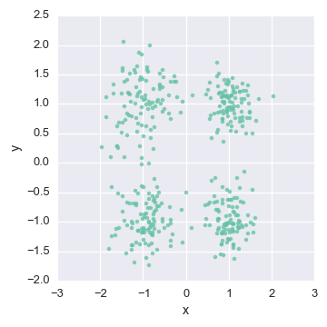

.. _intro:

Discovering structure in your data: an overview of clustering
============================================================

--------------

Often a dataset can be explained by a small number of unknown groups, or clusters. These clusters can arise because there are a small number of causes of the underlying dataset. Formally, the underlying assumption in clustering is that there exists :math:`K` latent classes in the data.  The goal of clustering is to classify the observations in the data into these :math:`K` latent classes. 

In the Bayesian context, we assume these clusters are characterized by probability distributions conditioned on their cluster assignment.  These distributions are the likelihood of the clusters.  For examples of the kinds of distributions available for modeling, see our list of :ref:`available likelihood models <docs>`.

To be specific, we assume the data is generated from a mixture of distributions.  As a result, algorithms to learn these underlying probabilistic distributions are called mxiture models.

Let's consider the example of 2-dimensional real valued data:

Since the data is real valued, we'll assume the data is distributed :ref:`multivariate Gaussian <niw>` :

.. math:: P(\mathbf{x} \mid cluster=k)\sim\mathcal{N}(\mu_{k},\Sigma_{k})

As a result, we will use a Gaussian Mixture Model to learn these underlying clusters.  In a Gaussian Mixture Model, we learn the parameters of these Gaussians.   We'll select our :ref:`normal-inverse-Wishart <niw>` likelihood model since the normal-inverse-Wishart is the conjugate prior of the multivariate Gaussian distribution. With these parameters, we can estimate the probability that new data is generated from each of these :math:`K` clusters.

Most clustering algorithms rely on the number of clusters to be known in advance because cluster assignments are considered categorical.  As a result, :math:`K` is assumed in advance so that the dimensionality of cluster assignments is finite.

Using the Dirichlet Process, we can learn the number of clusters as we learn each cluster's parameters.

We will visualize our data to examine the cluster assignment

.. code:: python

    def plot_assignment(assignment, data=Y):
        cl = pd.DataFrame(data, columns = ['x','y'])
        cl['cluster'] = assignment
        n_clusters = cl['cluster'].nunique()
        sns.lmplot('x', 'y', hue="cluster", data=cl, fit_reg=False, legend=(n_clusters<10))
        plt.title('Simulated Gaussians: %d Learned Clusters' % n_clusters)

Let's peek at the starting state for one of our chains

.. code:: python

    plot_assignment(latents[0].assignments())

.. image:: gauss2d_files/gauss2d_14_0.png

Let's watch one of the chains evolve for a few steps

.. code:: python

    first_runner = runners[0]
    for i in xrange(5):
        first_runner.run(r=prng, niters=1)
        plot_assignment(first_runner.get_latent().assignments())

.. image:: gauss2d_files/gauss2d_16_0.png

.. image:: gauss2d_files/gauss2d_16_1.png

.. image:: gauss2d_files/gauss2d_16_2.png

.. image:: gauss2d_files/gauss2d_16_3.png

.. image:: gauss2d_files/gauss2d_16_4.png

Now let's burn all our runners in for 100 iterations.

.. code:: python

    for runner in runners:
        runner.run(r=prng, niters=100)

Let's now peek again at the first state

.. image:: gauss2d_files/gauss2d_20_0.png

Because this model was run on simulated data, we can compare the results to our actual underlying assignments:

.. image:: gauss2d_files/gauss2d_8_1.png

To learn more about the code that generated this example, see :ref:`Inferring Gaussians with the Dirichlet Process Mixture Model <gauss2d>` .

