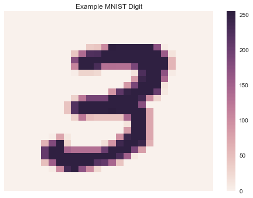
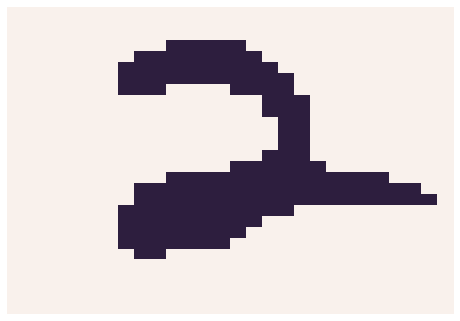
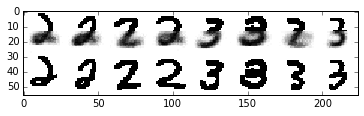

.. _mnist_predictions:

Digit recognition with the MNIST dataset
========================================

--------------

Let's set up our environment

.. code:: python

    %matplotlib inline
    import matplotlib.pylab as plt
    import numpy as np
    import numpy.ma as ma
    import time
    import math
    import seaborn as sns
    
    from PIL import Image, ImageOps
    from sklearn.datasets import fetch_mldata

Now let's get our functions from datamicroscopes

.. code:: python

    from microscopes.models import bb as beta_bernoulli
    from microscopes.mixture.definition import model_definition
    from microscopes.common.rng import rng
    from microscopes.common.recarray.dataview import numpy_dataview
    from microscopes.mixture import model, runner, query
    from microscopes.kernels import parallel

Let's focus on classifying 2's and 3's

.. code:: python

    mnist_dataset = fetch_mldata('MNIST original')
    Y_2 = mnist_dataset['data'][np.where(mnist_dataset['target'] == 2.)[0]]
    Y_3 = mnist_dataset['data'][np.where(mnist_dataset['target'] == 3.)[0]]
    print 'number of twos:', Y_2.shape[0]
    print 'number of threes:', Y_3.shape[0]

.. parsed-literal::

    number of twos: 6990
    number of threes: 7141

.. code:: python

    print 'number of dimensions: %d' % len(Y_2.shape)

.. parsed-literal::

    number of dimensions: 2

Our data is 2 dimensional, which means each observation is a vector.

We can reformat our data to show the digits as images

.. code:: python

    _, D = Y_3.shape
    W = int(math.sqrt(D))
    assert W * W == D
    sns.heatmap(np.reshape(Y_3[0], (W, W)), linewidth=0, xticklabels=False, yticklabels=False)
    plt.title('Example MNIST Digit')

.. parsed-literal::

    <matplotlib.text.Text at 0x119273fd0>

For simplicity, we'll convert these grayscale images into binary images

To pass our data into datamicroscopes, we'll also munge the data into
recarray format

.. code:: python

    Y = np.vstack([Y_2, Y_3])
    Y = np.array([tuple(y) for y in np.random.permutation(Y)], dtype=[('', bool)]*D)

Let's look at an example image

.. code:: python

    sns.heatmap(np.reshape([i for i in Y[0]], (W,W)), linewidth=0, xticklabels=False, yticklabels=False, cbar=False)

.. parsed-literal::

    <matplotlib.axes._subplots.AxesSubplot at 0x1134c8cd0>

Now, we can initialize our model. To do so, we must:

1. Specify the number of chains
2. Import the data
3. Define the model
4. Initialize the model
5. Initialize the samplers, aka ``runners``

For this classification task, we'll use a Dirichlet Process Mixture
Model

Since we converted the data into binary vectors for each pixel, we'll
define our likelihood of the model as a beta-bernouli. In this case, the
likelihood is the probability that each of the :math:`D` pixels in the
image is ``True`` or ``False``. Note, these pixel assignments are
assumed to be **independent**.

.. math:: \forall\hspace{2mm} d \in [0,1,..,D],\hspace{2mm} k \in [0,..,K], \hspace{2mm} P(pixel_d = True|cluster=k) \sim BetaBernoulli(\alpha_k,\beta_k)

.. math:: \forall \hspace{2mm} d\neq c \hspace{2mm} P(pixel_d = True|cluster=k) \perp P(pixel_c = True|cluster=k)\hspace{2mm} 

Recall that since we're using a Dirichlet Process Mixture Model,
:math:`K` is also latent variable which we learn at these same time as
the each cluster's parameters

.. code:: python

    nchains = 5
    view = numpy_dataview(Y)
    defn = model_definition(Y.shape[0], [beta_bernoulli]*D)
    prng = rng()
    kc = runner.default_kernel_config(defn)
    latents = [model.initialize(defn, view, prng) for _ in xrange(nchains)]
    runners = [runner.runner(defn, view, latent, kc) for latent in latents]
    r = parallel.runner(runners)
    print '%d betabernouli likelihoods: one for each pixel' % len(defn.models()) 

.. parsed-literal::

    784 betabernouli likelihoods: one for each pixel

Now let's run each chain in parallel for 5 iterations

.. code:: python

    start = time.time()
    iters = 5
    r.run(r=prng, niters=iters)
    print "mcmc took", (time.time() - start)/60., "minutes"

.. parsed-literal::

    mcmc took 156.391473516 minutes
    mcmc took 156.391473516 minutes

To save our results, we can get the latest assignment of each
observation and pickle the output

.. code:: python

    infers = r.get_latents()

.. code:: python

    # save to disk 
    import pickle
    with open("mnist-predictions-infers.pickle", 'w') as fp:
        pickle.dump(infers, fp)

.. code:: python

    import pickle
    infers = pickle.load(open("mnist-predictions-infers.pickle"))

With our saved results, we can plot our learned clusters

.. code:: python

    def plot_clusters(s, scalebysize=False):
        hps = [s.get_feature_hp(i) for i in xrange(D)]
        def prior_prob(hp):
            return hp['alpha'] / (hp['alpha'] + hp['beta'])
        def data_for_group(gid):
            suffstats = [s.get_suffstats(gid, i) for i in xrange(D)]
            def prob(hp, ss):
                top = hp['alpha'] + ss['heads']
                bot = top + hp['beta'] + ss['tails']
                return top / bot
            probs = [prob(hp, ss) for hp, ss in zip(hps, suffstats)]
            return np.array(probs)
        def scale(d, weight):
            im = d.reshape((W, W))
            newW = max(int(weight * W), 1)
            im = Image.fromarray(im)
            im = im.resize((newW, newW))
            im = ImageOps.expand(im, border=(W - newW) / 2)
            im = np.array(im)
            a, b = im.shape
            if a < W:
                im = np.append(im, np.zeros(b)[np.newaxis,:], axis=0)
            elif a > W:
                im = im[:W,:]
            if b < W:
                im = np.append(im, np.zeros(W)[:,np.newaxis], axis=1)
            elif b > W:
                im = im[:,:W]
            return im.flatten()
        def groupsbysize(s):
            counts = [(gid, s.groupsize(gid)) for gid in s.groups()]
            counts = sorted(counts, key=lambda x: x[1], reverse=True)
            return counts
        data = [(data_for_group(g), cnt) for g, cnt in groupsbysize(s)]
        largest = max(cnt for _, cnt in data)
        data = [scale(d, cnt/float(largest)) 
                if scalebysize else d for d, cnt in data]
        digits_per_row = 12
        rem = len(data) % digits_per_row
        if rem:
            fill = digits_per_row - rem
            for _ in xrange(fill):
                data.append(np.zeros(D))
        rows = len(data) / digits_per_row
        data = np.vstack([
            np.hstack([d.reshape((W, W)) for d in data[i:i+digits_per_row]]) 
            for i in xrange(0, len(data), digits_per_row)])
        plt.imshow(data, cmap=plt.cm.binary, interpolation='nearest')
        plt.show()

Let's show all groups (also by size) for the first set of assignments

.. code:: python

    plt.hold(True)
    plot_clusters(infers[0])
    plot_clusters(infers[0], scalebysize=True)

.. image:: mnist-predictions_files/mnist-predictions_24_0.png

.. image:: mnist-predictions_files/mnist-predictions_24_1.png

.. image:: mnist-predictions_files/mnist-predictions_24_2.png

.. image:: mnist-predictions_files/mnist-predictions_24_3.png

Now, let's used our learned clusters to make predictions when presented
with only the top half of the digit image

.. code:: python

    present = D/2
    absent = D-present
    queries = [tuple(Y_2[i]) for i in np.random.permutation(Y_2.shape[0])[:4]] + \
              [tuple(Y_3[i]) for i in np.random.permutation(Y_3.shape[0])[:4]]
    
    queries_masked = ma.masked_array(
        np.array(queries, dtype=[('',bool)]*D),
        mask=[(False,)*present + (True,)*absent])
    
    statistics = query.posterior_predictive_statistic(queries_masked, infers, prng, samples_per_chain=10, merge='avg') 

.. code:: python

    data0 = np.hstack([np.array(list(s)).reshape((W,W)) for s in statistics])
    data1 = np.hstack([np.clip(np.array(q, dtype=np.float), 0., 1.).reshape((W, W)) for q in queries])
    data = np.vstack([data0, data1])
    plt.imshow(data, cmap=plt.cm.binary, interpolation='nearest')

.. parsed-literal::

    <matplotlib.image.AxesImage at 0x1256f1890>

.. parsed-literal::

    <matplotlib.image.AxesImage at 0x1256f1890>

.. image:: mnist-predictions_files/mnist-predictions_27_3.png

