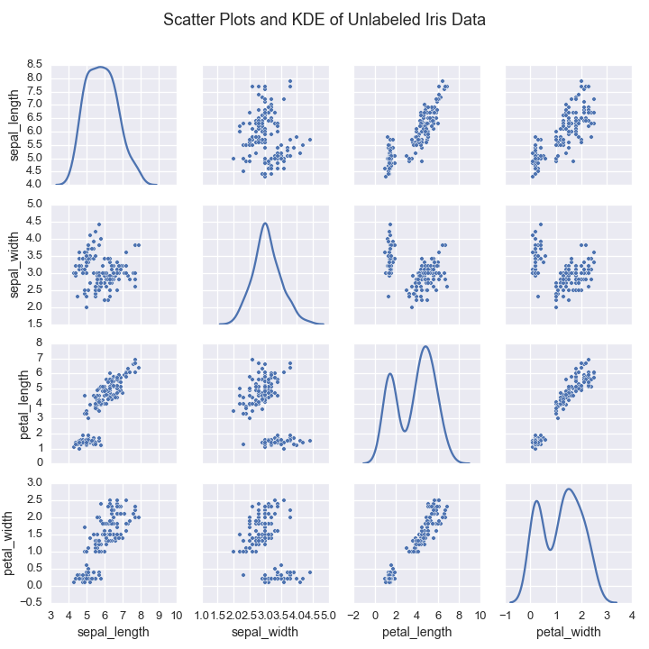
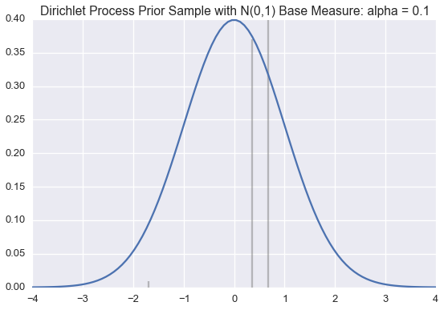
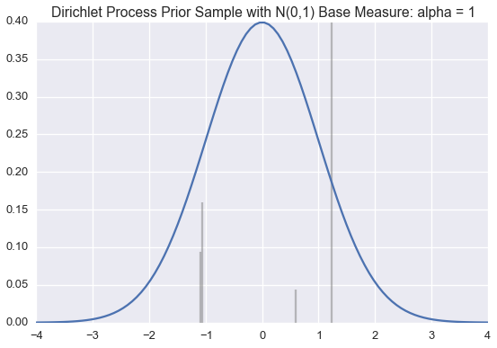
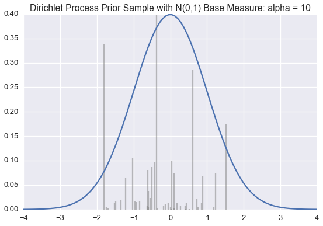
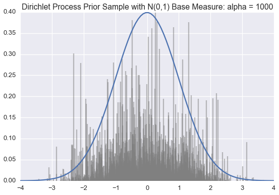
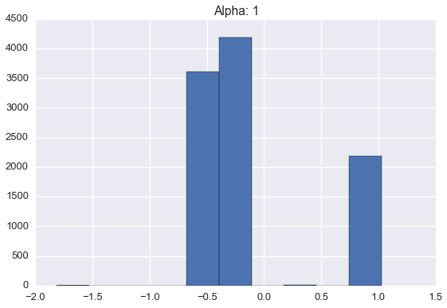
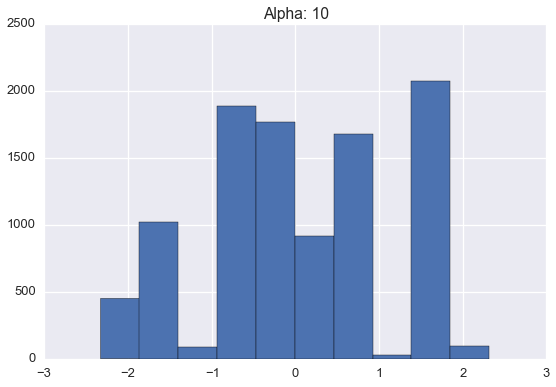
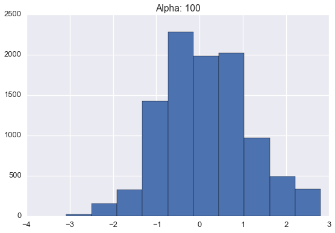
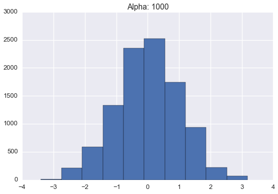

.. _ncluster:
Finding the number of clusters with the Dirichlet Process
============================================================

--------------

The `Iris Flower
Dataset <https://archive.ics.uci.edu/ml/datasets/Iris>`__ is a standard
machine learning data set dating back to the 1930s. It contains
measurements from 150 flowers.

If we wanted to learn these underlying species' measurements, we would
use these real valued measurements and make assumptions about the
structure of the data. We could assume that conditioned on ``species``, the measurement data
follwed a multivariate normal

.. math:: P(\mathbf{x}|species=s)\sim\mathcal{N}(\mu_{s},\Sigma_{s})

In this case, the data comes from three species of flowers:

-  Iris Setosa
-  Iris Versicolor
-  Iris Virginica

Plotting the data shows that indiviudal species exhibit a typical range of measurements

.. image:: normal-inverse-wishart_files/normal-inverse-wishart_5_0.png

The dimesnionality of a clustering model is equal to the number of clusters in the model. Bayesian clustering algorithms often rely of the Dirichlet Distribution to encode prior information about these cluster assignments. The `Dirichlet
distribution <https://en.wikipedia.org/wiki/Dirichlet_distribution>`__
(DD) can be considered a distribution of distributions. Each sample from
the DD is a `categorial
distribution <https://en.wikipedia.org/wiki/Categorical_distribution>`__
over :math:`K` categories. It is parameterized :math:`G_0`, a
distribution over :math:`K` categories and :math:`\alpha`, a scale
factor.

The expected value of the DD is :math:`G_0`. The variance of the DD is a
function of the scale factor. When :math:`\alpha` is large, samples from
:math:`DD(\alpha\cdot G_0)` will be very close to :math:`G_0`. When
:math:`\alpha` is small, samples will vary more widely.

Most clustering algorithms require the number of clusters to be given in advance.  If we don't know the number of species in the data, how would we be able to classify these flowers?

The `Dirichlet Process <https://en.wikipedia.org/wiki/Dirichlet_process>`__  is a stochastic process used in Bayesian nonparametrics to cluster data without specifying the number of clusters in advance.  The Dirichlet Process Prior is used to mathematically descirbe prior information about the number of clusters in the data.

The Dirichlet Process Prior is nonparametric because its dimensionality is infinite.  This characteristic is advantageous in clustering because it allows us to recognize new clusters when we observe new data.

The Dirichlet Process can be considered a way to *generalize* the Dirichlet distribution. While the
Dirichlet distribution is parameterized by a discrete distribution
:math:`G_0` and generates samples that are similar discrete
distributions, the Dirichlet process is parameterized by a generic
distribution :math:`H_0` and generates samples which are distributions
similar to :math:`H_0`. The Dirichlet process also has a parameter
:math:`\alpha` that determines how similar how widely samples will vary
from :math:`H_0`.

When learning a culstering using a Dirichlet Process Prior, observations are probabilistically assigned to clusters based on the number of observations in that cluster :math:`n_k`.

..:math:: P(x=\text{cluster=k})=\frac{n_k}{\alpha+n-1}

Probability of new clusters are paramteterized by :math:`\alpha`

..:math:: P(x=\text{cluster=new})=\frac{\alpha}{\alpha+n-1}

In other words, these culsters exhbit a rich get richer property.

The expected number of clusters in a dataset clustered with the Dirichlet Process is :math:`O(\alpha\log(N))`

The expected number of clusters with :math:`m` observations `(Arritia et al., 2003) <https://books.google.com/books/about/Logarithmic_Combinatorial_Structures.html?id=oBPvAAAAMAAJ>` is :math:`\frac{\alpha}{m}`

We can construct a sample :math:`H` (recall that :math:`H` is a
probability distribution) from a Dirichlet process
:math:`\text{DP}(\alpha H_0)` by drawing a countably infinite number of
samples :math:`\theta_k` from :math:`H_0`) and setting:

.. math:: H=\sum_{k=1}^\infty \pi_k \cdot\delta(x-\theta_k)

where the :math:`\pi_k` are carefully chosen weights (more later) that
sum to 1. (:math:`\delta` is the `Dirac delta
function <https://en.wikipedia.org/wiki/Dirac_delta_function>`__.)

:math:`H`, a sample from :math:`DP(\alpha H_0)`, is a *probability
distribution* that looks similar to :math:`H_0` (also a distribution).
In particular, :math:`H` is a *discrete* distribution that takes the
value :math:`\theta_k` with probability :math:`\pi_k`. This sampled
distribution :math:`H` is a discrete distribution *even if :math:`H_0`
has continuous support*; the
`support <http://www.statlect.com/glossary/support_of_a_random_variable.htm>`__
of :math:`H` is a countably infinite subset of the support :math:`H_0`.

The weights (:math:`\pi_k` values) of a Dirichlet process sample related
the Dirichlet *process* back to the Dirichlet *distribution*.

`Gregor Heinrich <http://www.arbylon.net/publications/ilda.pdf>`__
writes:

    The defining property of the DP is that its samples have weights
    :math:`\pi_k` and locations :math:`\theta_k` distributed in such a
    way that when partitioning :math:`S(H)` into finitely many arbitrary
    disjoint subsets :math:`S_1, \ldots, S_j` :math:`J<\infty`, the sums
    of the weights :math:`\pi_k` in each of these :math:`J` subsets are
    distributed according to a Dirichlet distribution that is
    parameterized by :math:`\alpha` and a discrete base distribution
    (like :math:`G_0`) whose weights are equal to the integrals of the
    base distribution :math:`H_0` over the subsets :math:`S_n`.

As an example, Heinrich imagines a DP with a standard normal base
measure :math:`H_0\sim \mathcal{N}(0,1)`. Let :math:`H` be a sample from
:math:`DP(H_0)` and partition the real line (the support of a normal
distribution) as :math:`S_1=(-\infty, -1]`, :math:`S_2=(-1, 1]`, and
:math:`S_3=(1, \infty]` then

.. math:: H(S_1),H(S_2), H(S_3) \sim \text{Dir}\left(\alpha\,\text{erf}(-1), \alpha\,(\text{erf}(1) - \text{erf}(-1)), \alpha\,(1-\text{erf}(1))\right)

where :math:`H(S_n)` be the sum of the :math:`\pi_k` values whose
:math:`\theta_k` lie in :math:`S_n`.

These :math:`S_n` subsets are chosen for convenience, however similar
results would hold for *any* choice of :math:`S_n`. For any sample from
a Dirichlet *process*, we can construct a sample from a Dirichlet
*distribution* by partitioning the support of the sample into a finite
number of bins.

There are several equivalent ways to choose the :math:`\pi_k` so that
this property is satisfied: the Chinese restaurant process, the
stick-breaking process, and the Pólya urn scheme.

To generate :math:`\left\{\pi_k\right\}` according to a stick-breaking
process we define :math:`\beta_k` to be a sample from
:math:`\text{Beta}(1,\alpha)`. :math:`\pi_1` is equal to
:math:`\beta_1`. Successive values are defined recursively as

.. math:: \pi_k=\beta_k \prod_{j=1}^{k-1}(1-\beta_j).

Thus, if we want to draw a sample from a Dirichlet process, we could, in
theory, sample an infinite number of :math:`\theta_k` values from the
base distribution :math:`H_0`, an infinite number of :math:`\beta_k`
values from the Beta distribution. Of course, sampling an infinite
number of values is easier in theory than in practice.

However, by noting that the :math:`\pi_k` values are *positive* values
summing to 1, we note that, in expectation, they must get increasingly
small as :math:`k\rightarrow\infty`. Thus, we can reasonably approximate
a sample :math:`H\sim DP(\alpha H_0)` by drawing *enough* samples such
that :math:`\sum_{k=1}^K \pi_k\approx 1`.

We use this method below to draw approximate samples from several
Dirichlet processes with a standard normal (:math:`\mathcal{N}(0,1)`)
base distribution but varying :math:`\alpha` values.

Recall that a single sample from a Dirichlet process is a probability
distribution over a countably infinite subset of the support of the base
measure.

The blue line is the PDF for a standard normal. The black lines
represent the :math:`\theta_k` and :math:`\pi_k` values;
:math:`\theta_k` is indicated by the position of the black line on the
:math:`x`-axis; :math:`\pi_k` is proportional to the height of each
line.

We generate enough :math:`\pi_k` values are generated so their sum is
greater than 0.99. When :math:`\alpha` is small, very few
:math:`\theta_k`'s will have corresponding :math:`\pi_k` values larger
than :math:`0.01`. However, as :math:`\alpha` grows large, the sample
becomes a more accurate (though still discrete) approximation of
:math:`\mathcal{N}(0,1)`.

Often we want to draw samples from a *distribution sampled from a
Dirichlet Process* instead of from the Dirichlet process itself. Much of
the literature on the topic unhelpful refers to this as sampling from a
Dirichlet process.

Fortunately, we don't have to draw an infinite number of samples from
the base distribution and stick breaking process to do this. Instead, we
can draw these samples *as they are needed*.

Suppose, for example, we know a finite number of the :math:`\theta_k`
and :math:`\pi_k` values for a sample
:math:`H\sim \text{Dir}(\alpha H_0)`. For example, we know

.. math:: \pi_1=0.5,\; \pi_3=0.3,\; \theta_1=0.1,\; \theta_2=-0.5.

To sample from :math:`H`, we can generate a uniform random :math:`u`
number between 0 and 1. If :math:`u` is less than 0.5, our sample is
:math:`0.1`. If :math:`0.5<=u<0.8`, our sample is :math:`-0.5`. If
:math:`u>=0.8`, our sample (from :math:`H` will be a new sample
:math:`\theta_3` from :math:`H_0`. At the same time, we should also
sample and store :math:`\pi_3`. When we draw our next sample, we will
again draw :math:`u\sim\text{Uniform}(0,1)` but will compare against
:math:`\pi_1, \pi_2`, AND :math:`\pi_3`.

The class below will take a base distribution :math:`H_0` and
:math:`\alpha` as arguments to its constructor. The class instance can
then be called to generate samples from
:math:`H\sim \text{DP}(\alpha H_0)`.

.. code:: python

    from numpy.random import choice
    
    class DirichletProcessSample():
        def __init__(self, base_measure, alpha):
            self.base_measure = base_measure
            self.alpha = alpha
            
            self.cache = []
            self.weights = []
            self.total_stick_used = 0.
    
        def __call__(self):
            remaining = 1.0 - self.total_stick_used
            i = DirichletProcessSample.roll_die(self.weights + [remaining])
            if i is not None and i < len(self.weights) :
                return self.cache[i]
            else:
                stick_piece = beta(1, self.alpha).rvs() * remaining
                self.total_stick_used += stick_piece
                self.weights.append(stick_piece)
                new_value = self.base_measure()
                self.cache.append(new_value)
                return new_value
            
        @staticmethod 
        def roll_die(weights):
            if weights:
                return choice(range(len(weights)), p=weights)
            else:
                return None

This Dirichlet process class could be called *stochastic memoization*.
This idea was first articulated in somewhat abstruse terms by `Daniel
Roy, et al <http://danroy.org/papers/RoyManGooTen-ICMLNPB-2008.pdf>`__.

Below are histograms of 10000 samples drawn from *samples* drawn from
Dirichlet processes with standard normal base distribution and varying
:math:`\alpha` values.

.. code:: python

    import pandas as pd
    
    base_measure = lambda: norm().rvs()
    n_samples = 10000
    samples = {}
    for alpha in [1, 10, 100, 1000]:
        dirichlet_norm = DirichletProcessSample(base_measure=base_measure, alpha=alpha)
        plt.figure(figsize=(9,6))
        pd.Series([dirichlet_norm() for _ in range(n_samples)]).hist()
        plt.title('Alpha: %s' % alpha)
        plt.savefig('Alpha_Hist_%s.png')

Note that these histograms look very similar to the corresponding plots
of sampled distributions above. However, these histograms are plotting
*points sampled from a distribution sampled from a Dirichlet process*
while the plots above were showing approximate *distributions samples
from the Dirichlet process*. Of course, as the number of samples from
each :math:`H` grows large, we would expect the histogram to be a very
good empirical approximation of :math:`H`.
