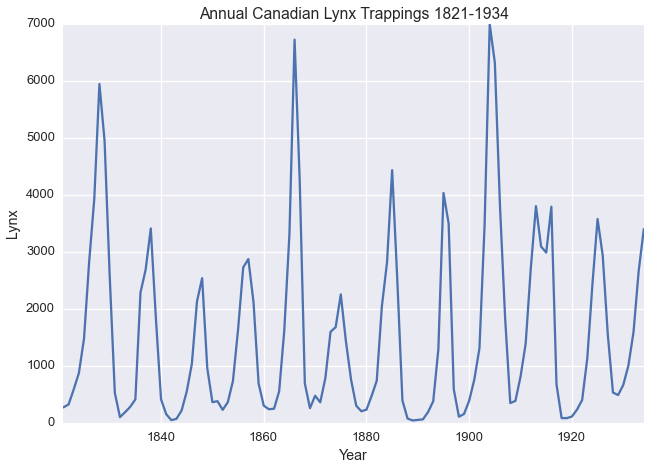
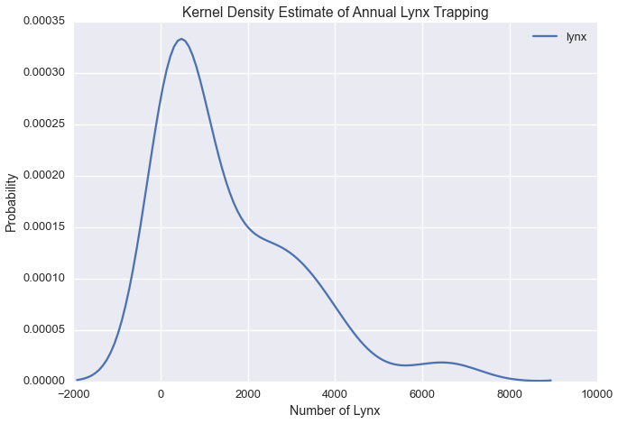
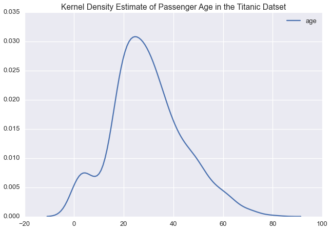
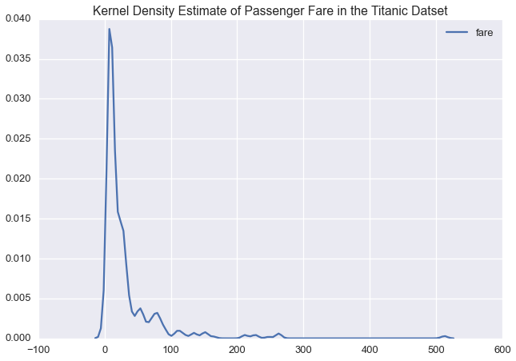
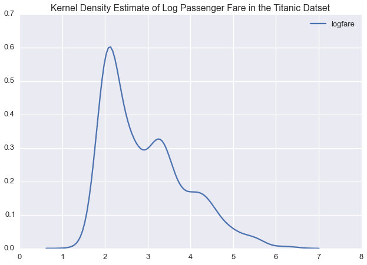

Univariate Data with the Normal Inverse Chi-Square Distribution
===============================================================

--------------

One of the simplest examples of data is univariate data

Let's consider a timeseries example:

`The Annual Canadian Lynx Trappings
Dataset <https://vincentarelbundock.github.io/Rdatasets/doc/datasets/lynx.html>`__
as described by `Campbel and Walker
1977 <http://www.jstor.org/stable/2345277>`__ contains the number of
Lynx trapped near the McKenzie River in the Northwest Territories in
Canada between 1821 and 1934.

.. code:: python

    import pandas as pd
    import numpy as np 
    import seaborn as sns
    import matplotlib.pyplot as plt 
    %matplotlib inline
    sns.set_context('talk')
    sns.set_style('darkgrid')

.. code:: python

    lynx = pd.read_csv('https://vincentarelbundock.github.io/Rdatasets/csv/datasets/lynx.csv',
                       index_col=0)

.. code:: python

    lynx = lynx.set_index('time')
    lynx.head()

.. raw:: html

    

    <table border="1" class="dataframe">
      <thead>
        <tr style="text-align: right;">
          <th></th>
          <th>lynx</th>
        </tr>
        <tr>
          <th>time</th>
          <th></th>
        </tr>
      </thead>
      <tbody>
        <tr>
          <th>1821</th>
          <td>269</td>
        </tr>
        <tr>
          <th>1822</th>
          <td>321</td>
        </tr>
        <tr>
          <th>1823</th>
          <td>585</td>
        </tr>
        <tr>
          <th>1824</th>
          <td>871</td>
        </tr>
        <tr>
          <th>1825</th>
          <td>1475</td>
        </tr>
      </tbody>
    </table>
    

.. code:: python

    lynx.plot(legend=False)
    plt.xlabel('Year')
    plt.title('Annual Canadian Lynx Trappings 1821-1934')
    plt.ylabel('Lynx')

.. parsed-literal::

    <matplotlib.text.Text at 0x1129d0090>

Let's plot the kernel density estimate of annual lynx trapping

.. code:: python

    sns.kdeplot(lynx['lynx'])
    plt.title('Kernel Density Estimate of Annual Lynx Trapping')
    plt.ylabel('Probability')
    plt.xlabel('Number of Lynx')

.. parsed-literal::

    <matplotlib.text.Text at 0x1129d0410>

Our plot suggests there could be three modes in the Lynx data.

In modeling this timeseries, we could assume that the number of lynx
trapped in a given year is falls into one of :math:`k` states, which are
normally distributed with some unknown mean :math:`\mu_i` and variance
:math:`\sigma^2_i` for each state

In the case of our Lynx data

.. math:: \forall i \in [1,...,k] \hspace{2mm} p(\text{lynx trapped}| \text{state} = i) \sim \mathcal{N}(\mu_i, \sigma^2_i)

--------------

Now let's consider demographics data from the Titanic Dataset

The Titanic Dataset contains information about passengers of the
Titanic.

.. code:: python

    ti = sns.load_dataset('titanic')
    ti.head()

.. raw:: html

    

    <table border="1" class="dataframe">
      <thead>
        <tr style="text-align: right;">
          <th></th>
          <th>survived</th>
          <th>pclass</th>
          <th>sex</th>
          <th>age</th>
          <th>sibsp</th>
          <th>parch</th>
          <th>fare</th>
          <th>embarked</th>
          <th>class</th>
          <th>who</th>
          <th>adult_male</th>
          <th>deck</th>
          <th>embark_town</th>
          <th>alive</th>
          <th>alone</th>
        </tr>
      </thead>
      <tbody>
        <tr>
          <th>0</th>
          <td>0</td>
          <td>3</td>
          <td>male</td>
          <td>22</td>
          <td>1</td>
          <td>0</td>
          <td>7.2500</td>
          <td>S</td>
          <td>Third</td>
          <td>man</td>
          <td>True</td>
          <td>NaN</td>
          <td>Southampton</td>
          <td>no</td>
          <td>False</td>
        </tr>
        <tr>
          <th>1</th>
          <td>1</td>
          <td>1</td>
          <td>female</td>
          <td>38</td>
          <td>1</td>
          <td>0</td>
          <td>71.2833</td>
          <td>C</td>
          <td>First</td>
          <td>woman</td>
          <td>False</td>
          <td>C</td>
          <td>Cherbourg</td>
          <td>yes</td>
          <td>False</td>
        </tr>
        <tr>
          <th>2</th>
          <td>1</td>
          <td>3</td>
          <td>female</td>
          <td>26</td>
          <td>0</td>
          <td>0</td>
          <td>7.9250</td>
          <td>S</td>
          <td>Third</td>
          <td>woman</td>
          <td>False</td>
          <td>NaN</td>
          <td>Southampton</td>
          <td>yes</td>
          <td>True</td>
        </tr>
        <tr>
          <th>3</th>
          <td>1</td>
          <td>1</td>
          <td>female</td>
          <td>35</td>
          <td>1</td>
          <td>0</td>
          <td>53.1000</td>
          <td>S</td>
          <td>First</td>
          <td>woman</td>
          <td>False</td>
          <td>C</td>
          <td>Southampton</td>
          <td>yes</td>
          <td>False</td>
        </tr>
        <tr>
          <th>4</th>
          <td>0</td>
          <td>3</td>
          <td>male</td>
          <td>35</td>
          <td>0</td>
          <td>0</td>
          <td>8.0500</td>
          <td>S</td>
          <td>Third</td>
          <td>man</td>
          <td>True</td>
          <td>NaN</td>
          <td>Southampton</td>
          <td>no</td>
          <td>True</td>
        </tr>
      </tbody>
    </table>
    

Passenger age and fare are both real valued. Are they related? Let's
examine the correlation matrix

.. code:: python

    ti[['age','fare']].dropna().corr()

.. raw:: html

    

    <table border="1" class="dataframe">
      <thead>
        <tr style="text-align: right;">
          <th></th>
          <th>age</th>
          <th>fare</th>
        </tr>
      </thead>
      <tbody>
        <tr>
          <th>age</th>
          <td>1.000000</td>
          <td>0.096067</td>
        </tr>
        <tr>
          <th>fare</th>
          <td>0.096067</td>
          <td>1.000000</td>
        </tr>
      </tbody>
    </table>
    

Since the correlation is between the two variables is zero, we can model
these two real valued columns independently.

Let's plot the kernel density estimate of each variable

.. code:: python

    sns.kdeplot(ti['age'])
    plt.title('Kernel Density Estimate of Passenger Age in the Titanic Datset')

.. parsed-literal::

    <matplotlib.text.Text at 0x117426c50>

.. code:: python

    sns.kdeplot(ti['fare'])
    plt.title('Kernel Density Estimate of Passenger Fare in the Titanic Datset')

.. parsed-literal::

    <matplotlib.text.Text at 0x117475310>

Given the long tail in the fare price, we might want to model this
variable on a log scale:

.. code:: python

    ti['logfare'] = np.log(ti['fare'])
    ti[['age','logfare']].dropna().corr()

.. raw:: html

    

    <table border="1" class="dataframe">
      <thead>
        <tr style="text-align: right;">
          <th></th>
          <th>age</th>
          <th>logfare</th>
        </tr>
      </thead>
      <tbody>
        <tr>
          <th>age</th>
          <td>1.000000</td>
          <td>0.135352</td>
        </tr>
        <tr>
          <th>logfare</th>
          <td>0.135352</td>
          <td>1.000000</td>
        </tr>
      </tbody>
    </table>
    

Again, ``logfare`` and ``age`` have near zero correlation, so we can
again model these two variables independently

Let's see what a kernel density estimate of log fare would look like

.. code:: python

    sns.kdeplot(ti['logfare'])
    plt.title('Kernel Density Estimate of Log Passenger Fare in the Titanic Datset')

.. parsed-literal::

    <matplotlib.text.Text at 0x1175a5110>

In logspace, passenger fare is multimodal, suggesting that we could
model this variable with a normal distirbution

If we were to model the passenger list using our Mixture Model, we would
have separate likelihoods for ``logfare`` and ``age``

.. math:: \forall i \in [1,...,k] \hspace{2mm} p(\text{logfare}|\text{cluster}=i)=\mathcal{N}(\mu_{i,l}, \sigma^2_{i,l})

.. math:: \forall i \in [1,...,k] \hspace{2mm}  p(\text{age}|\text{cluster}=c)=\mathcal{N}(\mu_{i,a}, \sigma^2_{i,a})

--------------

Often, real value data is assumed to be normally distributed.

To learn the latent variables, :math:`\mu_i` :math:`\sigma^2_i`, we
would use a normal inverse-chi-square likelihood

The normal inverse-chi-square likelihood is the conjugate univariate
normal likelihood in data microscopes. We also have normal likelihood,
the normal inverse-wishart likelihood, optimized for multivariate
datasets.

It is important to model univariate normal data with this likelihood as
it acheives superior performance on univariate data.

In both these examples, we found variables that were amenable to being
modeled as univariate normal:

1. Univariate datasets
2. Datasets containing real valued variables with near zero correlation

To import our univariate normal inverse-chi-squared likelihood, call:

.. code:: python

    from microscopes.models import nich as normal_inverse_chisquared
